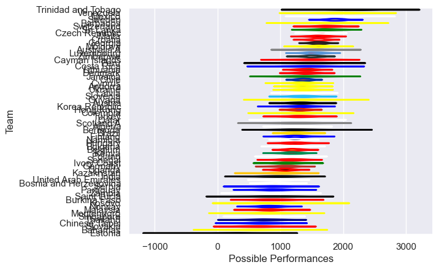
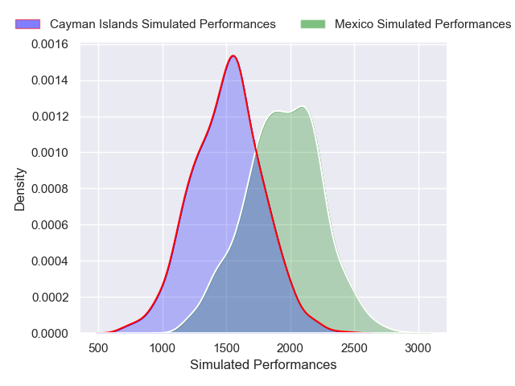
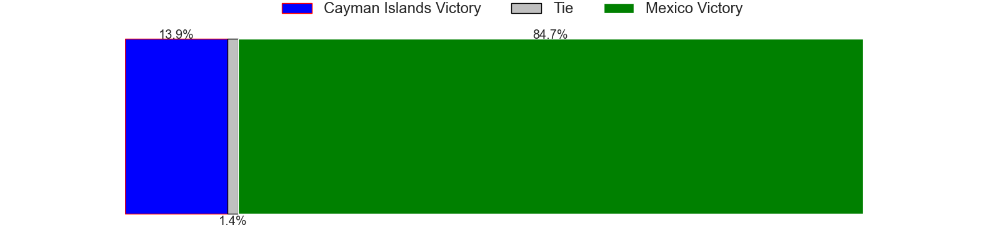
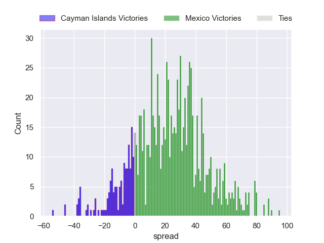

---  
title: "Developmental International 2024 Status"  
date: 2024-12-05 6:00:00 -0500  
categories: model review projection  
layout: article  
aside:  
    toc: true  
---
# Current Team Rankings

# Current Rankings

|   Rank | Team                   |   Rating |
|-------:|:-----------------------|---------:|
|      1 | New Zealand A          |  1635.49 |
|      2 | Sweden                 |  1628.6  |
|      3 | Trinidad and Tobago    |  1534.42 |
|      4 | England A              |  1440.32 |
|      5 | Georgia                |  1403.44 |
|      6 | Switzerland            |  1392.5  |
|      7 | Czech Republic         |  1378.35 |
|      8 | Croatia                |  1363.98 |
|      9 | Venezuela              |  1324.28 |
|     10 | Malta                  |  1316.36 |
|     11 | Mexico                 |  1314.63 |
|     12 | Sri Lanka              |  1310.27 |
|     13 | Luxembourg             |  1266.14 |
|     14 | Moldova                |  1262.65 |
|     15 | Zimbabwe               |  1254.71 |
|     16 | Barbados               |  1184.91 |
|     17 | Chile                  |  1160.59 |
|     18 | Lithuania              |  1154.26 |
|     19 | Denmark                |  1115.66 |
|     20 | Andorra                |  1069.2  |
|     21 | Hong Kong              |  1065.22 |
|     22 | Australia A            |  1054.69 |
|     23 | Cyprus                 |  1047.26 |
|     24 | Latvia                 |  1035.13 |
|     25 | Ukraine                |  1032.08 |
|     26 | Slovenia               |  1027.57 |
|     27 | Namibia                |   993.95 |
|     28 | Austria                |   990.52 |
|     29 | Brazil                 |   989.83 |
|     30 | Kenya                  |   956.73 |
|     31 | Cayman Islands         |   952.92 |
|     32 | Belgium                |   949.29 |
|     33 | Finland                |   942.46 |
|     34 | Turkey                 |   930.38 |
|     35 | Hungary                |   929.72 |
|     36 | Algeria                |   916.85 |
|     37 | Korea Republic         |   913.17 |
|     38 | Costa Rica             |   901.18 |
|     39 | Bulgaria               |   889.1  |
|     40 | Poland                 |   862.2  |
|     41 | Peru                   |   857.42 |
|     42 | Senegal                |   857.39 |
|     43 | Uganda                 |   807.4  |
|     44 | Colombia               |   802.17 |
|     45 | Qatar                  |   798.22 |
|     46 | Germany                |   794.22 |
|     47 | Jamaica                |   777.54 |
|     48 | Ivory Coast            |   742.49 |
|     49 | Guyana                 |   707.83 |
|     50 | Scotland A             |   700.27 |
|     51 | Bermuda                |   684.7  |
|     52 | Kazakhstan             |   623.2  |
|     53 | Bosnia and Herzegovina |   619.2  |
|     54 | United Arab Emirates   |   615.78 |
|     55 | Paraguay               |   508.43 |
|     56 | Norway                 |   493.35 |
|     57 | Malaysia               |   480.91 |
|     58 | India                  |   454.41 |
|     59 | Burkina Faso           |   437.45 |
|     60 | Serbia                 |   400.13 |
|     61 | Singapore              |   399.67 |
|     62 | Zambia                 |   387.09 |
|     63 | Thailand               |   337.8  |
|     64 | Montenegro             |   324.95 |
|     65 | Chinese Taipei         |   303.35 |
|     66 | Kosovo                 |   213.53 |
|     67 | Saint Lucia            |   170.67 |
|     68 | Slovakia               |   134.9  |
|     69 | Bahamas                |     2.78 |
|     70 | Estonia                |  -500.22 |
# Completed Match Review

| Model | Percent Correct Predictions | Spread Error |
| ------ | ------ | ------ |
| Club Level | 66.7% | 26.6 |
| Player Level: Lineup | 100.0% | 21.0 |
| Player Level: Minutes | 80.0% | 22.3 |

# Future Predictions

## Week 8

### Mexico V Cayman Islands on 2024/12/07

Average Margin: Mexico by 24.9

Average Scoreline: 36-11

