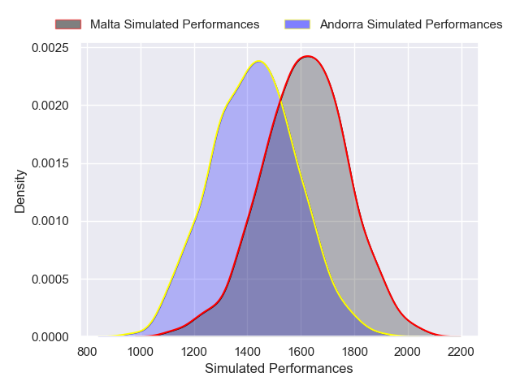
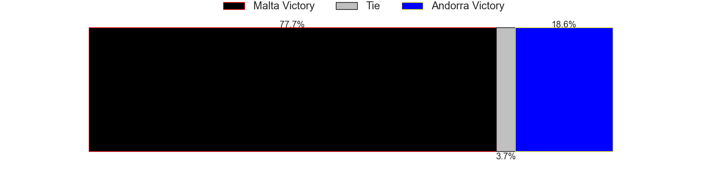
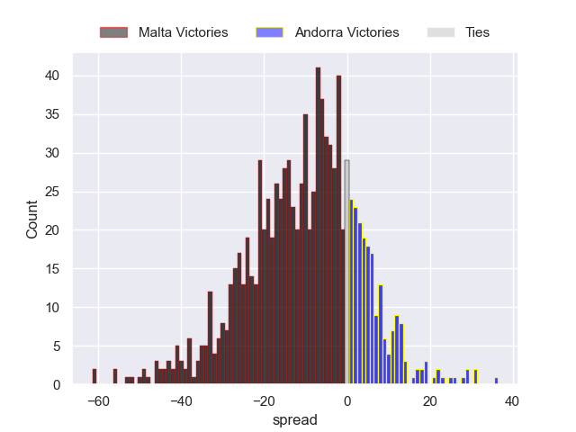

---  
title: "Developmental International 2024 Status"  
date: 2024-11-29 6:00:00 -0500  
categories: model review projection  
layout: article  
aside:  
    toc: true  
---
# Current Team Rankings

# Current Rankings

|   Rank | Team                   |   Rating |
|-------:|:-----------------------|---------:|
|      1 | New Zealand A          |  1637.71 |
|      2 | Sweden                 |  1633.71 |
|      3 | Trinidad and Tobago    |  1536.47 |
|      4 | England A              |  1442.2  |
|      5 | Georgia                |  1404.73 |
|      6 | Switzerland            |  1396.11 |
|      7 | Czech Republic         |  1382.85 |
|      8 | Croatia                |  1367.49 |
|      9 | Venezuela              |  1326.33 |
|     10 | Mexico                 |  1316.79 |
|     11 | Sri Lanka              |  1313.36 |
|     12 | Zimbabwe               |  1298.62 |
|     13 | Malta                  |  1298.18 |
|     14 | Moldova                |  1266.49 |
|     15 | Luxembourg             |  1227.11 |
|     16 | Barbados               |  1186.85 |
|     17 | Chile                  |  1166.69 |
|     18 | Lithuania              |  1159.22 |
|     19 | Denmark                |  1120    |
|     20 | Hong Kong              |  1070.35 |
|     21 | Australia A            |  1057.2  |
|     22 | Cyprus                 |  1051.22 |
|     23 | Andorra                |  1049.07 |
|     24 | Latvia                 |  1039.06 |
|     25 | Ukraine                |  1035.95 |
|     26 | Slovenia               |  1031.47 |
|     27 | Namibia                |   999.37 |
|     28 | Brazil                 |   994.6  |
|     29 | Austria                |   994.27 |
|     30 | Kenya                  |   961.98 |
|     31 | Cayman Islands         |   955.2  |
|     32 | Belgium                |   954.26 |
|     33 | Finland                |   946.67 |
|     34 | Hungary                |   934.04 |
|     35 | Turkey                 |   933.88 |
|     36 | Algeria                |   920.41 |
|     37 | Korea Republic         |   916.27 |
|     38 | Costa Rica             |   903.58 |
|     39 | Bulgaria               |   893    |
|     40 | Poland                 |   866.14 |
|     41 | Senegal                |   861.27 |
|     42 | Peru                   |   859.43 |
|     43 | Uganda                 |   812.34 |
|     44 | Colombia               |   804.66 |
|     45 | Qatar                  |   800.79 |
|     46 | Germany                |   798.59 |
|     47 | Jamaica                |   779.65 |
|     48 | Ivory Coast            |   745.96 |
|     49 | Guyana                 |   709.79 |
|     50 | Scotland A             |   702.45 |
|     51 | Bermuda                |   686.88 |
|     52 | Kazakhstan             |   626.29 |
|     53 | Bosnia and Herzegovina |   623.33 |
|     54 | United Arab Emirates   |   619.48 |
|     55 | Paraguay               |   511.74 |
|     56 | Norway                 |   497.15 |
|     57 | Malaysia               |   484.72 |
|     58 | India                  |   456.91 |
|     59 | Burkina Faso           |   440.31 |
|     60 | Singapore              |   402.88 |
|     61 | Serbia                 |   402.68 |
|     62 | Zambia                 |   389.61 |
|     63 | Thailand               |   340.68 |
|     64 | Montenegro             |   327.54 |
|     65 | Chinese Taipei         |   306.31 |
|     66 | Kosovo                 |   215.54 |
|     67 | Saint Lucia            |   172.44 |
|     68 | Slovakia               |   137.32 |
|     69 | Bahamas                |     4.82 |
|     70 | Estonia                |  -498.6  |
# Completed Match Review

| Model | Percent Correct Predictions | Spread Error |
| ------ | ------ | ------ |
| Club Level | 67.1% | 27.1 |
| Player Level: Lineup | 100.0% | 20.9 |
| Player Level: Minutes | 80.0% | 22.0 |

# Future Predictions

## Week 8

### Andorra V Malta on 2024/11/30

Average Margin: Malta by 10.3

Average Scoreline: 36-25

