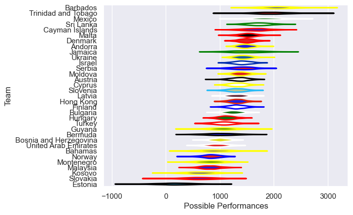

---  
title: "Developmental International 2025 Status"  
date: 2025-07-14 6:00:00 -0500  
categories: model review projection  
layout: article  
aside:  
    toc: true  
---
# Current Team Rankings

# Standings

## Projected Remaining Table

| Club   |   To Play |   Projected Wins |   Projected Differential |   Projected Losing Bonus Points | Projected Try Bonus Points   |   Projected Competition Points |
|:-------|----------:|-----------------:|-------------------------:|--------------------------------:|:-----------------------------|-------------------------------:|
| Chile  |         1 |            0.531 |                    2.063 |                           0.215 |                              |                          2.415 |
| Brazil |         1 |            0.431 |                   -2.063 |                           0.208 |                              |                          2.008 |

## Projected Total Table

| Club   |   Played |   Wins |   Point Differential |   Losing Bonus Points | Try Bonus Points   |   Competition Points |
|:-------|---------:|-------:|---------------------:|----------------------:|:-------------------|---------------------:|
| Chile  |        1 |  0.531 |                2.063 |                 0.215 |                    |                2.415 |
| Brazil |        1 |  0.431 |               -2.063 |                 0.208 |                    |                2.008 |

# Future Predictions

## Week 1

### Brazil V Chile on 2025/07/19

Average Margin: Chile by 2.1

