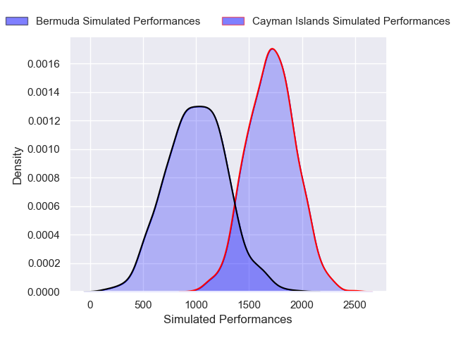
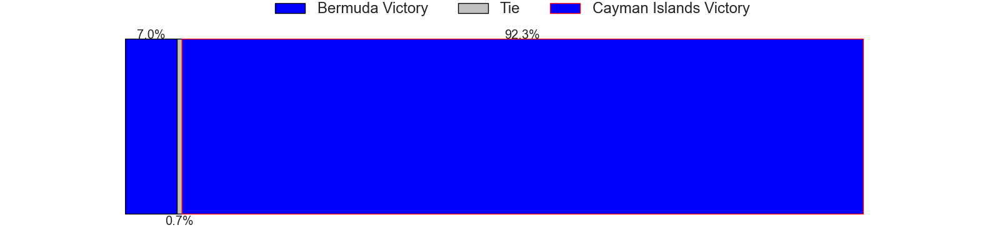
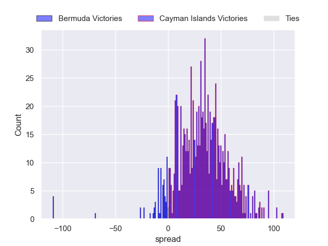
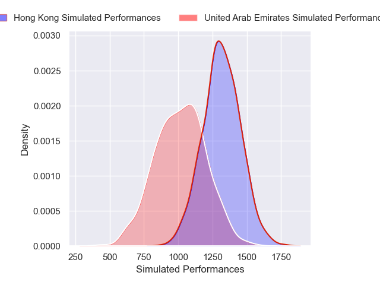
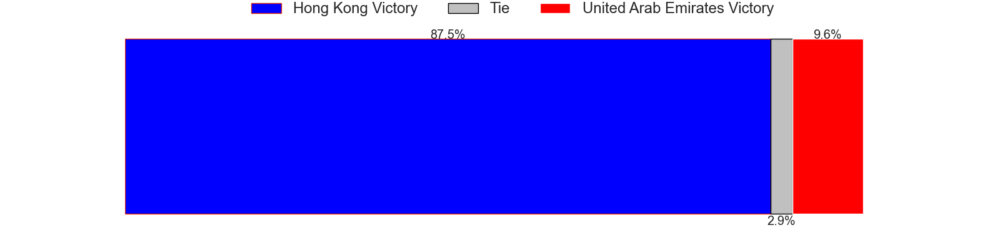
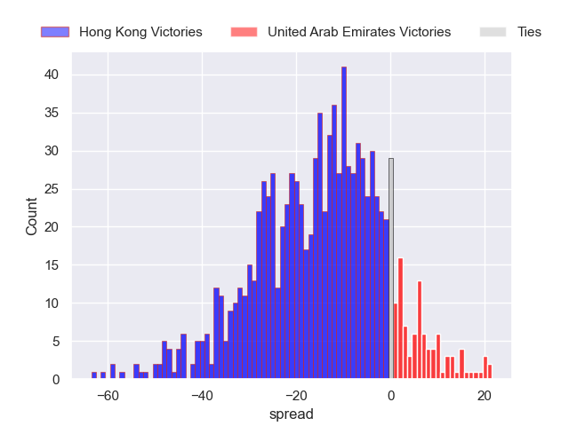

---  
title: "Developmental International 2025 Status"  
date: 2025-06-13 6:00:00 -0500  
categories: model review projection  
layout: article  
aside:  
    toc: true  
---
# Current Team Rankings

# Current Rankings

|   Rank | Team                   |   Rating |
|-------:|:-----------------------|---------:|
|      1 | Barbados               |  1469.93 |
|      2 | Trinidad and Tobago    |  1385.91 |
|      3 | Mexico                 |  1343.35 |
|      4 | Sri Lanka              |  1301.51 |
|      5 | Malta                  |  1219.55 |
|      6 | Denmark                |  1218.15 |
|      7 | Andorra                |  1213.58 |
|      8 | Cayman Islands         |  1180.01 |
|      9 | Ukraine                |  1122.03 |
|     10 | Israel                 |  1120.45 |
|     11 | Moldova                |  1084.81 |
|     12 | Austria                |  1048.21 |
|     13 | Cyprus                 |  1039.42 |
|     14 | Hong Kong              |  1036.42 |
|     15 | Latvia                 |  1015.74 |
|     16 | Finland                |  1006.86 |
|     17 | Serbia                 |  1003.49 |
|     18 | Slovenia               |   992.18 |
|     19 | Bulgaria               |   945.82 |
|     20 | Jamaica                |   883.88 |
|     21 | Hungary                |   838.13 |
|     22 | Turkey                 |   703.08 |
|     23 | Bosnia and Herzegovina |   701.77 |
|     24 | United Arab Emirates   |   594.39 |
|     25 | Guyana                 |   537.97 |
|     26 | Norway                 |   513.85 |
|     27 | Malaysia               |   463.2  |
|     28 | Bermuda                |   457.94 |
|     29 | Montenegro             |   358.55 |
|     30 | Bahamas                |   325.95 |
|     31 | Kosovo                 |   132.59 |
|     32 | Slovakia               |   118.98 |
|     33 | Estonia                |  -507.63 |
# Completed Match Review

| Model | Percent Correct Predictions | Spread Error |
| ------ | ------ | ------ |
| Club Level | 59.3% | 22.3 |
| Player Level: Lineup | nan% | nan |
| Player Level: Minutes | nan% | nan |

# Future Predictions

## Week 5

### Cayman Islands V Bermuda on 2025/06/14

Average Margin: Cayman Islands by 32.3

Average Scoreline: 47-14

### United Arab Emirates V Hong Kong on 2025/06/14

Average Margin: Hong Kong by 14.0

Average Scoreline: 35-21

