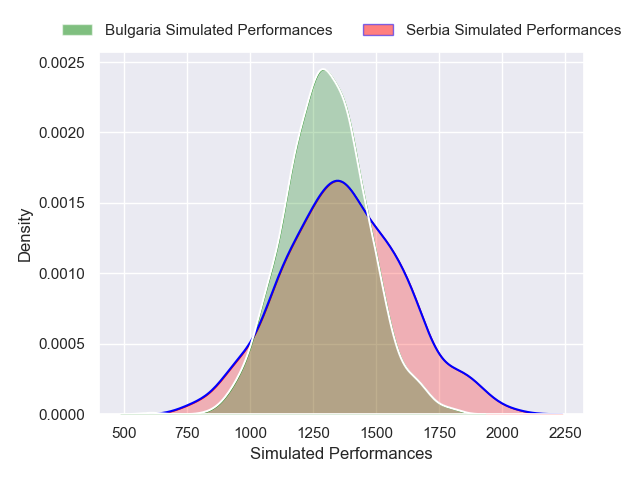
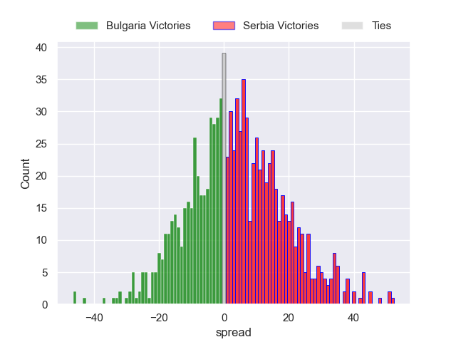
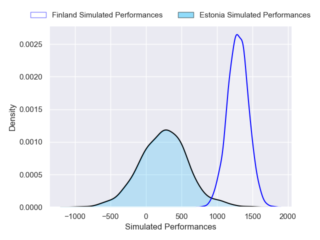
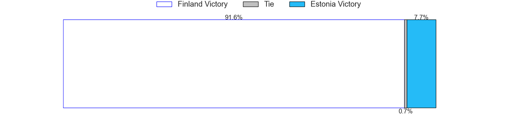
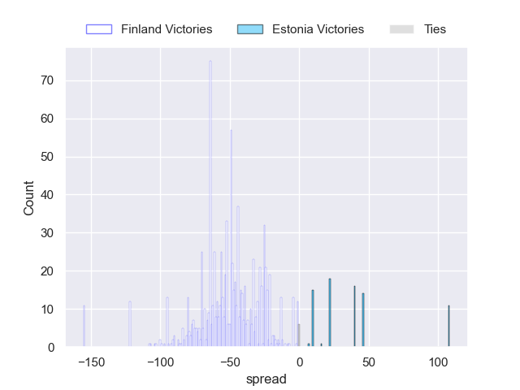
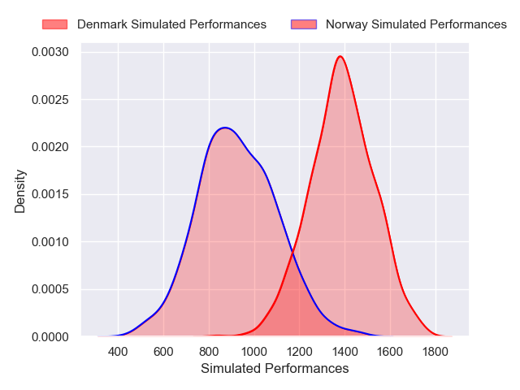
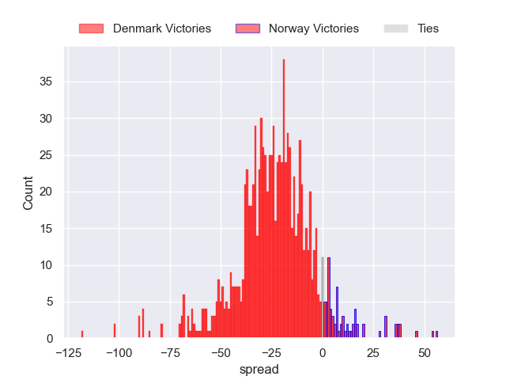

---  
title: "Developmental International 2025 Status"  
date: 2025-05-08 6:00:00 -0500  
categories: model review projection  
layout: article  
aside:  
    toc: true  
---
# Current Team Rankings

# Current Rankings

|   Rank | Team                   |   Rating |
|-------:|:-----------------------|---------:|
|      1 | Mexico                 |  1345.71 |
|      2 | Sri Lanka              |  1304.53 |
|      3 | Malta                  |  1223.64 |
|      4 | Andorra                |  1218.28 |
|      5 | Cayman Islands         |  1182.69 |
|      6 | Moldova                |  1177.54 |
|      7 | Ukraine                |  1126.25 |
|      8 | Israel                 |  1124.69 |
|      9 | Denmark                |  1098.91 |
|     10 | Austria                |  1052.12 |
|     11 | Cyprus                 |  1043.74 |
|     12 | Latvia                 |  1019.94 |
|     13 | Finland                |  1000.53 |
|     14 | Slovenia               |   996.03 |
|     15 | Bulgaria               |   977.45 |
|     16 | Jamaica                |   886.04 |
|     17 | Serbia                 |   842.55 |
|     18 | Hungary                |   842.44 |
|     19 | Turkey                 |   706.52 |
|     20 | Bosnia and Herzegovina |   705.88 |
|     21 | Guyana                 |   541.41 |
|     22 | Norway                 |   518.54 |
|     23 | Malaysia               |   466.84 |
|     24 | Montenegro             |   361.23 |
|     25 | Kosovo                 |   135.03 |
|     26 | Slovakia               |   121.37 |
|     27 | Estonia                |  -506.92 |
# Completed Match Review

| Model | Percent Correct Predictions | Spread Error |
| ------ | ------ | ------ |
| Club Level | 55.0% | 21.8 |
| Player Level: Lineup | nan% | nan |
| Player Level: Minutes | nan% | nan |

# Future Predictions

## Week 5

### Serbia V Bulgaria on 2025/05/10

Average Margin: Serbia by 4.4

Average Scoreline: 34-30

### Estonia V Finland on 2025/05/10

Average Margin: Finland by 44.0

Average Scoreline: 50-6

### Norway V Denmark on 2025/05/10

Average Margin: Denmark by 23.9

Average Scoreline: 42-18

