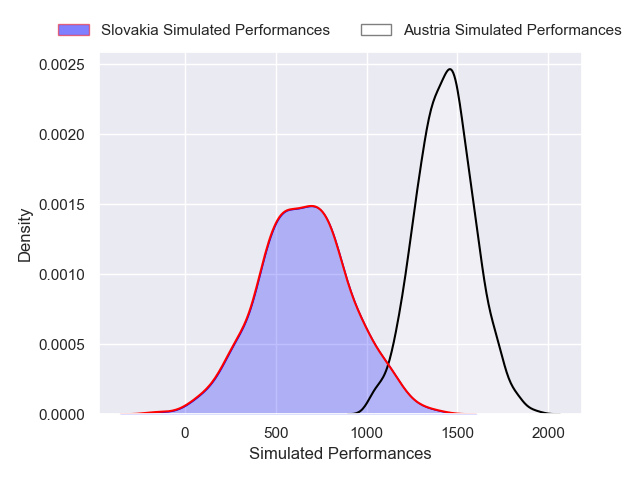
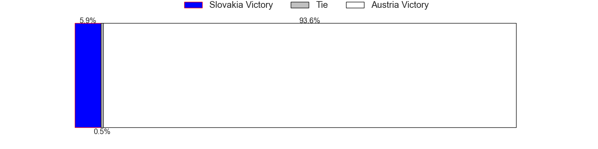
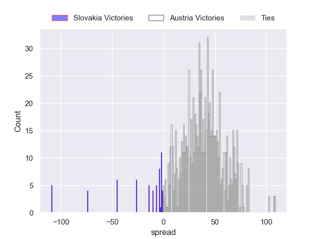
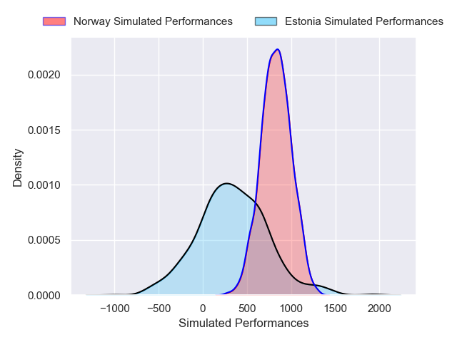
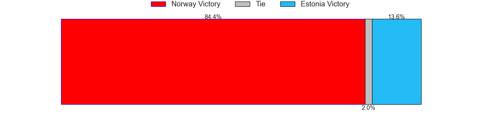
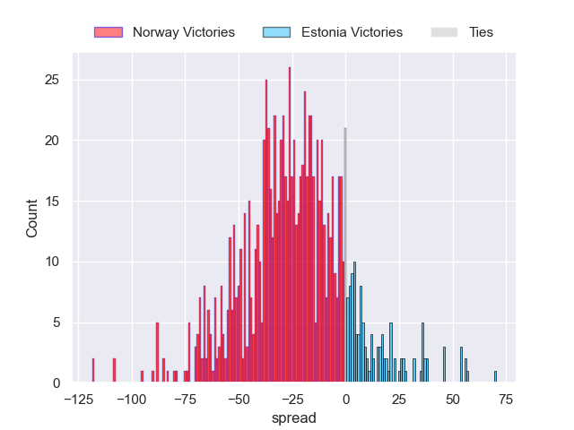

---  
title: "Developmental International 2025 Status"  
date: 2025-04-28 6:00:00 -0500  
categories: model review projection  
layout: article  
aside:  
    toc: true  
---
# Current Team Rankings

# Current Rankings

|   Rank | Team                   |   Rating |
|-------:|:-----------------------|---------:|
|      1 | Sri Lanka              |  1307.57 |
|      2 | Malta                  |  1227.79 |
|      3 | Andorra                |  1223.07 |
|      4 | Cayman Islands         |  1185.39 |
|      5 | Moldova                |  1181.41 |
|      6 | Ukraine                |  1130.53 |
|      7 | Israel                 |  1128.98 |
|      8 | Denmark                |  1103.26 |
|      9 | Cyprus                 |  1048.12 |
|     10 | Austria                |  1043.62 |
|     11 | Latvia                 |  1024.21 |
|     12 | Finland                |  1004.75 |
|     13 | Slovenia               |   999.94 |
|     14 | Bulgaria               |   981.37 |
|     15 | Hungary                |   846.81 |
|     16 | Serbia                 |   845.19 |
|     17 | Bosnia and Herzegovina |   710.05 |
|     18 | Turkey                 |   710    |
|     19 | Guyana                 |   543.79 |
|     20 | Norway                 |   478.57 |
|     21 | Malaysia               |   470.52 |
|     22 | Montenegro             |   363.92 |
|     23 | Kosovo                 |   137.48 |
|     24 | Slovakia               |   125.34 |
|     25 | Estonia                |  -506.7  |
# Completed Match Review

| Model | Percent Correct Predictions | Spread Error |
| ------ | ------ | ------ |
| Club Level | 47.1% | 18.6 |
| Player Level: Lineup | nan% | nan |
| Player Level: Minutes | nan% | nan |

# Future Predictions

## Week 5

### Austria V Slovakia on 2025/05/03

Average Margin: Austria by 36.0

Average Scoreline: 38-2

### Estonia V Norway on 2025/05/03

Average Margin: Norway by 24.2

Average Scoreline: 40-16

