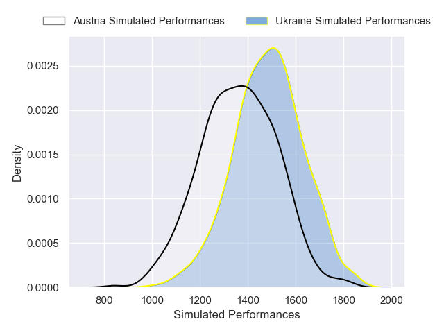
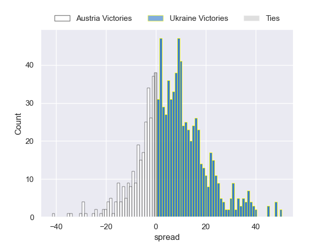
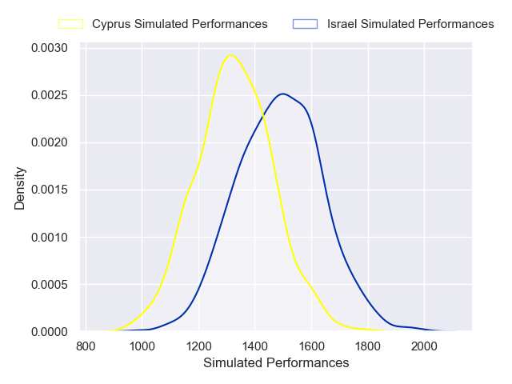
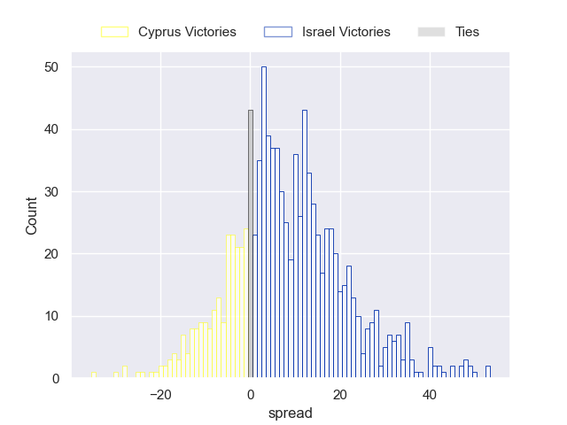
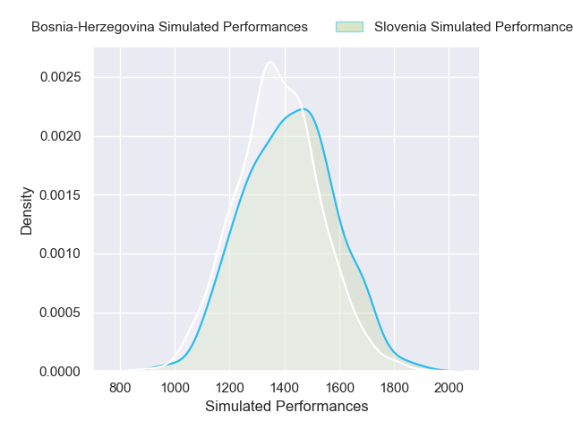
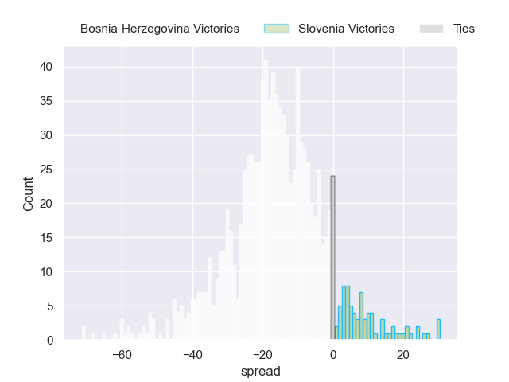

---  
title: "Developmental International 2025 Status"  
date: 2025-04-24 6:00:00 -0500  
categories: model review projection  
layout: article  
aside:  
    toc: true  
---
# Current Team Rankings

# Current Rankings

|   Rank | Team                   |   Rating |
|-------:|:-----------------------|---------:|
|      1 | Sri Lanka              |  1307.57 |
|      2 | Malta                  |  1227.79 |
|      3 | Andorra                |  1223.07 |
|      4 | Moldova                |  1181.41 |
|      5 | Ukraine                |  1130.53 |
|      6 | Israel                 |  1128.98 |
|      7 | Denmark                |  1103.26 |
|      8 | Bosnia-Herzegovina     |  1068.24 |
|      9 | Latvia                 |  1068.24 |
|     10 | Cyprus                 |  1048.12 |
|     11 | Austria                |  1043.62 |
|     12 | Slovenia               |  1023.64 |
|     13 | Bulgaria               |   981.37 |
|     14 | Hungary                |   846.81 |
|     15 | Serbia                 |   845.19 |
|     16 | Turkey                 |   710    |
|     17 | Bosnia and Herzegovina |   681.54 |
|     18 | Malaysia               |   470.52 |
|     19 | Montenegro             |   363.92 |
|     20 | Kosovo                 |   137.48 |
# Completed Match Review

| Model | Percent Correct Predictions | Spread Error |
| ------ | ------ | ------ |
| Club Level | 42.9% | 18.8 |
| Player Level: Lineup | nan% | nan |
| Player Level: Minutes | nan% | nan |

# Future Predictions

## Week 5

### Ukraine V Austria on 2025/04/25

Average Margin: Ukraine by 6.7

Average Scoreline: 27-21

### Israel V Cyprus on 2025/04/25

Average Margin: Israel by 9.0

Average Scoreline: 26-17

### Slovenia V Bosnia-Herzegovina on 2025/04/26

Average Margin: Slovenia by 3.1

Average Scoreline: 30-27

