---  
title: "Developmental International 2025 Status"  
date: 2025-04-14 6:00:00 -0500  
categories: model review projection  
layout: article  
aside:  
    toc: true  
---
# Current Team Rankings

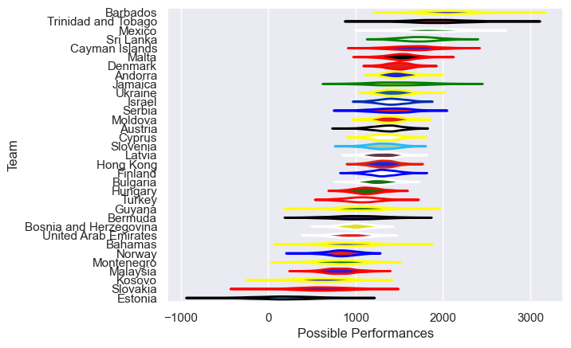
# Current Rankings

|   Rank | Team                   |   Rating |
|-------:|:-----------------------|---------:|
|      1 | Sri Lanka              |  1298.11 |
|      2 | Moldova                |  1247.71 |
|      3 | Malta                  |  1227.79 |
|      4 | Andorra                |  1223.07 |
|      5 | Ukraine                |  1155.59 |
|      6 | Israel                 |  1142.77 |
|      7 | Denmark                |  1098.92 |
|      8 | Latvia                 |  1019.88 |
|      9 | Slovenia               |  1012.44 |
|     10 | Cyprus                 |  1000.16 |
|     11 | Bulgaria               |   873.95 |
|     12 | Hungary                |   846.81 |
|     13 | Serbia                 |   845.19 |
|     14 | Turkey                 |   710    |
|     15 | Bosnia and Herzegovina |   681.54 |
|     16 | Malaysia               |   466.08 |
|     17 | Montenegro             |   314.72 |
|     18 | Kosovo                 |   137.48 |
# Completed Match Review

| Model | Percent Correct Predictions | Spread Error |
| ------ | ------ | ------ |
| Club Level | 28.6% | 31.0 |
| Player Level: Lineup | nan% | nan |
| Player Level: Minutes | nan% | nan |

# Future Predictions

## Week 4

### Bulgaria V Moldova on 2025/04/18

Average Margin: Moldova by 16.2

Average Scoreline: 35-19

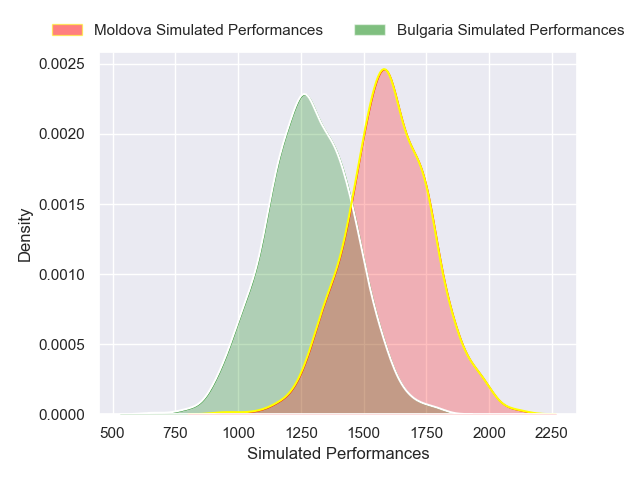
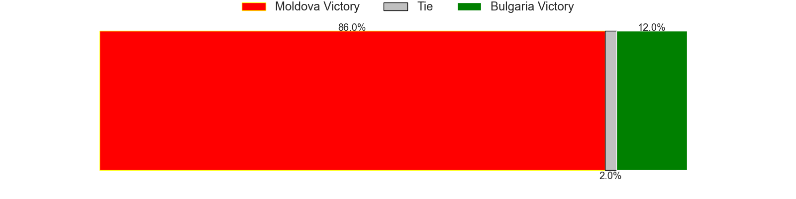
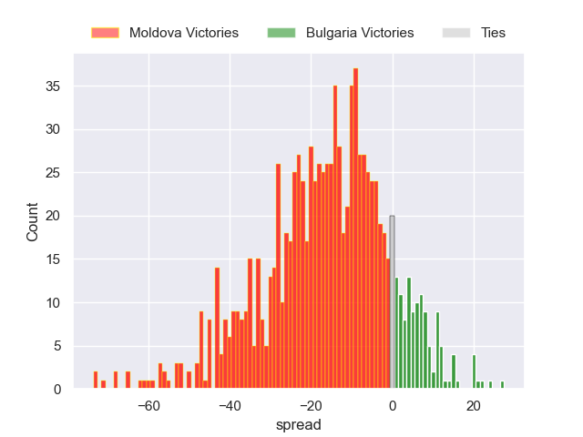

### Malaysia V Sri Lanka on 2025/04/18

Average Margin: Sri Lanka by 37.3

Average Scoreline: 48-10

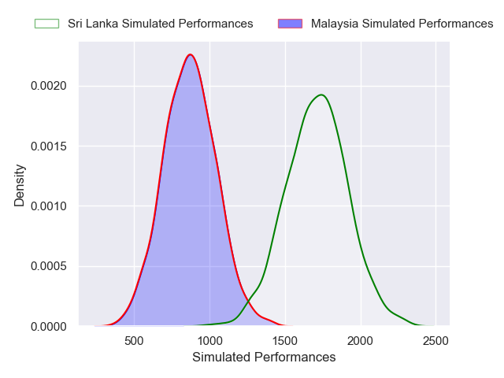
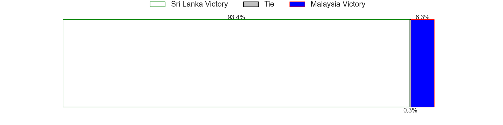
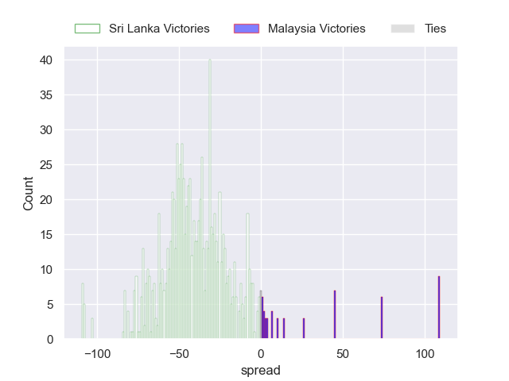

### Sri Lanka V Malaysia on 2025/04/19

Average Margin: Sri Lanka by 40.8

Average Scoreline: 49-9

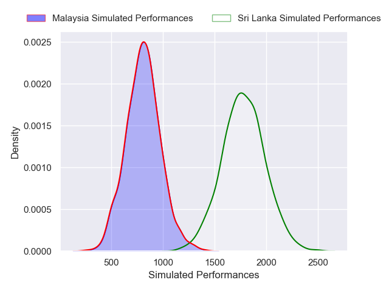
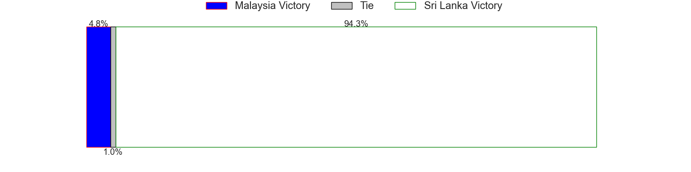
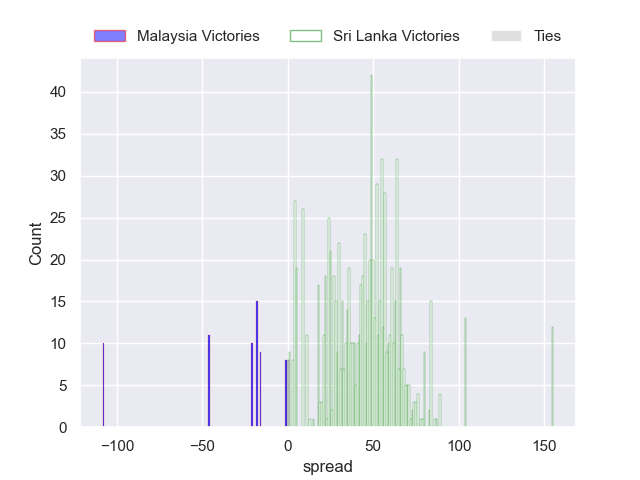

### Montenegro V Slovenia on 2025/04/19

Average Margin: Slovenia by 24.6

Average Scoreline: 44-20

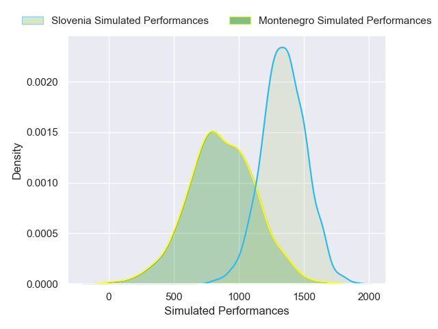
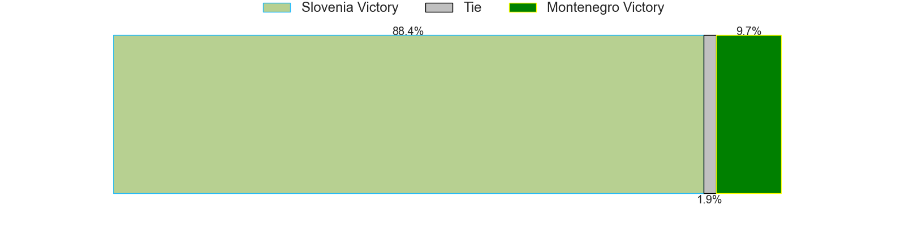
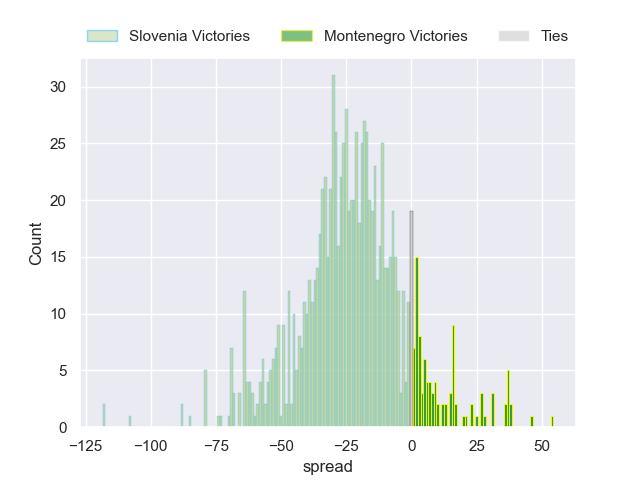

### Denmark V Latvia on 2025/04/19

Average Margin: Denmark by 7.0

Average Scoreline: 33-26

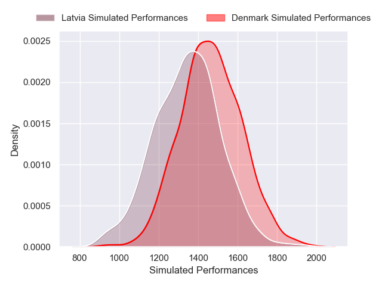

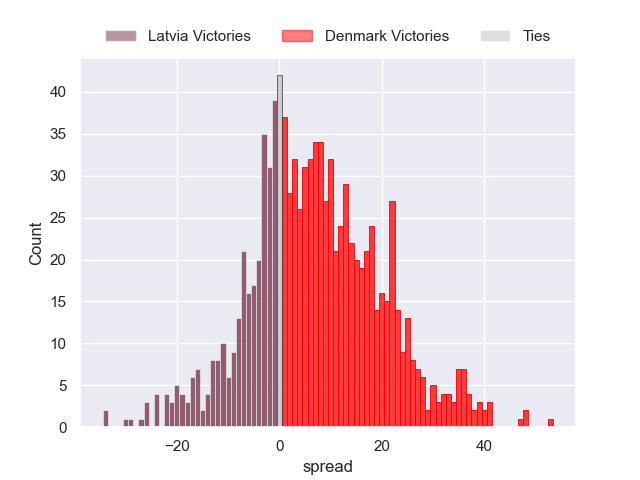

