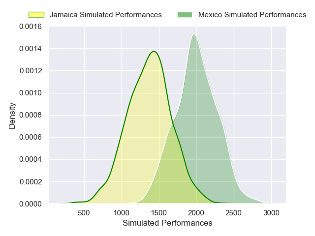
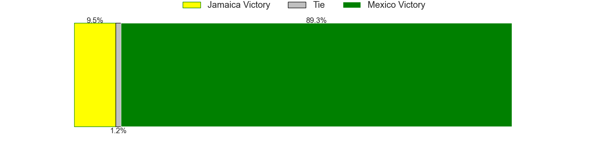
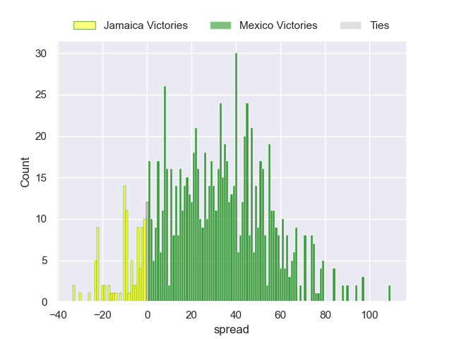

---  
title: "Developmental International 2025 Status"  
date: 2025-05-02 6:00:00 -0500  
categories: model review projection  
layout: article  
aside:  
    toc: true  
---
# Current Team Rankings

# Current Rankings

|   Rank | Team                   |   Rating |
|-------:|:-----------------------|---------:|
|      1 | Mexico                 |  1396.54 |
|      2 | Sri Lanka              |  1304.53 |
|      3 | Malta                  |  1223.64 |
|      4 | Andorra                |  1218.28 |
|      5 | Cayman Islands         |  1182.69 |
|      6 | Moldova                |  1177.54 |
|      7 | Ukraine                |  1126.25 |
|      8 | Israel                 |  1124.69 |
|      9 | Denmark                |  1098.91 |
|     10 | Cyprus                 |  1043.74 |
|     11 | Austria                |  1039.74 |
|     12 | Latvia                 |  1019.94 |
|     13 | Finland                |  1000.53 |
|     14 | Slovenia               |   996.03 |
|     15 | Bulgaria               |   977.45 |
|     16 | Serbia                 |   842.55 |
|     17 | Hungary                |   842.44 |
|     18 | Jamaica                |   767.11 |
|     19 | Turkey                 |   706.52 |
|     20 | Bosnia and Herzegovina |   705.88 |
|     21 | Guyana                 |   541.41 |
|     22 | Norway                 |   474.97 |
|     23 | Malaysia               |   466.84 |
|     24 | Montenegro             |   361.23 |
|     25 | Kosovo                 |   135.03 |
|     26 | Slovakia               |   122.97 |
|     27 | Estonia                |  -508.31 |
# Completed Match Review

| Model | Percent Correct Predictions | Spread Error |
| ------ | ------ | ------ |
| Club Level | 47.1% | 18.6 |
| Player Level: Lineup | nan% | nan |
| Player Level: Minutes | nan% | nan |

# Future Predictions

## Week 5

### Estonia V Norway on 2025/05/03

Average Margin: Norway by 23.4

Average Scoreline: 40-16

### Austria V Slovakia on 2025/05/03

Average Margin: Austria by 35.4

Average Scoreline: 38-3

### Mexico V Jamaica on 2025/05/03

Average Margin: Mexico by 30.0

Average Scoreline: 30-0

