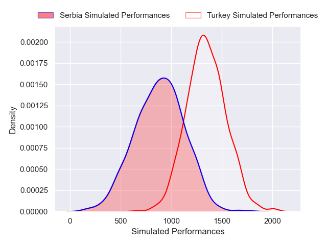
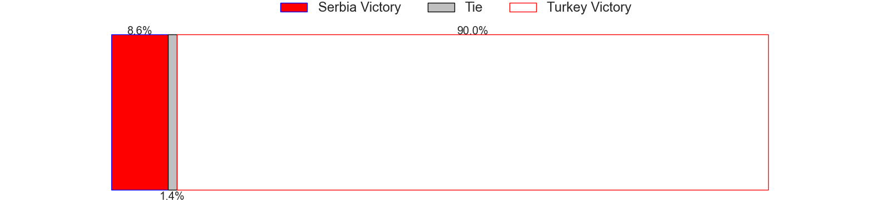
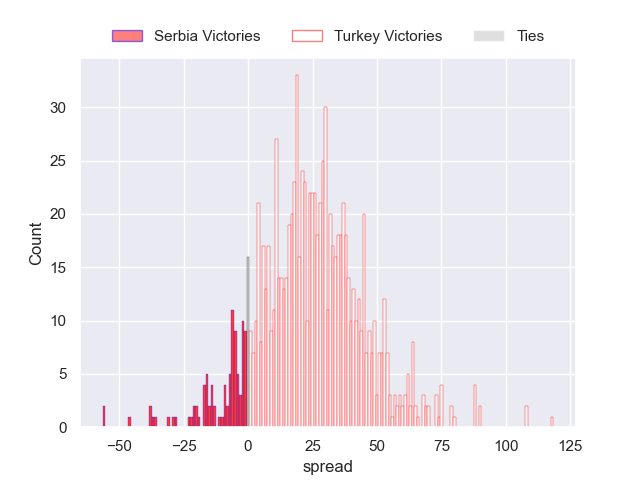
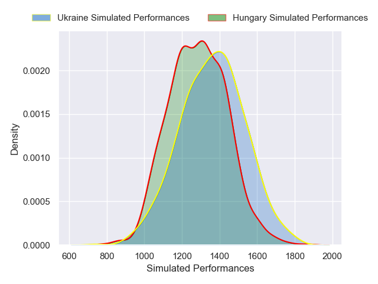
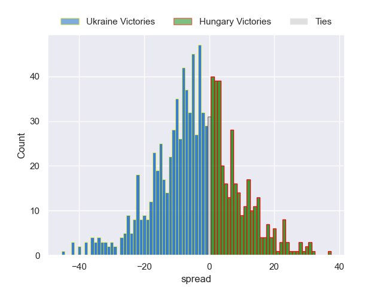

---  
title: "Developmental International 2025 Status"  
date: 2025-04-11 6:00:00 -0500  
categories: model review projection  
layout: article  
aside:  
    toc: true  
---
# Current Team Rankings

# Current Rankings

|   Rank | Team                   |   Rating |
|-------:|:-----------------------|---------:|
|      1 | Malta                  |  1227.79 |
|      2 | Andorra                |  1223.07 |
|      3 | Israel                 |  1142.77 |
|      4 | Ukraine                |  1017.04 |
|      5 | Cyprus                 |  1000.16 |
|      6 | Turkey                 |   916.7  |
|      7 | Hungary                |   913.04 |
|      8 | Bosnia and Herzegovina |   681.54 |
|      9 | Serbia                 |   390.05 |
|     10 | Kosovo                 |   137.48 |
# Completed Match Review

| Model | Percent Correct Predictions | Spread Error |
| ------ | ------ | ------ |
| Club Level | 20.0% | 20.5 |
| Player Level: Lineup | nan% | nan |
| Player Level: Minutes | nan% | nan |

# Future Predictions

## Week 4

### Turkey V Serbia on 2025/04/12

Average Margin: Turkey by 24.6

Average Scoreline: 36-11

### Hungary V Ukraine on 2025/04/12

Average Margin: Ukraine by 4.0

Average Scoreline: 31-27

