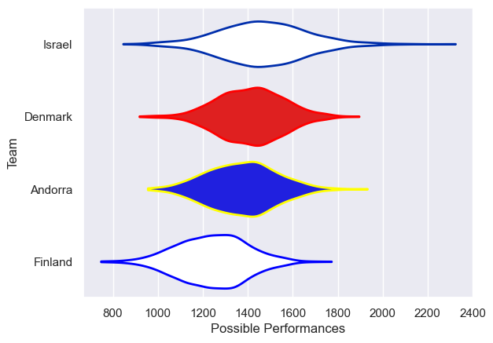
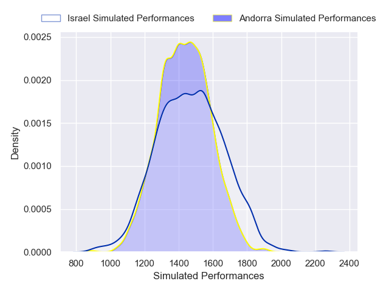
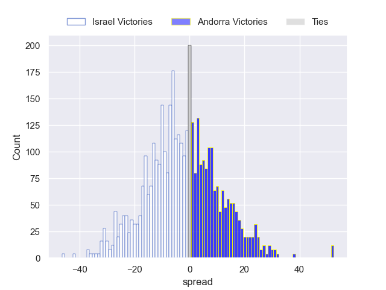
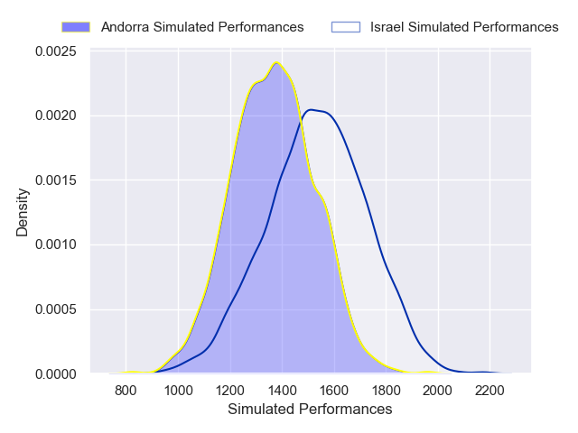
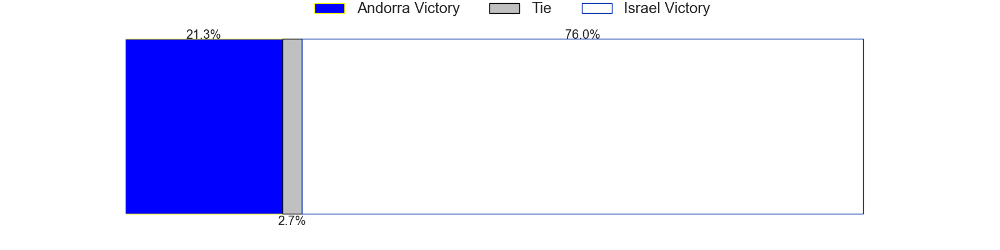
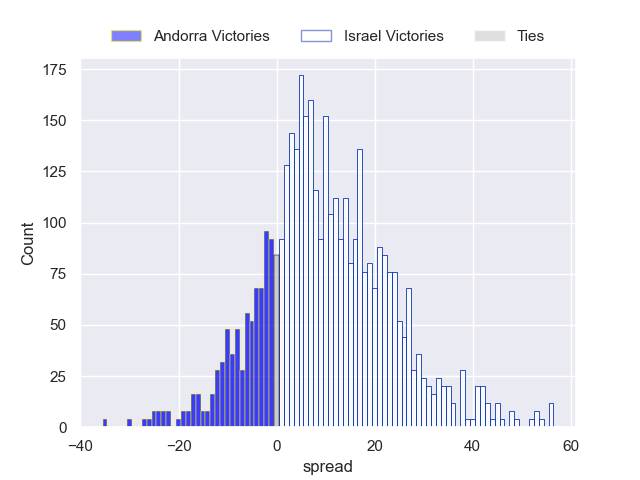

---  
title: "Developmental International 2025 Status"  
date: 2025-01-27 6:00:00 -0500  
categories: model review projection  
layout: article  
aside:  
    toc: true  
---
# Current Team Rankings

# Current Rankings

|   Rank | Team    |   Rating |
|-------:|:--------|---------:|
|      1 | Denmark |  1111.38 |
|      2 | Israel  |  1090.92 |
|      3 | Andorra |  1065.01 |
|      4 | Finland |   938.31 |
# Completed Match Review

| Model | Percent Correct Predictions | Spread Error |
| ------ | ------ | ------ |
| Club Level | 100.0% | 36.3 |
| Player Level: Lineup | nan% | nan |
| Player Level: Minutes | nan% | nan |

# Future Predictions

## Week 2

### Andorra V Israel on 2025/02/01

Average Margin: Israel by 2.4

Average Scoreline: 25-23

### Andorra V Israel on 2025/02/01

Average Margin: Israel by 2.4

Average Scoreline: 25-23

### Andorra V Israel on 2025/02/01

Average Margin: Israel by 2.4

Average Scoreline: 25-23

### Andorra V Israel on 2025/02/01

Average Margin: Israel by 2.4

Average Scoreline: 25-23

### Israel V Andorra on 2025/02/01

Average Margin: Israel by 9.6

Average Scoreline: 29-19

### Israel V Andorra on 2025/02/01

Average Margin: Israel by 9.6

Average Scoreline: 29-19

### Israel V Andorra on 2025/02/01

Average Margin: Israel by 9.6

Average Scoreline: 29-19

### Israel V Andorra on 2025/02/01

Average Margin: Israel by 9.6

Average Scoreline: 29-19

