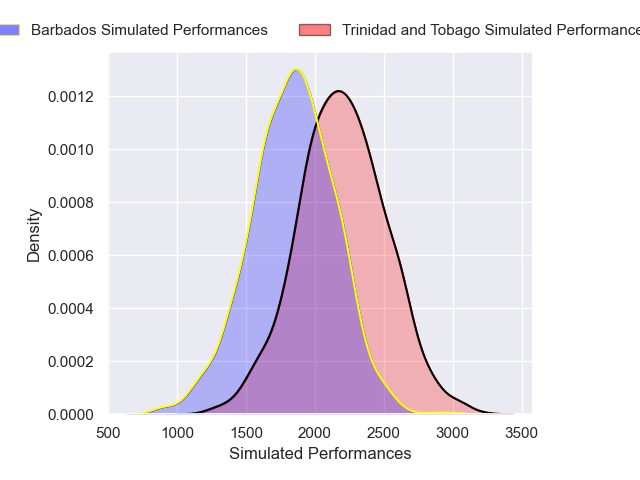
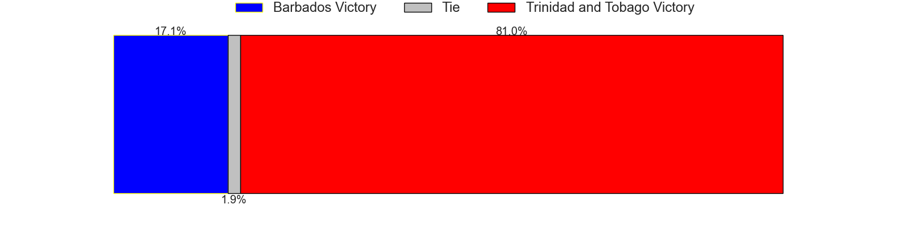
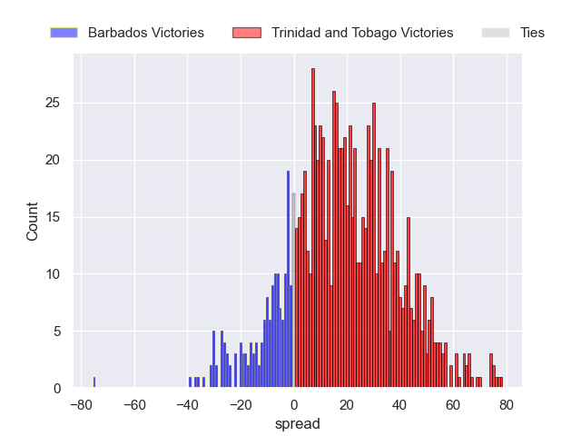

---  
title: "Developmental International 2025 Status"  
date: 2025-05-26 6:00:00 -0500  
categories: model review projection  
layout: article  
aside:  
    toc: true  
---
# Current Team Rankings

# Current Rankings

|   Rank | Team                   |   Rating |
|-------:|:-----------------------|---------:|
|      1 | Trinidad and Tobago    |  1524.27 |
|      2 | Mexico                 |  1345.71 |
|      3 | Sri Lanka              |  1304.53 |
|      4 | Malta                  |  1223.64 |
|      5 | Denmark                |  1222.86 |
|      6 | Andorra                |  1218.28 |
|      7 | Barbados               |  1203.29 |
|      8 | Cayman Islands         |  1182.69 |
|      9 | Ukraine                |  1126.25 |
|     10 | Israel                 |  1124.69 |
|     11 | Moldova                |  1089    |
|     12 | Austria                |  1052.12 |
|     13 | Cyprus                 |  1043.74 |
|     14 | Latvia                 |  1019.94 |
|     15 | Finland                |  1011.09 |
|     16 | Serbia                 |  1006.54 |
|     17 | Slovenia               |   996.03 |
|     18 | Bulgaria               |   949.97 |
|     19 | Jamaica                |   886.04 |
|     20 | Hungary                |   842.44 |
|     21 | Turkey                 |   706.52 |
|     22 | Bosnia and Herzegovina |   705.88 |
|     23 | Guyana                 |   540.39 |
|     24 | Norway                 |   517.64 |
|     25 | Malaysia               |   466.84 |
|     26 | Bermuda                |   460.21 |
|     27 | Montenegro             |   361.23 |
|     28 | Bahamas                |   328.1  |
|     29 | Kosovo                 |   135.03 |
|     30 | Slovakia               |   121.37 |
|     31 | Estonia                |  -505.77 |
# Completed Match Review

| Model | Percent Correct Predictions | Spread Error |
| ------ | ------ | ------ |
| Club Level | 57.7% | 22.4 |
| Player Level: Lineup | nan% | nan |
| Player Level: Minutes | nan% | nan |

# Future Predictions

## Week 5

### Trinidad and Tobago V Barbados on 2025/05/31

Average Margin: Trinidad and Tobago by 17.8

Average Scoreline: 37-19

