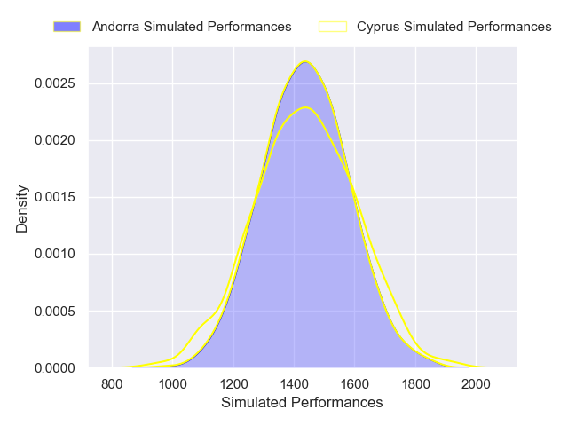
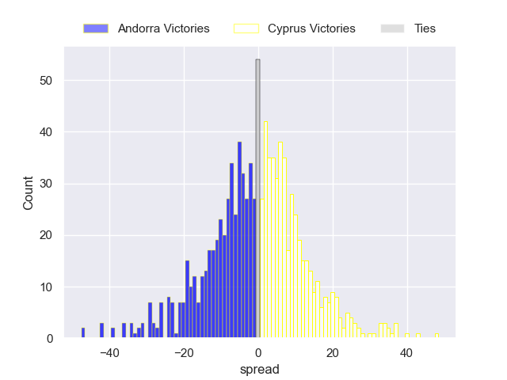
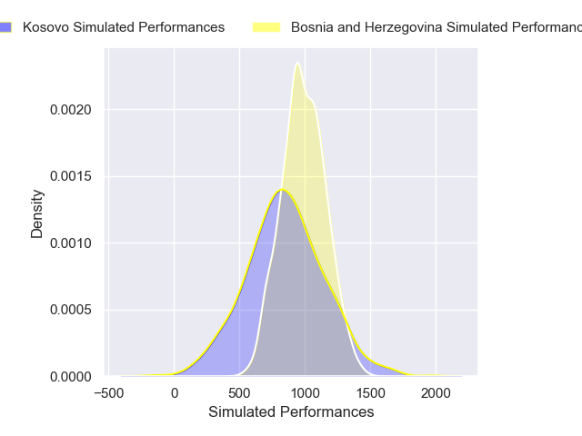
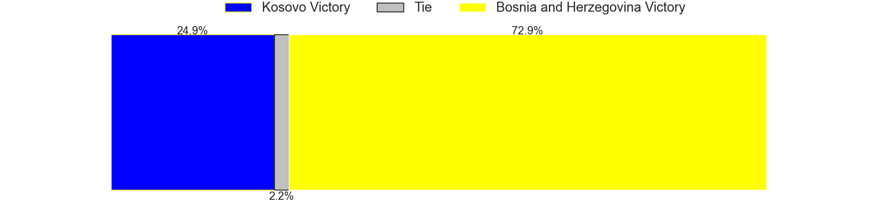
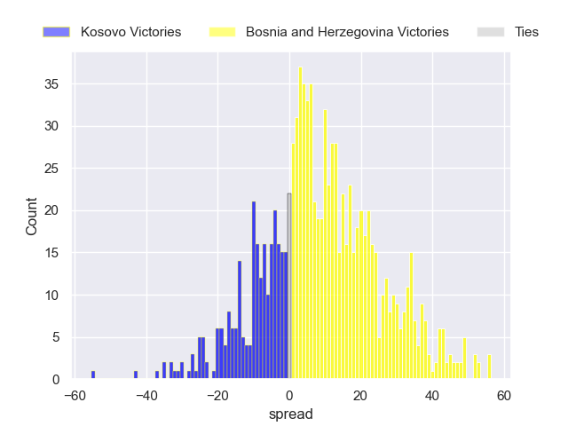
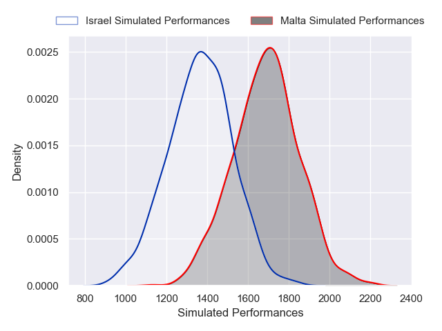
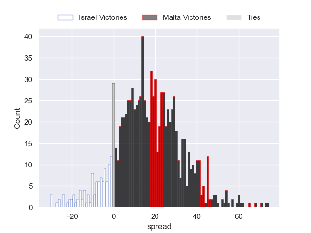

---  
title: "Developmental International 2025 Status"  
date: 2025-03-31 6:00:00 -0500  
categories: model review projection  
layout: article  
aside:  
    toc: true  
---
# Current Team Rankings

# Current Rankings

|   Rank | Team                   |   Rating |
|-------:|:-----------------------|---------:|
|      1 | Malta                  |  1300.04 |
|      2 | Bosnia-Herzegovina     |  1163.48 |
|      3 | Andorra                |  1159.92 |
|      4 | Israel                 |  1032.95 |
|      5 | Cyprus                 |  1031.9  |
|      6 | Bosnia and Herzegovina |   603.23 |
|      7 | Kosovo                 |   205.52 |
# Completed Match Review

| Model | Percent Correct Predictions | Spread Error |
| ------ | ------ | ------ |
| Club Level | 0.0% | 8.3 |
| Player Level: Lineup | nan% | nan |
| Player Level: Minutes | nan% | nan |

# Future Predictions

## Week 3

### Cyprus V Andorra on 2025/04/05

Average Margin: Andorra by 0.6

Average Scoreline: 23-22

### Bosnia and Herzegovina V Kosovo on 2025/04/05

Average Margin: Bosnia and Herzegovina by 9.2

Average Scoreline: 33-23

### Malta V Israel on 2025/04/05

Average Margin: Malta by 16.8

Average Scoreline: 38-21

