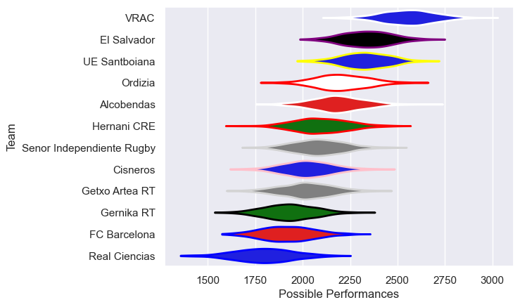

---  
title: "Division de Honor de Rugby 16/17"  
date: 2025-07-29 6:00:00 -0500  
categories: model review projection  
layout: article  
aside:  
    toc: true  
---
# Current Team Rankings

# Standings

## Current Standings

| Club                      |   Played |   Wins |   Point Differential |   Losing Bonus Points | Try Bonus Points   |   Competition Points |
|:--------------------------|---------:|-------:|---------------------:|----------------------:|:-------------------|---------------------:|
| VRAC                      |       24 |     21 |                  561 |                     1 |                    |                   85 |
| El Salvador               |       24 |     20 |                  402 |                     2 |                    |                   82 |
| Alcobendas                |       24 |     17 |                  296 |                     2 |                    |                   70 |
| UE Santboiana             |       24 |     16 |                  286 |                     3 |                    |                   67 |
| Cisneros                  |       23 |     13 |                   61 |                     1 |                    |                   53 |
| Senor Independiente Rugby |       23 |     12 |                 -150 |                     1 |                    |                   49 |
| Ordizia                   |       22 |     10 |                   -2 |                     3 |                    |                   43 |
| Gernika RT                |       22 |      9 |                  -61 |                     3 |                    |                   39 |
| Hernani CRE               |       22 |      7 |                 -257 |                     4 |                    |                   32 |
| FC Barcelona              |       22 |      5 |                 -278 |                     4 |                    |                   24 |
| Getxo Artea RT            |       22 |      4 |                 -358 |                     3 |                    |                   21 |
| Real Ciencias             |       22 |      2 |                 -500 |                     5 |                    |                   15 |

# Completed Match Review

| Model | Percent Correct Predictions | Spread Error |
| ------ | ------ | ------ |
| Club Level | 75.2% | 13.9 |
| Player Level: Lineup | nan% | nan |
| Player Level: Minutes | nan% | nan |

