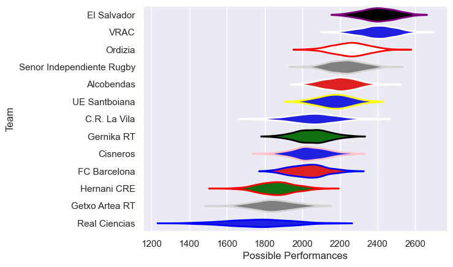

---  
title: "Division de Honor de Rugby 17/18 Status"  
date: 2025-07-28 6:00:00 -0500  
categories: model review projection  
layout: article  
aside:  
    toc: true  
---
# Current Team Rankings

# Standings

## Current Standings

| Club                      |   Played |   Wins |   Point Differential |   Losing Bonus Points |   Try Bonus Points |   Competition Points |
|:--------------------------|---------:|-------:|---------------------:|----------------------:|-------------------:|---------------------:|
| VRAC                      |       24 |     23 |                  488 |                     1 |                    |                   93 |
| El Salvador               |       24 |     20 |                  452 |                     3 |                    |                   83 |
| Alcobendas                |       24 |     16 |                  194 |                     4 |                    |                   70 |
| Senor Independiente Rugby |       24 |     14 |                   58 |                     6 |                    |                   62 |
| Ordizia                   |       23 |     13 |                  180 |                     6 |                    |                   60 |
| UE Santboiana             |       23 |     11 |                  104 |                     7 |                    |                   51 |
| FC Barcelona              |       22 |      9 |                  -93 |                     3 |                    |                   39 |
| Gernika RT                |       22 |      9 |                 -141 |                     3 |                    |                   39 |
| C.R. La Vila              |       22 |      7 |                 -159 |                     4 |                    |                   32 |
| Cisneros                  |       22 |      7 |                 -154 |                     2 |                    |                   30 |
| Hernani CRE               |       24 |      5 |                 -412 |                     5 |                  1 |                   26 |
| Getxo Artea RT            |       22 |      3 |                 -508 |                     3 |                    |                   15 |
| Real Ciencias             |        2 |      1 |                   -9 |                     0 |                    |                    4 |

# Completed Match Review

| Model | Percent Correct Predictions | Spread Error |
| ------ | ------ | ------ |
| Club Level | 81.3% | 12.7 |
| Player Level: Lineup | nan% | nan |
| Player Level: Minutes | nan% | nan |

