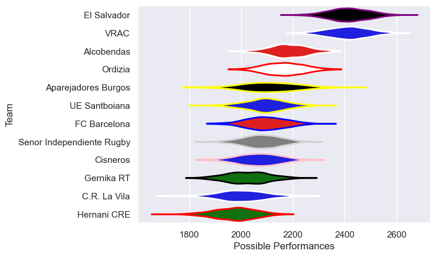

---  
title: "Division de Honor de Rugby 18/19 Status"  
date: 2025-07-28 6:00:00 -0500  
categories: model review projection  
layout: article  
aside:  
    toc: true  
---
# Current Team Rankings

# Standings

## Current Standings

| Club                      |   Played |   Wins |   Point Differential |   Losing Bonus Points |   Try Bonus Points |   Competition Points |
|:--------------------------|---------:|-------:|---------------------:|----------------------:|-------------------:|---------------------:|
| VRAC                      |       24 |     20 |                  401 |                     1 |                  1 |                   84 |
| El Salvador               |       24 |     19 |                  448 |                     1 |                    |                   81 |
| Alcobendas                |       24 |     17 |                  120 |                     2 |                    |                   72 |
| Ordizia                   |       24 |     13 |                   25 |                     2 |                    |                   58 |
| FC Barcelona              |       23 |     11 |                  -60 |                     4 |                    |                   50 |
| Aparejadores Burgos       |       23 |     11 |                  -49 |                     4 |                    |                   48 |
| UE Santboiana             |       22 |     10 |                   -4 |                     5 |                    |                   47 |
| Senor Independiente Rugby |       22 |      7 |                 -111 |                     5 |                    |                   35 |
| Hernani CRE               |       22 |      7 |                 -218 |                     6 |                    |                   34 |
| C.R. La Vila              |       22 |      6 |                 -190 |                     7 |                    |                   31 |
| Cisneros                  |       22 |      5 |                 -147 |                     8 |                    |                   30 |
| Gernika RT                |       22 |      5 |                 -215 |                     6 |                    |                   30 |

# Completed Match Review

| Model | Percent Correct Predictions | Spread Error |
| ------ | ------ | ------ |
| Club Level | 69.3% | 11.4 |
| Player Level: Lineup | nan% | nan |
| Player Level: Minutes | nan% | nan |

