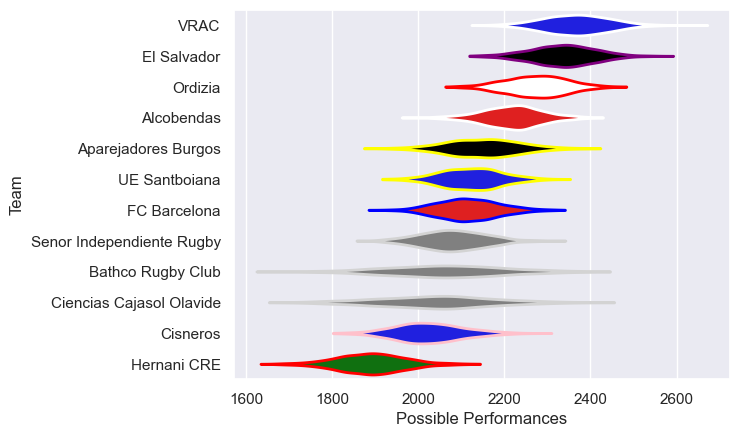

---  
title: "Division de Honor de Rugby 19/20"  
date: 2025-07-29 6:00:00 -0500  
categories: model review projection  
layout: article  
aside:  
    toc: true  
---
# Current Team Rankings

# Standings

## Current Standings

| Club                      |   Played |   Wins |   Point Differential |   Losing Bonus Points | Try Bonus Points   |   Competition Points |
|:--------------------------|---------:|-------:|---------------------:|----------------------:|:-------------------|---------------------:|
| VRAC                      |       17 |     14 |                  242 |                     1 |                    |                   59 |
| El Salvador               |       17 |     14 |                  202 |                     3 |                    |                   59 |
| Ordizia                   |       17 |     11 |                  203 |                     5 |                    |                   51 |
| Alcobendas                |       17 |     12 |                   87 |                     3 |                    |                   51 |
| FC Barcelona              |       17 |      8 |                   -7 |                     3 |                    |                   41 |
| UE Santboiana             |       17 |      9 |                   11 |                     2 |                    |                   40 |
| Senor Independiente Rugby |       17 |      8 |                  -27 |                     4 |                    |                   38 |
| Aparejadores Burgos       |       17 |      7 |                  -43 |                     1 |                    |                   33 |
| Cisneros                  |       17 |      5 |                 -119 |                     4 |                    |                   24 |
| Ciencias Cajasol Olavide  |       17 |      5 |                 -116 |                     3 |                    |                   23 |
| Bathco Rugby Club         |       17 |      3 |                  -47 |                     7 |                    |                   21 |
| Hernani CRE               |       17 |      1 |                 -386 |                     4 |                    |                    8 |

# Completed Match Review

| Model | Percent Correct Predictions | Spread Error |
| ------ | ------ | ------ |
| Club Level | 71.6% | 10.9 |
| Player Level: Lineup | nan% | nan |
| Player Level: Minutes | nan% | nan |

