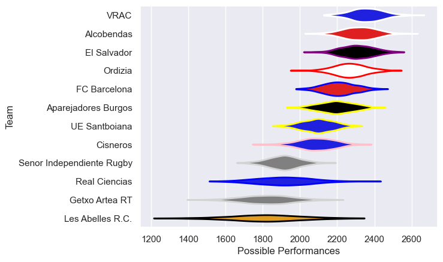

---  
title: "Division de Honor de Rugby 20/21"  
date: 2025-07-29 6:00:00 -0500  
categories: model review projection  
layout: article  
aside:  
    toc: true  
---
# Current Team Rankings

# Standings

## Current Standings

| Club                      |   Played |   Wins |   Point Differential |   Losing Bonus Points | Try Bonus Points   |   Competition Points |
|:--------------------------|---------:|-------:|---------------------:|----------------------:|:-------------------|---------------------:|
| VRAC                      |       14 |     13 |                  171 |                     1 |                    |                   53 |
| Alcobendas                |       13 |     10 |                  224 |                     3 |                    |                   43 |
| El Salvador               |       13 |      9 |                  113 |                     3 |                    |                   39 |
| Ordizia                   |       12 |      8 |                  132 |                     2 |                    |                   34 |
| FC Barcelona              |       13 |      8 |                   52 |                     2 |                    |                   34 |
| Aparejadores Burgos       |       12 |      8 |                  112 |                     0 |                    |                   32 |
| UE Santboiana             |       11 |      5 |                   23 |                     2 |                    |                   22 |
| Cisneros                  |       12 |      4 |                  -14 |                     2 |                    |                   18 |
| Les Abelles R.C.          |       11 |      2 |                 -188 |                     1 |                    |                   11 |
| Getxo Artea RT            |       11 |      1 |                 -220 |                     0 |                    |                    8 |
| Real Ciencias             |       11 |      1 |                 -189 |                     1 |                    |                    7 |
| Senor Independiente Rugby |       11 |      1 |                 -216 |                     3 |                    |                    7 |

# Completed Match Review

| Model | Percent Correct Predictions | Spread Error |
| ------ | ------ | ------ |
| Club Level | 81.9% | 11.2 |
| Player Level: Lineup | nan% | nan |
| Player Level: Minutes | nan% | nan |

