---  
title: "Division de Honor de Rugby 2024 Status"  
date: 2025-01-27 6:00:00 -0500  
categories: model review projection  
layout: article  
aside:  
    toc: true  
---
# Current Team Rankings

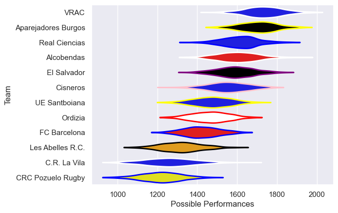
# Standings

## Current Standings

| Club                |   Played |   Wins |   Point Differential |   Losing Bonus Points |   Try Bonus Points |   Competition Points |
|:--------------------|---------:|-------:|---------------------:|----------------------:|-------------------:|---------------------:|
| VRAC                |        8 |      8 |                  167 |                     0 |                nan |                   36 |
| El Salvador         |        8 |      7 |                   41 |                     1 |                nan |                   30 |
| Alcobendas          |        8 |      5 |                   80 |                     3 |                nan |                   27 |
| Aparejadores Burgos |        8 |      5 |                   82 |                     3 |                nan |                   26 |
| Real Ciencias       |        8 |      5 |                   70 |                     2 |                nan |                   25 |
| UE Santboiana       |        8 |      5 |                   23 |                     2 |                nan |                   25 |
| Cisneros            |        8 |      3 |                    4 |                     3 |                nan |                   17 |
| Ordizia             |        8 |      3 |                  -49 |                     2 |                nan |                   15 |
| C.R. La Vila        |        8 |      2 |                  -31 |                     4 |                nan |                   13 |
| FC Barcelona        |        8 |      3 |                  -63 |                     1 |                nan |                   13 |
| CRC Pozuelo Rugby   |        8 |      1 |                 -176 |                     2 |                nan |                    8 |
| Les Abelles R.C.    |        8 |      1 |                 -148 |                     1 |                nan |                    6 |

## Projected Remaining Table

| Club                |   Matches Remaining |   Wins |   Point Differential |   Losing Bonus Points |   Try Bonus Points |   Competition Points |
|:--------------------|--------------------:|-------:|---------------------:|----------------------:|-------------------:|---------------------:|
| Aparejadores Burgos |                   3 |    2.8 |              53.6272 |                   0.1 |                2.3 |                 13.5 |
| VRAC                |                   3 |    2.8 |              65.0796 |                   0.1 |                2.1 |                 13.3 |
| El Salvador         |                   3 |    2.6 |              35.1033 |                   0.2 |                1.4 |                 12.1 |
| Alcobendas          |                   3 |    2.1 |              18.5217 |                   0.6 |                1.3 |                 10.3 |
| Real Ciencias       |                   3 |    2.1 |              17.7727 |                   0.5 |                0.9 |                  9.8 |
| Cisneros            |                   3 |    1.9 |              16.3345 |                   0.6 |                1.3 |                  9.3 |
| Ordizia             |                   3 |    0.9 |             -24.9779 |                   0.4 |                0.7 |                  4.9 |
| CRC Pozuelo Rugby   |                   3 |    0.8 |             -39.1902 |                   0.4 |                0.7 |                  4.1 |
| UE Santboiana       |                   3 |    0.7 |             -21.9333 |                   0.8 |                0.4 |                  4   |
| Les Abelles R.C.    |                   3 |    0.6 |             -36.8562 |                   0.6 |                0.9 |                  3.8 |
| FC Barcelona        |                   3 |    0.4 |             -35.2063 |                   0.6 |                0.6 |                  2.8 |
| C.R. La Vila        |                   3 |    0.4 |             -48.2752 |                   0.6 |                0.5 |                  2.6 |

## Projected Total Table

| Club                |   Total Matches |   Wins |   Point Differential |   Losing Bonus Points |   Try Bonus Points |   Competition Points |
|:--------------------|----------------:|-------:|---------------------:|----------------------:|-------------------:|---------------------:|
| VRAC                |              11 |   10.8 |            232.08    |                   0.1 |                2.1 |                 49.3 |
| El Salvador         |              11 |    9.6 |             76.1033  |                   1.2 |                1.4 |                 42.1 |
| Aparejadores Burgos |              11 |    7.8 |            135.627   |                   3.1 |                2.3 |                 39.5 |
| Alcobendas          |              11 |    7.1 |             98.5217  |                   3.6 |                1.3 |                 37.3 |
| Real Ciencias       |              11 |    7.1 |             87.7727  |                   2.5 |                0.9 |                 34.8 |
| UE Santboiana       |              11 |    5.7 |              1.06672 |                   2.8 |                0.4 |                 29   |
| Cisneros            |              11 |    4.9 |             20.3345  |                   3.6 |                1.3 |                 26.3 |
| Ordizia             |              11 |    3.9 |            -73.9779  |                   2.4 |                0.7 |                 19.9 |
| FC Barcelona        |              11 |    3.4 |            -98.2063  |                   1.6 |                0.6 |                 15.8 |
| C.R. La Vila        |              11 |    2.4 |            -79.2752  |                   4.6 |                0.5 |                 15.6 |
| CRC Pozuelo Rugby   |              11 |    1.8 |           -215.19    |                   2.4 |                0.7 |                 12.1 |
| Les Abelles R.C.    |              11 |    1.6 |           -184.856   |                   1.6 |                0.9 |                  9.8 |

# Completed Match Review

| Model | Percent Correct Predictions | Spread Error |
| ------ | ------ | ------ |
| Club Level | 70.8% | 10.6 |
| Player Level: Lineup | 70.8% | 13.1 |
| Player Level: Minutes | 58.3% | 14.0 |

# Future Predictions

## Week 9

### Real Ciencias V UE Santboiana on 2025/02/09

Average Margin: Real Ciencias by 9.0

Average Scoreline: 30-20

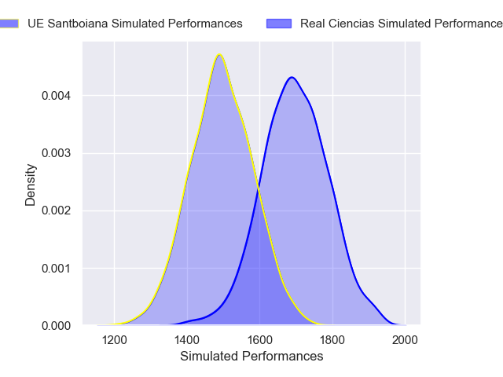

### FC Barcelona V Aparejadores Burgos on 2025/02/09

Average Margin: Aparejadores Burgos by 13.2

Average Scoreline: 40-27

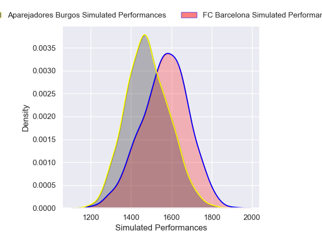

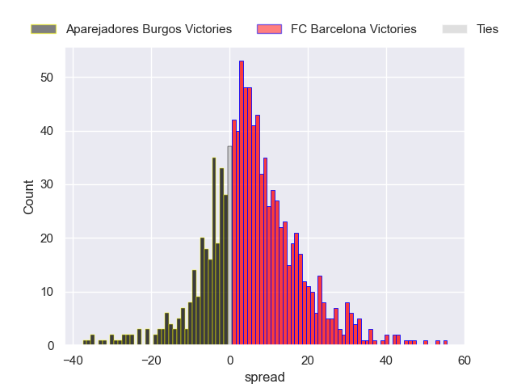

### Les Abelles R.C. V El Salvador on 2025/02/09

Average Margin: El Salvador by 11.8

Average Scoreline: 45-33

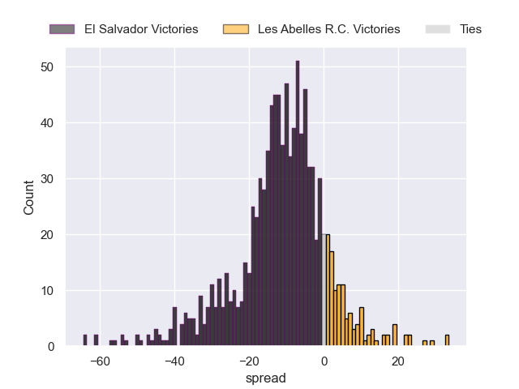

### VRAC V C.R. La Vila on 2025/02/09

Average Margin: VRAC by 29.4

Average Scoreline: 33-4

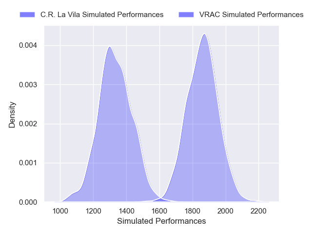

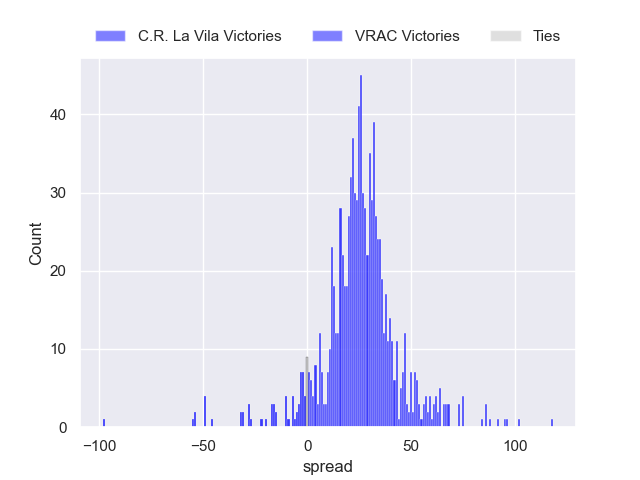

### Alcobendas V Ordizia on 2025/02/09

Average Margin: Alcobendas by 14.2

Average Scoreline: 33-19

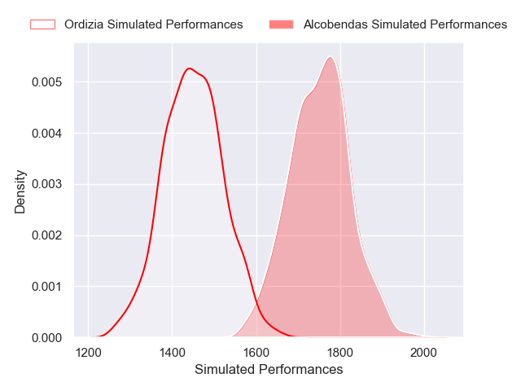

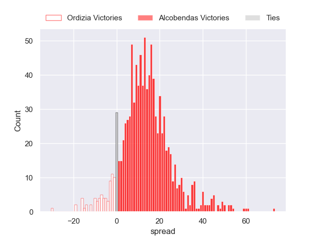

### Cisneros V CRC Pozuelo Rugby on 2025/02/09

Average Margin: Cisneros by 17.1

Average Scoreline: 37-20

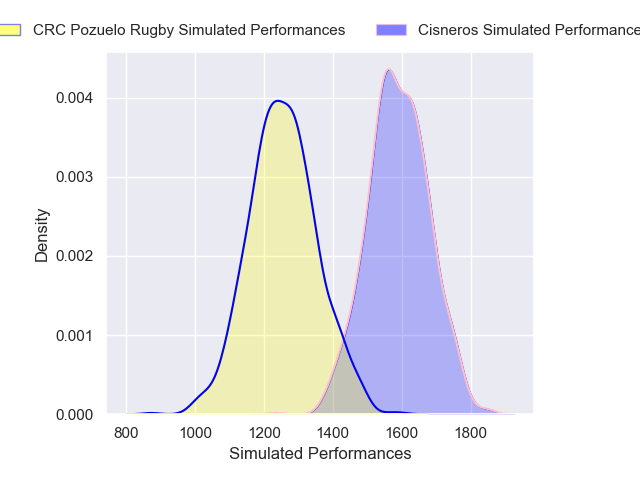

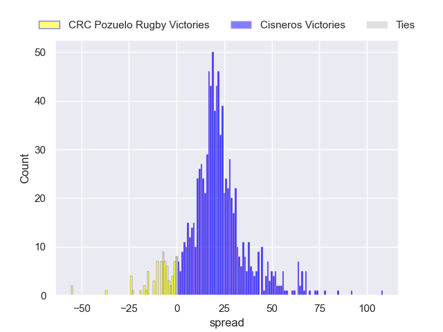

## Week 10

### Aparejadores Burgos V Les Abelles R.C. on 2025/02/15

Average Margin: Aparejadores Burgos by 23.0

Average Scoreline: 37-14

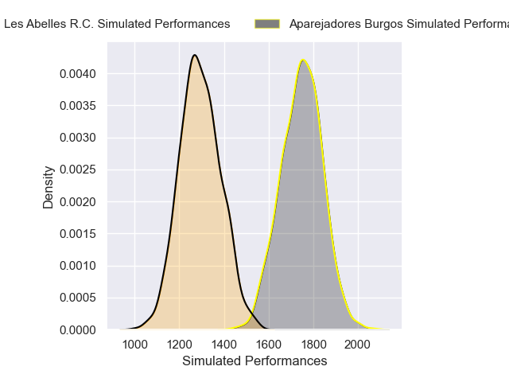

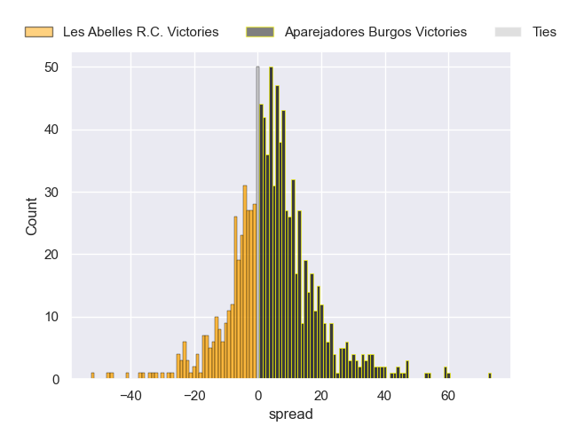

### UE Santboiana V Alcobendas on 2025/02/15

Average Margin: Alcobendas by 1.4

Average Scoreline: 23-22

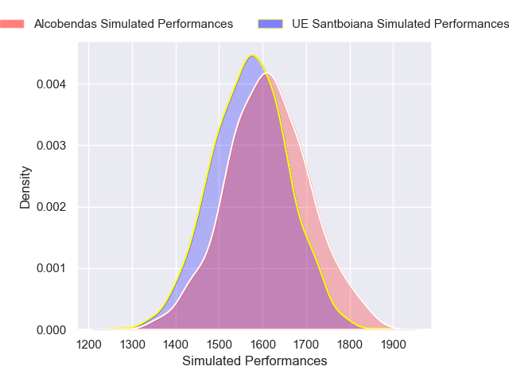

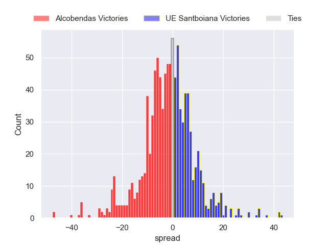

### Ordizia V FC Barcelona on 2025/02/15

Average Margin: Ordizia by 6.7

Average Scoreline: 31-24

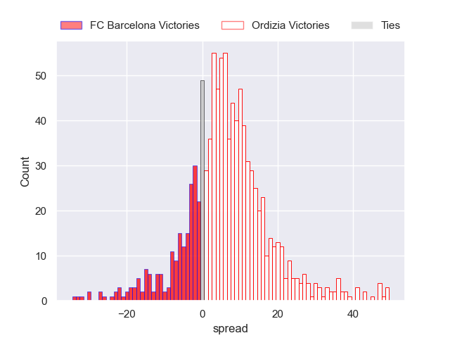

### C.R. La Vila V Real Ciencias on 2025/02/15

Average Margin: Real Ciencias by 11.6

Average Scoreline: 37-25

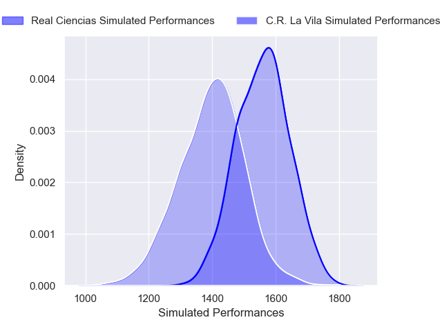

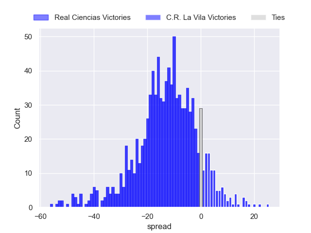

### El Salvador V Cisneros on 2025/02/15

Average Margin: El Salvador by 8.0

Average Scoreline: 29-21

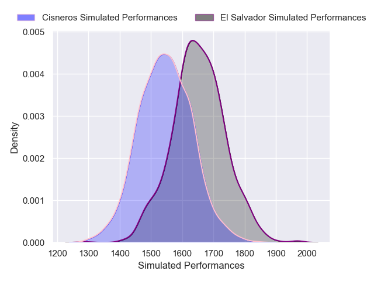

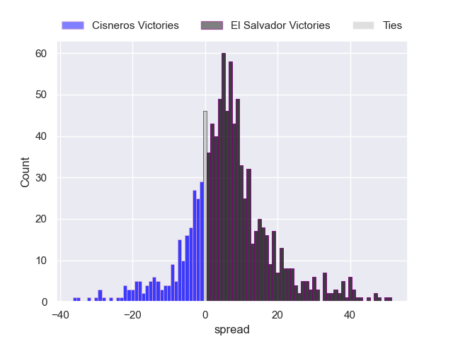

### CRC Pozuelo Rugby V VRAC on 2025/02/15

Average Margin: VRAC by 24.2

Average Scoreline: 53-29

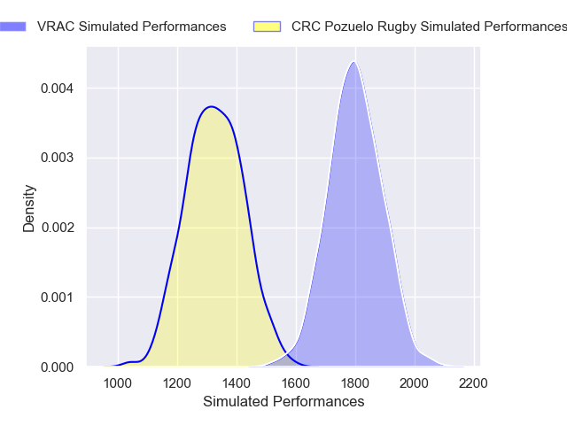

## Week 11

### CRC Pozuelo Rugby V Les Abelles R.C. on 2025/03/01

Average Margin: CRC Pozuelo Rugby by 2.1

Average Scoreline: 31-29

### UE Santboiana V VRAC on 2025/03/01

Average Margin: VRAC by 11.5

Average Scoreline: 38-26

### C.R. La Vila V Cisneros on 2025/03/01

Average Margin: Cisneros by 7.2

Average Scoreline: 32-25

### Alcobendas V Real Ciencias on 2025/03/01

Average Margin: Alcobendas by 2.9

Average Scoreline: 26-23

### Aparejadores Burgos V Ordizia on 2025/03/01

Average Margin: Aparejadores Burgos by 17.5

Average Scoreline: 35-17

### El Salvador V FC Barcelona on 2025/03/01

Average Margin: El Salvador by 15.3

Average Scoreline: 31-16

