---  
title: "Division de Honor de Rugby 2024 Status"  
date: 2024-12-06 6:00:00 -0500  
categories: model review projection  
layout: article  
aside:  
    toc: true  
---
# Current Team Rankings

# Standings

## Current Standings

| Club                |   Played |   Wins |   Point Differential |   Losing Bonus Points |   Try Bonus Points |   Competition Points |
|:--------------------|---------:|-------:|---------------------:|----------------------:|-------------------:|---------------------:|
| Alcobendas          |        4 |      4 |                   88 |                     0 |                  4 |                   20 |
| VRAC                |        4 |      4 |                   45 |                     0 |                  2 |                   18 |
| Cisneros            |        4 |      3 |                   50 |                     1 |                nan |                   14 |
| El Salvador         |        4 |      3 |                   16 |                     1 |                  0 |                   13 |
| Aparejadores Burgos |        4 |      2 |                   25 |                     2 |                  2 |                   12 |
| Real Ciencias       |        4 |      2 |                   55 |                     2 |                  1 |                   11 |
| UE Santboiana       |        4 |      2 |                  -18 |                     1 |                  1 |                   10 |
| Ordizia             |        4 |      2 |                  -23 |                     0 |                  0 |                    8 |
| C.R. La Vila        |        4 |      1 |                  -20 |                     2 |                  1 |                    7 |
| FC Barcelona        |        4 |      1 |                  -36 |                     1 |                  0 |                    5 |
| CRC Pozuelo Rugby   |        4 |      0 |                 -112 |                     1 |                  1 |                    2 |
| Les Abelles R.C.    |        4 |      0 |                  -70 |                     0 |                nan |                    0 |

## Projected Remaining Table

| Club                |   Matches Remaining |   Wins |   Point Differential |   Losing Bonus Points |   Try Bonus Points |   Competition Points |
|:--------------------|--------------------:|-------:|---------------------:|----------------------:|-------------------:|---------------------:|
| Aparejadores Burgos |                   7 |    6   |            113.079   |                   0.5 |                5   |                 29.6 |
| VRAC                |                   7 |    5.9 |            103.193   |                   0.7 |                4.6 |                 28.6 |
| Real Ciencias       |                   7 |    4.8 |             42.8694  |                   1   |                3.2 |                 23.2 |
| El Salvador         |                   7 |    5   |             47.4324  |                   1.1 |                1.9 |                 22.9 |
| Cisneros            |                   7 |    3.8 |             24.338   |                   1.5 |                3   |                 19.9 |
| Alcobendas          |                   7 |    3.8 |              9.15825 |                   1.6 |                2.6 |                 19.5 |
| Ordizia             |                   7 |    3.3 |             -5.11362 |                   1.4 |                2.7 |                 17.5 |
| UE Santboiana       |                   7 |    2.9 |            -15.4715  |                   1.6 |                2.1 |                 15.4 |
| FC Barcelona        |                   7 |    2.7 |            -27.0192  |                   1.4 |                2.5 |                 14.5 |
| Les Abelles R.C.    |                   7 |    1.6 |            -85.2978  |                   1.2 |                2   |                  9.5 |
| C.R. La Vila        |                   7 |    1.1 |            -93.9754  |                   1.3 |                1.4 |                  7.2 |
| CRC Pozuelo Rugby   |                   7 |    1.1 |           -113.193   |                   1   |                1.4 |                  6.7 |

## Projected Total Table

| Club                |   Total Matches |   Wins |   Point Differential |   Losing Bonus Points |   Try Bonus Points |   Competition Points |
|:--------------------|----------------:|-------:|---------------------:|----------------------:|-------------------:|---------------------:|
| VRAC                |              11 |    9.9 |             148.193  |                   0.7 |                6.6 |                 46.6 |
| Aparejadores Burgos |              11 |    8   |             138.079  |                   2.5 |                7   |                 41.6 |
| Alcobendas          |              11 |    7.8 |              97.1583 |                   1.6 |                6.6 |                 39.5 |
| El Salvador         |              11 |    8   |              63.4324 |                   2.1 |                1.9 |                 35.9 |
| Real Ciencias       |              11 |    6.8 |              97.8694 |                   3   |                4.2 |                 34.2 |
| Cisneros            |              11 |    6.8 |              74.338  |                   2.5 |                3   |                 33.9 |
| Ordizia             |              11 |    5.3 |             -28.1136 |                   1.4 |                2.7 |                 25.5 |
| UE Santboiana       |              11 |    4.9 |             -33.4715 |                   2.6 |                3.1 |                 25.4 |
| FC Barcelona        |              11 |    3.7 |             -63.0192 |                   2.4 |                2.5 |                 19.5 |
| C.R. La Vila        |              11 |    2.1 |            -113.975  |                   3.3 |                2.4 |                 14.2 |
| Les Abelles R.C.    |              11 |    1.6 |            -155.298  |                   1.2 |                2   |                  9.5 |
| CRC Pozuelo Rugby   |              11 |    1.1 |            -225.193  |                   2   |                2.4 |                  8.7 |

# Completed Match Review

| Model | Percent Correct Predictions | Spread Error |
| ------ | ------ | ------ |
| Club Level | 70.8% | 11.6 |
| Player Level: Lineup | 60.9% | 12.9 |
| Player Level: Minutes | 56.5% | 13.1 |

# Future Predictions

## Week 5

### Alcobendas V Cisneros on 2024/12/07

Average Margin: Alcobendas by 4.7

Average Scoreline: 29-24

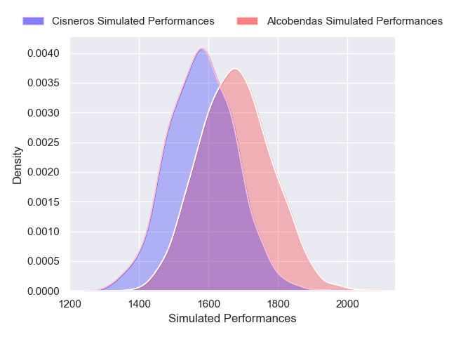

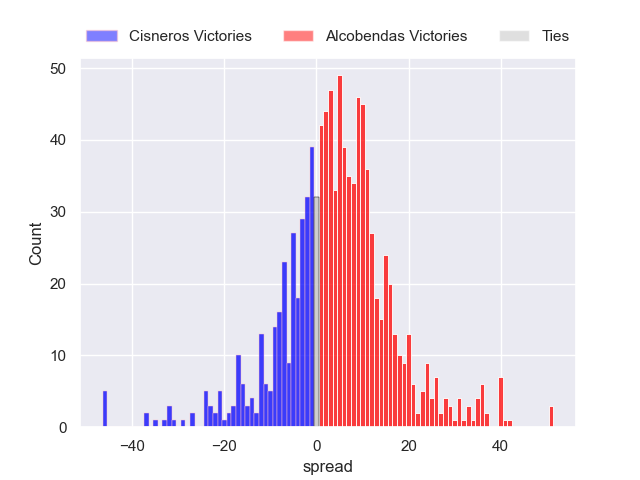

### CRC Pozuelo Rugby V El Salvador on 2024/12/07

Average Margin: El Salvador by 16.2

Average Scoreline: 29-13

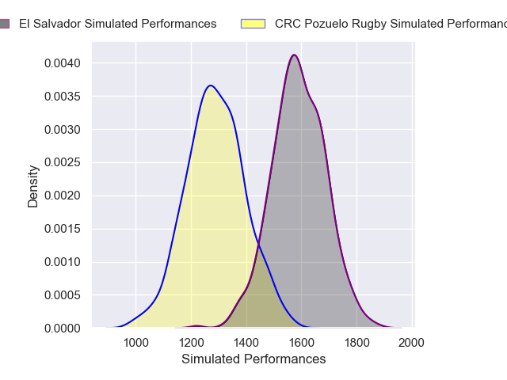

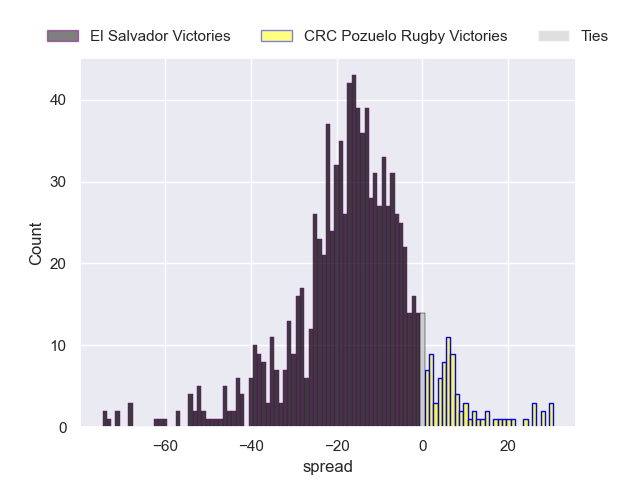

### VRAC V Les Abelles R.C. on 2024/12/08

Average Margin: VRAC by 26.9

Average Scoreline: 41-14

### Real Ciencias V FC Barcelona on 2024/12/08

Average Margin: Real Ciencias by 13.7

Average Scoreline: 32-19

### UE Santboiana V Ordizia on 2024/12/08

Average Margin: UE Santboiana by 4.9

Average Scoreline: 29-25

### C.R. La Vila V Aparejadores Burgos on 2024/12/08

Average Margin: Aparejadores Burgos by 18.8

Average Scoreline: 31-13

## Week 6

### Cisneros V VRAC on 2024/12/14

Average Margin: VRAC by 5.3

Average Scoreline: 17-12

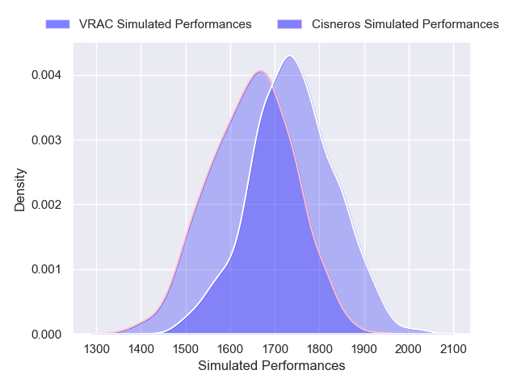

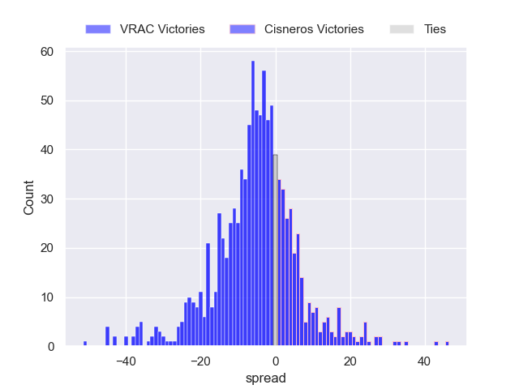

### Les Abelles R.C. V Real Ciencias on 2024/12/15

Average Margin: Real Ciencias by 13.9

Average Scoreline: 31-17

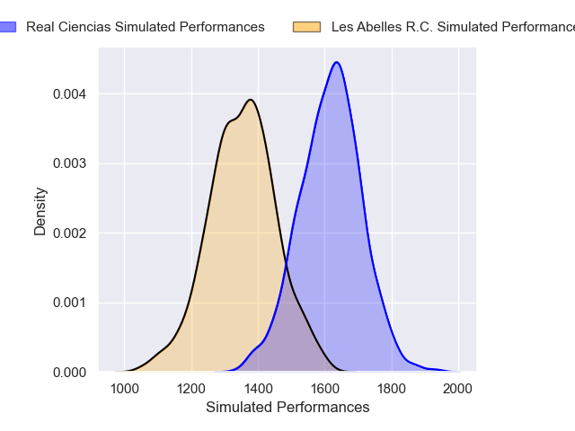

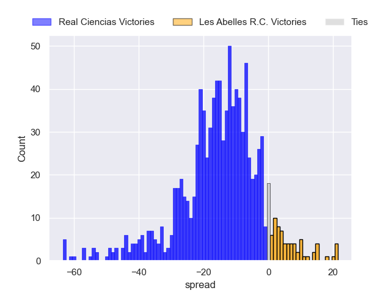

### Ordizia V C.R. La Vila on 2024/12/15

Average Margin: Ordizia by 14.5

Average Scoreline: 31-16

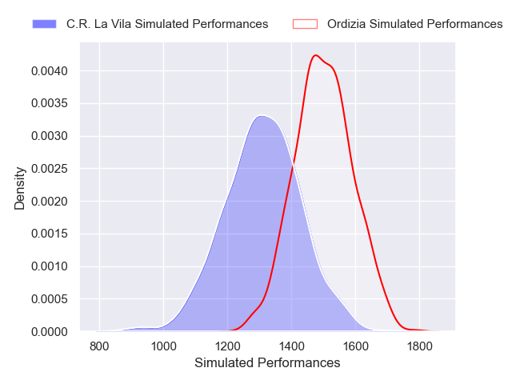

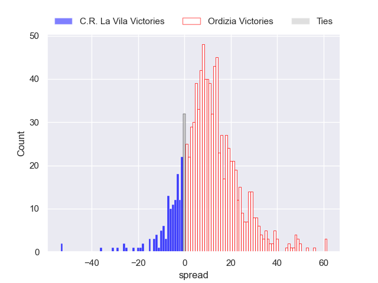

### FC Barcelona V UE Santboiana on 2024/12/15

Average Margin: FC Barcelona by 0.2

Average Scoreline: 23-23

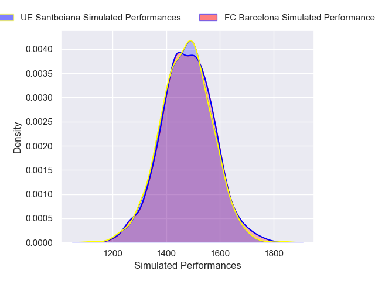

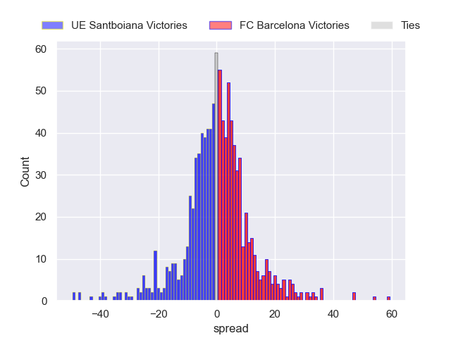

### El Salvador V Alcobendas on 2024/12/15

Average Margin: El Salvador by 2.6

Average Scoreline: 23-20

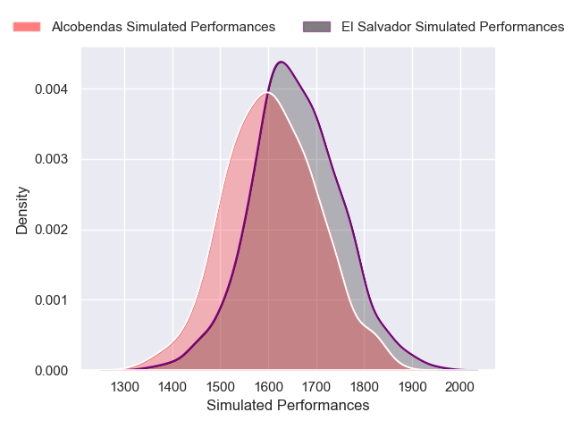

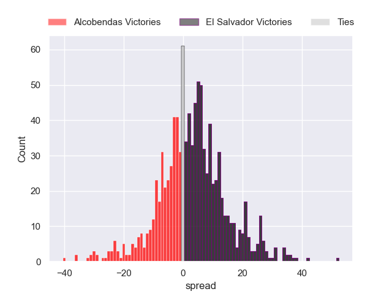

### Aparejadores Burgos V CRC Pozuelo Rugby on 2024/12/15

Average Margin: Aparejadores Burgos by 30.2

Average Scoreline: 52-22

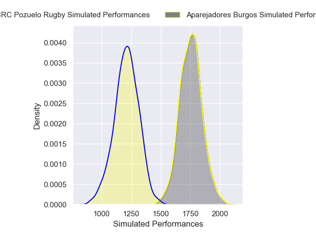

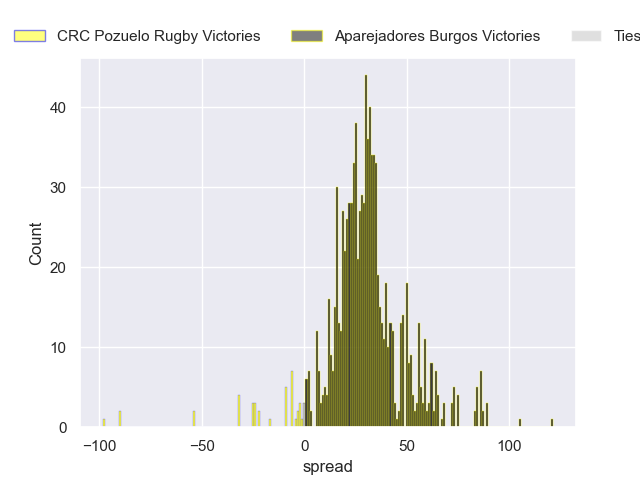

## Week 7

### CRC Pozuelo Rugby V Ordizia on 2025/01/11

Average Margin: Ordizia by 9.1

Average Scoreline: 31-22

### El Salvador V Aparejadores Burgos on 2025/01/12

Average Margin: Aparejadores Burgos by 2.6

Average Scoreline: 16-14

### Alcobendas V VRAC on 2025/01/12

Average Margin: VRAC by 3.2

Average Scoreline: 24-21

### UE Santboiana V Les Abelles R.C. on 2025/01/12

Average Margin: UE Santboiana by 13.3

Average Scoreline: 29-15

### C.R. La Vila V FC Barcelona on 2025/01/12

Average Margin: FC Barcelona by 4.0

Average Scoreline: 23-19

### Real Ciencias V Cisneros on 2025/01/12

Average Margin: Real Ciencias by 5.1

Average Scoreline: 28-23

## Week 8

### FC Barcelona V CRC Pozuelo Rugby on 2025/01/18

Average Margin: FC Barcelona by 13.8

Average Scoreline: 33-20

### Cisneros V UE Santboiana on 2025/01/18

Average Margin: Cisneros by 10.1

Average Scoreline: 28-17

### Ordizia V El Salvador on 2025/01/19

Average Margin: El Salvador by 2.9

Average Scoreline: 23-21

### Aparejadores Burgos V Alcobendas on 2025/01/19

Average Margin: Aparejadores Burgos by 9.2

Average Scoreline: 32-23

### Les Abelles R.C. V C.R. La Vila on 2025/01/19

Average Margin: Les Abelles R.C. by 5.0

Average Scoreline: 22-17

### VRAC V Real Ciencias on 2025/01/19

Average Margin: VRAC by 10.4

Average Scoreline: 28-18

## Week 9

### CRC Pozuelo Rugby V Les Abelles R.C. on 2025/01/25

Average Margin: CRC Pozuelo Rugby by 0.1

Average Scoreline: 35-35

## Week 10

### Alcobendas V Ordizia on 2025/02/09

Average Margin: Alcobendas by 12.1

Average Scoreline: 29-17

### Cisneros V CRC Pozuelo Rugby on 2025/02/09

Average Margin: Cisneros by 22.0

Average Scoreline: 38-16

### VRAC V C.R. La Vila on 2025/02/09

Average Margin: VRAC by 26.2

Average Scoreline: 40-14

### Real Ciencias V UE Santboiana on 2025/02/09

Average Margin: Real Ciencias by 11.0

Average Scoreline: 29-18

### FC Barcelona V Aparejadores Burgos on 2025/02/09

Average Margin: Aparejadores Burgos by 12.4

Average Scoreline: 32-20

### Les Abelles R.C. V El Salvador on 2025/02/09

Average Margin: El Salvador by 11.6

Average Scoreline: 29-17

## Week 11

### Ordizia V FC Barcelona on 2025/02/15

Average Margin: Ordizia by 6.5

Average Scoreline: 30-23

### El Salvador V Cisneros on 2025/02/15

Average Margin: El Salvador by 4.4

Average Scoreline: 24-20

### Aparejadores Burgos V Les Abelles R.C. on 2025/02/15

Average Margin: Aparejadores Burgos by 24.5

Average Scoreline: 38-14

### CRC Pozuelo Rugby V VRAC on 2025/02/15

Average Margin: VRAC by 22.1

Average Scoreline: 35-13

### UE Santboiana V Alcobendas on 2025/02/15

Average Margin: Alcobendas by 3.2

Average Scoreline: 22-18

### C.R. La Vila V Real Ciencias on 2025/02/15

Average Margin: Real Ciencias by 13.7

Average Scoreline: 35-21

## Week 12

### Alcobendas V Real Ciencias on 2025/03/01

Average Margin: Alcobendas by 4.3

Average Scoreline: 24-20

### C.R. La Vila V Cisneros on 2025/03/01

Average Margin: Cisneros by 11.7

Average Scoreline: 30-18

### UE Santboiana V VRAC on 2025/03/01

Average Margin: VRAC by 9.1

Average Scoreline: 27-18

### El Salvador V FC Barcelona on 2025/03/01

Average Margin: El Salvador by 12.3

Average Scoreline: 32-19

### Aparejadores Burgos V Ordizia on 2025/03/01

Average Margin: Aparejadores Burgos by 15.3

Average Scoreline: 30-15

