---  
title: "Division de Honor de Rugby 2024 Status"  
date: 2024-12-02 6:00:00 -0500  
categories: model review projection  
layout: article  
aside:  
    toc: true  
---
# Current Team Rankings

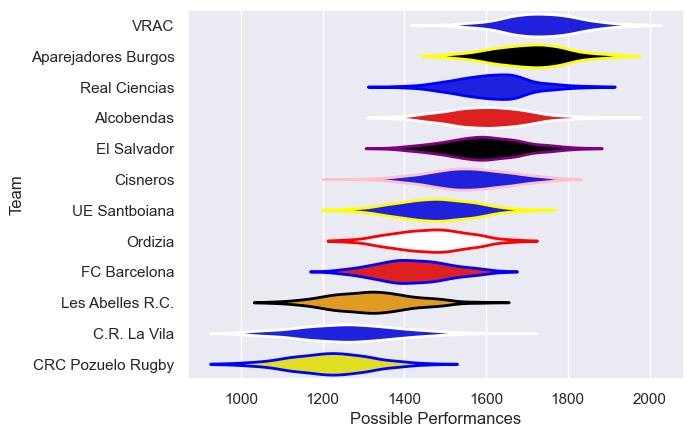
# Standings

## Current Standings

| Club                |   Played |   Wins |   Point Differential |   Losing Bonus Points |   Try Bonus Points |   Competition Points |
|:--------------------|---------:|-------:|---------------------:|----------------------:|-------------------:|---------------------:|
| Alcobendas          |        4 |      4 |                   88 |                     0 |                  4 |                   20 |
| VRAC                |        4 |      4 |                   45 |                     0 |                  2 |                   18 |
| El Salvador         |        4 |      3 |                   16 |                     1 |                  0 |                   13 |
| Aparejadores Burgos |        4 |      2 |                   25 |                     2 |                  2 |                   12 |
| Real Ciencias       |        4 |      2 |                   55 |                     2 |                  1 |                   11 |
| Cisneros            |        3 |      2 |                   25 |                     1 |                  1 |                   10 |
| UE Santboiana       |        4 |      2 |                  -18 |                     1 |                  1 |                   10 |
| Ordizia             |        4 |      2 |                  -23 |                     0 |                  0 |                    8 |
| C.R. La Vila        |        4 |      1 |                  -20 |                     2 |                  1 |                    7 |
| FC Barcelona        |        4 |      1 |                  -36 |                     1 |                  0 |                    5 |
| CRC Pozuelo Rugby   |        4 |      0 |                 -112 |                     1 |                  1 |                    2 |
| Les Abelles R.C.    |        3 |      0 |                  -45 |                     0 |                  0 |                    0 |

## Projected Remaining Table

| Club                |   Matches Remaining |   Wins |   Point Differential |   Losing Bonus Points |   Try Bonus Points |   Competition Points |
|:--------------------|--------------------:|-------:|---------------------:|----------------------:|-------------------:|---------------------:|
| Aparejadores Burgos |                   1 |    0.9 |             18.1599  |                   0   |                0.9 |                  4.6 |
| VRAC                |                   1 |    0.9 |             24.5181  |                   0   |                0.7 |                  4.4 |
| El Salvador         |                   1 |    0.9 |             15.5517  |                   0   |                0.7 |                  4.4 |
| Real Ciencias       |                   1 |    0.9 |             14.4161  |                   0.1 |                0.5 |                  4.2 |
| Alcobendas          |                   1 |    0.8 |              6.85286 |                   0.2 |                0.4 |                  3.5 |
| UE Santboiana       |                   1 |    0.7 |              4.78539 |                   0.2 |                0.3 |                  3.3 |
| Ordizia             |                   1 |    0.3 |             -4.78539 |                   0.3 |                0.4 |                  2   |
| Cisneros            |                   1 |    0.2 |             -6.85286 |                   0.3 |                0.3 |                  1.6 |
| FC Barcelona        |                   1 |    0.1 |            -14.4161  |                   0.2 |                0.2 |                  0.8 |
| CRC Pozuelo Rugby   |                   1 |    0.1 |            -15.5517  |                   0.1 |                0.2 |                  0.8 |
| C.R. La Vila        |                   1 |    0.1 |            -18.1599  |                   0.1 |                0.2 |                  0.6 |
| Les Abelles R.C.    |                   1 |    0.1 |            -24.5181  |                   0   |                0.1 |                  0.5 |

## Projected Total Table

| Club                |   Total Matches |   Wins |   Point Differential |   Losing Bonus Points |   Try Bonus Points |   Competition Points |
|:--------------------|----------------:|-------:|---------------------:|----------------------:|-------------------:|---------------------:|
| Alcobendas          |               5 |    4.8 |              94.8529 |                   0.2 |                4.4 |                 23.5 |
| VRAC                |               5 |    4.9 |              69.5181 |                   0   |                2.7 |                 22.4 |
| El Salvador         |               5 |    3.9 |              31.5517 |                   1   |                0.7 |                 17.4 |
| Aparejadores Burgos |               5 |    2.9 |              43.1599 |                   2   |                2.9 |                 16.6 |
| Real Ciencias       |               5 |    2.9 |              69.4161 |                   2.1 |                1.5 |                 15.2 |
| UE Santboiana       |               5 |    2.7 |             -13.2146 |                   1.2 |                1.3 |                 13.3 |
| Cisneros            |               4 |    2.2 |              18.1471 |                   1.3 |                1.3 |                 11.6 |
| Ordizia             |               5 |    2.3 |             -27.7854 |                   0.3 |                0.4 |                 10   |
| C.R. La Vila        |               5 |    1.1 |             -38.1599 |                   2.1 |                1.2 |                  7.6 |
| FC Barcelona        |               5 |    1.1 |             -50.4161 |                   1.2 |                0.2 |                  5.8 |
| CRC Pozuelo Rugby   |               5 |    0.1 |            -127.552  |                   1.1 |                1.2 |                  2.8 |
| Les Abelles R.C.    |               4 |    0.1 |             -69.5181 |                   0   |                0.1 |                  0.5 |

# Completed Match Review

| Model | Percent Correct Predictions | Spread Error |
| ------ | ------ | ------ |
| Club Level | 69.6% | 11.4 |
| Player Level: Lineup | 60.9% | 12.9 |
| Player Level: Minutes | 56.5% | 13.1 |

# Future Predictions

## Week 5

### Alcobendas V Cisneros on 2024/12/08

Average Margin: Alcobendas by 6.9

Average Scoreline: 35-28

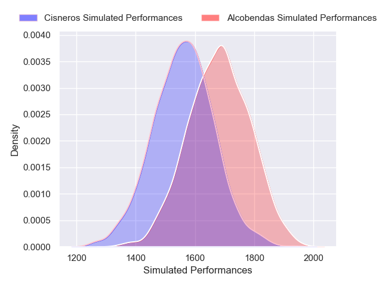

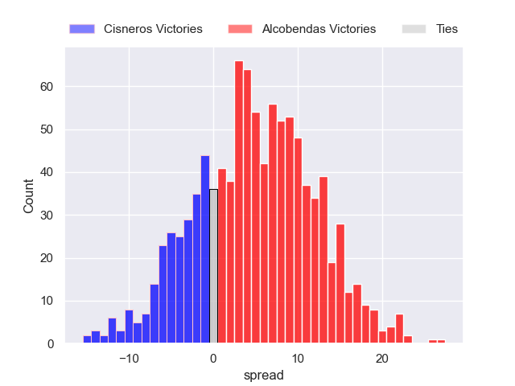

### VRAC V Les Abelles R.C. on 2024/12/08

Average Margin: VRAC by 24.5

Average Scoreline: 37-13

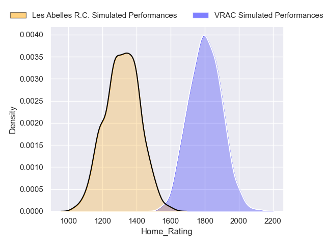

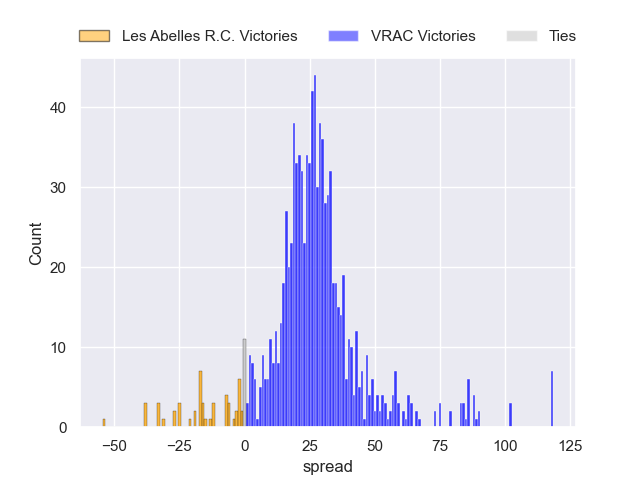

### C.R. La Vila V Aparejadores Burgos on 2024/12/08

Average Margin: Aparejadores Burgos by 18.2

Average Scoreline: 35-17

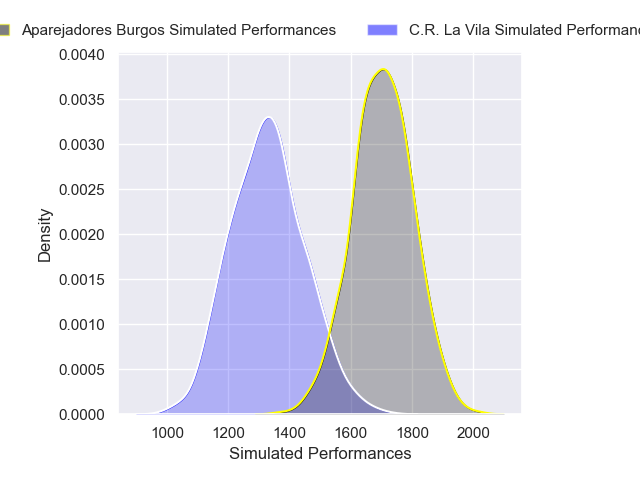

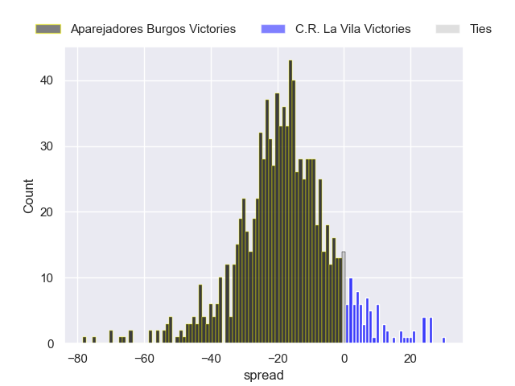

### UE Santboiana V Ordizia on 2024/12/08

Average Margin: UE Santboiana by 4.8

Average Scoreline: 29-24

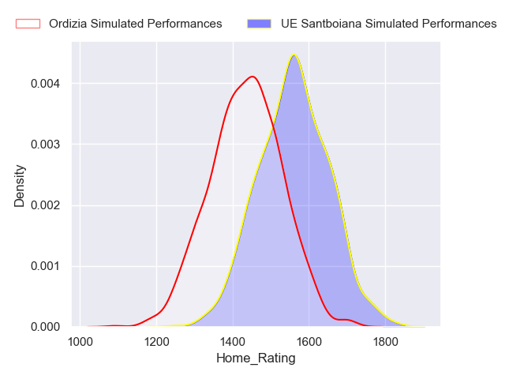

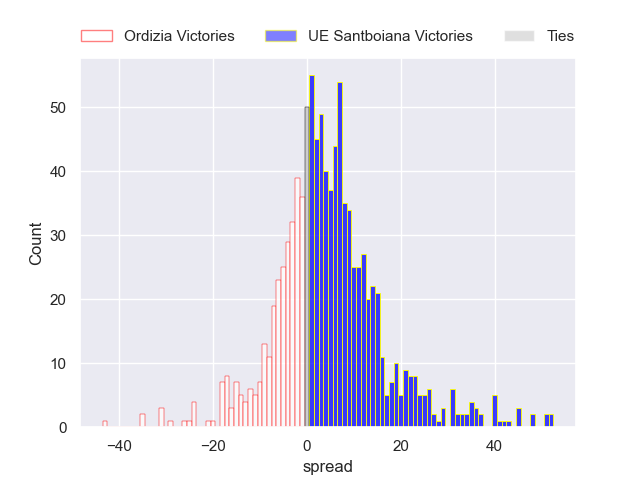

### CRC Pozuelo Rugby V El Salvador on 2024/12/08

Average Margin: El Salvador by 15.6

Average Scoreline: 41-26

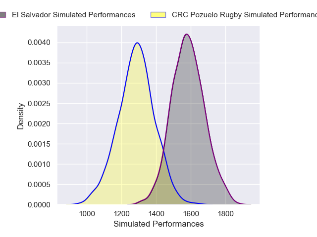

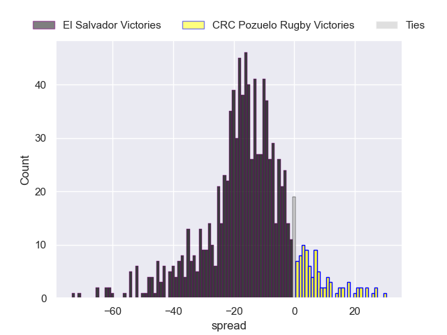

### Real Ciencias V FC Barcelona on 2024/12/08

Average Margin: Real Ciencias by 14.4

Average Scoreline: 34-20

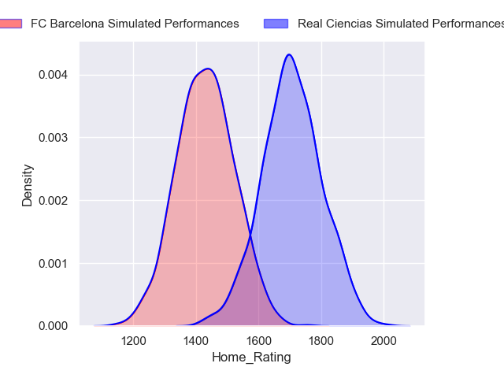
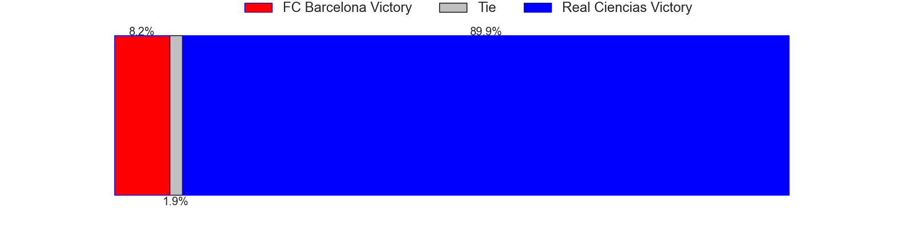
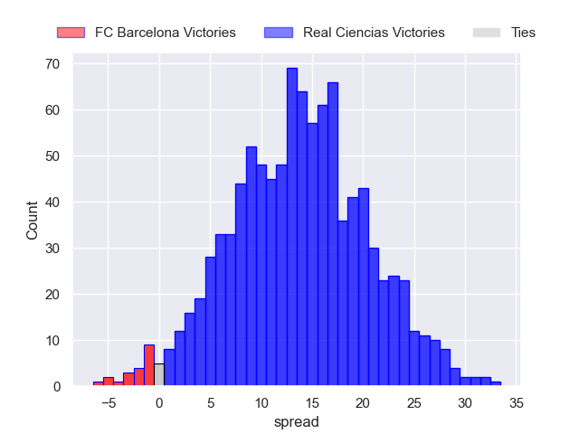

