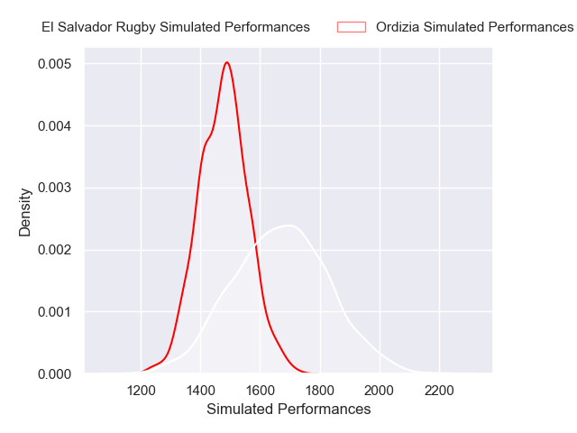
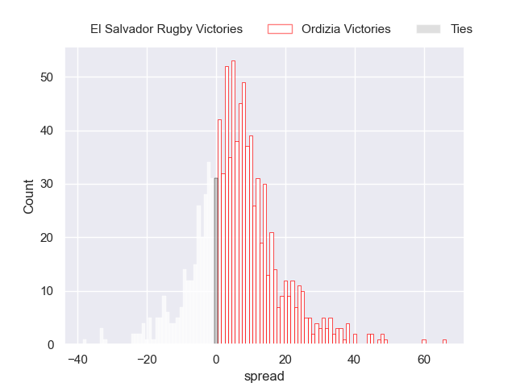
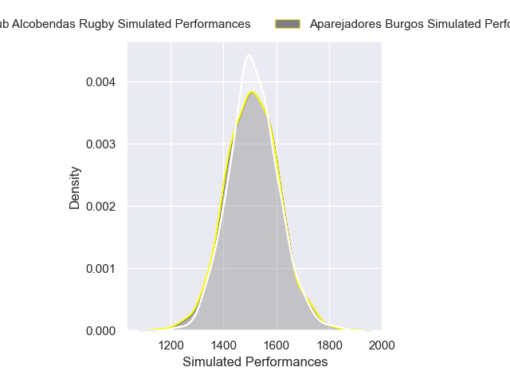
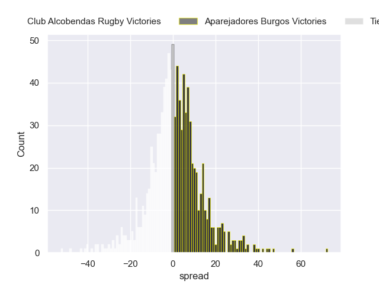
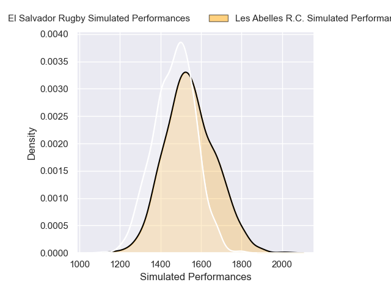
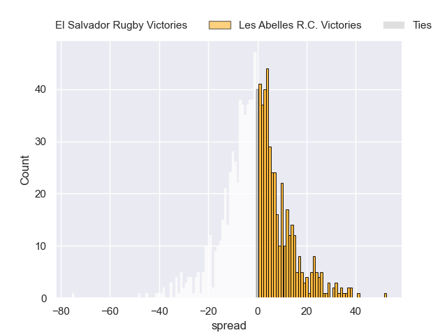
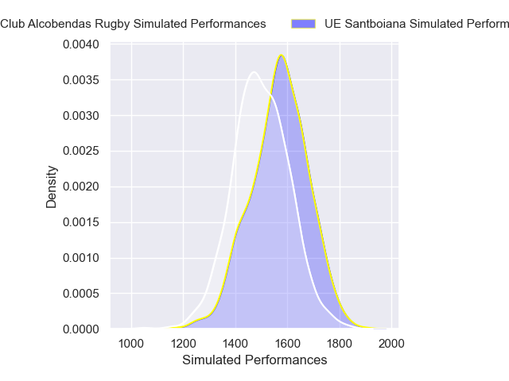
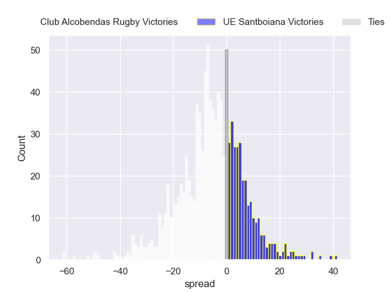

---  
title: "Division de Honor de Rugby 2024 Status"  
date: 2025-01-13 6:00:00 -0500  
categories: model review projection  
layout: article  
aside:  
    toc: true  
---
# Current Team Rankings

# Standings

## Current Standings

| Club                  |   Played |   Wins |   Point Differential |   Losing Bonus Points |   Try Bonus Points |   Competition Points |
|:----------------------|---------:|-------:|---------------------:|----------------------:|-------------------:|---------------------:|
| VRAC                  |        8 |      8 |                  142 |                     0 |                nan |                   36 |
| Real Ciencias         |        8 |      5 |                   93 |                     3 |                nan |                   26 |
| Club Alcobendas Rugby |        7 |      5 |                   87 |                     2 |                nan |                   26 |
| El Salvador Rugby     |        7 |      6 |                   36 |                     1 |                nan |                   26 |
| Aparejadores Burgos   |        7 |      4 |                   75 |                     3 |                nan |                   22 |
| UE Santboiana         |        8 |      4 |                   12 |                     3 |                nan |                   22 |
| Alcobendas            |        4 |      4 |                   88 |                     0 |                nan |                   16 |
| Cisneros              |        7 |      3 |                    8 |                     2 |                nan |                   16 |
| Ordizia               |        7 |      3 |                  -44 |                     1 |                  1 |                   14 |
| El Salvador           |        4 |      3 |                   16 |                     1 |                nan |                   13 |
| C.R. La Vila          |        9 |      1 |                  -60 |                     5 |                nan |                   10 |
| FC Barcelona          |        8 |      2 |                  -87 |                     1 |                nan |                    9 |
| CRC Pozuelo Rugby     |        8 |      1 |                 -206 |                     1 |                nan |                    7 |
| Les Abelles R.C.      |        8 |      1 |                 -160 |                     0 |                nan |                    5 |

## Projected Remaining Table

| Club                  |   Matches Remaining |   Wins |   Point Differential |   Losing Bonus Points |   Try Bonus Points |   Competition Points |
|:----------------------|--------------------:|-------:|---------------------:|----------------------:|-------------------:|---------------------:|
| VRAC                  |                   4 |    3.7 |             77.1899  |                   0.2 |                2.5 |                 17.4 |
| Aparejadores Burgos   |                   4 |    3.5 |             62.5556  |                   0.3 |                2.5 |                 16.8 |
| El Salvador Rugby     |                   4 |    3.4 |             52.2215  |                   0.4 |                1.9 |                 15.8 |
| Cisneros              |                   4 |    2.8 |             27.6766  |                   0.5 |                1.7 |                 13.3 |
| Club Alcobendas Rugby |                   4 |    2.6 |             20.2514  |                   0.7 |                1.3 |                 12.2 |
| Real Ciencias         |                   4 |    2.2 |              5.97913 |                   0.6 |                1.3 |                 10.5 |
| Les Abelles R.C.      |                   4 |    1.4 |            -33.8784  |                   0.7 |                1.1 |                  7.3 |
| FC Barcelona          |                   4 |    1.3 |            -25.7106  |                   0.7 |                1.4 |                  7.2 |
| Ordizia               |                   4 |    1.1 |            -38.9065  |                   0.6 |                0.8 |                  5.9 |
| UE Santboiana         |                   4 |    0.8 |            -35.8268  |                   1   |                0.7 |                  4.8 |
| CRC Pozuelo Rugby     |                   4 |    0.7 |            -57.458   |                   0.7 |                1   |                  4.5 |
| C.R. La Vila          |                   4 |    0.7 |            -54.0938  |                   0.8 |                0.8 |                  4.2 |

## Projected Total Table

| Club                  |   Total Matches |   Wins |   Point Differential |   Losing Bonus Points |   Try Bonus Points |   Competition Points |
|:----------------------|----------------:|-------:|---------------------:|----------------------:|-------------------:|---------------------:|
| VRAC                  |              12 |   11.7 |             219.19   |                   0.2 |                2.5 |                 53.4 |
| El Salvador Rugby     |              11 |    9.4 |              88.2215 |                   1.4 |                1.9 |                 41.8 |
| Aparejadores Burgos   |              11 |    7.5 |             137.556  |                   3.3 |                2.5 |                 38.8 |
| Club Alcobendas Rugby |              11 |    7.6 |             107.251  |                   2.7 |                1.3 |                 38.2 |
| Real Ciencias         |              12 |    7.2 |              98.9791 |                   3.6 |                1.3 |                 36.5 |
| Cisneros              |              11 |    5.8 |              35.6766 |                   2.5 |                1.7 |                 29.3 |
| UE Santboiana         |              12 |    4.8 |             -23.8268 |                   4   |                0.7 |                 26.8 |
| Ordizia               |              11 |    4.1 |             -82.9065 |                   1.6 |                1.8 |                 19.9 |
| FC Barcelona          |              12 |    3.3 |            -112.711  |                   1.7 |                1.4 |                 16.2 |
| Alcobendas            |               4 |    4   |              88      |                   0   |                0   |                 16   |
| C.R. La Vila          |              13 |    1.7 |            -114.094  |                   5.8 |                0.8 |                 14.2 |
| El Salvador           |               4 |    3   |              16      |                   1   |                0   |                 13   |
| Les Abelles R.C.      |              12 |    2.4 |            -193.878  |                   0.7 |                1.1 |                 12.3 |
| CRC Pozuelo Rugby     |              12 |    1.7 |            -263.458  |                   1.7 |                1   |                 11.5 |

# Completed Match Review

| Model | Percent Correct Predictions | Spread Error |
| ------ | ------ | ------ |
| Club Level | 72.0% | 11.4 |
| Player Level: Lineup | 70.4% | 14.3 |
| Player Level: Minutes | 55.6% | 14.8 |

# Future Predictions

## Week 10

### Cisneros V UE Santboiana on 2025/01/18

Average Margin: Cisneros by 7.7

Average Scoreline: 31-23

### FC Barcelona V CRC Pozuelo Rugby on 2025/01/18

Average Margin: FC Barcelona by 11.3

Average Scoreline: 32-21

### VRAC V Real Ciencias on 2025/01/19

Average Margin: VRAC by 12.6

Average Scoreline: 33-20

### Les Abelles R.C. V C.R. La Vila on 2025/01/19

Average Margin: Les Abelles R.C. by 3.7

Average Scoreline: 25-21

### Ordizia V El Salvador Rugby on 2025/01/19

Average Margin: El Salvador Rugby by 11.2

Average Scoreline: 28-16

### Aparejadores Burgos V Club Alcobendas Rugby on 2025/01/19

Average Margin: Aparejadores Burgos by 7.1

Average Scoreline: 23-16

## Week 11

### CRC Pozuelo Rugby V Les Abelles R.C. on 2025/01/25

Average Margin: Les Abelles R.C. by 0.9

Average Scoreline: 29-28

## Week 12

### VRAC V C.R. La Vila on 2025/02/09

Average Margin: VRAC by 28.2

Average Scoreline: 38-10

### FC Barcelona V Aparejadores Burgos on 2025/02/09

Average Margin: Aparejadores Burgos by 13.8

Average Scoreline: 39-25

### Real Ciencias V UE Santboiana on 2025/02/09

Average Margin: Real Ciencias by 10.7

Average Scoreline: 30-20

### Cisneros V CRC Pozuelo Rugby on 2025/02/09

Average Margin: Cisneros by 20.4

Average Scoreline: 32-11

### Les Abelles R.C. V El Salvador Rugby on 2025/02/09

Average Margin: El Salvador Rugby by 14.6

Average Scoreline: 30-15

## Week 13

### CRC Pozuelo Rugby V VRAC on 2025/02/15

Average Margin: VRAC by 24.8

Average Scoreline: 42-18

### C.R. La Vila V Real Ciencias on 2025/02/15

Average Margin: Real Ciencias by 13.0

Average Scoreline: 32-19

### Aparejadores Burgos V Les Abelles R.C. on 2025/02/15

Average Margin: Aparejadores Burgos by 23.9

Average Scoreline: 39-16

### UE Santboiana V Club Alcobendas Rugby on 2025/02/15

Average Margin: Club Alcobendas Rugby by 5.8

Average Scoreline: 24-18

### Ordizia V FC Barcelona on 2025/02/15

Average Margin: Ordizia by 6.4

Average Scoreline: 25-19

## Week 14

### UE Santboiana V VRAC on 2025/03/01

Average Margin: VRAC by 11.6

Average Scoreline: 37-25

### C.R. La Vila V Cisneros on 2025/03/01

Average Margin: Cisneros by 9.2

Average Scoreline: 26-17

### Aparejadores Burgos V Ordizia on 2025/03/01

Average Margin: Aparejadores Burgos by 17.7

Average Scoreline: 35-17

