---  
title: "Division de Honor de Rugby 2024 Status"  
date: 2024-10-14 6:00:00 -0500  
categories: model review projection  
layout: article  
aside:  
    toc: true  
---
# Current Team Rankings

# Standings

## Current Standings

| Club                |   Played |   Wins |   Point Differential |   Losing Bonus Points |   Try Bonus Points |   Competition Points |
|:--------------------|---------:|-------:|---------------------:|----------------------:|-------------------:|---------------------:|
| Alcobendas          |        2 |      2 |                   40 |                     0 |                nan |                    8 |
| UE Santboiana       |        2 |      2 |                   18 |                     0 |                nan |                    8 |
| VRAC                |        2 |      2 |                    6 |                     0 |                nan |                    8 |
| Real Ciencias       |        2 |      1 |                   53 |                     1 |                nan |                    5 |
| El Salvador         |        2 |      1 |                    2 |                     1 |                nan |                    5 |
| Cisneros            |        1 |      1 |                   23 |                     0 |                nan |                    4 |
| FC Barcelona        |        2 |      1 |                   -6 |                     0 |                nan |                    4 |
| Ordizia             |        2 |      1 |                  -12 |                     0 |                nan |                    4 |
| Aparejadores Burgos |        1 |      0 |                   -2 |                     1 |                nan |                    1 |
| C.R. La Vila        |        2 |      0 |                  -20 |                     1 |                nan |                    1 |
| Les Abelles R.C.    |        2 |      0 |                  -28 |                     0 |                nan |                    0 |
| CRC Pozuelo Rugby   |        2 |      0 |                  -74 |                     0 |                nan |                    0 |

## Projected Remaining Table

| Club                |   Matches Remaining |   Wins |   Point Differential |   Losing Bonus Points |   Try Bonus Points |   Competition Points |
|:--------------------|--------------------:|-------:|---------------------:|----------------------:|-------------------:|---------------------:|
| VRAC                |                   1 |    1   |            17.3194   |                   0   |                0.8 |                  4.7 |
| Alcobendas          |                   1 |    1   |            16.0982   |                   0   |                0.7 |                  4.6 |
| Cisneros            |                   1 |    0.9 |             9.77488  |                   0.1 |                0.4 |                  4.2 |
| CRC Pozuelo Rugby   |                   1 |    0.6 |             1.67853  |                   0.3 |                0.6 |                  3.2 |
| Aparejadores Burgos |                   1 |    0.6 |             2.05992  |                   0.3 |                0.4 |                  3.1 |
| El Salvador         |                   1 |    0.5 |             0.207645 |                   0.3 |                0.4 |                  2.8 |
| UE Santboiana       |                   1 |    0.5 |            -0.207645 |                   0.3 |                0.2 |                  2.6 |
| C.R. La Vila        |                   1 |    0.4 |            -1.67853  |                   0.3 |                0.4 |                  2.4 |
| Real Ciencias       |                   1 |    0.4 |            -2.05992  |                   0.4 |                0.2 |                  2.1 |
| FC Barcelona        |                   1 |    0.1 |            -9.77488  |                   0.2 |                0.3 |                  0.9 |
| Les Abelles R.C.    |                   1 |    0   |           -16.0982   |                   0.1 |                0.2 |                  0.3 |
| Ordizia             |                   1 |    0   |           -17.3194   |                   0.1 |                0.2 |                  0.3 |

## Projected Total Table

| Club                |   Total Matches |   Wins |   Point Differential |   Losing Bonus Points |   Try Bonus Points |   Competition Points |
|:--------------------|----------------:|-------:|---------------------:|----------------------:|-------------------:|---------------------:|
| VRAC                |               3 |    3   |           23.3194    |                   0   |                0.8 |                 12.7 |
| Alcobendas          |               3 |    3   |           56.0982    |                   0   |                0.7 |                 12.6 |
| UE Santboiana       |               3 |    2.5 |           17.7924    |                   0.3 |                0.2 |                 10.6 |
| Cisneros            |               2 |    1.9 |           32.7749    |                   0.1 |                0.4 |                  8.2 |
| El Salvador         |               3 |    1.5 |            2.20764   |                   1.3 |                0.4 |                  7.8 |
| Real Ciencias       |               3 |    1.4 |           50.9401    |                   1.4 |                0.2 |                  7.1 |
| FC Barcelona        |               3 |    1.1 |          -15.7749    |                   0.2 |                0.3 |                  4.9 |
| Ordizia             |               3 |    1   |          -29.3194    |                   0.1 |                0.2 |                  4.3 |
| Aparejadores Burgos |               2 |    0.6 |            0.0599206 |                   1.3 |                0.4 |                  4.1 |
| C.R. La Vila        |               3 |    0.4 |          -21.6785    |                   1.3 |                0.4 |                  3.4 |
| CRC Pozuelo Rugby   |               3 |    0.6 |          -72.3215    |                   0.3 |                0.6 |                  3.2 |
| Les Abelles R.C.    |               3 |    0   |          -44.0982    |                   0.1 |                0.2 |                  0.3 |

# Completed Match Review

| Model | Percent Correct Predictions | Spread Error |
| ------ | ------ | ------ |
| Club Level | 72.7% | 13.6 |
| Player Level: Lineup | nan% | nan |
| Player Level: Minutes | nan% | nan |

# Future Predictions

## Week 3

### VRAC V Ordizia on 2024/10/20

Average Margin: VRAC by 17.3

Average Scoreline: 36-19

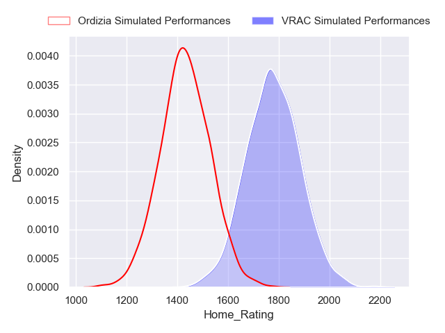

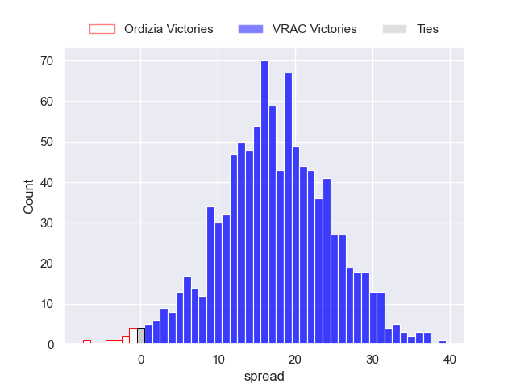

### Real Ciencias V Aparejadores Burgos on 2024/10/20

Average Margin: Aparejadores Burgos by 2.1

Average Scoreline: 25-23

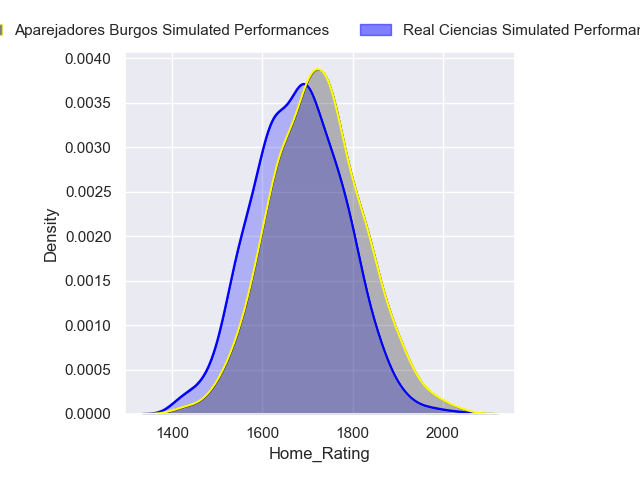

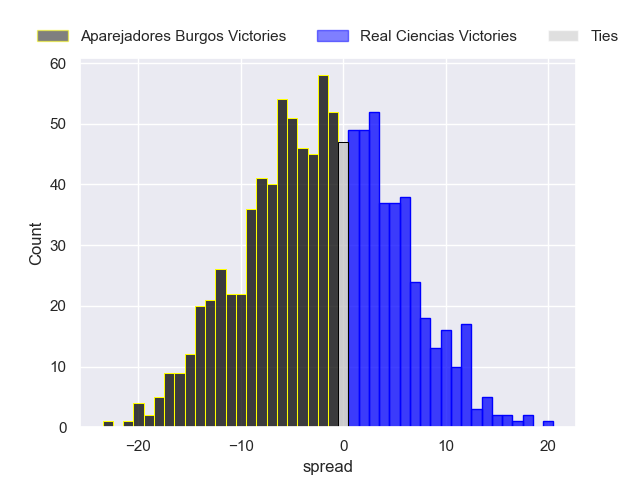

### Alcobendas V Les Abelles R.C. on 2024/10/20

Average Margin: Alcobendas by 16.1

Average Scoreline: 33-16

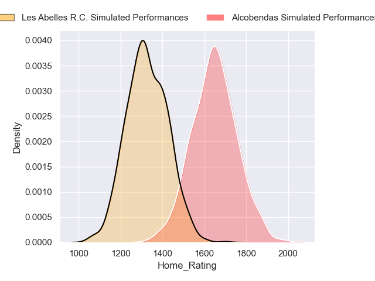
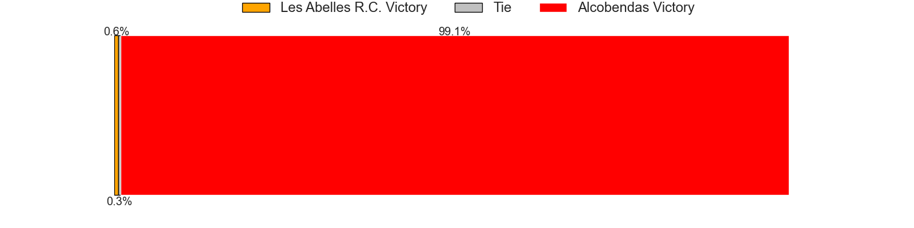
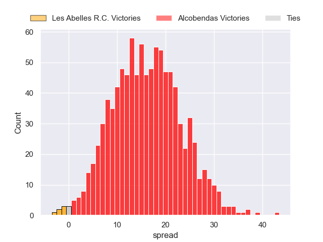

### UE Santboiana V El Salvador on 2024/10/20

Average Margin: El Salvador by 0.2

Average Scoreline: 30-30

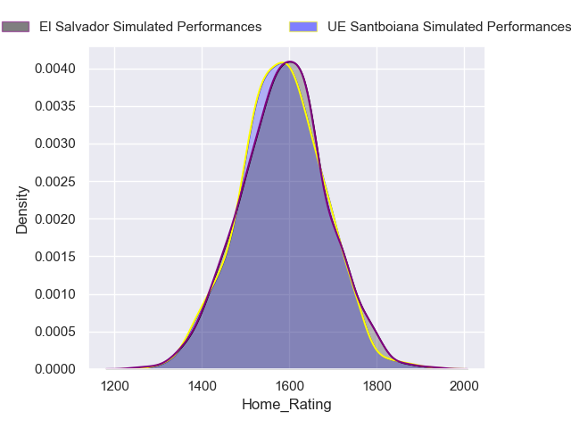

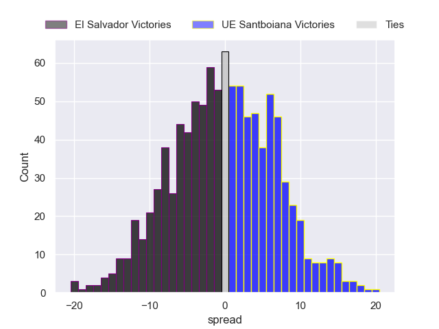

### Cisneros V FC Barcelona on 2024/10/20

Average Margin: Cisneros by 9.8

Average Scoreline: 31-21

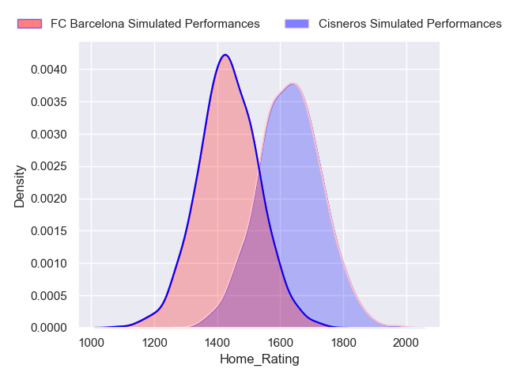

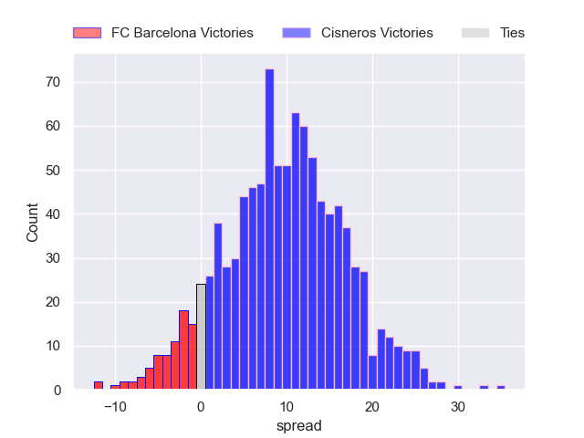

