---  
title: "Division de Honor de Rugby 2024 Status"  
date: 2024-11-01 6:00:00 -0500  
categories: model review projection  
layout: article  
aside:  
    toc: true  
---
# Current Team Rankings

# Standings

## Current Standings

| Club                |   Played |   Wins |   Point Differential |   Losing Bonus Points |   Try Bonus Points |   Competition Points |
|:--------------------|---------:|-------:|---------------------:|----------------------:|-------------------:|---------------------:|
| Alcobendas          |        3 |      3 |                   57 |                     0 |                  3 |                   15 |
| VRAC                |        3 |      3 |                   22 |                     0 |                  1 |                   13 |
| Real Ciencias       |        3 |      2 |                   60 |                     1 |                  1 |                   10 |
| Cisneros            |        3 |      2 |                   25 |                     1 |                  1 |                   10 |
| UE Santboiana       |        3 |      2 |                   11 |                     1 |                  1 |                   10 |
| El Salvador         |        3 |      2 |                    9 |                     1 |                  0 |                    9 |
| Aparejadores Burgos |        3 |      1 |                   -4 |                     2 |                  1 |                    7 |
| C.R. La Vila        |        3 |      1 |                  -13 |                     1 |                  1 |                    6 |
| FC Barcelona        |        3 |      1 |                  -13 |                     1 |                  0 |                    5 |
| Ordizia             |        3 |      1 |                  -28 |                     0 |                  0 |                    4 |
| CRC Pozuelo Rugby   |        3 |      0 |                  -81 |                     1 |                  0 |                    1 |
| Les Abelles R.C.    |        3 |      0 |                  -45 |                     0 |                  0 |                    0 |

## Projected Remaining Table

| Club                |   Matches Remaining |   Wins |   Point Differential |   Losing Bonus Points |   Try Bonus Points |   Competition Points |
|:--------------------|--------------------:|-------:|---------------------:|----------------------:|-------------------:|---------------------:|
| El Salvador         |                   2 |    2   |              36.818  |                   0   |                1.6 |                  9.5 |
| Aparejadores Burgos |                   2 |    2   |              33.2216 |                   0   |                1.4 |                  9.3 |
| VRAC                |                   2 |    1.9 |              34.4605 |                   0   |                1.4 |                  9.2 |
| Real Ciencias       |                   2 |    1.8 |              20.2814 |                   0.2 |                1.2 |                  8.6 |
| Alcobendas          |                   2 |    1.7 |              18.3172 |                   0.2 |                1.3 |                  8.3 |
| Cisneros            |                   2 |    1.2 |               4.5036 |                   0.5 |                1   |                  6.1 |
| UE Santboiana       |                   2 |    0.8 |              -7.8256 |                   0.3 |                0.6 |                  4.2 |
| Ordizia             |                   2 |    0.4 |             -12.3761 |                   0.7 |                0.6 |                  2.8 |
| FC Barcelona        |                   2 |    0.1 |             -24.7617 |                   0.4 |                0.4 |                  1   |
| CRC Pozuelo Rugby   |                   2 |    0.1 |             -28.3643 |                   0.3 |                0.4 |                  1   |
| Les Abelles R.C.    |                   2 |    0.1 |             -32.5021 |                   0.3 |                0.3 |                  1   |
| C.R. La Vila        |                   2 |    0   |             -41.7726 |                   0.1 |                0.3 |                  0.4 |

## Projected Total Table

| Club                |   Total Matches |   Wins |   Point Differential |   Losing Bonus Points |   Try Bonus Points |   Competition Points |
|:--------------------|----------------:|-------:|---------------------:|----------------------:|-------------------:|---------------------:|
| Alcobendas          |               5 |    4.7 |              75.3172 |                   0.2 |                4.3 |                 23.3 |
| VRAC                |               5 |    4.9 |              56.4605 |                   0   |                2.4 |                 22.2 |
| Real Ciencias       |               5 |    3.8 |              80.2814 |                   1.2 |                2.2 |                 18.6 |
| El Salvador         |               5 |    4   |              45.818  |                   1   |                1.6 |                 18.5 |
| Aparejadores Burgos |               5 |    3   |              29.2216 |                   2   |                2.4 |                 16.3 |
| Cisneros            |               5 |    3.2 |              29.5036 |                   1.5 |                2   |                 16.1 |
| UE Santboiana       |               5 |    2.8 |               3.1744 |                   1.3 |                1.6 |                 14.2 |
| Ordizia             |               5 |    1.4 |             -40.3761 |                   0.7 |                0.6 |                  6.8 |
| C.R. La Vila        |               5 |    1   |             -54.7726 |                   1.1 |                1.3 |                  6.4 |
| FC Barcelona        |               5 |    1.1 |             -37.7617 |                   1.4 |                0.4 |                  6   |
| CRC Pozuelo Rugby   |               5 |    0.1 |            -109.364  |                   1.3 |                0.4 |                  2   |
| Les Abelles R.C.    |               5 |    0.1 |             -77.5021 |                   0.3 |                0.3 |                  1   |

# Completed Match Review

| Model | Percent Correct Predictions | Spread Error |
| ------ | ------ | ------ |
| Club Level | 66.7% | 10.5 |
| Player Level: Lineup | 50.0% | 12.4 |
| Player Level: Minutes | 55.6% | 12.9 |

# Future Predictions

## Week 4

### CRC Pozuelo Rugby V Alcobendas on 2024/11/02

Average Margin: Alcobendas by 13.8

Average Scoreline: 46-33

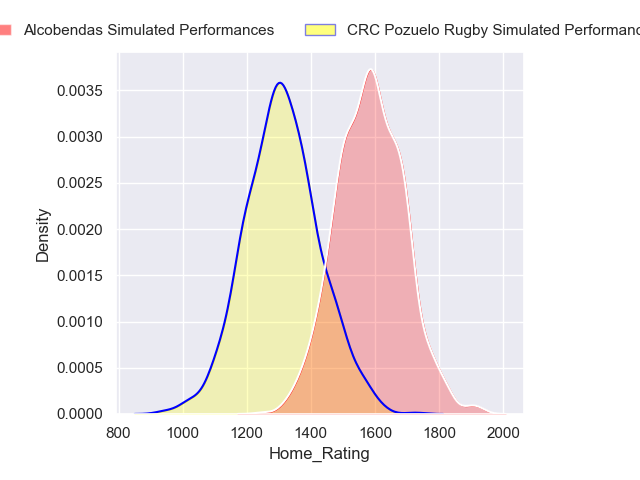

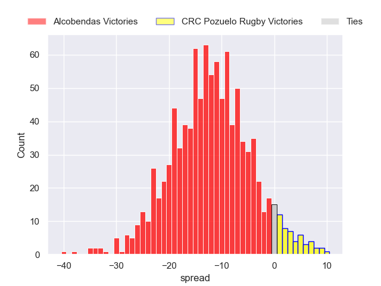

### FC Barcelona V VRAC on 2024/11/02

Average Margin: VRAC by 11.0

Average Scoreline: 44-33

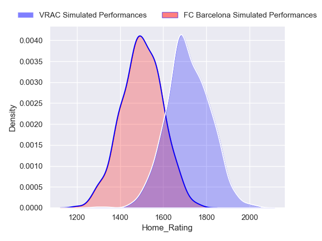

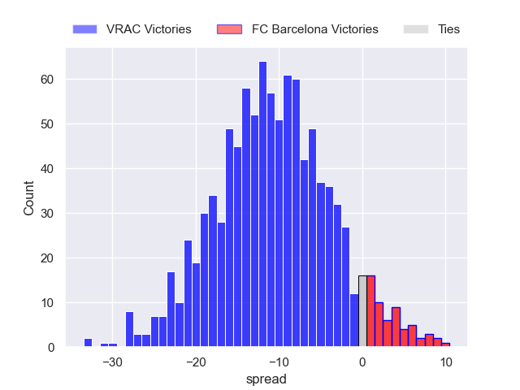

### El Salvador V C.R. La Vila on 2024/11/02

Average Margin: El Salvador by 22.2

Average Scoreline: 41-18

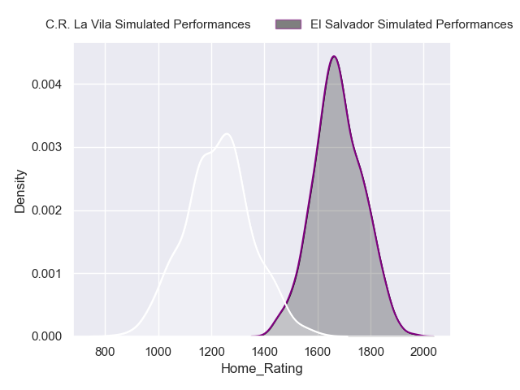

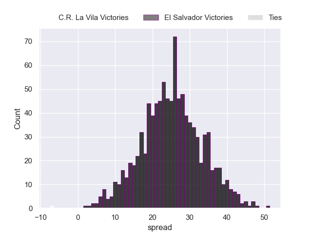

### Aparejadores Burgos V UE Santboiana on 2024/11/02

Average Margin: Aparejadores Burgos by 13.7

Average Scoreline: 34-20

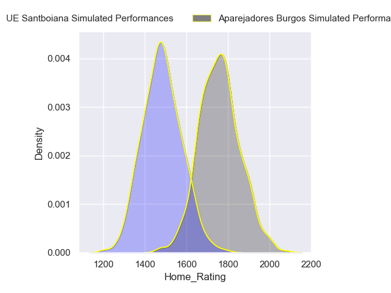

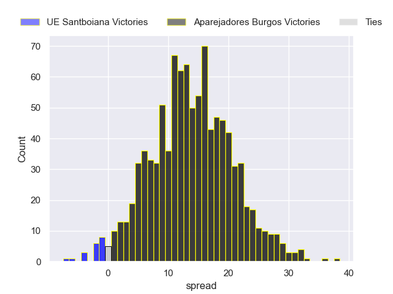

### Les Abelles R.C. V Cisneros on 2024/11/02

Average Margin: Cisneros by 9.1

Average Scoreline: 36-27

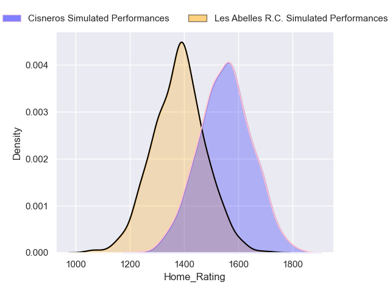

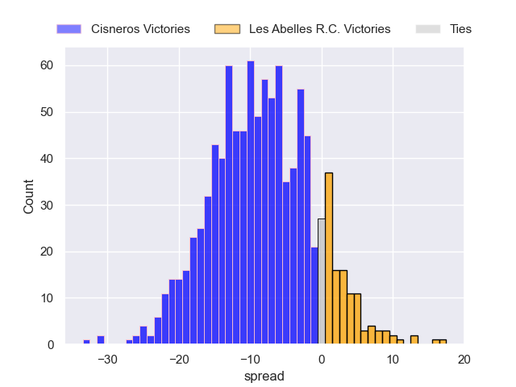

### Ordizia V Real Ciencias on 2024/11/02

Average Margin: Real Ciencias by 6.5

Average Scoreline: 41-35

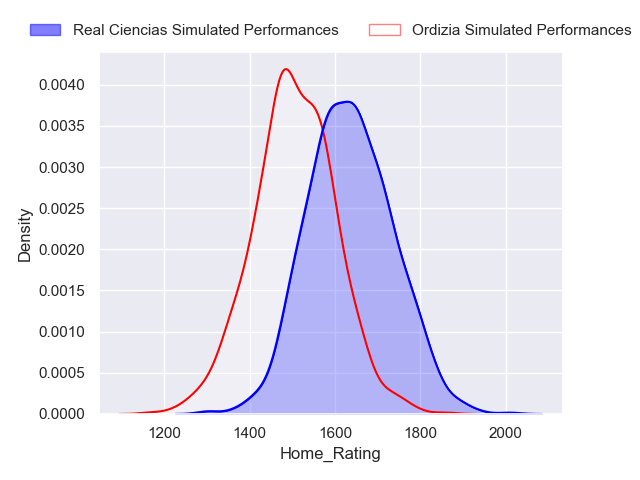

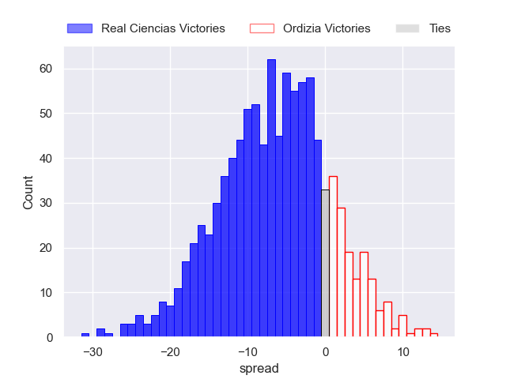

## Week 5

### VRAC V Les Abelles R.C. on 2024/12/08

Average Margin: VRAC by 23.4

Average Scoreline: 41-17

### UE Santboiana V Ordizia on 2024/12/08

Average Margin: UE Santboiana by 5.8

Average Scoreline: 30-24

### CRC Pozuelo Rugby V El Salvador on 2024/12/08

Average Margin: El Salvador by 14.6

Average Scoreline: 51-37

### Real Ciencias V FC Barcelona on 2024/12/08

Average Margin: Real Ciencias by 13.7

Average Scoreline: 33-20

### Alcobendas V Cisneros on 2024/12/08

Average Margin: Alcobendas by 4.6

Average Scoreline: 30-25

