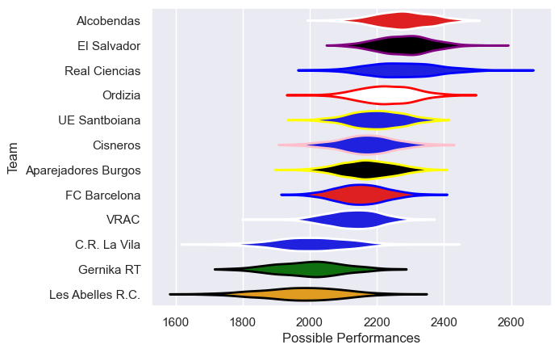

---  
title: "Division de Honor de Rugby 21/22 Status"  
date: 2025-07-28 6:00:00 -0500  
categories: model review projection  
layout: article  
aside:  
    toc: true  
---
# Current Team Rankings

# Standings

## Current Standings

| Club                |   Played |   Wins |   Point Differential |   Losing Bonus Points | Try Bonus Points   |   Competition Points |
|:--------------------|---------:|-------:|---------------------:|----------------------:|:-------------------|---------------------:|
| UE Santboiana       |       19 |     15 |                  131 |                     3 |                    |                   63 |
| El Salvador         |       18 |     12 |                  127 |                     6 |                    |                   54 |
| Ordizia             |       19 |     12 |                   91 |                     4 |                    |                   54 |
| Alcobendas          |       16 |     10 |                  133 |                     6 |                    |                   46 |
| Real Ciencias       |       17 |     10 |                  114 |                     3 |                    |                   45 |
| Cisneros            |       17 |      8 |                  -32 |                     4 |                    |                   36 |
| Aparejadores Burgos |       17 |      6 |                    1 |                     4 |                    |                   34 |
| FC Barcelona        |       17 |      7 |                  -20 |                     5 |                    |                   33 |
| VRAC                |       16 |      7 |                  -58 |                     3 |                    |                   33 |
| Les Abelles R.C.    |       16 |      5 |                 -162 |                     3 |                    |                   23 |
| C.R. La Vila        |       16 |      4 |                 -148 |                     2 |                    |                   18 |
| Gernika RT          |       16 |      3 |                 -177 |                     5 |                    |                   17 |

# Completed Match Review

| Model | Percent Correct Predictions | Spread Error |
| ------ | ------ | ------ |
| Club Level | 68.6% | 10.3 |
| Player Level: Lineup | nan% | nan |
| Player Level: Minutes | nan% | nan |

