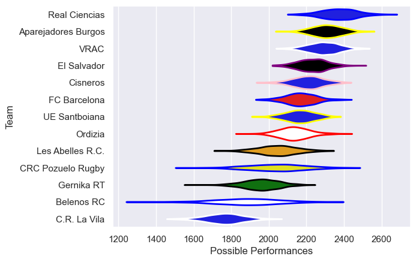

---  
title: "Division de Honor de Rugby 22/23 Status"  
date: 2025-07-28 6:00:00 -0500  
categories: model review projection  
layout: article  
aside:  
    toc: true  
---
# Current Team Rankings

# Standings

## Current Standings

| Club                |   Played |   Wins |   Point Differential |   Losing Bonus Points | Try Bonus Points   |   Competition Points |
|:--------------------|---------:|-------:|---------------------:|----------------------:|:-------------------|---------------------:|
| Real Ciencias       |       12 |     10 |                  289 |                     1 |                    |                   41 |
| VRAC                |       11 |     10 |                  206 |                     1 |                    |                   41 |
| Aparejadores Burgos |       11 |      9 |                  196 |                     1 |                    |                   37 |
| UE Santboiana       |       12 |      7 |                   68 |                     2 |                    |                   32 |
| El Salvador         |       12 |      7 |                  116 |                     1 |                    |                   31 |
| Cisneros            |       11 |      7 |                   19 |                     2 |                    |                   30 |
| FC Barcelona        |       11 |      6 |                  117 |                     4 |                    |                   28 |
| Ordizia             |       11 |      5 |                  -36 |                     2 |                    |                   22 |
| CRC Pozuelo Rugby   |       12 |      5 |                  -68 |                     1 |                    |                   21 |
| Les Abelles R.C.    |       11 |      3 |                  -75 |                     3 |                    |                   15 |
| Belenos RC          |       11 |      3 |                 -102 |                     2 |                    |                   14 |
| Gernika RT          |       12 |      1 |                 -177 |                     2 |                    |                    6 |
| C.R. La Vila        |       11 |      0 |                 -553 |                     0 |                    |                    0 |

# Completed Match Review

| Model | Percent Correct Predictions | Spread Error |
| ------ | ------ | ------ |
| Club Level | 78.4% | 17.1 |
| Player Level: Lineup | nan% | nan |
| Player Level: Minutes | nan% | nan |

