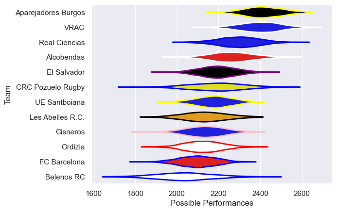

---  
title: "Division de Honor de Rugby 23/24 Status"  
date: 2025-07-28 6:00:00 -0500  
categories: model review projection  
layout: article  
aside:  
    toc: true  
---
# Current Team Rankings

# Standings

## Current Standings

| Club                |   Played |   Wins |   Point Differential |   Losing Bonus Points |   Try Bonus Points |   Competition Points |
|:--------------------|---------:|-------:|---------------------:|----------------------:|-------------------:|---------------------:|
| Aparejadores Burgos |       11 |     10 |                  234 |                     1 |                  2 |                   43 |
| VRAC                |       11 |     10 |                  201 |                     1 |                  1 |                   42 |
| Real Ciencias       |       11 |      6 |                   79 |                     4 |                  1 |                   31 |
| Alcobendas          |       11 |      6 |                    9 |                     3 |                  1 |                   28 |
| UE Santboiana       |       11 |      6 |                   -1 |                     1 |                  1 |                   28 |
| El Salvador         |       11 |      5 |                    8 |                     0 |                    |                   22 |
| Cisneros            |       11 |      4 |                   -5 |                     2 |                  2 |                   20 |
| FC Barcelona        |       11 |      4 |                  -92 |                     2 |                  2 |                   20 |
| Ordizia             |       11 |      4 |                  -72 |                     2 |                  1 |                   19 |
| Les Abelles R.C.    |       11 |      4 |                  -81 |                     0 |                    |                   18 |
| Belenos RC          |       11 |      3 |                 -136 |                     4 |                  2 |                   18 |
| CRC Pozuelo Rugby   |       11 |      2 |                 -144 |                     0 |                    |                    8 |

# Completed Match Review

| Model | Percent Correct Predictions | Spread Error |
| ------ | ------ | ------ |
| Club Level | 63.6% | 14.2 |
| Player Level: Lineup | nan% | nan |
| Player Level: Minutes | nan% | nan |

