---  
title: "Division de Honor de Rugby 24/25 Status"  
date: 2025-02-21 6:00:00 -0500  
categories: model review projection  
layout: article  
aside:  
    toc: true  
---
# Current Team Rankings

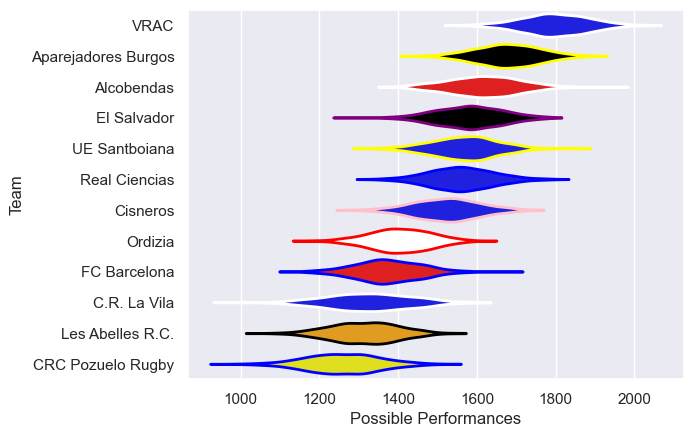
# Standings

## Current Standings

| Club                |   Played |   Wins |   Point Differential |   Losing Bonus Points |   Try Bonus Points |   Competition Points |
|:--------------------|---------:|-------:|---------------------:|----------------------:|-------------------:|---------------------:|
| VRAC                |       10 |     10 |                  221 |                     0 |                nan |                   44 |
| El Salvador         |       10 |      9 |                   51 |                     1 |                nan |                   38 |
| Alcobendas          |       10 |      7 |                  102 |                     3 |                nan |                   35 |
| Aparejadores Burgos |       10 |      7 |                  131 |                     3 |                nan |                   34 |
| UE Santboiana       |       10 |      6 |                   47 |                     3 |                nan |                   30 |
| Real Ciencias       |       10 |      5 |                   43 |                     2 |                nan |                   27 |
| Cisneros            |       10 |      4 |                   10 |                     4 |                nan |                   22 |
| FC Barcelona        |       10 |      4 |                  -65 |                     1 |                nan |                   17 |
| Ordizia             |       10 |      3 |                  -75 |                     3 |                nan |                   16 |
| C.R. La Vila        |       10 |      2 |                  -54 |                     4 |                nan |                   15 |
| CRC Pozuelo Rugby   |       10 |      1 |                 -220 |                     2 |                nan |                    8 |
| Les Abelles R.C.    |       10 |      1 |                 -191 |                     2 |                nan |                    7 |

## Projected Remaining Table

| Club                |   Matches Remaining |   Wins |   Point Differential |   Losing Bonus Points |   Try Bonus Points |   Competition Points |
|:--------------------|--------------------:|-------:|---------------------:|----------------------:|-------------------:|---------------------:|
| Aparejadores Burgos |                   1 |    0.9 |             18.1223  |                   0   |                0.7 |                  4.4 |
| El Salvador         |                   1 |    0.9 |             13.3567  |                   0   |                0.4 |                  4   |
| VRAC                |                   1 |    0.8 |              9.31867 |                   0.1 |                0.6 |                  4   |
| Alcobendas          |                   1 |    0.8 |              8.00376 |                   0.1 |                0.2 |                  3.6 |
| Cisneros            |                   1 |    0.7 |              5.68495 |                   0.2 |                0.2 |                  3.3 |
| CRC Pozuelo Rugby   |                   1 |    0.6 |              1.56085 |                   0.3 |                0.5 |                  3   |
| Les Abelles R.C.    |                   1 |    0.4 |             -1.56085 |                   0.3 |                0.7 |                  2.8 |
| C.R. La Vila        |                   1 |    0.3 |             -5.68495 |                   0.3 |                0.2 |                  1.6 |
| Real Ciencias       |                   1 |    0.2 |             -8.00376 |                   0.3 |                0.2 |                  1.3 |
| UE Santboiana       |                   1 |    0.2 |             -9.31867 |                   0.3 |                0.1 |                  1   |
| FC Barcelona        |                   1 |    0.1 |            -13.3567  |                   0.2 |                0.1 |                  0.7 |
| Ordizia             |                   1 |    0.1 |            -18.1223  |                   0.1 |                0.1 |                  0.5 |

## Projected Total Table

| Club                |   Total Matches |   Wins |   Point Differential |   Losing Bonus Points |   Try Bonus Points |   Competition Points |
|:--------------------|----------------:|-------:|---------------------:|----------------------:|-------------------:|---------------------:|
| VRAC                |              11 |   10.8 |             230.319  |                   0.1 |                0.6 |                 48   |
| El Salvador         |              11 |    9.9 |              64.3567 |                   1   |                0.4 |                 42   |
| Alcobendas          |              11 |    7.8 |             110.004  |                   3.1 |                0.2 |                 38.6 |
| Aparejadores Burgos |              11 |    7.9 |             149.122  |                   3   |                0.7 |                 38.4 |
| UE Santboiana       |              11 |    6.2 |              37.6813 |                   3.3 |                0.1 |                 31   |
| Real Ciencias       |              11 |    5.2 |              34.9962 |                   2.3 |                0.2 |                 28.3 |
| Cisneros            |              11 |    4.7 |              15.685  |                   4.2 |                0.2 |                 25.3 |
| FC Barcelona        |              11 |    4.1 |             -78.3567 |                   1.2 |                0.1 |                 17.7 |
| C.R. La Vila        |              11 |    2.3 |             -59.685  |                   4.3 |                0.2 |                 16.6 |
| Ordizia             |              11 |    3.1 |             -93.1223 |                   3.1 |                0.1 |                 16.5 |
| CRC Pozuelo Rugby   |              11 |    1.6 |            -218.439  |                   2.3 |                0.5 |                 11   |
| Les Abelles R.C.    |              11 |    1.4 |            -192.561  |                   2.3 |                0.7 |                  9.8 |

# Completed Match Review

| Model | Percent Correct Predictions | Spread Error |
| ------ | ------ | ------ |
| Club Level | 70.0% | 10.4 |
| Player Level: Lineup | 70.8% | 13.1 |
| Player Level: Minutes | 58.3% | 14.0 |

# Future Predictions

## Week 11

### UE Santboiana V VRAC on 2025/03/01

Average Margin: VRAC by 9.3

Average Scoreline: 34-24

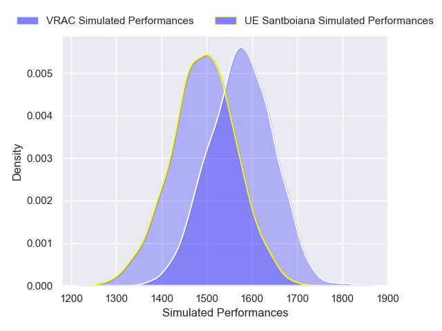

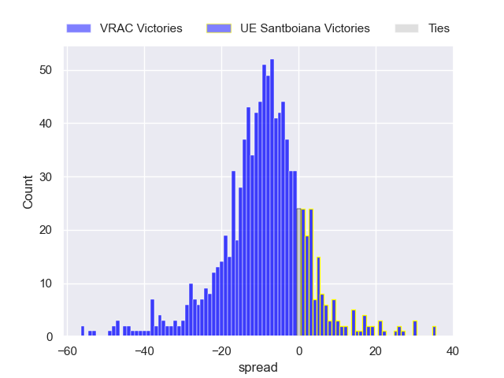

### El Salvador V FC Barcelona on 2025/03/01

Average Margin: El Salvador by 13.4

Average Scoreline: 34-21

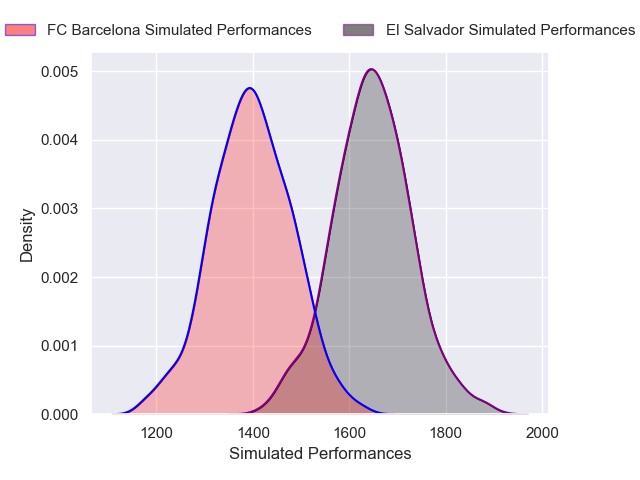

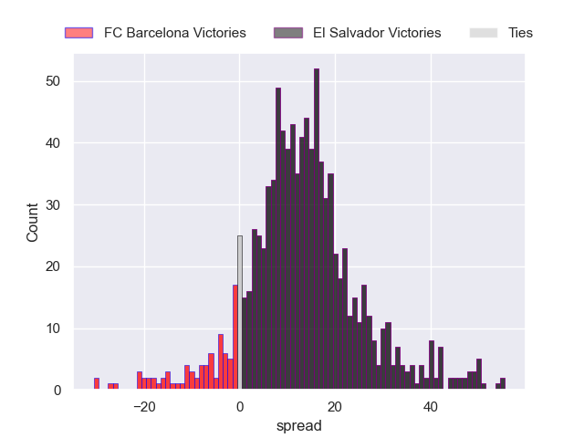

### CRC Pozuelo Rugby V Les Abelles R.C. on 2025/03/01

Average Margin: CRC Pozuelo Rugby by 1.6

Average Scoreline: 34-33

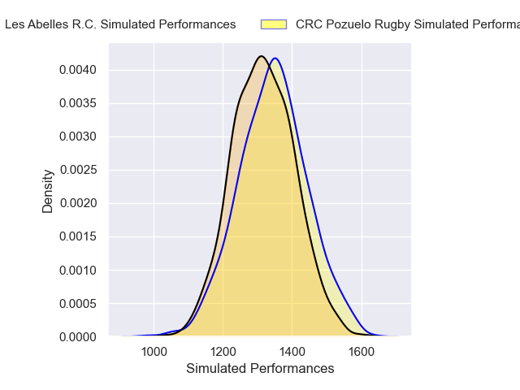

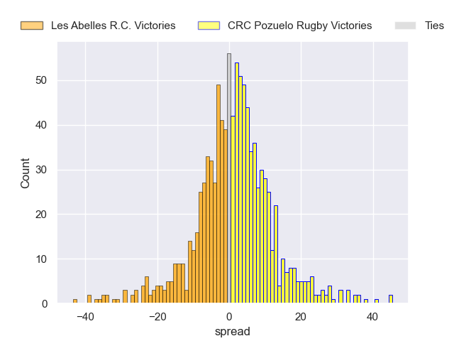

### C.R. La Vila V Cisneros on 2025/03/01

Average Margin: Cisneros by 5.7

Average Scoreline: 29-23

### Alcobendas V Real Ciencias on 2025/03/01

Average Margin: Alcobendas by 8.0

Average Scoreline: 26-18

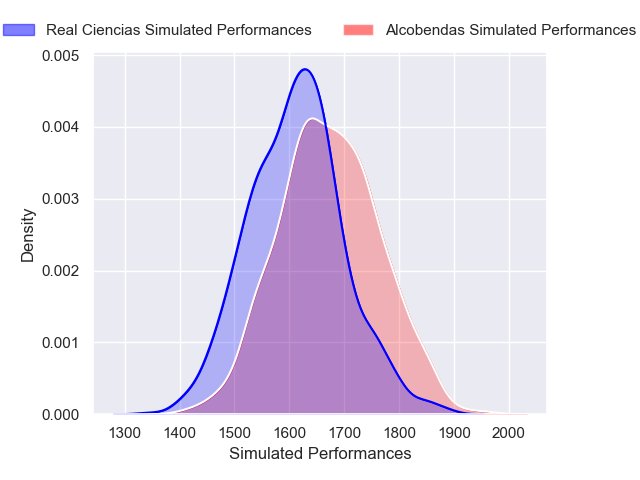

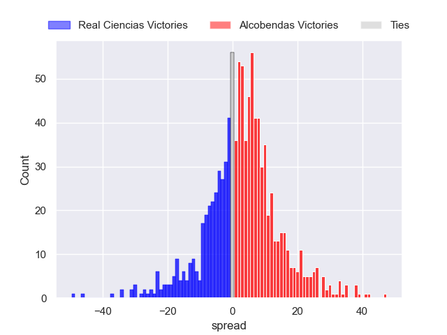

### Aparejadores Burgos V Ordizia on 2025/03/01

Average Margin: Aparejadores Burgos by 18.1

Average Scoreline: 38-20

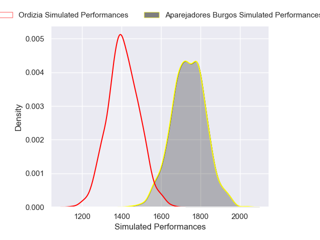

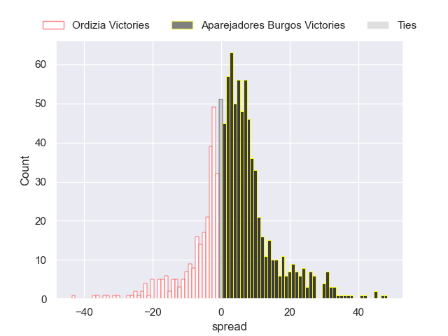

