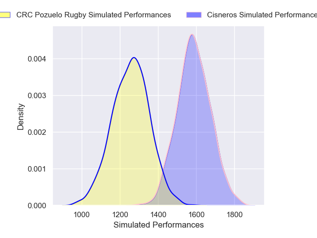
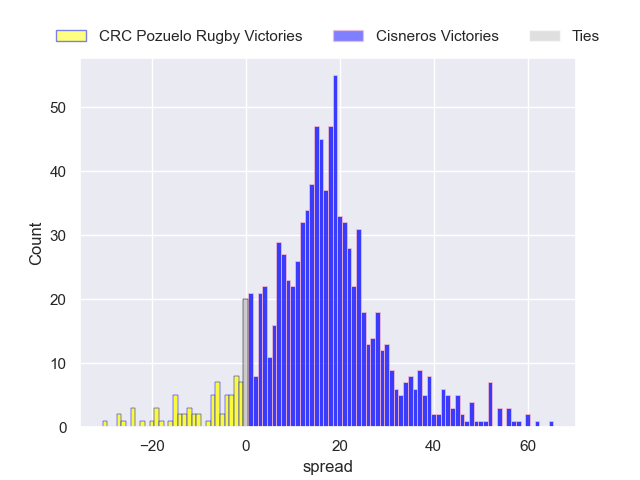

---  
title: "Division de Honor de Rugby 24/25 Status"  
date: 2025-02-03 6:00:00 -0500  
categories: model review projection  
layout: article  
aside:  
    toc: true  
---
# Current Team Rankings

# Standings

## Current Standings

| Club                |   Played |   Wins |   Point Differential |   Losing Bonus Points |   Try Bonus Points |   Competition Points |
|:--------------------|---------:|-------:|---------------------:|----------------------:|-------------------:|---------------------:|
| VRAC                |        8 |      8 |                  167 |                     0 |                nan |                   36 |
| El Salvador         |        8 |      7 |                   41 |                     1 |                nan |                   30 |
| Alcobendas          |        8 |      5 |                   80 |                     3 |                nan |                   27 |
| Aparejadores Burgos |        8 |      5 |                   82 |                     3 |                nan |                   26 |
| Real Ciencias       |        8 |      5 |                   70 |                     2 |                nan |                   25 |
| UE Santboiana       |        8 |      5 |                   23 |                     2 |                nan |                   25 |
| Cisneros            |        8 |      3 |                    4 |                     3 |                nan |                   17 |
| Ordizia             |        8 |      3 |                  -49 |                     2 |                nan |                   15 |
| C.R. La Vila        |        8 |      2 |                  -31 |                     4 |                nan |                   13 |
| FC Barcelona        |        8 |      3 |                  -63 |                     1 |                nan |                   13 |
| CRC Pozuelo Rugby   |        8 |      1 |                 -176 |                     2 |                nan |                    8 |
| Les Abelles R.C.    |        8 |      1 |                 -148 |                     1 |                nan |                    6 |

## Projected Remaining Table

| Club                |   Matches Remaining |   Wins |   Point Differential |   Losing Bonus Points |   Try Bonus Points |   Competition Points |
|:--------------------|--------------------:|-------:|---------------------:|----------------------:|-------------------:|---------------------:|
| VRAC                |                   3 |    2.8 |              63.7799 |                   0.1 |                2.2 |                 13.4 |
| Aparejadores Burgos |                   3 |    2.8 |              53.348  |                   0.1 |                2.2 |                 13.3 |
| El Salvador         |                   3 |    2.6 |              36.0217 |                   0.2 |                1.4 |                 12.2 |
| Alcobendas          |                   3 |    2.1 |              18.3186 |                   0.5 |                1.1 |                 10.1 |
| Real Ciencias       |                   3 |    2.1 |              17.9397 |                   0.5 |                1   |                  9.8 |
| Cisneros            |                   3 |    1.9 |              13.9403 |                   0.5 |                1.3 |                  9.2 |
| Ordizia             |                   3 |    1   |             -23.1594 |                   0.5 |                0.9 |                  5.2 |
| UE Santboiana       |                   3 |    0.7 |             -21.4855 |                   0.8 |                0.5 |                  4.2 |
| CRC Pozuelo Rugby   |                   3 |    0.7 |             -37.5935 |                   0.4 |                0.8 |                  4.1 |
| Les Abelles R.C.    |                   3 |    0.6 |             -38.2267 |                   0.6 |                1   |                  3.8 |
| FC Barcelona        |                   3 |    0.4 |             -34.6211 |                   0.6 |                0.5 |                  2.7 |
| C.R. La Vila        |                   3 |    0.4 |             -48.262  |                   0.6 |                0.4 |                  2.6 |

## Projected Total Table

| Club                |   Total Matches |   Wins |   Point Differential |   Losing Bonus Points |   Try Bonus Points |   Competition Points |
|:--------------------|----------------:|-------:|---------------------:|----------------------:|-------------------:|---------------------:|
| VRAC                |              11 |   10.8 |            230.78    |                   0.1 |                2.2 |                 49.4 |
| El Salvador         |              11 |    9.6 |             77.0217  |                   1.2 |                1.4 |                 42.2 |
| Aparejadores Burgos |              11 |    7.8 |            135.348   |                   3.1 |                2.2 |                 39.3 |
| Alcobendas          |              11 |    7.1 |             98.3186  |                   3.5 |                1.1 |                 37.1 |
| Real Ciencias       |              11 |    7.1 |             87.9397  |                   2.5 |                1   |                 34.8 |
| UE Santboiana       |              11 |    5.7 |              1.51449 |                   2.8 |                0.5 |                 29.2 |
| Cisneros            |              11 |    4.9 |             17.9403  |                   3.5 |                1.3 |                 26.2 |
| Ordizia             |              11 |    4   |            -72.1594  |                   2.5 |                0.9 |                 20.2 |
| FC Barcelona        |              11 |    3.4 |            -97.6211  |                   1.6 |                0.5 |                 15.7 |
| C.R. La Vila        |              11 |    2.4 |            -79.262   |                   4.6 |                0.4 |                 15.6 |
| CRC Pozuelo Rugby   |              11 |    1.7 |           -213.593   |                   2.4 |                0.8 |                 12.1 |
| Les Abelles R.C.    |              11 |    1.6 |           -186.227   |                   1.6 |                1   |                  9.8 |

# Completed Match Review

| Model | Percent Correct Predictions | Spread Error |
| ------ | ------ | ------ |
| Club Level | 70.8% | 10.6 |
| Player Level: Lineup | 70.8% | 13.1 |
| Player Level: Minutes | 58.3% | 14.0 |

# Future Predictions

## Week 9

### Cisneros V CRC Pozuelo Rugby on 2025/02/08

Average Margin: Cisneros by 16.4

Average Scoreline: 41-25

### Les Abelles R.C. V El Salvador on 2025/02/09

Average Margin: El Salvador by 12.3

Average Scoreline: 31-19

### VRAC V C.R. La Vila on 2025/02/09

Average Margin: VRAC by 29.5

Average Scoreline: 39-9

### FC Barcelona V Aparejadores Burgos on 2025/02/09

Average Margin: Aparejadores Burgos by 12.9

Average Scoreline: 32-19

### Real Ciencias V UE Santboiana on 2025/02/09

Average Margin: Real Ciencias by 9.2

Average Scoreline: 32-23

### Alcobendas V Ordizia on 2025/02/09

Average Margin: Alcobendas by 13.2

Average Scoreline: 35-21

## Week 10

### Aparejadores Burgos V Les Abelles R.C. on 2025/02/15

Average Margin: Aparejadores Burgos by 23.7

Average Scoreline: 42-18

### UE Santboiana V Alcobendas on 2025/02/15

Average Margin: Alcobendas by 1.5

Average Scoreline: 25-23

### CRC Pozuelo Rugby V VRAC on 2025/02/15

Average Margin: VRAC by 23.4

Average Scoreline: 37-14

### El Salvador V Cisneros on 2025/02/15

Average Margin: El Salvador by 8.8

Average Scoreline: 31-22

### C.R. La Vila V Real Ciencias on 2025/02/15

Average Margin: Real Ciencias by 12.4

Average Scoreline: 25-12

### Ordizia V FC Barcelona on 2025/02/15

Average Margin: Ordizia by 6.7

Average Scoreline: 29-22

## Week 11

### El Salvador V FC Barcelona on 2025/03/01

Average Margin: El Salvador by 15.0

Average Scoreline: 33-18

### CRC Pozuelo Rugby V Les Abelles R.C. on 2025/03/01

Average Margin: CRC Pozuelo Rugby by 2.3

Average Scoreline: 27-25

### Alcobendas V Real Ciencias on 2025/03/01

Average Margin: Alcobendas by 3.6

Average Scoreline: 26-22

### UE Santboiana V VRAC on 2025/03/01

Average Margin: VRAC by 10.8

Average Scoreline: 34-23

### Aparejadores Burgos V Ordizia on 2025/03/01

Average Margin: Aparejadores Burgos by 16.7

Average Scoreline: 32-16

### C.R. La Vila V Cisneros on 2025/03/01

Average Margin: Cisneros by 6.3

Average Scoreline: 24-18

