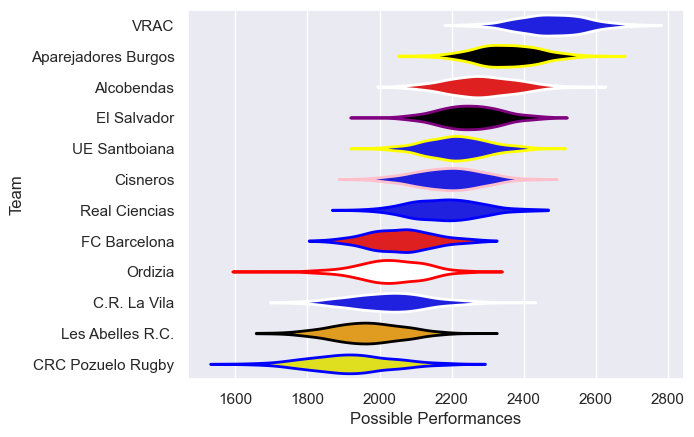

---  
title: "Division de Honor de Rugby 24/25 Status"  
date: 2025-07-28 6:00:00 -0500  
categories: model review projection  
layout: article  
aside:  
    toc: true  
---
# Current Team Rankings

# Standings

## Current Standings

| Club                |   Played |   Wins |   Point Differential |   Losing Bonus Points |   Try Bonus Points |   Competition Points |
|:--------------------|---------:|-------:|---------------------:|----------------------:|-------------------:|---------------------:|
| VRAC                |       10 |     10 |                  221 |                     0 |                  4 |                   44 |
| El Salvador         |       10 |      9 |                   51 |                     1 |                  1 |                   38 |
| Alcobendas          |       10 |      7 |                  102 |                     3 |                  4 |                   35 |
| Aparejadores Burgos |       10 |      7 |                  131 |                     3 |                  3 |                   34 |
| UE Santboiana       |       10 |      6 |                   47 |                     3 |                  3 |                   30 |
| Real Ciencias       |       10 |      5 |                   43 |                     2 |                  3 |                   27 |
| Cisneros            |       10 |      4 |                   10 |                     4 |                  2 |                   22 |
| FC Barcelona        |       10 |      4 |                  -65 |                     1 |                    |                   17 |
| Ordizia             |       10 |      3 |                  -75 |                     3 |                  1 |                   16 |
| C.R. La Vila        |       10 |      2 |                  -54 |                     4 |                  1 |                   15 |
| CRC Pozuelo Rugby   |       10 |      1 |                 -220 |                     2 |                  2 |                    8 |
| Les Abelles R.C.    |       10 |      1 |                 -191 |                     2 |                  1 |                    7 |

## Projected Remaining Table

| Club                |   To Play |   Projected Wins |   Projected Differential |   Projected Losing Bonus Points | Projected Try Bonus Points   |   Projected Competition Points |
|:--------------------|----------:|-----------------:|-------------------------:|--------------------------------:|:-----------------------------|-------------------------------:|
| Aparejadores Burgos |         1 |             0.74 |                    10.73 |                            0.16 |                              |                           3.22 |
| El Salvador         |         1 |             0.73 |                     6.82 |                            0.11 |                              |                           3.05 |
| Alcobendas          |         1 |             0.69 |                     4.96 |                            0.13 |                              |                           2.99 |
| VRAC                |         1 |             0.66 |                     4.61 |                            0.16 |                              |                           2.92 |
| CRC Pozuelo Rugby   |         1 |             0.53 |                     2.32 |                            0.24 |                              |                           2.54 |
| C.R. La Vila        |         1 |             0.49 |                    -0.13 |                            0.26 |                              |                           2.26 |
| Cisneros            |         1 |             0.49 |                     0.13 |                            0.23 |                              |                           2.23 |
| Les Abelles R.C.    |         1 |             0.38 |                    -2.32 |                            0.24 |                              |                           1.94 |
| UE Santboiana       |         1 |             0.28 |                    -4.61 |                            0.23 |                              |                           1.47 |
| Real Ciencias       |         1 |             0.26 |                    -4.96 |                            0.19 |                              |                           1.33 |
| FC Barcelona        |         1 |             0.26 |                    -6.82 |                            0.16 |                              |                           1.22 |
| Ordizia             |         1 |             0.21 |                   -10.73 |                            0.17 |                              |                           1.11 |

## Projected Total Table

| Club                |   Played |   Wins |   Point Differential |   Losing Bonus Points |   Try Bonus Points |   Competition Points |
|:--------------------|---------:|-------:|---------------------:|----------------------:|-------------------:|---------------------:|
| VRAC                |       11 |  10.66 |               225.61 |                  0.16 |                  4 |                46.92 |
| El Salvador         |       11 |   9.73 |                57.82 |                  1.11 |                  1 |                41.05 |
| Alcobendas          |       11 |   7.69 |               106.96 |                  3.13 |                  4 |                37.99 |
| Aparejadores Burgos |       11 |   7.74 |               141.73 |                  3.16 |                  3 |                37.22 |
| UE Santboiana       |       11 |   6.28 |                42.39 |                  3.23 |                  3 |                31.47 |
| Real Ciencias       |       11 |   5.26 |                38.04 |                  2.19 |                  3 |                28.33 |
| Cisneros            |       11 |   4.49 |                10.13 |                  4.23 |                  2 |                24.23 |
| FC Barcelona        |       11 |   4.26 |               -71.82 |                  1.16 |                    |                18.22 |
| C.R. La Vila        |       11 |   2.49 |               -54.13 |                  4.26 |                  1 |                17.26 |
| Ordizia             |       11 |   3.21 |               -85.73 |                  3.17 |                  1 |                17.11 |
| CRC Pozuelo Rugby   |       11 |   1.53 |              -217.68 |                  2.24 |                  2 |                10.54 |
| Les Abelles R.C.    |       11 |   1.38 |              -193.32 |                  2.24 |                  1 |                 8.94 |

# Completed Match Review

| Model | Percent Correct Predictions | Spread Error |
| ------ | ------ | ------ |
| Club Level | 72.7% | 10.0 |
| Player Level: Lineup | nan% | nan |
| Player Level: Minutes | nan% | nan |

# Future Predictions

## Week 11

### C.R. La Vila V Cisneros on 2025/03/01

Average Margin: Cisneros by 0.1

### UE Santboiana V VRAC on 2025/03/01

Average Margin: VRAC by 4.6

### El Salvador V FC Barcelona on 2025/03/01

Average Margin: El Salvador by 6.8

### CRC Pozuelo Rugby V Les Abelles R.C. on 2025/03/01

Average Margin: CRC Pozuelo Rugby by 2.3

### Alcobendas V Real Ciencias on 2025/03/01

Average Margin: Alcobendas by 5.0

### Aparejadores Burgos V Ordizia on 2025/03/01

Average Margin: Aparejadores Burgos by 10.7

