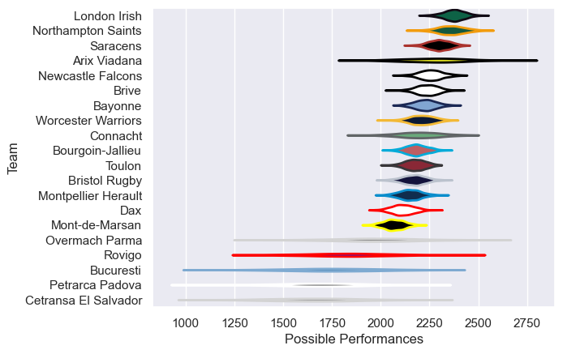

---  
title: "European Rugby Challenge Cup 08/09"  
date: 2025-07-29 6:00:00 -0500  
categories: model review projection  
layout: article  
aside:  
    toc: true  
---
# Current Team Rankings

# Standings

## Current Standings

| Club                 |   Played |   Wins |   Point Differential |   Losing Bonus Points |   Try Bonus Points |   Competition Points |
|:---------------------|---------:|-------:|---------------------:|----------------------:|-------------------:|---------------------:|
| Northampton Saints   |        9 |      9 |                  253 |                     0 |                  2 |                   38 |
| Saracens             |        8 |      7 |                  173 |                     1 |                    |                   29 |
| London Irish         |        7 |      6 |                  264 |                     1 |                  2 |                   27 |
| Worcester Warriors   |        8 |      6 |                  161 |                     0 |                  1 |                   25 |
| Bourgoin-Jallieu     |        9 |      5 |                   44 |                     2 |                    |                   22 |
| Brive                |        7 |      5 |                  143 |                     1 |                    |                   21 |
| Newcastle Falcons    |        7 |      4 |                   69 |                     1 |                    |                   17 |
| Connacht             |        7 |      4 |                  -10 |                     0 |                    |                   16 |
| Overmach Parma       |        6 |      3 |                   45 |                     2 |                    |                   14 |
| Arix Viadana         |        6 |      3 |                   -6 |                     1 |                    |                   13 |
| Bristol Rugby        |        6 |      3 |                  -28 |                     1 |                    |                   13 |
| Petrarca Padova      |        6 |      3 |                  -94 |                     1 |                    |                   13 |
| Bayonne              |        6 |      3 |                  -23 |                     0 |                    |                   12 |
| Montpellier Herault  |        6 |      2 |                  -58 |                     1 |                    |                    9 |
| Bucuresti            |        6 |      1 |                 -110 |                     1 |                    |                    5 |
| Rovigo               |        6 |      1 |                 -120 |                     1 |                    |                    5 |
| Toulon               |        6 |      1 |                 -123 |                     1 |                    |                    5 |
| Dax                  |        6 |      1 |                 -165 |                     0 |                    |                    4 |
| Mont-de-Marsan       |        6 |      0 |                 -128 |                     1 |                    |                    1 |
| Cetransa El Salvador |        6 |      0 |                 -287 |                     0 |                    |                    0 |

# Completed Match Review

| Model | Percent Correct Predictions | Spread Error |
| ------ | ------ | ------ |
| Club Level | 68.7% | 20.5 |
| Player Level: Lineup | nan% | nan |
| Player Level: Minutes | nan% | nan |

