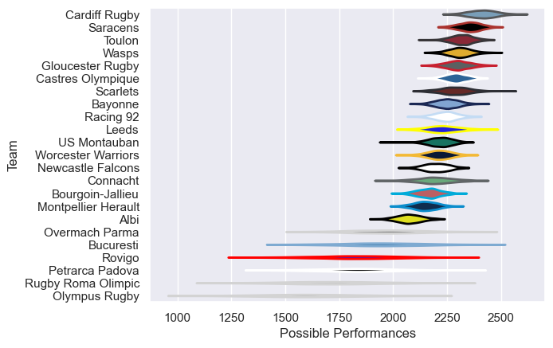

---  
title: "European Rugby Challenge Cup 09/10"  
date: 2025-07-29 6:00:00 -0500  
categories: model review projection  
layout: article  
aside:  
    toc: true  
---
# Current Team Rankings

# Standings

## Current Standings

| Club                |   Played |   Wins |   Point Differential |   Losing Bonus Points | Try Bonus Points   |   Competition Points |
|:--------------------|---------:|-------:|---------------------:|----------------------:|:-------------------|---------------------:|
| Toulon              |        9 |      7 |                  149 |                     1 |                    |                   29 |
| Connacht            |        8 |      7 |                  132 |                     1 |                    |                   29 |
| Wasps               |        8 |      6 |                  120 |                     2 |                    |                   26 |
| Bourgoin-Jallieu    |        7 |      5 |                   52 |                     2 |                    |                   22 |
| Newcastle Falcons   |        7 |      5 |                   36 |                     1 |                    |                   21 |
| Saracens            |        6 |      5 |                  101 |                     0 |                    |                   20 |
| US Montauban        |        6 |      5 |                   36 |                     0 |                    |                   20 |
| Bayonne             |        6 |      4 |                  111 |                     1 |                    |                   17 |
| Montpellier Herault |        6 |      4 |                   66 |                     1 |                    |                   17 |
| Leeds               |        6 |      4 |                   78 |                     0 |                    |                   16 |
| Racing 92           |        6 |      3 |                   92 |                     2 |                    |                   14 |
| Cardiff Rugby       |        3 |      3 |                   43 |                     0 |                    |                   12 |
| Worcester Warriors  |        6 |      2 |                   57 |                     3 |                    |                   11 |
| Albi                |        6 |      2 |                  -20 |                     2 |                    |                   10 |
| Castres Olympique   |        6 |      2 |                   53 |                     1 |                    |                    9 |
| Overmach Parma      |        6 |      2 |                  -67 |                     0 |                    |                    8 |
| Bucuresti           |        6 |      1 |                  -66 |                     3 |                    |                    7 |
| Petrarca Padova     |        6 |      0 |                  -85 |                     1 |                    |                    1 |
| Gloucester Rugby    |        1 |      0 |                  -16 |                     0 |                    |                    0 |
| Scarlets            |        1 |      0 |                  -26 |                     0 |                    |                    0 |
| Olympus Rugby       |        6 |      0 |                 -259 |                     0 |                    |                    0 |
| Rovigo              |        6 |      0 |                 -277 |                     0 |                    |                    0 |
| Rugby Roma Olimpic  |        6 |      0 |                 -310 |                     0 |                    |                    0 |

# Completed Match Review

| Model | Percent Correct Predictions | Spread Error |
| ------ | ------ | ------ |
| Club Level | 74.6% | 15.6 |
| Player Level: Lineup | nan% | nan |
| Player Level: Minutes | nan% | nan |

