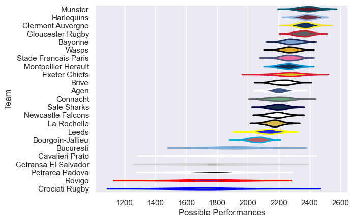

---  
title: "European Rugby Challenge Cup 10/11"  
date: 2025-07-29 6:00:00 -0500  
categories: model review projection  
layout: article  
aside:  
    toc: true  
---
# Current Team Rankings

# Standings

## Current Standings

| Club                 |   Played |   Wins |   Point Differential |   Losing Bonus Points |   Try Bonus Points |   Competition Points |
|:---------------------|---------:|-------:|---------------------:|----------------------:|-------------------:|---------------------:|
| Stade Francais Paris |        9 |      8 |                  150 |                     1 |                  3 |                   36 |
| Harlequins           |        9 |      8 |                  124 |                     1 |                    |                   33 |
| Brive                |        7 |      6 |                  198 |                     1 |                  1 |                   26 |
| La Rochelle          |        7 |      5 |                   96 |                     1 |                  1 |                   22 |
| Montpellier Herault  |        7 |      5 |                   42 |                     1 |                  1 |                   22 |
| Gloucester Rugby     |        6 |      4 |                  178 |                     2 |                  1 |                   19 |
| Sale Sharks          |        6 |      4 |                  221 |                     1 |                    |                   17 |
| Leeds                |        6 |      4 |                   85 |                     0 |                    |                   16 |
| Exeter Chiefs        |        6 |      3 |                   41 |                     3 |                    |                   15 |
| Connacht             |        6 |      3 |                   74 |                     2 |                    |                   14 |
| Bayonne              |        6 |      3 |                   47 |                     1 |                  1 |                   14 |
| Agen                 |        6 |      3 |                  -27 |                     1 |                    |                   13 |
| Bourgoin-Jallieu     |        6 |      2 |                  -11 |                     1 |                  1 |                   10 |
| Newcastle Falcons    |        6 |      2 |                  -76 |                     1 |                    |                    9 |
| Clermont Auvergne    |        2 |      1 |                    6 |                     1 |                    |                    5 |
| Munster              |        2 |      1 |                   -3 |                     0 |                  1 |                    5 |
| Bucuresti            |        6 |      1 |                  -74 |                     1 |                    |                    5 |
| Petrarca Padova      |        6 |      1 |                 -125 |                     1 |                    |                    5 |
| Crociati Rugby       |        6 |      1 |                 -154 |                     1 |                    |                    5 |
| Cavalieri Prato      |        6 |      1 |                 -226 |                     0 |                    |                    4 |
| Cetransa El Salvador |        6 |      1 |                 -299 |                     0 |                    |                    4 |
| Wasps                |        1 |      0 |                  -10 |                     0 |                    |                    0 |
| Rovigo               |        6 |      0 |                 -257 |                     0 |                    |                    0 |

# Completed Match Review

| Model | Percent Correct Predictions | Spread Error |
| ------ | ------ | ------ |
| Club Level | 80.6% | 16.2 |
| Player Level: Lineup | nan% | nan |
| Player Level: Minutes | nan% | nan |

