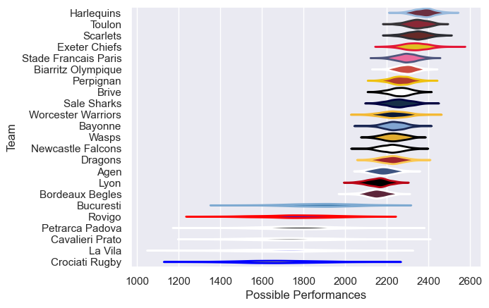

---  
title: "European Rugby Challenge Cup 11/12 Status"  
date: 2025-07-28 6:00:00 -0500  
categories: model review projection  
layout: article  
aside:  
    toc: true  
---
# Current Team Rankings

# Standings

## Current Standings

| Club                 |   Played |   Wins |   Point Differential |   Losing Bonus Points |   Try Bonus Points |   Competition Points |
|:---------------------|---------:|-------:|---------------------:|----------------------:|-------------------:|---------------------:|
| Toulon               |        9 |      7 |                  153 |                     2 |                  3 |                   33 |
| Stade Francais Paris |        8 |      7 |                  200 |                     1 |                  3 |                   32 |
| Brive                |        8 |      7 |                  115 |                     0 |                    |                   28 |
| Exeter Chiefs        |        7 |      5 |                  133 |                     2 |                  1 |                   23 |
| Wasps                |        7 |      5 |                  111 |                     1 |                  2 |                   23 |
| Bayonne              |        6 |      5 |                  136 |                     0 |                    |                   20 |
| Sale Sharks          |        6 |      4 |                  129 |                     0 |                  3 |                   19 |
| Worcester Warriors   |        6 |      4 |                   99 |                     0 |                  2 |                   18 |
| Newcastle Falcons    |        6 |      4 |                   51 |                     0 |                  1 |                   17 |
| Perpignan            |        6 |      4 |                   41 |                     0 |                    |                   16 |
| Dragons              |        6 |      3 |                   39 |                     1 |                  1 |                   14 |
| Lyon                 |        6 |      3 |                   29 |                     1 |                    |                   13 |
| Biarritz Olympique   |        3 |      3 |                   25 |                     0 |                    |                   12 |
| Bordeaux Begles      |        6 |      2 |                  -50 |                     1 |                    |                    9 |
| Agen                 |        6 |      2 |                    2 |                     0 |                    |                    8 |
| Bucuresti            |        6 |      2 |                  -82 |                     0 |                    |                    8 |
| Scarlets             |        1 |      0 |                   -4 |                     1 |                    |                    1 |
| Rovigo               |        6 |      0 |                 -200 |                     1 |                    |                    1 |
| Harlequins           |        1 |      0 |                  -29 |                     0 |                    |                    0 |
| Petrarca Padova      |        6 |      0 |                 -204 |                     0 |                    |                    0 |
| Crociati Rugby       |        6 |      0 |                 -215 |                     0 |                    |                    0 |
| Cavalieri Prato      |        6 |      0 |                 -218 |                     0 |                    |                    0 |
| La Vila              |        6 |      0 |                 -261 |                     0 |                    |                    0 |

# Completed Match Review

| Model | Percent Correct Predictions | Spread Error |
| ------ | ------ | ------ |
| Club Level | 85.1% | 13.4 |
| Player Level: Lineup | nan% | nan |
| Player Level: Minutes | nan% | nan |

