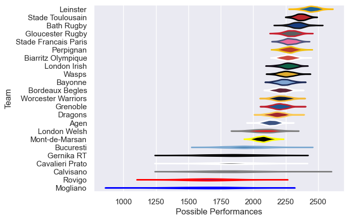

---  
title: "European Rugby Challenge Cup 12/13 Status"  
date: 2025-07-28 6:00:00 -0500  
categories: model review projection  
layout: article  
aside:  
    toc: true  
---
# Current Team Rankings

# Standings

## Current Standings

| Club                 |   Played |   Wins |   Point Differential |   Losing Bonus Points |   Try Bonus Points |   Competition Points |
|:---------------------|---------:|-------:|---------------------:|----------------------:|-------------------:|---------------------:|
| Stade Francais Paris |        9 |      7 |                  103 |                     1 |                  5 |                   34 |
| Perpignan            |        8 |      6 |                  212 |                     2 |                  4 |                   30 |
| Bath Rugby           |        7 |      6 |                  150 |                     0 |                  5 |                   29 |
| Gloucester Rugby     |        7 |      6 |                   83 |                     0 |                  3 |                   27 |
| Wasps                |        7 |      5 |                  119 |                     0 |                  4 |                   26 |
| Worcester Warriors   |        5 |      4 |                  189 |                     1 |                  3 |                   20 |
| Bayonne              |        6 |      4 |                  110 |                     0 |                  2 |                   20 |
| Grenoble             |        6 |      4 |                   92 |                     1 |                  3 |                   20 |
| London Irish         |        6 |      4 |                   35 |                     1 |                  2 |                   19 |
| Agen                 |        6 |      3 |                   34 |                     3 |                  2 |                   17 |
| Leinster             |        3 |      3 |                   69 |                     0 |                  3 |                   15 |
| Dragons              |        6 |      2 |                   63 |                     3 |                  2 |                   13 |
| London Welsh         |        6 |      3 |                    1 |                     0 |                  1 |                   13 |
| Mont-de-Marsan       |        6 |      2 |                  -56 |                     2 |                    |                   10 |
| Bucuresti            |        6 |      2 |                  -94 |                     0 |                  1 |                    9 |
| Gernika RT           |        6 |      2 |                 -229 |                     0 |                    |                    8 |
| Calvisano            |        6 |      1 |                 -106 |                     1 |                  2 |                    7 |
| Biarritz Olympique   |        2 |      1 |                  -18 |                     0 |                  1 |                    5 |
| Bordeaux Begles      |        6 |      0 |                  -72 |                     2 |                    |                    2 |
| Cavalieri Prato      |        6 |      0 |                 -198 |                     1 |                  1 |                    2 |
| Rovigo               |        5 |      0 |                 -164 |                     1 |                    |                    1 |
| Stade Toulousain     |        1 |      0 |                  -11 |                     0 |                    |                    0 |
| Mogliano             |        6 |      0 |                 -312 |                     0 |                    |                    0 |

# Completed Match Review

| Model | Percent Correct Predictions | Spread Error |
| ------ | ------ | ------ |
| Club Level | 78.8% | 17.9 |
| Player Level: Lineup | nan% | nan |
| Player Level: Minutes | nan% | nan |

