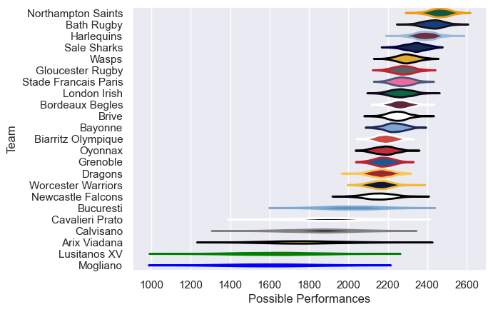

---  
title: "European Rugby Challenge Cup 13/14 Status"  
date: 2025-07-28 6:00:00 -0500  
categories: model review projection  
layout: article  
aside:  
    toc: true  
---
# Current Team Rankings

# Standings

## Current Standings

| Club                 |   Played |   Wins |   Point Differential |   Losing Bonus Points |   Try Bonus Points |   Competition Points |
|:---------------------|---------:|-------:|---------------------:|----------------------:|-------------------:|---------------------:|
| Bath Rugby           |        9 |      8 |                  217 |                     0 |                  5 |                   37 |
| Wasps                |        8 |      7 |                  215 |                     1 |                  3 |                   32 |
| London Irish         |        6 |      5 |                  228 |                     0 |                  4 |                   24 |
| Stade Francais Paris |        7 |      5 |                  104 |                     0 |                  4 |                   24 |
| Brive                |        7 |      5 |                   15 |                     0 |                  1 |                   23 |
| Sale Sharks          |        7 |      5 |                   76 |                     1 |                  1 |                   22 |
| Newcastle Falcons    |        6 |      4 |                   57 |                     2 |                  1 |                   19 |
| Biarritz Olympique   |        6 |      3 |                    3 |                     2 |                  2 |                   16 |
| Bayonne              |        6 |      3 |                  101 |                     0 |                  3 |                   15 |
| Dragons              |        6 |      3 |                   18 |                     0 |                  2 |                   14 |
| Northampton Saints   |        3 |      3 |                   36 |                     0 |                  1 |                   13 |
| Grenoble             |        6 |      2 |                  -40 |                     0 |                  2 |                   12 |
| Oyonnax              |        6 |      2 |                  -56 |                     1 |                  1 |                   12 |
| Bucuresti            |        6 |      2 |                  -11 |                     2 |                    |                   10 |
| Cavalieri Prato      |        6 |      2 |                  -98 |                     1 |                  1 |                   10 |
| Bordeaux Begles      |        5 |      2 |                   10 |                     0 |                  1 |                    9 |
| Worcester Warriors   |        6 |      1 |                  -37 |                     1 |                    |                    7 |
| Harlequins           |        2 |      1 |                   15 |                     0 |                    |                    4 |
| Calvisano            |        6 |      0 |                  -93 |                     0 |                    |                    2 |
| Arix Viadana         |        6 |      0 |                 -270 |                     0 |                    |                    2 |
| Gloucester Rugby     |        1 |      0 |                  -12 |                     0 |                    |                    0 |
| Mogliano             |        5 |      0 |                 -221 |                     0 |                    |                    0 |
| Lusitanos XV         |        6 |      0 |                 -257 |                     0 |                    |                    0 |

# Completed Match Review

| Model | Percent Correct Predictions | Spread Error |
| ------ | ------ | ------ |
| Club Level | 80.3% | 15.1 |
| Player Level: Lineup | nan% | nan |
| Player Level: Minutes | nan% | nan |

