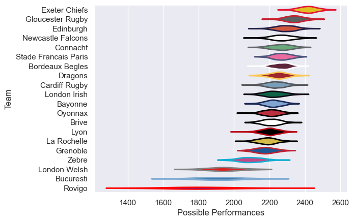

---  
title: "European Rugby Challenge Cup 14/15"  
date: 2025-07-29 6:00:00 -0500  
categories: model review projection  
layout: article  
aside:  
    toc: true  
---
# Current Team Rankings

# Standings

## Current Standings

| Club                 |   Played |   Wins |   Point Differential |   Losing Bonus Points |   Try Bonus Points |   Competition Points |
|:---------------------|---------:|-------:|---------------------:|----------------------:|-------------------:|---------------------:|
| Gloucester Rugby     |        8 |      8 |                  165 |                     0 |                  4 |                   36 |
| Edinburgh            |       10 |      7 |                   90 |                     1 |                  2 |                   35 |
| Exeter Chiefs        |        8 |      6 |                  139 |                     1 |                  5 |                   30 |
| Dragons              |        8 |      6 |                   88 |                     1 |                  4 |                   29 |
| London Irish         |        7 |      5 |                   92 |                     1 |                  4 |                   25 |
| Cardiff Rugby        |        7 |      5 |                  150 |                     1 |                  3 |                   24 |
| Newcastle Falcons    |        7 |      4 |                   24 |                     1 |                  4 |                   21 |
| Connacht             |        7 |      4 |                   35 |                     1 |                  3 |                   20 |
| Lyon                 |        6 |      4 |                   10 |                     0 |                  2 |                   18 |
| Bordeaux Begles      |        6 |      3 |                   34 |                     1 |                  3 |                   16 |
| Oyonnax              |        6 |      4 |                   -1 |                     0 |                    |                   16 |
| Stade Francais Paris |        6 |      3 |                   12 |                     1 |                  2 |                   15 |
| Grenoble             |        6 |      2 |                    1 |                     1 |                  3 |                   12 |
| Bayonne              |        6 |      2 |                  -59 |                     1 |                    |                    9 |
| Zebre                |        6 |      2 |                  -52 |                     0 |                    |                    8 |
| La Rochelle          |        6 |      1 |                  -98 |                     0 |                    |                    4 |
| Brive                |        6 |      0 |                  -94 |                     2 |                    |                    2 |
| London Welsh         |        6 |      0 |                 -100 |                     1 |                    |                    1 |
| Bucuresti            |        6 |      0 |                 -184 |                     1 |                    |                    1 |
| Rovigo               |        6 |      0 |                 -252 |                     1 |                    |                    1 |

# Completed Match Review

| Model | Percent Correct Predictions | Spread Error |
| ------ | ------ | ------ |
| Club Level | 74.6% | 13.6 |
| Player Level: Lineup | nan% | nan |
| Player Level: Minutes | nan% | nan |

