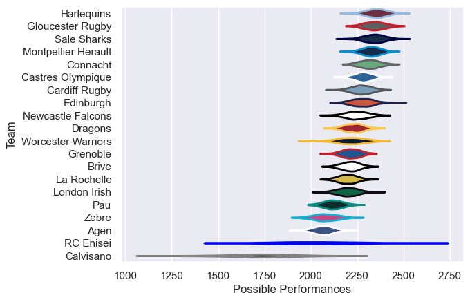

---  
title: "European Rugby Challenge Cup 15/16 Status"  
date: 2025-07-28 6:00:00 -0500  
categories: model review projection  
layout: article  
aside:  
    toc: true  
---
# Current Team Rankings

# Standings

## Current Standings

| Club                |   Played |   Wins |   Point Differential |   Losing Bonus Points |   Try Bonus Points |   Competition Points |
|:--------------------|---------:|-------:|---------------------:|----------------------:|-------------------:|---------------------:|
| Harlequins          |        9 |      7 |                  127 |                     1 |                  6 |                   35 |
| Montpellier Herault |        9 |      7 |                  128 |                     0 |                  4 |                   32 |
| Gloucester Rugby    |        7 |      6 |                   63 |                     1 |                  1 |                   26 |
| Grenoble            |        8 |      6 |                   10 |                     0 |                  2 |                   26 |
| Sale Sharks         |        7 |      5 |                   70 |                     1 |                  3 |                   24 |
| Dragons             |        8 |      5 |                   26 |                     1 |                  3 |                   24 |
| Connacht            |        7 |      4 |                   50 |                     2 |                  3 |                   21 |
| Cardiff Rugby       |        6 |      3 |                   98 |                     1 |                  4 |                   17 |
| London Irish        |        7 |      3 |                   56 |                     2 |                  3 |                   17 |
| Edinburgh           |        6 |      4 |                   22 |                     0 |                  1 |                   17 |
| Brive               |        6 |      3 |                   26 |                     3 |                  1 |                   16 |
| Newcastle Falcons   |        6 |      3 |                   40 |                     1 |                  2 |                   15 |
| Castres Olympique   |        6 |      3 |                  -12 |                     1 |                  2 |                   15 |
| Zebre               |        6 |      3 |                   22 |                     1 |                    |                   13 |
| La Rochelle         |        6 |      2 |                  -27 |                     0 |                  2 |                   10 |
| RC Enisei           |        6 |      2 |                 -117 |                     0 |                    |                    8 |
| Worcester Warriors  |        6 |      1 |                  -60 |                     1 |                    |                    5 |
| Agen                |        6 |      0 |                 -119 |                     1 |                  1 |                    2 |
| Pau                 |        6 |      0 |                  -98 |                     0 |                    |                    0 |
| Calvisano           |        6 |      0 |                 -305 |                     0 |                    |                    0 |

# Completed Match Review

| Model | Percent Correct Predictions | Spread Error |
| ------ | ------ | ------ |
| Club Level | 79.1% | 13.2 |
| Player Level: Lineup | nan% | nan |
| Player Level: Minutes | nan% | nan |

