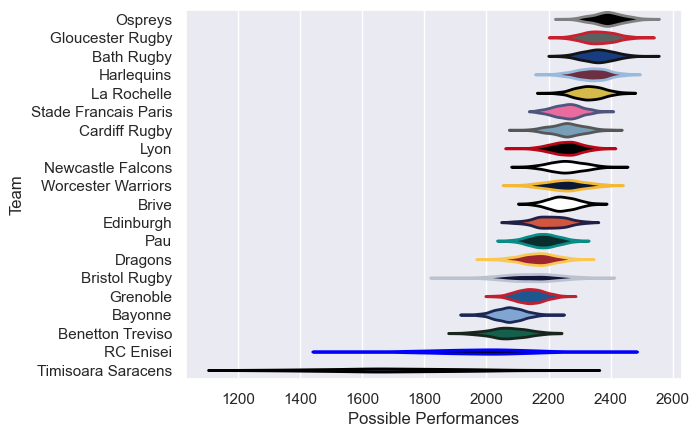

---  
title: "European Rugby Challenge Cup 16/17 Status"  
date: 2025-07-28 6:00:00 -0500  
categories: model review projection  
layout: article  
aside:  
    toc: true  
---
# Current Team Rankings

# Standings

## Current Standings

| Club                 |   Played |   Wins |   Point Differential |   Losing Bonus Points |   Try Bonus Points |   Competition Points |
|:---------------------|---------:|-------:|---------------------:|----------------------:|-------------------:|---------------------:|
| Gloucester Rugby     |        9 |      7 |                  141 |                     0 |                  6 |                   34 |
| Ospreys              |        7 |      6 |                  224 |                     1 |                  6 |                   31 |
| Stade Francais Paris |        9 |      7 |                   56 |                     1 |                  2 |                   31 |
| La Rochelle          |        8 |      6 |                  107 |                     1 |                  5 |                   30 |
| Bath Rugby           |        8 |      6 |                  134 |                     1 |                  4 |                   29 |
| Edinburgh            |        7 |      5 |                   83 |                     1 |                  3 |                   24 |
| Brive                |        7 |      5 |                   41 |                     0 |                  3 |                   23 |
| Cardiff Rugby        |        7 |      5 |                   15 |                     0 |                  2 |                   22 |
| Harlequins           |        6 |      3 |                  117 |                     2 |                  3 |                   17 |
| Lyon                 |        6 |      3 |                   23 |                     0 |                  4 |                   16 |
| Dragons              |        6 |      3 |                   10 |                     0 |                  2 |                   14 |
| Worcester Warriors   |        6 |      2 |                   30 |                     3 |                  1 |                   12 |
| Newcastle Falcons    |        6 |      2 |                  -22 |                     2 |                  2 |                   12 |
| Bristol Rugby        |        6 |      2 |                  -43 |                     0 |                  2 |                   10 |
| RC Enisei            |        6 |      2 |                  -95 |                     0 |                  1 |                    9 |
| Benetton Treviso     |        6 |      2 |                 -107 |                     0 |                    |                    8 |
| Grenoble             |        6 |      1 |                 -229 |                     0 |                    |                    4 |
| Pau                  |        6 |      0 |                 -115 |                     2 |                    |                    2 |
| Bayonne              |        6 |      0 |                 -119 |                     1 |                    |                    1 |
| Timisoara Saracens   |        6 |      0 |                 -251 |                     0 |                    |                    0 |

# Completed Match Review

| Model | Percent Correct Predictions | Spread Error |
| ------ | ------ | ------ |
| Club Level | 76.1% | 16.7 |
| Player Level: Lineup | nan% | nan |
| Player Level: Minutes | nan% | nan |

