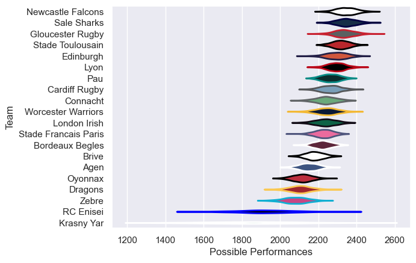

---  
title: "European Rugby Challenge Cup 17/18 Status"  
date: 2025-07-28 6:00:00 -0500  
categories: model review projection  
layout: article  
aside:  
    toc: true  
---
# Current Team Rankings

# Standings

## Current Standings

| Club                 |   Played |   Wins |   Point Differential |   Losing Bonus Points |   Try Bonus Points |   Competition Points |
|:---------------------|---------:|-------:|---------------------:|----------------------:|-------------------:|---------------------:|
| Pau                  |        8 |      7 |                   79 |                     1 |                  5 |                   34 |
| Newcastle Falcons    |        8 |      7 |                  101 |                     0 |                  5 |                   33 |
| Cardiff Rugby        |        9 |      8 |                   25 |                     0 |                  1 |                   33 |
| Gloucester Rugby     |        9 |      6 |                  139 |                     2 |                  6 |                   32 |
| Connacht             |        7 |      5 |                  118 |                     1 |                  5 |                   28 |
| Edinburgh            |        7 |      5 |                  170 |                     1 |                  4 |                   25 |
| Stade Francais Paris |        7 |      3 |                  -18 |                     3 |                  4 |                   19 |
| Brive                |        7 |      3 |                  -16 |                     1 |                  4 |                   17 |
| Dragons              |        6 |      3 |                   23 |                     2 |                  2 |                   16 |
| London Irish         |        6 |      3 |                   15 |                     1 |                  3 |                   16 |
| Bordeaux Begles      |        6 |      3 |                   12 |                     1 |                  3 |                   16 |
| Worcester Warriors   |        6 |      2 |                   -9 |                     2 |                  3 |                   15 |
| Stade Toulousain     |        6 |      2 |                   -3 |                     2 |                  2 |                   14 |
| Sale Sharks          |        6 |      2 |                    8 |                     2 |                    |                   12 |
| Lyon                 |        6 |      2 |                   -9 |                     3 |                    |                   11 |
| Zebre                |        6 |      1 |                 -124 |                     2 |                  2 |                    8 |
| Agen                 |        6 |      1 |                  -72 |                     0 |                  2 |                    6 |
| Krasny Yar           |        6 |      1 |                 -184 |                     1 |                  1 |                    6 |
| Oyonnax              |        6 |      1 |                 -113 |                     0 |                    |                    4 |
| RC Enisei            |        6 |      0 |                 -142 |                     1 |                    |                    1 |

# Completed Match Review

| Model | Percent Correct Predictions | Spread Error |
| ------ | ------ | ------ |
| Club Level | 73.5% | 13.3 |
| Player Level: Lineup | nan% | nan |
| Player Level: Minutes | nan% | nan |

# Future Predictions

## Week 10

### Newcastle Falcons V RC Enisei on 2018/01/12

Average Margin: Newcastle Falcons by 14.3

