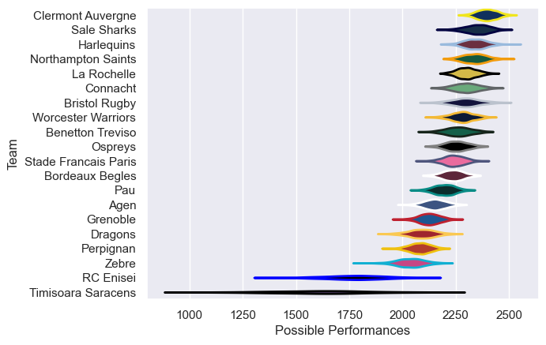

---  
title: "European Rugby Challenge Cup 18/19"  
date: 2025-07-29 6:00:00 -0500  
categories: model review projection  
layout: article  
aside:  
    toc: true  
---
# Current Team Rankings

# Standings

## Current Standings

| Club                 |   Played |   Wins |   Point Differential |   Losing Bonus Points |   Try Bonus Points |   Competition Points |
|:---------------------|---------:|-------:|---------------------:|----------------------:|-------------------:|---------------------:|
| Clermont Auvergne    |        9 |      9 |                  235 |                     0 |                  7 |                   43 |
| La Rochelle          |        9 |      7 |                  142 |                     0 |                  5 |                   33 |
| Sale Sharks          |        8 |      5 |                   94 |                     3 |                  4 |                   27 |
| Harlequins           |        8 |      5 |                   63 |                     3 |                  4 |                   27 |
| Worcester Warriors   |        7 |      5 |                   23 |                     1 |                  2 |                   23 |
| Connacht             |        7 |      5 |                   16 |                     0 |                  2 |                   22 |
| Bristol Rugby        |        7 |      4 |                  135 |                     1 |                  4 |                   21 |
| Northampton Saints   |        7 |      4 |                  129 |                     0 |                  5 |                   21 |
| Benetton Treviso     |        6 |      4 |                   65 |                     1 |                  3 |                   20 |
| Zebre                |        6 |      3 |                   11 |                     0 |                  2 |                   14 |
| Ospreys              |        6 |      2 |                   36 |                     3 |                  2 |                   13 |
| Pau                  |        6 |      3 |                  -38 |                     0 |                  1 |                   13 |
| Stade Francais Paris |        6 |      2 |                  -23 |                     2 |                  2 |                   12 |
| Bordeaux Begles      |        6 |      2 |                  -34 |                     1 |                  1 |                   12 |
| Dragons              |        6 |      2 |                  -22 |                     0 |                  2 |                   10 |
| Agen                 |        6 |      2 |                  -64 |                     1 |                    |                    9 |
| Grenoble             |        6 |      2 |                  -67 |                     1 |                    |                    9 |
| Perpignan            |        6 |      0 |                  -80 |                     1 |                    |                    3 |
| RC Enisei            |        6 |      0 |                 -304 |                     0 |                  1 |                    1 |
| Timisoara Saracens   |        6 |      0 |                 -317 |                     0 |                    |                    0 |

# Completed Match Review

| Model | Percent Correct Predictions | Spread Error |
| ------ | ------ | ------ |
| Club Level | 80.6% | 13.3 |
| Player Level: Lineup | nan% | nan |
| Player Level: Minutes | nan% | nan |

