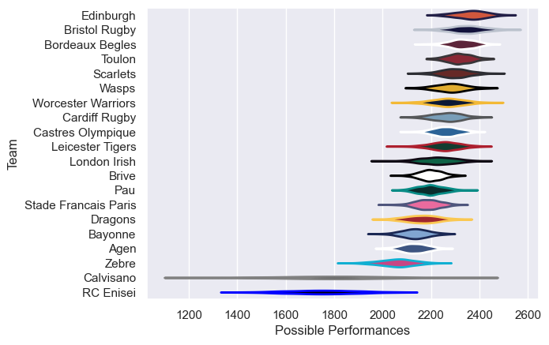

---  
title: "European Rugby Challenge Cup 19/20"  
date: 2025-07-29 6:00:00 -0500  
categories: model review projection  
layout: article  
aside:  
    toc: true  
---
# Current Team Rankings

# Standings

## Current Standings

| Club                 |   Played |   Wins |   Point Differential |   Losing Bonus Points |   Try Bonus Points |   Competition Points |
|:---------------------|---------:|-------:|---------------------:|----------------------:|-------------------:|---------------------:|
| Toulon               |        6 |      6 |                   90 |                     0 |                  4 |                   28 |
| Bristol Rugby        |        6 |      5 |                  151 |                     0 |                  4 |                   26 |
| Bordeaux Begles      |        6 |      5 |                  149 |                     0 |                  4 |                   26 |
| Leicester Tigers     |        6 |      5 |                   86 |                     1 |                  2 |                   23 |
| Castres Olympique    |        6 |      5 |                   56 |                     0 |                  3 |                   23 |
| Edinburgh            |        6 |      4 |                   55 |                     0 |                  3 |                   21 |
| Dragons              |        6 |      4 |                   58 |                     1 |                  3 |                   20 |
| Scarlets             |        6 |      4 |                   59 |                     1 |                  2 |                   19 |
| Pau                  |        6 |      4 |                   38 |                     0 |                  3 |                   19 |
| Cardiff Rugby        |        6 |      3 |                   97 |                     2 |                  4 |                   18 |
| Worcester Warriors   |        6 |      3 |                   82 |                     1 |                  3 |                   16 |
| Brive                |        6 |      3 |                  -54 |                     1 |                  1 |                   14 |
| Zebre                |        6 |      2 |                  -45 |                     1 |                  2 |                   13 |
| Wasps                |        6 |      2 |                   -4 |                     1 |                  2 |                   11 |
| Stade Francais Paris |        6 |      1 |                  -52 |                     3 |                  1 |                    8 |
| London Irish         |        6 |      1 |                  -52 |                     2 |                  1 |                    7 |
| Bayonne              |        6 |      1 |                  -97 |                     1 |                  2 |                    7 |
| Calvisano            |        6 |      0 |                 -221 |                     1 |                    |                    1 |
| RC Enisei            |        6 |      0 |                 -196 |                     0 |                    |                    0 |
| Agen                 |        6 |      0 |                 -200 |                     0 |                    |                    0 |

# Completed Match Review

| Model | Percent Correct Predictions | Spread Error |
| ------ | ------ | ------ |
| Club Level | 71.7% | 14.7 |
| Player Level: Lineup | nan% | nan |
| Player Level: Minutes | nan% | nan |

