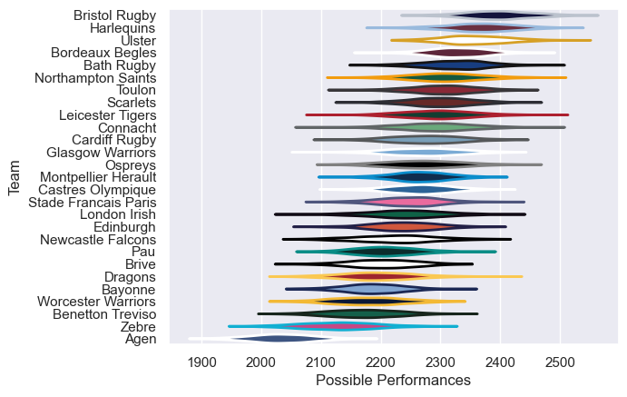

---  
title: "European Rugby Challenge Cup 20/21"  
date: 2025-07-29 6:00:00 -0500  
categories: model review projection  
layout: article  
aside:  
    toc: true  
---
# Current Team Rankings

# Standings

## Current Standings

| Club                 |   Played |   Wins |   Point Differential |   Losing Bonus Points |   Try Bonus Points |   Competition Points |
|:---------------------|---------:|-------:|---------------------:|----------------------:|-------------------:|---------------------:|
| Leicester Tigers     |        8 |      5 |                   63 |                     1 |                    |                   23 |
| Montpellier Herault  |        4 |      4 |                   21 |                     0 |                    |                   16 |
| Bristol Rugby        |        3 |      3 |                   69 |                     0 |                  2 |                   14 |
| London Irish         |        4 |      3 |                   28 |                     0 |                    |                   12 |
| Benetton Treviso     |        3 |      2 |                   31 |                     1 |                    |                    9 |
| Ospreys              |        3 |      2 |                   29 |                     1 |                    |                    9 |
| Toulon               |        3 |      2 |                    7 |                     0 |                  1 |                    9 |
| Ulster               |        3 |      2 |                   35 |                     0 |                    |                    8 |
| Bath Rugby           |        3 |      2 |                   12 |                     0 |                    |                    8 |
| Newcastle Falcons    |        4 |      2 |                  -24 |                     0 |                    |                    8 |
| Zebre                |        3 |      1 |                   -6 |                     0 |                    |                    6 |
| Cardiff Rugby        |        2 |      1 |                    7 |                     1 |                    |                    5 |
| Northampton Saints   |        2 |      1 |                   -4 |                     0 |                    |                    4 |
| Pau                  |        2 |      1 |                   -5 |                     0 |                    |                    4 |
| Bordeaux Begles      |        2 |      1 |                   -8 |                     0 |                    |                    4 |
| Bayonne              |        2 |      0 |                   -8 |                     0 |                    |                    2 |
| Castres Olympique    |        3 |      0 |                  -33 |                     0 |                    |                    2 |
| Glasgow Warriors     |        1 |      0 |                   -5 |                     1 |                    |                    1 |
| Scarlets             |        1 |      0 |                   -5 |                     1 |                    |                    1 |
| Worcester Warriors   |        2 |      0 |                  -13 |                     1 |                    |                    1 |
| Brive                |        2 |      0 |                  -24 |                     1 |                    |                    1 |
| Dragons              |        2 |      0 |                  -43 |                     1 |                    |                    1 |
| Edinburgh            |        1 |      0 |                   -9 |                     0 |                    |                    0 |
| Connacht             |        1 |      0 |                  -16 |                     0 |                    |                    0 |
| Stade Francais Paris |        1 |      0 |                  -24 |                     0 |                    |                    0 |
| Harlequins           |        1 |      0 |                  -36 |                     0 |                    |                    0 |
| Agen                 |        2 |      0 |                  -39 |                     0 |                    |                    0 |

# Completed Match Review

| Model | Percent Correct Predictions | Spread Error |
| ------ | ------ | ------ |
| Club Level | 58.8% | 11.2 |
| Player Level: Lineup | nan% | nan |
| Player Level: Minutes | nan% | nan |

