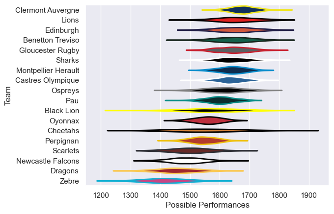
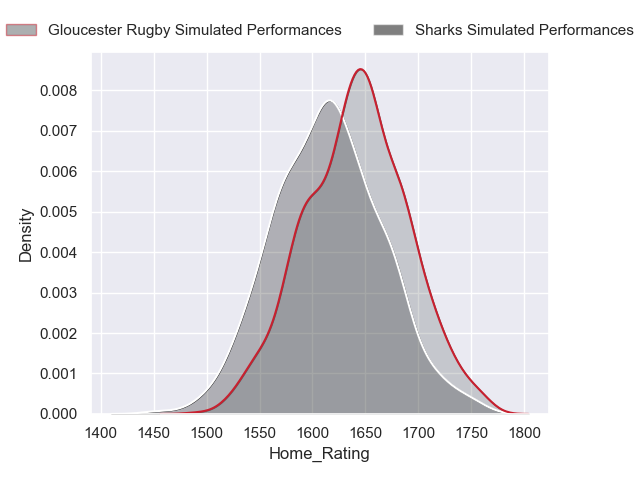
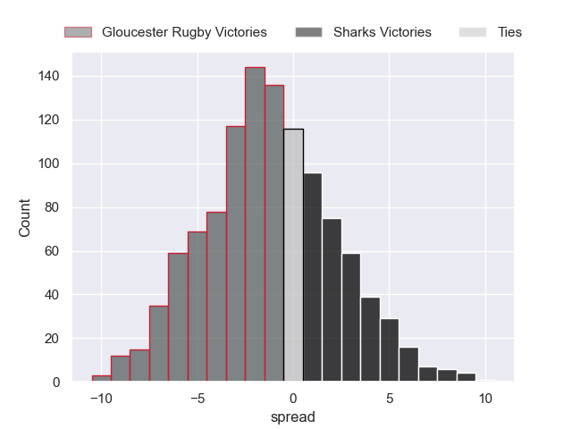

---  
title: "European Rugby Challenge Cup 2023 Status"  
date: 2024-05-24 6:00:00 -0500  
categories: model review projection  
layout: article  
aside:  
    toc: true  
---
# Current Team Rankings

# Knockout Match Predictions

## finals

### Sharks V Gloucester Rugby on 2024/05/24

Average Margin: Gloucester Rugby by 1.3

# Completed Match Review

| Match                                                 |   Result |   Lineup Prediction |   Minutes Prediction |   Club Prediction |
|:------------------------------------------------------|---------:|--------------------:|---------------------:|------------------:|
| Clermont Auvergne V Edinburgh on 2023/12/08           |       13 |                16.2 |                 14.6 |               5.4 |
| Black Lion V Gloucester Rugby on 2023/12/09           |       -5 |                17.9 |                 17   |               5.5 |
| Zebre V Cheetahs on 2023/12/09                        |      -18 |               -15.5 |                -13.6 |              -2.8 |
| Sharks V Pau on 2023/12/09                            |       40 |                13   |                 10.1 |               2.9 |
| Castres Olympique V Scarlets on 2023/12/09            |       18 |                 6.6 |                  6.5 |               9.5 |
| Ospreys V Benetton Treviso on 2023/12/09              |        9 |               -11.8 |                 -9.6 |               1.9 |
| Dragons V Oyonnax on 2023/12/09                       |       17 |                -0.9 |                  0.7 |              -2.6 |
| Perpignan V Lions on 2023/12/10                       |      -16 |               -10.7 |                 -8.9 |              -0.1 |
| Newcastle Falcons V Montpellier Herault on 2023/12/10 |       -5 |                -5.8 |                 -5.5 |              -0.1 |
| Gloucester Rugby V Clermont Auvergne on 2023/12/15    |       11 |                -6.3 |                 -5.3 |               2.7 |
| Scarlets V Black Lion on 2023/12/15                   |      -16 |               -13.7 |                -13   |              -0.2 |
| Lions V Newcastle Falcons on 2023/12/16               |       22 |                20.2 |                 18.3 |               9.7 |
| Pau V Dragons on 2023/12/16                           |        3 |                 8.8 |                  8.3 |              13.3 |
| Edinburgh V Castres Olympique on 2023/12/16           |       13 |                 0.5 |                 -0.3 |               4.1 |
| Oyonnax V Zebre on 2023/12/16                         |       -7 |                 8.6 |                  8.3 |              15.5 |
| Benetton Treviso V Perpignan on 2023/12/16            |       22 |                10.8 |                  9.5 |               8.4 |
| Montpellier Herault V Ospreys on 2023/12/17           |       33 |                 3.1 |                  4.4 |               7.3 |
| Cheetahs V Sharks on 2023/12/17                       |        3 |                 1.3 |                  2.8 |               0.8 |
| Newcastle Falcons V Benetton Treviso on 2024/01/12    |      -39 |               -16.1 |                -14.1 |              -1.2 |
| Ospreys V Perpignan on 2024/01/12                     |       22 |                 9.6 |                  7.5 |               6.6 |
| Clermont Auvergne V Scarlets on 2024/01/13            |       21 |                 2.3 |                  2.3 |              11   |
| Sharks V Oyonnax on 2024/01/13                        |       31 |                12.3 |                 11.5 |               6.7 |
| Castres Olympique V Black Lion on 2024/01/13          |       22 |                -7.5 |                 -5.2 |               3.1 |
| Zebre V Dragons on 2024/01/13                         |        3 |                -2.5 |                 -1.9 |               0.2 |
| Edinburgh V Gloucester Rugby on 2024/01/13            |       -1 |                12.7 |                 10.1 |               6.1 |
| Montpellier Herault V Lions on 2024/01/13             |       10 |                 1.8 |                  2.6 |               2.7 |
| Cheetahs V Pau on 2024/01/14                          |      -13 |                11   |                 10.3 |               3.5 |
| Gloucester Rugby V Castres Olympique on 2024/01/19    |       30 |                 0.9 |                  0   |               3.8 |
| Scarlets V Edinburgh on 2024/01/19                    |      -12 |               -17.8 |                -16.2 |              -2.4 |
| Pau V Zebre on 2024/01/20                             |        1 |                 8.2 |                  7.8 |              15.4 |
| Black Lion V Clermont Auvergne on 2024/01/20          |      -33 |                 5.5 |                  6.1 |               5.4 |
| Benetton Treviso V Montpellier Herault on 2024/01/20  |        8 |                 5.3 |                  3.8 |               3.8 |
| Oyonnax V Cheetahs on 2024/01/20                      |        1 |               -13   |                -14.1 |               3.7 |
| Perpignan V Newcastle Falcons on 2024/01/21           |       -9 |                -1.7 |                 -0.7 |               6.3 |
| Lions V Ospreys on 2024/01/21                         |      -10 |                15.2 |                 16.3 |               8.7 |
| Dragons V Sharks on 2024/01/21                        |      -20 |               -13.1 |                -11.6 |              -2.5 |
| Gloucester Rugby V Castres Olympique on 2024/04/05    |        5 |                 6   |                  4.8 |               5.5 |
| Clermont Auvergne V Cheetahs on 2024/04/06            |        5 |                 6.2 |                  5.3 |               9.5 |
| Benetton Treviso V Lions on 2024/04/06                |       10 |                 4.4 |                  3.8 |               2.5 |
| Edinburgh V Bayonne on 2024/04/06                     |       18 |                15   |                 14   |               5.4 |
| Ospreys V Sale Sharks on 2024/04/06                   |        8 |                -2.9 |                 -1.7 |               1   |
| Montpellier Herault V Ulster on 2024/04/07            |      -23 |                 2.5 |                  2.4 |               3.4 |
| Sharks V Zebre on 2024/04/07                          |       44 |                16.4 |                 14.5 |              15.4 |
| Pau V Connacht on 2024/04/07                          |      -10 |                -7   |                 -6.3 |               3.9 |
| Gloucester Rugby V Ospreys on 2024/04/12              |       10 |                 2.8 |                  2   |               6.1 |
| Clermont Auvergne V Ulster on 2024/04/13              |       39 |                -2.2 |                 -0.6 |               3.5 |
| Sharks V Edinburgh on 2024/04/13                      |        6 |                -0.7 |                 -0.7 |               4.5 |
| Benetton Treviso V Connacht on 2024/04/14             |       15 |                 3.6 |                  3.8 |               3.8 |
| Sharks V Clermont Auvergne on 2024/05/04              |        1 |                 7.1 |                  6.9 |               3.7 |
| Gloucester Rugby V Benetton Treviso on 2024/05/04     |       17 |                -7.3 |                 -5.2 |               4.2 |

# Model Accuracies

| Model | Percent Correct Predictions | Spread Error |
| ------ | ------ | ------ |
| Club Level | 80.0% | 14.0 |
| Player Level: Lineup | 64.7% | 13.5 |
| Player Level: Minutes | 64.0% | 13.5 |

