---  
title: "European Rugby Challenge Cup 2024 Status"  
date: 2024-12-13 6:00:00 -0500  
categories: model review projection  
layout: article  
aside:  
    toc: true  
---
# Current Team Rankings

# Pool Results

## Pool A

## Current Standings

| Club          |   Played |   Wins |   Point Differential |   Losing Bonus Points |   Try Bonus Points |
|:--------------|---------:|-------:|---------------------:|----------------------:|-------------------:|
| Connacht      |        1 |      1 |                   31 |                     0 |                  1 |
| Lyon          |        1 |      1 |                   11 |                     0 |                  1 |
| Cheetahs      |        1 |      0 |                    0 |                     0 |                  0 |
| Perpignan     |        1 |      0 |                    0 |                     0 |                  0 |
| Cardiff Blues |        1 |      0 |                  -11 |                     0 |                  1 |
| Zebre         |        1 |      0 |                  -31 |                     0 |                  0 |

### Projected Total Table

| Club          |   Played |   Wins |   Point Differential |   Losing Bonus Points |   Try Bonus Points |   Competition Points |
|:--------------|---------:|-------:|---------------------:|----------------------:|-------------------:|---------------------:|
| Lyon          |        4 |    2.9 |            22.4681   |                   0.7 |                2.3 |                 14.6 |
| Connacht      |        4 |    2.7 |            34.9523   |                   0.8 |                1.9 |                 13.7 |
| Perpignan     |        4 |    2.2 |            13.5268   |                   0.6 |                1.1 |                 12.3 |
| Cheetahs      |        4 |    1.4 |            -0.382806 |                   0.7 |                0.9 |                  9.2 |
| Cardiff Blues |        4 |    1.2 |           -15.8215   |                   1   |                1.5 |                  7.3 |
| Zebre         |        4 |    0.6 |           -54.7429   |                   1   |                0.6 |                  3.8 |

## Pool B

## Current Standings

| Club                |   Played |   Wins |   Point Differential |   Losing Bonus Points |   Try Bonus Points |
|:--------------------|---------:|-------:|---------------------:|----------------------:|-------------------:|
| Ospreys             |        1 |      1 |                   16 |                     0 |                  1 |
| Pau                 |        1 |      1 |                   13 |                     0 |                  1 |
| Montpellier Herault |        1 |      1 |                    4 |                     0 |                  0 |
| Dragons             |        1 |      0 |                   -4 |                     1 |                  0 |
| Newcastle Falcons   |        1 |      0 |                  -13 |                     0 |                  0 |
| Lions               |        1 |      0 |                  -16 |                     0 |                  0 |

### Projected Total Table

| Club                |   Played |   Wins |   Point Differential |   Losing Bonus Points |   Try Bonus Points |   Competition Points |
|:--------------------|---------:|-------:|---------------------:|----------------------:|-------------------:|---------------------:|
| Montpellier Herault |        4 |    3.3 |             18.0612  |                   0.5 |                1.1 |                 14.6 |
| Pau                 |        4 |    2.7 |             15.5179  |                   0.7 |                2.2 |                 13.5 |
| Ospreys             |        4 |    2.4 |             18.3672  |                   1   |                2   |                 12.6 |
| Lions               |        4 |    2.1 |              5.13796 |                   0.6 |                1.9 |                 11   |
| Newcastle Falcons   |        4 |    1.1 |            -25.1816  |                   0.8 |                0.6 |                  5.6 |
| Dragons             |        4 |    0.5 |            -31.9027  |                   1.9 |                0.5 |                  4.4 |

## Pool C

## Current Standings

| Club             |   Played |   Wins |   Point Differential |   Losing Bonus Points |   Try Bonus Points |
|:-----------------|---------:|-------:|---------------------:|----------------------:|-------------------:|
| Edinburgh        |        2 |      1 |                    7 |                     1 |                  1 |
| Gloucester Rugby |        1 |      1 |                    5 |                     0 |                  0 |
| Black Lion       |        1 |      1 |                    3 |                     0 |                  0 |
| Bayonne          |        2 |      1 |                  -11 |                     0 |                  0 |
| Scarlets         |        1 |      0 |                   -1 |                     1 |                  0 |
| Vannes           |        1 |      0 |                   -3 |                     1 |                  0 |

### Projected Total Table

| Club             |   Played |   Wins |   Point Differential |   Losing Bonus Points |   Try Bonus Points |   Competition Points |
|:-----------------|---------:|-------:|---------------------:|----------------------:|-------------------:|---------------------:|
| Edinburgh        |        5 |    3.3 |            22.9204   |                   1.5 |                1.7 |                 16.3 |
| Gloucester Rugby |        4 |    2.7 |            10.0522   |                   0.8 |                0.8 |                 12.3 |
| Black Lion       |        4 |    2.3 |            -0.523691 |                   0.9 |                0.6 |                 10.7 |
| Bayonne          |        5 |    2.3 |           -16.1675   |                   0.9 |                0.6 |                 10.7 |
| Scarlets         |        4 |    1.4 |            -5.4069   |                   1.8 |                0.6 |                  7.9 |
| Vannes           |        4 |    1   |           -10.8746   |                   2.2 |                0.6 |                  6.9 |

# Projected Playoff Results

|                      | Reach Round of Sixteen   | Reach Quarterfinals   | Reach Semifinals   | Reach Final   | Win Final   |
|:---------------------|:-------------------------|:----------------------|:-------------------|:--------------|:------------|
| Edinburgh            | 75.9 %                   | 79.4 %                | 56.2 %             | 38.4 %        | 22.1 %      |
| Montpellier Herault  | 73.1 %                   | 68.9 %                | 44.8 %             | 24.3 %        | 12.8 %      |
| Lions                | 66.0 %                   | 52.0 %                | 27.3 %             | 14.0 %        | 8.2 %       |
| Connacht             | 67.7 %                   | 63.5 %                | 33.7 %             | 18.4 %        | 7.9 %       |
| Lyon                 | 73.3 %                   | 63.3 %                | 38.2 %             | 19.3 %        | 7.1 %       |
| Black Lion           | 52.4 %                   | 33.6 %                | 16.0 %             | 8.3 %         | 4.4 %       |
| Pau                  | 71.2 %                   | 54.6 %                | 28.0 %             | 11.6 %        | 4.0 %       |
| Bath Rugby           | 15.9 %                   | 11.6 %                | 7.4 %              | 4.9 %         | 3.9 %       |
| Bulls                | 13.5 %                   | 11.2 %                | 7.6 %              | 5.2 %         | 3.8 %       |
| Gloucester Rugby     | 64.6 %                   | 46.1 %                | 22.5 %             | 9.5 %         | 3.4 %       |
| Ospreys              | 68.5 %                   | 47.5 %                | 21.0 %             | 8.7 %         | 3.4 %       |
| Bristol Rugby        | 24.7 %                   | 22.6 %                | 10.7 %             | 4.7 %         | 3.3 %       |
| Bayonne              | 54.8 %                   | 33.2 %                | 15.2 %             | 5.3 %         | 2.1 %       |
| Harlequins           | 21.7 %                   | 15.7 %                | 5.7 %              | 2.9 %         | 2.1 %       |
| Perpignan            | 66.4 %                   | 40.1 %                | 14.1 %             | 6.0 %         | 1.4 %       |
| Stormers             | 20.4 %                   | 11.8 %                | 4.8 %              | 1.9 %         | 1.0 %       |
| Cheetahs             | 53.6 %                   | 18.7 %                | 5.7 %              | 2.2 %         | 0.9 %       |
| Saracens             | 2.7 %                    | 2.1 %                 | 1.2 %              | 1.0 %         | 0.9 %       |
| Ulster               | 21.3 %                   | 11.2 %                | 3.9 %              | 1.1 %         | 0.8 %       |
| Racing 92            | 20.1 %                   | 9.6 %                 | 4.2 %              | 1.4 %         | 0.7 %       |
| La Rochelle          | 4.3 %                    | 3.5 %                 | 1.8 %              | 1.1 %         | 0.7 %       |
| Castres Olympique    | 35.9 %                   | 16.4 %                | 3.9 %              | 1.4 %         | 0.6 %       |
| Toulon               | 4.5 %                    | 3.2 %                 | 1.5 %              | 1.0 %         | 0.6 %       |
| Clermont Auvergne    | 16.8 %                   | 11.4 %                | 4.6 %              | 0.9 %         | 0.6 %       |
| Leicester Tigers     | 15.5 %                   | 9.3 %                 | 2.9 %              | 1.4 %         | 0.5 %       |
| Exeter Chiefs        | 16.8 %                   | 9.1 %                 | 3.4 %              | 1.1 %         | 0.5 %       |
| Bordeaux Begles      | 1.4 %                    | 1.0 %                 | 0.7 %              | 0.6 %         | 0.5 %       |
| Munster              | 4.5 %                    | 3.5 %                 | 1.3 %              | 0.6 %         | 0.4 %       |
| Northampton Saints   | 4.2 %                    | 3.7 %                 | 1.3 %              | 0.5 %         | 0.4 %       |
| Glasgow Warriors     | 1.5 %                    | 1.5 %                 | 0.7 %              | 0.3 %         | 0.3 %       |
| Sharks               | 19.3 %                   | 8.6 %                 | 2.7 %              | 0.6 %         | 0.2 %       |
| Stade Francais Paris | 13.9 %                   | 5.3 %                 | 1.6 %              | 0.4 %         | 0.2 %       |
| Vannes               | 23.2 %                   | 4.2 %                 | 1.0 %              | 0.1 %         | 0.1 %       |
| Leinster             | 0.2 %                    | 0.3 %                 | 0.2 %              | 0.1 %         | 0.1 %       |
| Stade Toulousain     | 0.1 %                    | 0.1 %                 | 0.1 %              | 0.1 %         | 0.1 %       |
| Cardiff Blues        | 35.0 %                   | 6.3 %                 | 1.4 %              | 0.3 %         | 0.0 %       |
| Scarlets             | 37.3 %                   | 7.1 %                 | 1.1 %              | 0.2 %         | 0.0 %       |
| Benetton Treviso     | 10.8 %                   | 3.4 %                 | 0.8 %              | 0.1 %         | 0.0 %       |
| Sale Sharks          | 4.8 %                    | 2.8 %                 | 0.7 %              | 0.1 %         | 0.0 %       |
| Newcastle Falcons    | 9.9 %                    | 1.4 %                 | 0.1 %              | 0.0 %         | 0.0 %       |
| Zebre                | 4.5 %                    | 0.7 %                 | 0.0 %              | 0.0 %         | 0.0 %       |
| Dragons              | 7.6 %                    | 0.5 %                 | 0.0 %              | 0.0 %         | 0.0 %       |
| chall SS_2           | 0.1 %                    | 0.0 %                 | 0.0 %              | 0.0 %         | 0.0 %       |
| chall SS_5           | 0.1 %                    | 0.0 %                 | 0.0 %              | 0.0 %         | 0.0 %       |

# Pool Match Predictions

## Pool A

### Cardiff Blues V Cheetahs on 2024/12/14

Average Margin: Cardiff Blues by 3.6

Average Scoreline: 21-18

### Zebre V Lyon on 2024/12/14

Average Margin: Lyon by 7.7

Average Scoreline: 34-26

### Perpignan V Connacht on 2024/12/15

Average Margin: Perpignan by 1.6

Average Scoreline: 27-26

### Connacht V Lyon on 2025/01/11

Average Margin: Connacht by 3.8

Average Scoreline: 31-28

### Perpignan V Cardiff Blues on 2025/01/11

Average Margin: Perpignan by 6.7

Average Scoreline: 30-23

### Cheetahs V Zebre on 2025/01/12

Average Margin: Cheetahs by 10.8

Average Scoreline: 28-17

### Cardiff Blues V Connacht on 2025/01/17

Average Margin: Connacht by 1.7

Average Scoreline: 29-27

### Lyon V Cheetahs on 2025/01/18

Average Margin: Lyon by 7.6

Average Scoreline: 29-21

### Zebre V Perpignan on 2025/01/19

Average Margin: Perpignan by 5.3

Average Scoreline: 35-30

## Pool B

### Lions V Pau on 2024/12/14

Average Margin: Lions by 7.0

Average Scoreline: 30-23

### Montpellier Herault V Ospreys on 2024/12/14

Average Margin: Montpellier Herault by 5.7

Average Scoreline: 29-23

### Newcastle Falcons V Dragons on 2024/12/15

Average Margin: Newcastle Falcons by 5.9

Average Scoreline: 22-17

### Montpellier Herault V Lions on 2025/01/11

Average Margin: Montpellier Herault by 2.0

Average Scoreline: 32-30

### Ospreys V Newcastle Falcons on 2025/01/11

Average Margin: Ospreys by 11.6

Average Scoreline: 31-20

### Dragons V Pau on 2025/01/12

Average Margin: Pau by 5.9

Average Scoreline: 30-24

### Newcastle Falcons V Montpellier Herault on 2025/01/17

Average Margin: Montpellier Herault by 6.4

Average Scoreline: 33-27

### Pau V Ospreys on 2025/01/18

Average Margin: Pau by 3.6

Average Scoreline: 33-30

### Lions V Dragons on 2025/01/18

Average Margin: Lions by 16.1

Average Scoreline: 36-19

## Pool C

### Edinburgh V Bayonne on 2024/12/13

Average Margin: Edinburgh by 5.7

Average Scoreline: 29-23

### Vannes V Gloucester Rugby on 2024/12/14

Average Margin: Gloucester Rugby by 0.7

Average Scoreline: 25-24

### Scarlets V Black Lion on 2024/12/15

Average Margin: Scarlets by 0.2

Average Scoreline: 21-21

### Gloucester Rugby V Scarlets on 2025/01/10

Average Margin: Gloucester Rugby by 8.3

Average Scoreline: 26-17

### Black Lion V Bayonne on 2025/01/11

Average Margin: Black Lion by 3.4

Average Scoreline: 25-21

### Vannes V Edinburgh on 2025/01/11

Average Margin: Edinburgh by 3.5

Average Scoreline: 23-20

### Scarlets V Vannes on 2025/01/18

Average Margin: Scarlets by 3.7

Average Scoreline: 27-23

### Edinburgh V Black Lion on 2025/01/19

Average Margin: Edinburgh by 6.8

Average Scoreline: 25-19

### Bayonne V Gloucester Rugby on 2025/01/19

Average Margin: Bayonne by 4.0

Average Scoreline: 27-23

# Knockout Match Predictions

## Sixteens

### Bayonne V Lions on 2025/04/04

Average Margin: Bayonne by 1.1

### Black Lion V Leicester Tigers on 2025/04/04

Average Margin: Black Lion by 0.1

### Ospreys V Bath Rugby on 2025/04/04

Average Margin: Bath Rugby by 1.4

### Connacht V Racing 92 on 2025/04/04

Average Margin: Connacht by 0.2

### Edinburgh V Benetton Treviso on 2025/04/04

Average Margin: Edinburgh by 5.7

### Perpignan V Black Lion on 2025/04/04

Average Margin: Perpignan by 3.8

### Connacht V Stormers on 2025/04/04

Average Margin: Connacht by 2.9

### Pau V Stade Francais Paris on 2025/04/04

Average Margin: Pau by 3.4

### Black Lion V Scarlets on 2025/04/04

Average Margin: Black Lion by 4.5

### Montpellier Herault V Bath Rugby on 2025/04/04

Average Margin: Bath Rugby by 1.0

### Ospreys V Scarlets on 2025/04/04

Average Margin: Ospreys by 4.6

### Connacht V Bristol Rugby on 2025/04/04

Average Margin: Connacht by 1.0

### Black Lion V Harlequins on 2025/04/04

Average Margin: Harlequins by 1.8

### Montpellier Herault V Northampton Saints on 2025/04/04

Average Margin: Montpellier Herault by 1.8

### Lyon V Bulls on 2025/04/04

Average Margin: Bulls by 1.4

### Gloucester Rugby V Exeter Chiefs on 2025/04/04

Average Margin: Gloucester Rugby by 1.1

### Gloucester Rugby V Edinburgh on 2025/04/04

Average Margin: Gloucester Rugby by 2.4

### Ospreys V Bayonne on 2025/04/04

Average Margin: Ospreys by 2.8

### Pau V Benetton Treviso on 2025/04/04

Average Margin: Pau by 7.0

### Lions V Ospreys on 2025/04/04

Average Margin: Lions by 3.1

### Connacht V Cardiff Blues on 2025/04/04

Average Margin: Connacht by 8.1

### Edinburgh V Exeter Chiefs on 2025/04/04

Average Margin: Edinburgh by 5.4

### Montpellier Herault V Newcastle Falcons on 2025/04/04

Average Margin: Montpellier Herault by 7.2

### Bayonne V Harlequins on 2025/04/04

Average Margin: Bayonne by 1.8

### Connacht V Bath Rugby on 2025/04/04

Average Margin: Bath Rugby by 0.9

### Perpignan V Munster on 2025/04/04

Average Margin: Munster by 0.3

### Gloucester Rugby V Pau on 2025/04/04

Average Margin: Gloucester Rugby by 5.6

### Edinburgh V Bath Rugby on 2025/04/04

Average Margin: Bath Rugby by 1.2

### Lions V Leicester Tigers on 2025/04/04

Average Margin: Lions by 5.2

### Black Lion V Cardiff Blues on 2025/04/04

Average Margin: Black Lion by 11.1

### Lions V Edinburgh on 2025/04/04

Average Margin: Lions by 6.2

### Lyon V Racing 92 on 2025/04/04

Average Margin: Lyon by 4.0

### Cheetahs V Connacht on 2025/04/04

Average Margin: Connacht by 2.0

### Lyon V La Rochelle on 2025/04/04

Average Margin: La Rochelle by 0.8

### Bayonne V Ospreys on 2025/04/04

Average Margin: Bayonne by 6.7

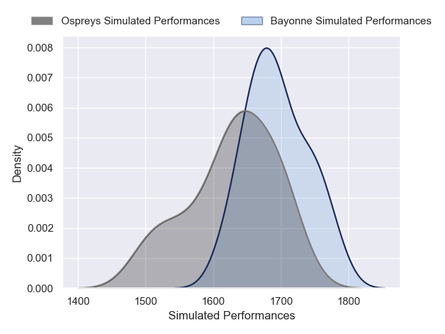
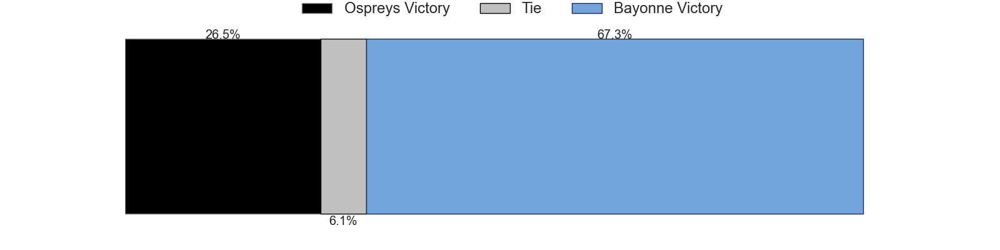
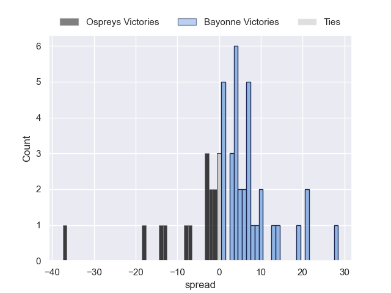

### Edinburgh V Dragons on 2025/04/04

Average Margin: Edinburgh by 14.1

### Perpignan V Benetton Treviso on 2025/04/04

Average Margin: Perpignan by 1.6

### Gloucester Rugby V Harlequins on 2025/04/04

Average Margin: Harlequins by 0.3

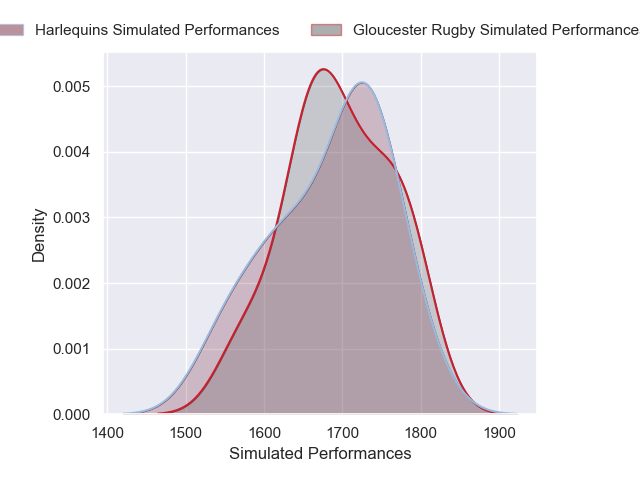
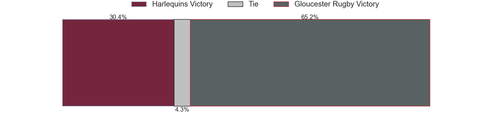
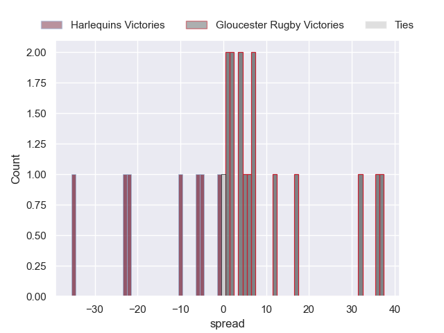

### Scarlets V Sharks on 2025/04/04

Average Margin: Sharks by 4.0

### Black Lion V Benetton Treviso on 2025/04/04

Average Margin: Black Lion by 7.7

### Perpignan V Vannes on 2025/04/04

Average Margin: Perpignan by 8.7

### Cheetahs V Ospreys on 2025/04/04

Average Margin: Cheetahs by 11.5

### Gloucester Rugby V Castres Olympique on 2025/04/04

Average Margin: Gloucester Rugby by 4.2

### Connacht V Lyon on 2025/04/04

Average Margin: Connacht by 5.3

### Black Lion V Perpignan on 2025/04/04

Average Margin: Black Lion by 10.4

### Perpignan V Toulon on 2025/04/04

Average Margin: Perpignan by 2.7

### Pau V Sharks on 2025/04/04

Average Margin: Pau by 2.1

### Lions V Montpellier Herault on 2025/04/04

Average Margin: Lions by 7.1

### Bayonne V Benetton Treviso on 2025/04/04

Average Margin: Bayonne by 7.9

### Gloucester Rugby V Northampton Saints on 2025/04/04

Average Margin: Northampton Saints by 2.7

### Connacht V Ulster on 2025/04/04

Average Margin: Ulster by 0.5

### Ospreys V Bulls on 2025/04/04

Average Margin: Bulls by 6.1

### Bayonne V Stormers on 2025/04/04

Average Margin: Bayonne by 1.3

### Pau V Newcastle Falcons on 2025/04/04

Average Margin: Pau by 9.7

### Black Lion V Gloucester Rugby on 2025/04/04

Average Margin: Black Lion by 6.1

### Lions V Bulls on 2025/04/04

Average Margin: Bulls by 0.9

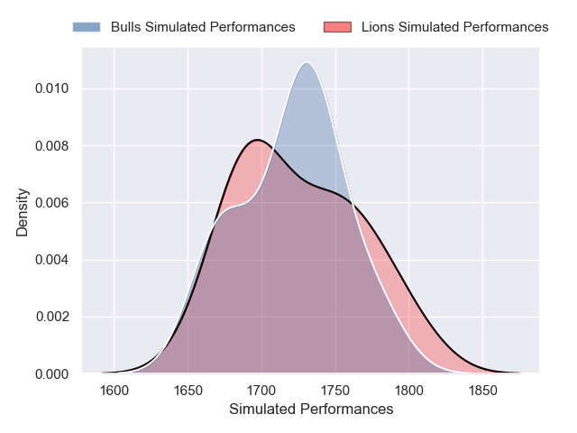

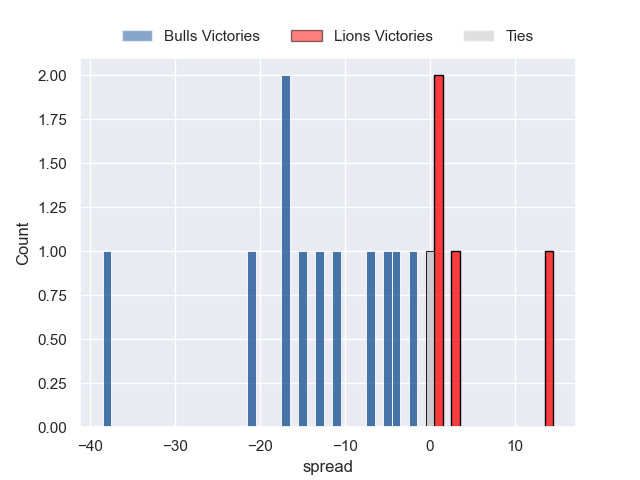

### Montpellier Herault V Racing 92 on 2025/04/04

Average Margin: Montpellier Herault by 4.1

### Bayonne V Bristol Rugby on 2025/04/04

Average Margin: Bristol Rugby by 1.6

### Pau V La Rochelle on 2025/04/04

Average Margin: La Rochelle by 8.0

### Edinburgh V Bulls on 2025/04/04

Average Margin: Bulls by 1.1

### Edinburgh V Harlequins on 2025/04/04

Average Margin: Edinburgh by 1.0

### Bayonne V Ulster on 2025/04/04

Average Margin: Bayonne by 5.4

### Edinburgh V Stormers on 2025/04/04

Average Margin: Edinburgh by 2.3

### Perpignan V Bayonne on 2025/04/04

Average Margin: Perpignan by 1.0

### Lyon V Stade Francais Paris on 2025/04/04

Average Margin: Lyon by 0.8

### Lions V Bristol Rugby on 2025/04/04

Average Margin: Bristol Rugby by 0.7

### Pau V Bayonne on 2025/04/04

Average Margin: Pau by 3.5

### Black Lion V Ospreys on 2025/04/04

Average Margin: Black Lion by 4.4

### Connacht V Sharks on 2025/04/04

Average Margin: Connacht by 4.8

### Ospreys V Montpellier Herault on 2025/04/04

Average Margin: Ospreys by 4.0

### Connacht V Stade Francais Paris on 2025/04/04

Average Margin: Connacht by 10.2

### Perpignan V Sharks on 2025/04/04

Average Margin: Sharks by 0.4

### Bayonne V Bath Rugby on 2025/04/04

Average Margin: Bath Rugby by 3.5

### Montpellier Herault V Harlequins on 2025/04/04

Average Margin: Harlequins by 0.1

### Lyon V Ulster on 2025/04/04

Average Margin: Lyon by 2.4

### Perpignan V Lions on 2025/04/04

Average Margin: Perpignan by 1.4

### Perpignan V Racing 92 on 2025/04/04

Average Margin: Perpignan by 0.5

### Black Lion V Ulster on 2025/04/04

Average Margin: Black Lion by 1.4

### Edinburgh V Bristol Rugby on 2025/04/04

Average Margin: Edinburgh by 0.7

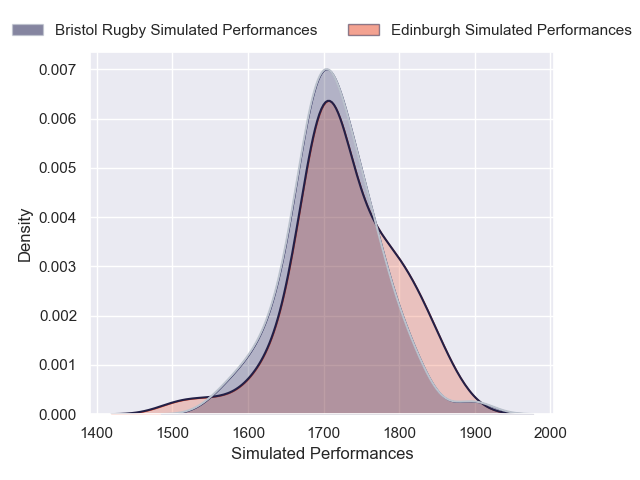

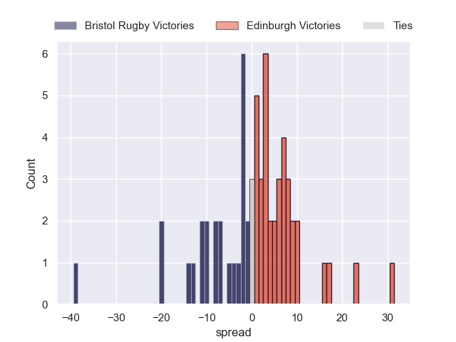

### Ospreys V Pau on 2025/04/04

Average Margin: Ospreys by 8.0

### Edinburgh V Cheetahs on 2025/04/04

Average Margin: Edinburgh by 9.7

### Lions V Castres Olympique on 2025/04/04

Average Margin: Lions by 6.0

### Montpellier Herault V Exeter Chiefs on 2025/04/04

Average Margin: Montpellier Herault by 1.8

### Gloucester Rugby V Scarlets on 2025/04/04

Average Margin: Gloucester Rugby by 8.6

### Ospreys V Stormers on 2025/04/04

Average Margin: Ospreys by 1.8

### Gloucester Rugby V Perpignan on 2025/04/04

Average Margin: Gloucester Rugby by 7.7

### Connacht V Ospreys on 2025/04/04

Average Margin: Connacht by 5.0

### Lions V Racing 92 on 2025/04/04

Average Margin: Lions by 6.8

### Cheetahs V Bristol Rugby on 2025/04/04

Average Margin: Bristol Rugby by 5.6

### Pau V Leicester Tigers on 2025/04/04

Average Margin: Pau by 4.8

### Gloucester Rugby V Black Lion on 2025/04/04

Average Margin: Gloucester Rugby by 4.9

### Lions V Munster on 2025/04/04

Average Margin: Lions by 5.2

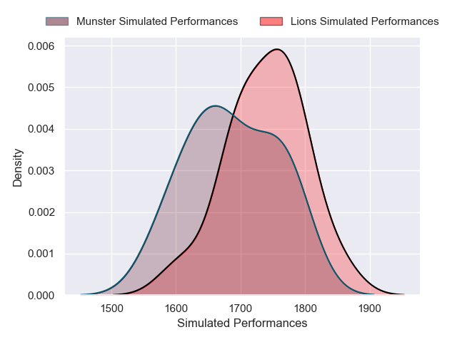
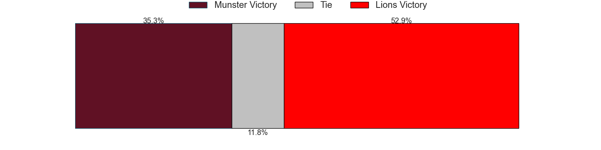
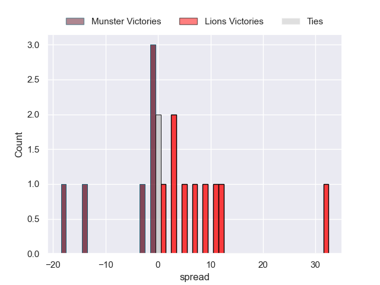

### Edinburgh V Racing 92 on 2025/04/04

Average Margin: Edinburgh by 7.1

### Lyon V Ospreys on 2025/04/04

Average Margin: Lyon by 4.8

### Lyon V Bayonne on 2025/04/04

Average Margin: Lyon by 1.9

### Scarlets V Exeter Chiefs on 2025/04/04

Average Margin: Exeter Chiefs by 5.2

### Lions V Stormers on 2025/04/04

Average Margin: Lions by 5.6

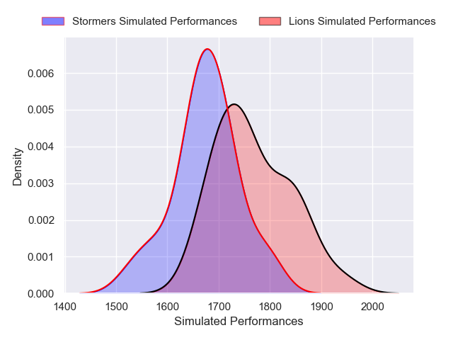
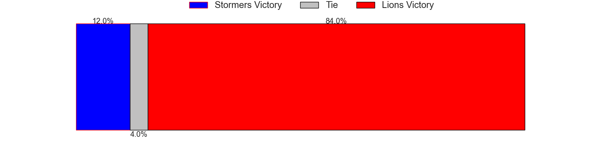
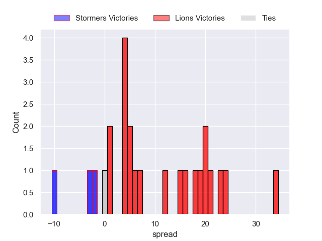

### Pau V Gloucester Rugby on 2025/04/04

Average Margin: Pau by 2.6

### Perpignan V Connacht on 2025/04/04

Average Margin: Perpignan by 2.1

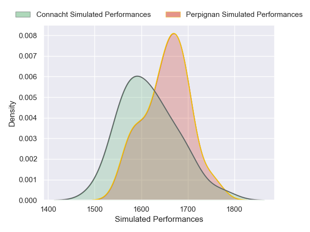

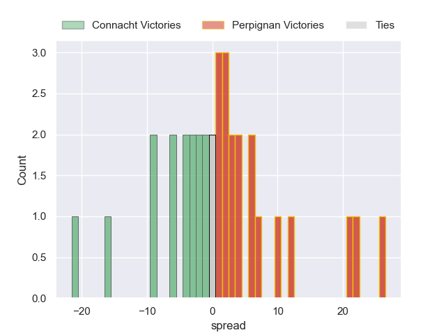

### Black Lion V Bulls on 2025/04/04

Average Margin: Bulls by 4.5

### Pau V Ulster on 2025/04/04

Average Margin: Pau by 0.2

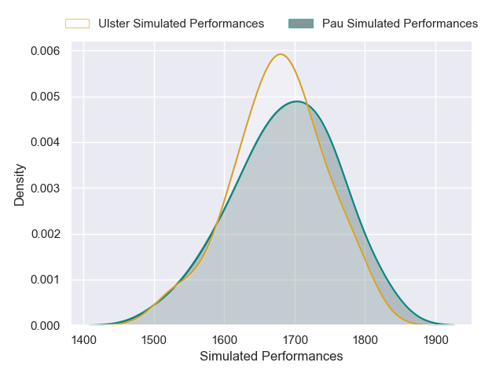

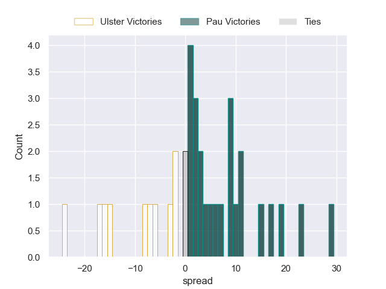

### Perpignan V Scarlets on 2025/04/04

Average Margin: Perpignan by 6.9

### Edinburgh V Newcastle Falcons on 2025/04/04

Average Margin: Edinburgh by 14.2

### Gloucester Rugby V Lyon on 2025/04/04

Average Margin: Gloucester Rugby by 3.4

### Connacht V Pau on 2025/04/04

Average Margin: Connacht by 5.2

### Cheetahs V Pau on 2025/04/04

Average Margin: Cheetahs by 4.5

### Perpignan V Cheetahs on 2025/04/04

Average Margin: Perpignan by 4.1

### Ospreys V Benetton Treviso on 2025/04/04

Average Margin: Ospreys by 4.1

### Pau V Stormers on 2025/04/04

Average Margin: Pau by 0.5

### Bayonne V Stade Francais Paris on 2025/04/04

Average Margin: Stade Francais Paris by 2.1

### Bayonne V Cheetahs on 2025/04/04

Average Margin: Bayonne by 8.9

### Ospreys V Gloucester Rugby on 2025/04/04

Average Margin: Ospreys by 2.0

### Perpignan V Bristol Rugby on 2025/04/04

Average Margin: Bristol Rugby by 4.9

### Ospreys V Perpignan on 2025/04/04

Average Margin: Ospreys by 8.3

### Montpellier Herault V Ulster on 2025/04/04

Average Margin: Montpellier Herault by 4.6

### Connacht V Vannes on 2025/04/04

Average Margin: Connacht by 10.9

### Pau V Lyon on 2025/04/04

Average Margin: Pau by 4.9

### Cheetahs V Bath Rugby on 2025/04/04

Average Margin: Bath Rugby by 4.8

### Edinburgh V Gloucester Rugby on 2025/04/04

Average Margin: Edinburgh by 4.6

### Black Lion V Exeter Chiefs on 2025/04/04

Average Margin: Black Lion by 7.5

### Lions V Harlequins on 2025/04/04

Average Margin: Lions by 3.8

### Montpellier Herault V Connacht on 2025/04/04

Average Margin: Montpellier Herault by 4.3

### Ospreys V Leicester Tigers on 2025/04/04

Average Margin: Ospreys by 1.7

### Connacht V Benetton Treviso on 2025/04/04

Average Margin: Connacht by 7.6

### Cheetahs V Leicester Tigers on 2025/04/04

Average Margin: Cheetahs by 1.4

### Pau V Edinburgh on 2025/04/04

Average Margin: Edinburgh by 0.3

### Connacht V Montpellier Herault on 2025/04/04

Average Margin: Connacht by 1.2

### Montpellier Herault V Sale Sharks on 2025/04/04

Average Margin: Montpellier Herault by 2.9

### Connacht V Northampton Saints on 2025/04/04

Average Margin: Connacht by 1.0

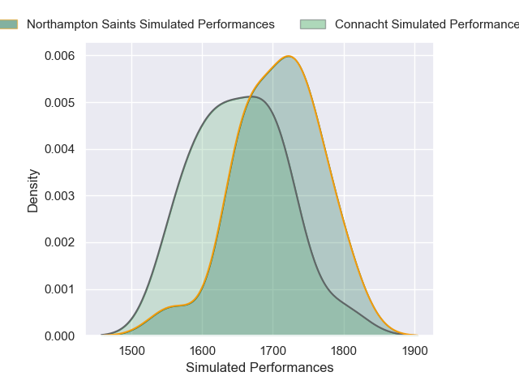

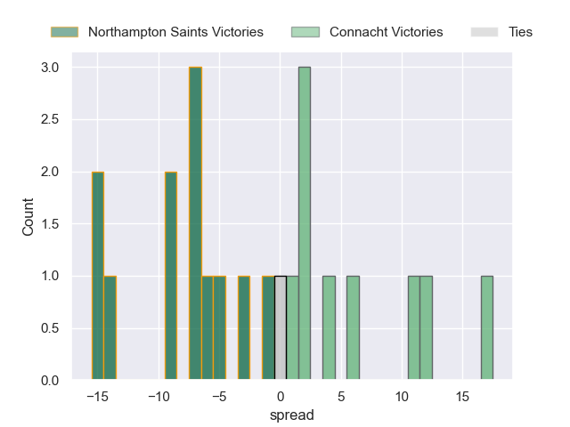

### Montpellier Herault V Benetton Treviso on 2025/04/04

Average Margin: Montpellier Herault by 8.2

### Bayonne V Clermont Auvergne on 2025/04/04

Average Margin: Clermont Auvergne by 0.2

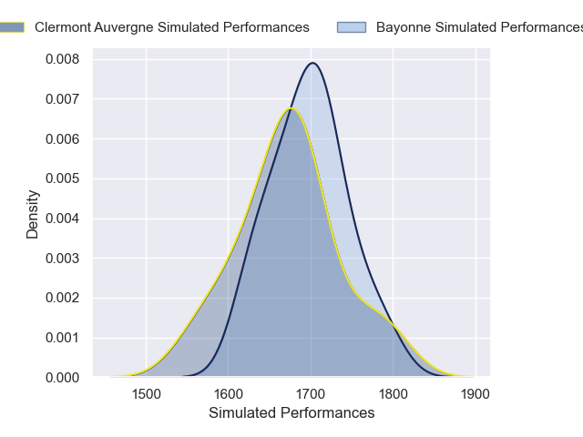

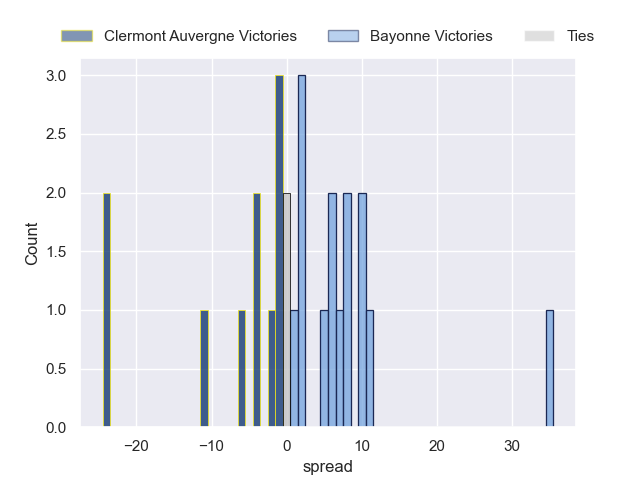

### Bayonne V Edinburgh on 2025/04/04

Average Margin: Bayonne by 3.7

### Lions V Black Lion on 2025/04/04

Average Margin: Lions by 8.2

### Cheetahs V Lyon on 2025/04/04

Average Margin: Cheetahs by 7.8

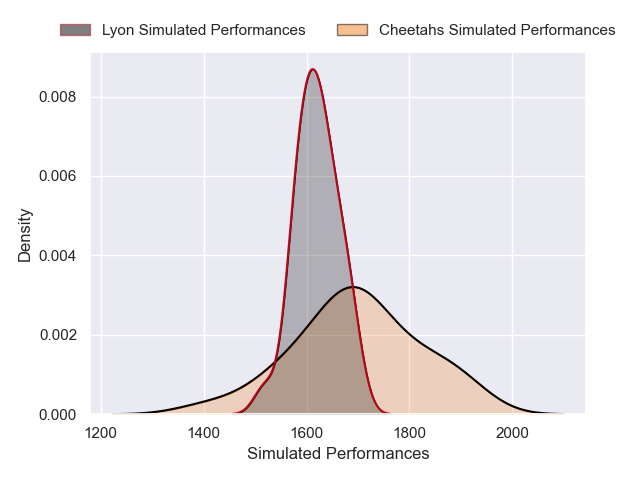

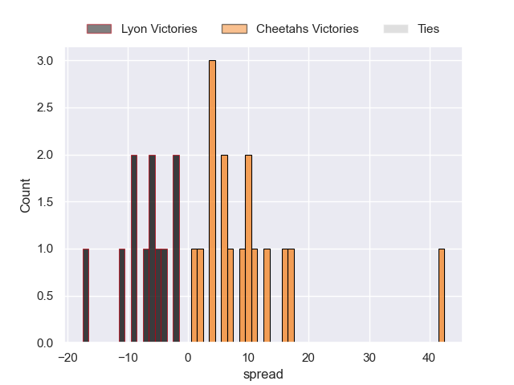

### Lyon V Benetton Treviso on 2025/04/04

Average Margin: Lyon by 1.3

### Lions V La Rochelle on 2025/04/04

Average Margin: Lions by 3.6

### Lions V Connacht on 2025/04/04

Average Margin: Lions by 8.4

### Lyon V Toulon on 2025/04/04

Average Margin: Toulon by 3.9

### Bayonne V Bulls on 2025/04/04

Average Margin: Bayonne by 1.4

### Connacht V Edinburgh on 2025/04/04

Average Margin: Connacht by 2.4

### Montpellier Herault V Toulon on 2025/04/04

Average Margin: Toulon by 5.0

### Cardiff Blues V Bristol Rugby on 2025/04/04

Average Margin: Bristol Rugby by 3.8

### Connacht V La Rochelle on 2025/04/04

Average Margin: Connacht by 1.9

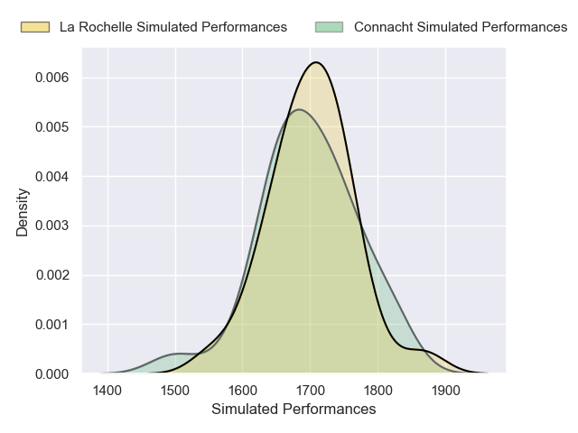

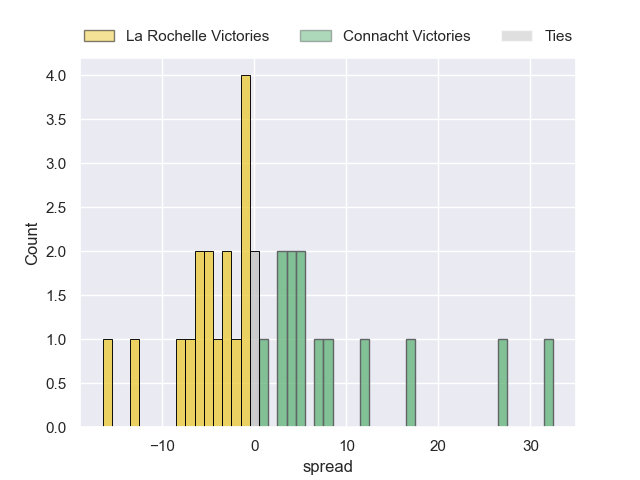

### Cheetahs V Ulster on 2025/04/04

Average Margin: Ulster by 0.5

### Bayonne V Perpignan on 2025/04/04

Average Margin: Bayonne by 7.0

### Bayonne V Gloucester Rugby on 2025/04/04

Average Margin: Bayonne by 6.7

### Lions V Cardiff Blues on 2025/04/04

Average Margin: Lions by 11.1

### Gloucester Rugby V La Rochelle on 2025/04/04

Average Margin: La Rochelle by 0.4

### Pau V Vannes on 2025/04/04

Average Margin: Pau by 12.3

### Lions V Perpignan on 2025/04/04

Average Margin: Lions by 11.9

### Pau V Connacht on 2025/04/04

Average Margin: Pau by 3.1

### Black Lion V Castres Olympique on 2025/04/04

Average Margin: Black Lion by 4.4

### Ospreys V Munster on 2025/04/04

Average Margin: Munster by 1.0

### Black Lion V Connacht on 2025/04/04

Average Margin: Black Lion by 4.9

### Edinburgh V Zebre on 2025/04/04

Average Margin: Edinburgh by 8.9

### Gloucester Rugby V Clermont Auvergne on 2025/04/04

Average Margin: Gloucester Rugby by 1.1

### Edinburgh V Leicester Tigers on 2025/04/04

Average Margin: Edinburgh by 5.0

### Lyon V Castres Olympique on 2025/04/04

Average Margin: Lyon by 2.5

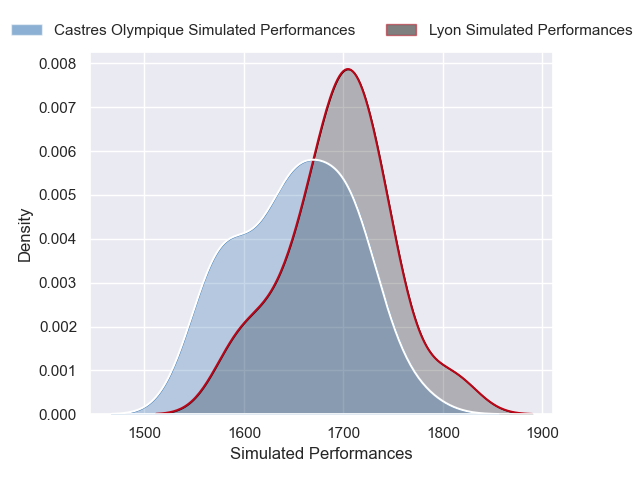

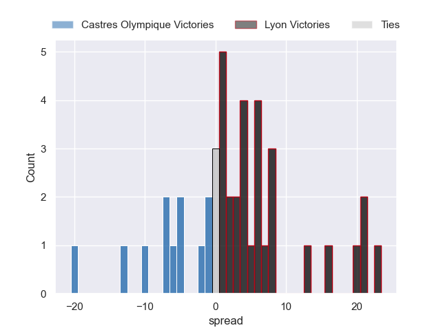

### Pau V Bulls on 2025/04/04

Average Margin: Bulls by 3.2

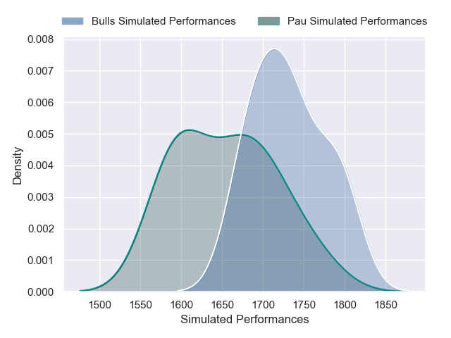

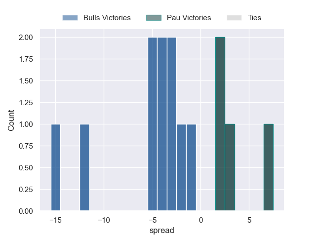

### Cheetahs V Lions on 2025/04/04

Average Margin: Lions by 4.5

### Edinburgh V Munster on 2025/04/04

Average Margin: Edinburgh by 3.2

### Montpellier Herault V Stade Francais Paris on 2025/04/04

Average Margin: Montpellier Herault by 4.0

### Ospreys V Sale Sharks on 2025/04/04

Average Margin: Ospreys by 4.1

### Cheetahs V Harlequins on 2025/04/04

Average Margin: Harlequins by 1.2

### Montpellier Herault V Black Lion on 2025/04/04

Average Margin: Montpellier Herault by 5.0

### Gloucester Rugby V Stade Francais Paris on 2025/04/04

Average Margin: Gloucester Rugby by 1.9

### Montpellier Herault V Saracens on 2025/04/04

Average Margin: Saracens by 5.9

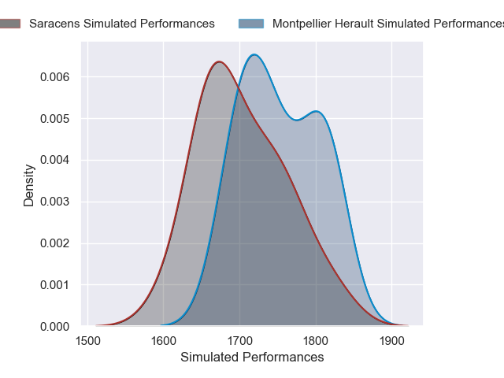

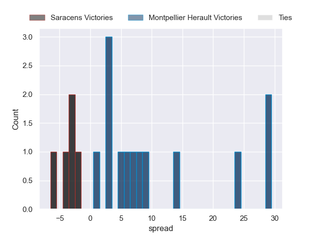

### Black Lion V Clermont Auvergne on 2025/04/04

Average Margin: Black Lion by 1.7

### Black Lion V Pau on 2025/04/04

Average Margin: Black Lion by 12.7

### Ospreys V Edinburgh on 2025/04/04

Average Margin: Ospreys by 2.5

### Vannes V Harlequins on 2025/04/04

Average Margin: Vannes by 0.7

### Cheetahs V Exeter Chiefs on 2025/04/04

Average Margin: Exeter Chiefs by 4.4

### Lyon V Clermont Auvergne on 2025/04/04

Average Margin: Clermont Auvergne by 3.4

### Bayonne V Scarlets on 2025/04/04

Average Margin: Bayonne by 11.1

### Edinburgh V Sale Sharks on 2025/04/04

Average Margin: Edinburgh by 6.9

### Bayonne V Exeter Chiefs on 2025/04/04

Average Margin: Bayonne by 1.6

### Scarlets V Castres Olympique on 2025/04/04

Average Margin: Castres Olympique by 4.4

### Lyon V Edinburgh on 2025/04/04

Average Margin: Lyon by 0.8

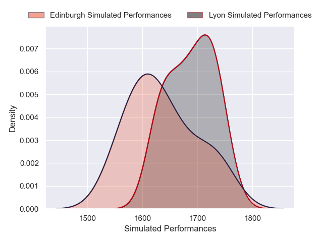
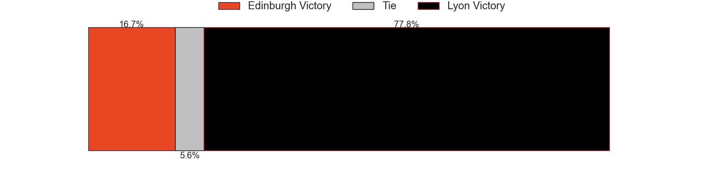
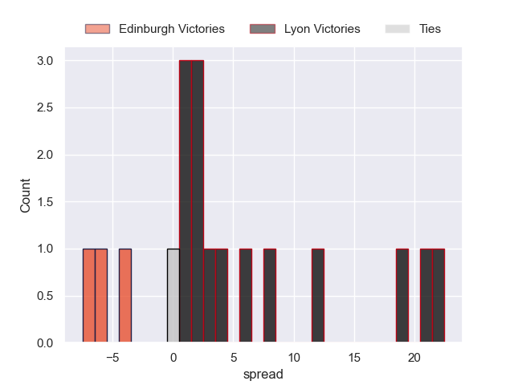

### Pau V Clermont Auvergne on 2025/04/04

Average Margin: Pau by 3.0

### Montpellier Herault V Sharks on 2025/04/04

Average Margin: Montpellier Herault by 3.0

### Montpellier Herault V Munster on 2025/04/04

Average Margin: Munster by 1.1

### Montpellier Herault V Perpignan on 2025/04/04

Average Margin: Montpellier Herault by 7.1

### Black Lion V Lyon on 2025/04/04

Average Margin: Black Lion by 5.8

### Cheetahs V Perpignan on 2025/04/04

Average Margin: Cheetahs by 3.5

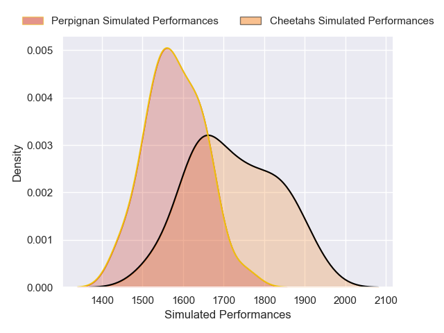
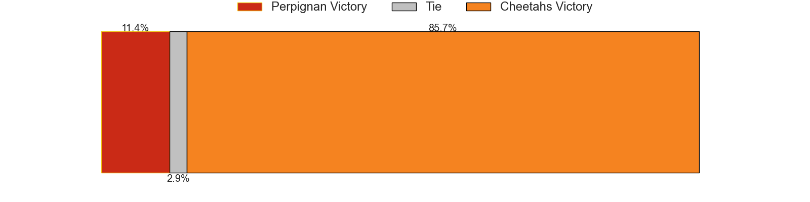
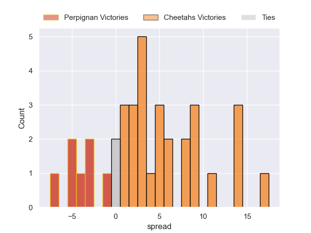

### Black Lion V La Rochelle on 2025/04/04

Average Margin: Black Lion by 1.3

### Black Lion V Northampton Saints on 2025/04/04

Average Margin: Northampton Saints by 0.5

### Black Lion V Montpellier Herault on 2025/04/04

Average Margin: Black Lion by 6.2

### Perpignan V Gloucester Rugby on 2025/04/04

Average Margin: Perpignan by 0.3

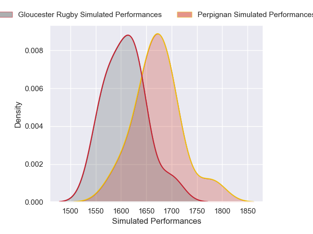

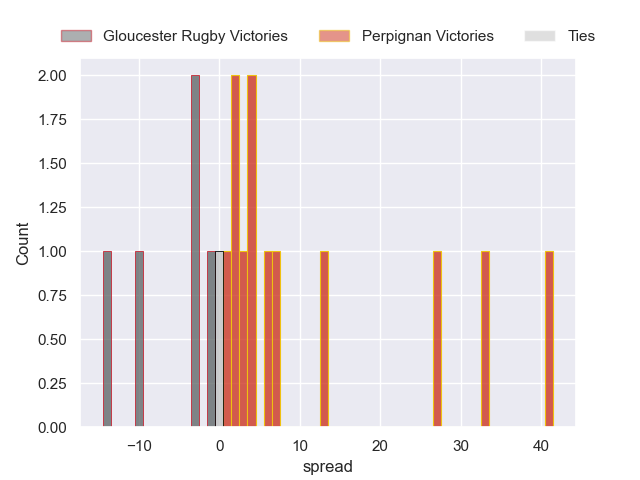

### Bayonne V Montpellier Herault on 2025/04/04

Average Margin: Bayonne by 6.4

### Lions V Northampton Saints on 2025/04/04

Average Margin: Lions by 3.7

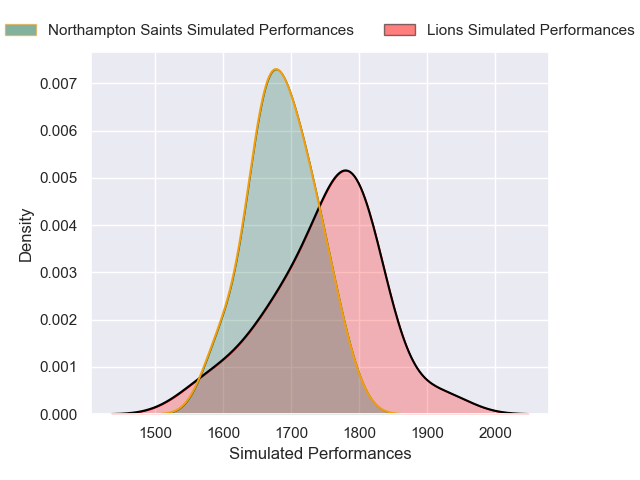

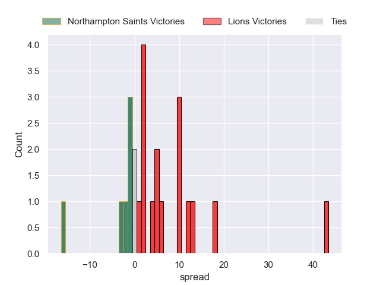

### Edinburgh V Sharks on 2025/04/04

Average Margin: Edinburgh by 7.3

### Perpignan V Montpellier Herault on 2025/04/04

Average Margin: Montpellier Herault by 3.5

### Lyon V Sharks on 2025/04/04

Average Margin: Sharks by 0.6

### Perpignan V Northampton Saints on 2025/04/04

Average Margin: Northampton Saints by 3.2

### Montpellier Herault V La Rochelle on 2025/04/04

Average Margin: La Rochelle by 3.6

### Lions V Pau on 2025/04/04

Average Margin: Lions by 9.7

### Gloucester Rugby V Lions on 2025/04/04

Average Margin: Gloucester Rugby by 1.0

### Perpignan V Lyon on 2025/04/04

Average Margin: Perpignan by 2.0

### Bayonne V Pau on 2025/04/04

Average Margin: Bayonne by 0.2

### Perpignan V Harlequins on 2025/04/04

Average Margin: Harlequins by 1.8

### Edinburgh V Lions on 2025/04/04

Average Margin: Edinburgh by 2.9

### Pau V Racing 92 on 2025/04/04

Average Margin: Pau by 3.1

### Perpignan V Castres Olympique on 2025/04/04

Average Margin: Perpignan by 1.3

### Ospreys V Clermont Auvergne on 2025/04/04

Average Margin: Clermont Auvergne by 0.2

### Ospreys V Stade Francais Paris on 2025/04/04

Average Margin: Ospreys by 2.4

### Black Lion V Sharks on 2025/04/04

Average Margin: Black Lion by 5.6

### Lions V Clermont Auvergne on 2025/04/04

Average Margin: Lions by 5.0

### Gloucester Rugby V Cardiff Blues on 2025/04/04

Average Margin: Gloucester Rugby by 11.7

### Montpellier Herault V Zebre on 2025/04/04

Average Margin: Montpellier Herault by 18.3

### Ospreys V Ulster on 2025/04/04

Average Margin: Ospreys by 2.1

### Lyon V Gloucester Rugby on 2025/04/04

Average Margin: Lyon by 4.8

### Edinburgh V Bayonne on 2025/04/04

Average Margin: Edinburgh by 6.9

### Connacht V Bayonne on 2025/04/04

Average Margin: Connacht by 3.1

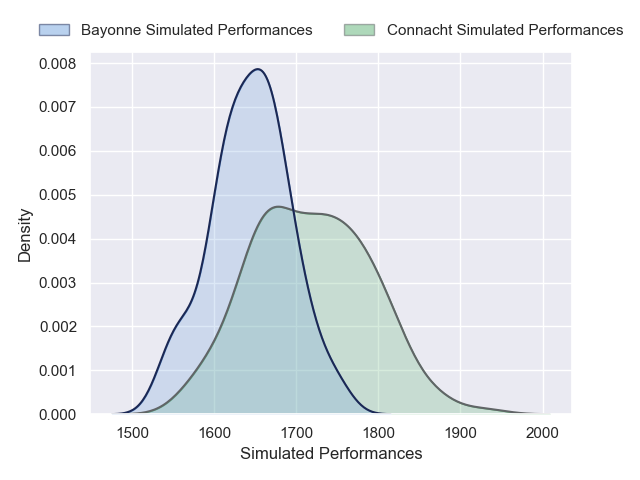
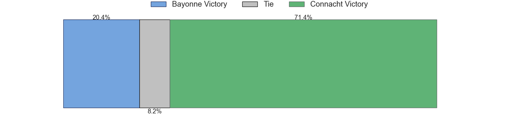
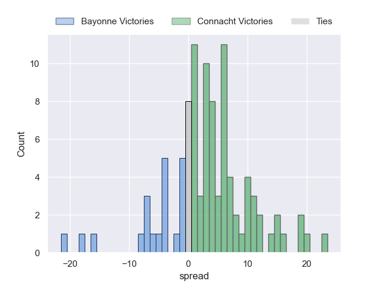

### Edinburgh V Cardiff Blues on 2025/04/04

Average Margin: Edinburgh by 11.9

### Montpellier Herault V Lyon on 2025/04/04

Average Margin: Montpellier Herault by 4.2

### Ospreys V Cheetahs on 2025/04/04

Average Margin: Ospreys by 10.0

### Montpellier Herault V Pau on 2025/04/04

Average Margin: Montpellier Herault by 5.9

### Lions V Ulster on 2025/04/04

Average Margin: Lions by 5.6

### Gloucester Rugby V Racing 92 on 2025/04/04

Average Margin: Gloucester Rugby by 4.1

### Montpellier Herault V Bristol Rugby on 2025/04/04

Average Margin: Montpellier Herault by 0.6

### Edinburgh V Vannes on 2025/04/04

Average Margin: Edinburgh by 14.6

### Lyon V Bath Rugby on 2025/04/04

Average Margin: Bath Rugby by 4.4

### Montpellier Herault V Castres Olympique on 2025/04/04

Average Margin: Montpellier Herault by 4.6

### Cheetahs V Castres Olympique on 2025/04/04

Average Margin: Castres Olympique by 0.4

### Edinburgh V Ulster on 2025/04/04

Average Margin: Edinburgh by 3.2

### Connacht V Toulon on 2025/04/04

Average Margin: Connacht by 0.3

### Montpellier Herault V Bulls on 2025/04/04

Average Margin: Bulls by 1.6

### Perpignan V Clermont Auvergne on 2025/04/04

Average Margin: Clermont Auvergne by 0.3

### Gloucester Rugby V Cheetahs on 2025/04/04

Average Margin: Gloucester Rugby by 5.3

### Ospreys V Bristol Rugby on 2025/04/04

Average Margin: Bristol Rugby by 2.9

### Perpignan V Ulster on 2025/04/04

Average Margin: Ulster by 0.9

### Gloucester Rugby V Bath Rugby on 2025/04/04

Average Margin: Bath Rugby by 4.2

### Ospreys V Black Lion on 2025/04/04

Average Margin: Ospreys by 2.6

### Lyon V Pau on 2025/04/04

Average Margin: Lyon by 4.8

### Lions V Bayonne on 2025/04/04

Average Margin: Lions by 8.3

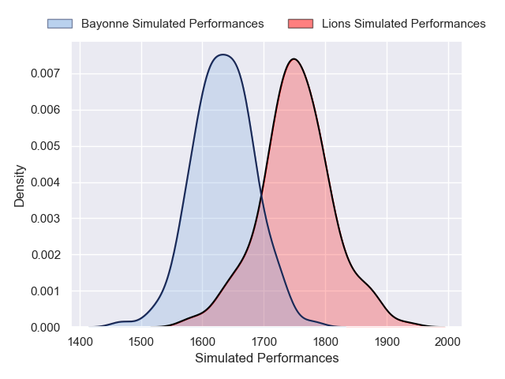
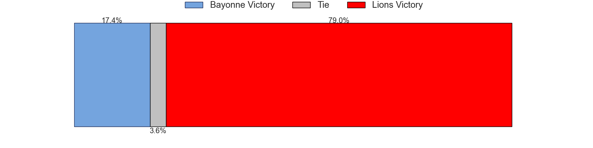
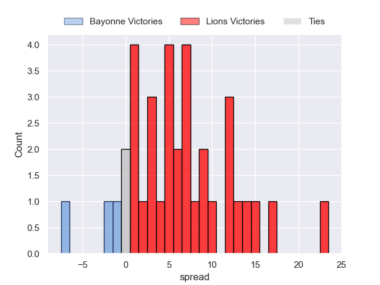

### Gloucester Rugby V Montpellier Herault on 2025/04/04

Average Margin: Gloucester Rugby by 2.8

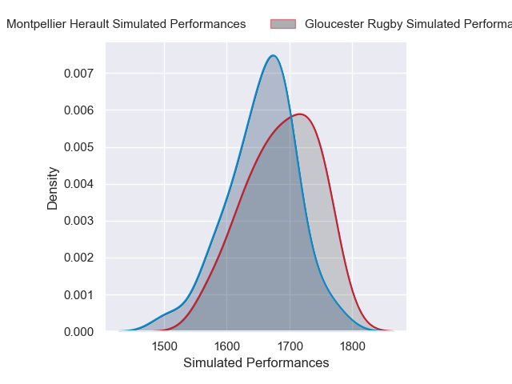
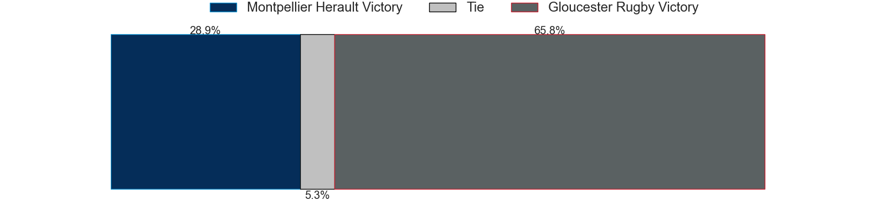
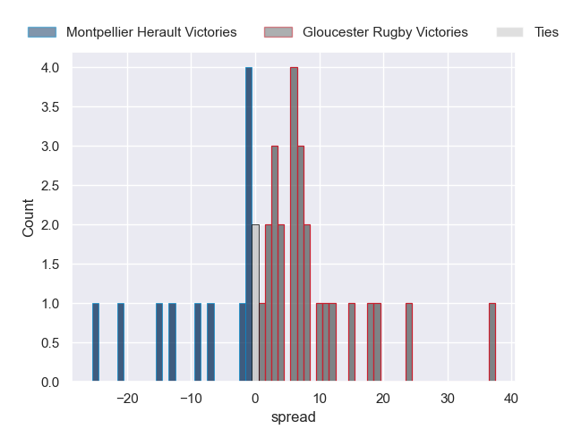

### Connacht V Cheetahs on 2025/04/04

Average Margin: Connacht by 8.1

### Gloucester Rugby V Vannes on 2025/04/04

Average Margin: Gloucester Rugby by 7.2

### Gloucester Rugby V Stormers on 2025/04/04

Average Margin: Gloucester Rugby by 4.2

### Pau V Lions on 2025/04/04

Average Margin: Lions by 0.0

### Black Lion V Edinburgh on 2025/04/04

Average Margin: Black Lion by 6.5

### Black Lion V Bristol Rugby on 2025/04/04

Average Margin: Bristol Rugby by 0.5

### Lyon V Leicester Tigers on 2025/04/04

Average Margin: Leicester Tigers by 2.2

### Edinburgh V Connacht on 2025/04/04

Average Margin: Edinburgh by 4.1

### Black Lion V Stormers on 2025/04/04

Average Margin: Black Lion by 2.9

### Black Lion V Bayonne on 2025/04/04

Average Margin: Black Lion by 7.9

### Edinburgh V Toulon on 2025/04/04

Average Margin: Edinburgh by 0.1

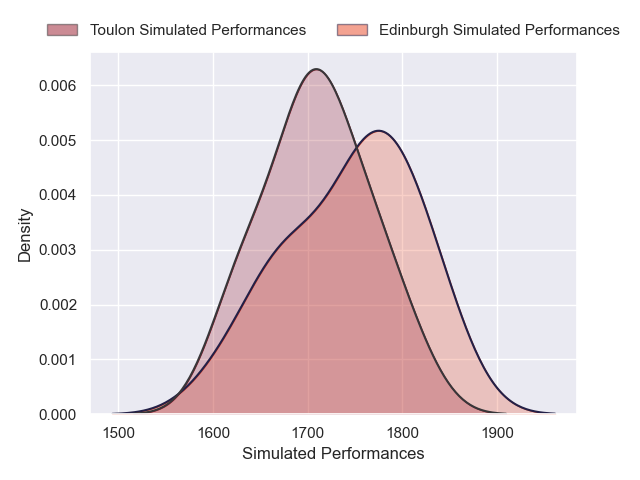

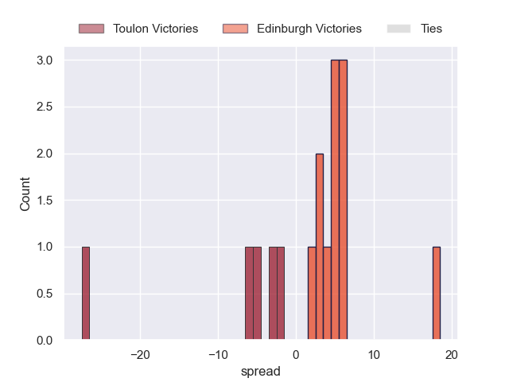

### Cheetahs V Bulls on 2025/04/04

Average Margin: Bulls by 6.0

### Pau V Bath Rugby on 2025/04/04

Average Margin: Bath Rugby by 3.3

### Edinburgh V Stade Francais Paris on 2025/04/04

Average Margin: Edinburgh by 7.3

### Gloucester Rugby V Benetton Treviso on 2025/04/04

Average Margin: Gloucester Rugby by 2.0

### Lions V Gloucester Rugby on 2025/04/04

Average Margin: Lions by 8.7

### Perpignan V Ospreys on 2025/04/04

Average Margin: Perpignan by 1.9

### Connacht V Clermont Auvergne on 2025/04/04

Average Margin: Connacht by 1.6

### Gloucester Rugby V Bulls on 2025/04/04

Average Margin: Bulls by 5.6

### Bayonne V Connacht on 2025/04/04

Average Margin: Bayonne by 3.0

### Ospreys V Racing 92 on 2025/04/04

Average Margin: Ospreys by 2.5

### Lyon V Vannes on 2025/04/04

Average Margin: Lyon by 9.6

### Perpignan V Cardiff Blues on 2025/04/04

Average Margin: Perpignan by 4.7

### Montpellier Herault V Ospreys on 2025/04/04

Average Margin: Montpellier Herault by 7.9

### Black Lion V Cheetahs on 2025/04/04

Average Margin: Black Lion by 10.0

### Pau V Montpellier Herault on 2025/04/04

Average Margin: Pau by 3.3

### Bayonne V Leicester Tigers on 2025/04/04

Average Margin: Bayonne by 0.9

### Lyon V Harlequins on 2025/04/04

Average Margin: Lyon by 0.3

### Montpellier Herault V Lions on 2025/04/04

Average Margin: Montpellier Herault by 2.8

### Edinburgh V Lyon on 2025/04/04

Average Margin: Edinburgh by 5.0

### Pau V Bristol Rugby on 2025/04/04

Average Margin: Bristol Rugby by 1.2

### Gloucester Rugby V Bristol Rugby on 2025/04/04

Average Margin: Bristol Rugby by 0.7

### Connacht V Castres Olympique on 2025/04/04

Average Margin: Connacht by 1.2

### Ospreys V Castres Olympique on 2025/04/04

Average Margin: Ospreys by 1.0

### Connacht V Perpignan on 2025/04/04

Average Margin: Connacht by 5.8

### Lyon V Bristol Rugby on 2025/04/04

Average Margin: Bristol Rugby by 0.4

### Pau V Black Lion on 2025/04/04

Average Margin: Pau by 0.9

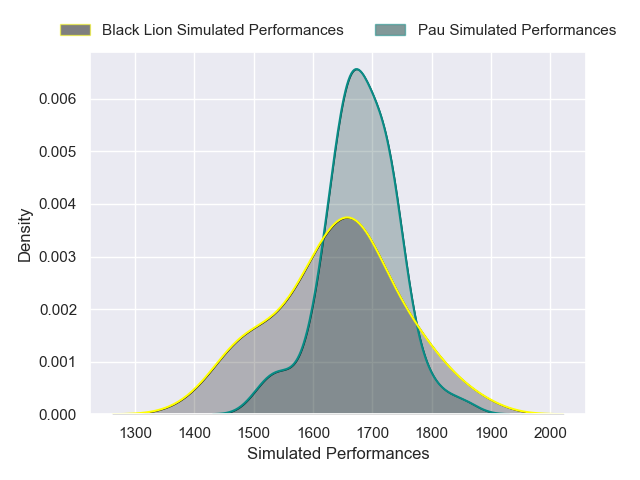

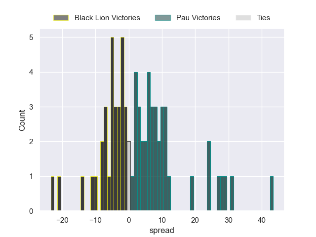

### Lyon V Exeter Chiefs on 2025/04/04

Average Margin: Lyon by 2.4

### Lyon V Black Lion on 2025/04/04

Average Margin: Lyon by 3.0

### Montpellier Herault V Cardiff Blues on 2025/04/04

Average Margin: Montpellier Herault by 10.3

### Pau V Castres Olympique on 2025/04/04

Average Margin: Pau by 2.6

### Lyon V Stormers on 2025/04/04

Average Margin: Lyon by 3.1

### Ospreys V Exeter Chiefs on 2025/04/04

Average Margin: Ospreys by 1.8

### Lyon V Newcastle Falcons on 2025/04/04

Average Margin: Lyon by 6.3

### Pau V Exeter Chiefs on 2025/04/04

Average Margin: Pau by 0.3

### Pau V Perpignan on 2025/04/04

Average Margin: Pau by 8.2

### Montpellier Herault V Bayonne on 2025/04/04

Average Margin: Montpellier Herault by 5.0

### Ospreys V Connacht on 2025/04/04

Average Margin: Ospreys by 0.4

### Lions V Cheetahs on 2025/04/04

Average Margin: Lions by 7.1

### Cheetahs V Racing 92 on 2025/04/04

Average Margin: Racing 92 by 3.4

### Edinburgh V Clermont Auvergne on 2025/04/04

Average Margin: Edinburgh by 4.9

### Montpellier Herault V Dragons on 2025/04/04

Average Margin: Montpellier Herault by 14.6

### Lyon V Montpellier Herault on 2025/04/04

Average Margin: Lyon by 2.8

### Perpignan V Exeter Chiefs on 2025/04/04

Average Margin: Exeter Chiefs by 0.5

### Bayonne V Black Lion on 2025/04/04

Average Margin: Bayonne by 8.3

### Cheetahs V Stade Francais Paris on 2025/04/04

Average Margin: Cheetahs by 4.1

### Lions V Sharks on 2025/04/04

Average Margin: Lions by 4.8

### Gloucester Rugby V Ospreys on 2025/04/04

Average Margin: Gloucester Rugby by 5.7

### Ospreys V Lyon on 2025/04/04

Average Margin: Ospreys by 3.9

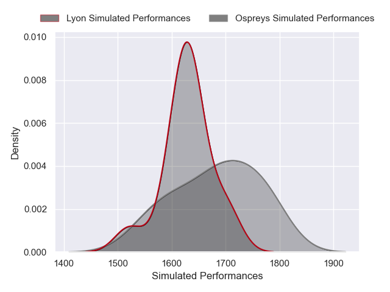

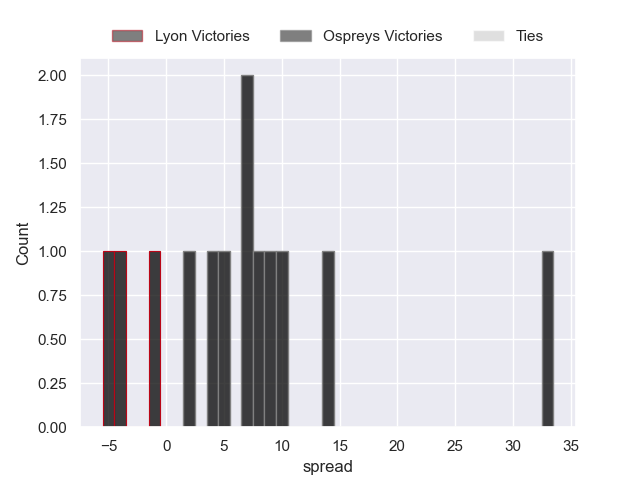

### Bayonne V Toulon on 2025/04/04

Average Margin: Bayonne by 1.5

### Pau V Scarlets on 2025/04/04

Average Margin: Pau by 4.2

### Perpignan V Stade Francais Paris on 2025/04/04

Average Margin: Stade Francais Paris by 0.6

### Bayonne V Castres Olympique on 2025/04/04

Average Margin: Bayonne by 3.7

### Montpellier Herault V Stormers on 2025/04/04

Average Margin: Montpellier Herault by 2.6

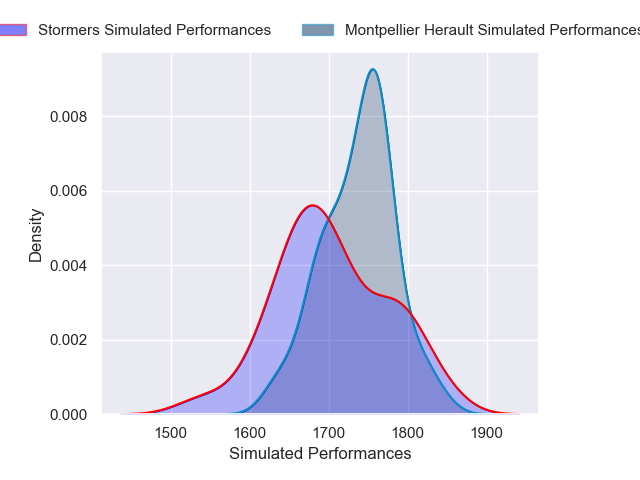
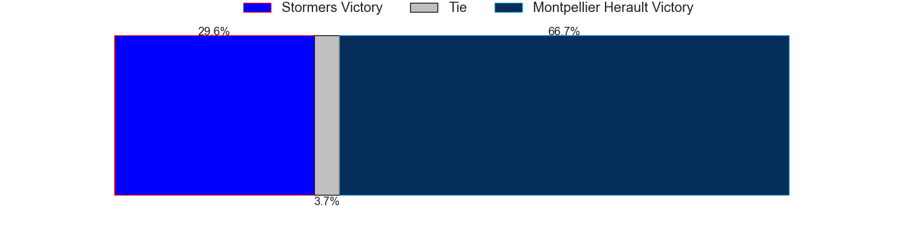
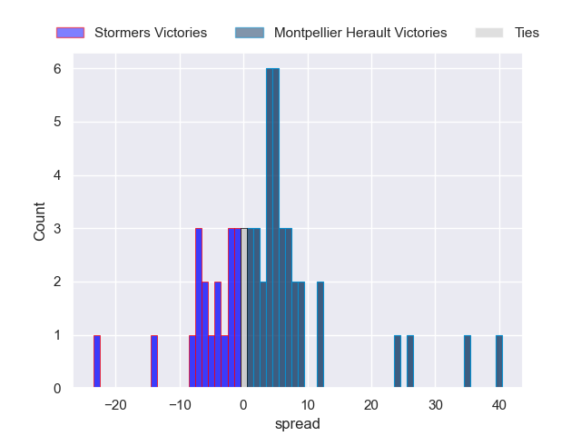

### Black Lion V Lions on 2025/04/04

Average Margin: Black Lion by 5.1

### Montpellier Herault V Scarlets on 2025/04/04

Average Margin: Montpellier Herault by 9.6

### Lions V Exeter Chiefs on 2025/04/04

Average Margin: Exeter Chiefs by 0.3

### Lyon V Connacht on 2025/04/04

Average Margin: Lyon by 5.0

### Pau V Cheetahs on 2025/04/04

Average Margin: Pau by 8.4

### Montpellier Herault V Leicester Tigers on 2025/04/04

Average Margin: Montpellier Herault by 5.7

### Perpignan V Stormers on 2025/04/04

Average Margin: Stormers by 3.7

### Perpignan V Bath Rugby on 2025/04/04

Average Margin: Bath Rugby by 4.0

### Gloucester Rugby V Leicester Tigers on 2025/04/04

Average Margin: Gloucester Rugby by 3.3

### Ospreys V Vannes on 2025/04/04

Average Margin: Ospreys by 6.6

### Ospreys V Harlequins on 2025/04/04

Average Margin: Harlequins by 0.9

### Edinburgh V Castres Olympique on 2025/04/04

Average Margin: Edinburgh by 3.5

### Bayonne V Sharks on 2025/04/04

Average Margin: Bayonne by 1.8

### Montpellier Herault V Edinburgh on 2025/04/04

Average Margin: Montpellier Herault by 1.0

### Gloucester Rugby V Connacht on 2025/04/04

Average Margin: Gloucester Rugby by 2.8

### Gloucester Rugby V Sale Sharks on 2025/04/04

Average Margin: Gloucester Rugby by 5.2

### Lions V Benetton Treviso on 2025/04/04

Average Margin: Lions by 3.7

### Lyon V Cardiff Blues on 2025/04/04

Average Margin: Lyon by 9.6

### Lyon V Lions on 2025/04/04

Average Margin: Lyon by 0.1

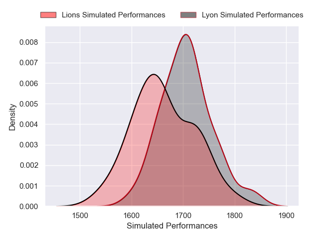

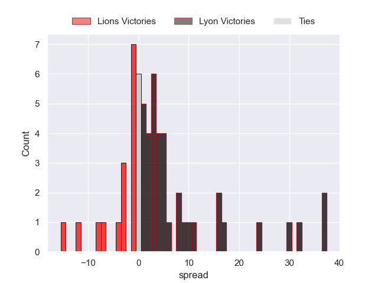

### Perpignan V Bulls on 2025/04/04

Average Margin: Bulls by 8.3

### Connacht V Black Lion on 2025/04/04

Average Margin: Connacht by 5.3

### Connacht V Leicester Tigers on 2025/04/04

Average Margin: Leicester Tigers by 0.8

### Connacht V Gloucester Rugby on 2025/04/04

Average Margin: Connacht by 2.9

### Pau V Harlequins on 2025/04/04

Average Margin: Pau by 1.4

### Lyon V Cheetahs on 2025/04/04

Average Margin: Lyon by 10.9

### Montpellier Herault V Gloucester Rugby on 2025/04/04

Average Margin: Montpellier Herault by 5.1

### Montpellier Herault V Vannes on 2025/04/04

Average Margin: Montpellier Herault by 9.2

### Perpignan V Edinburgh on 2025/04/04

Average Margin: Edinburgh by 2.2

### Ospreys V Sharks on 2025/04/04

Average Margin: Ospreys by 2.7

### Lions V Bath Rugby on 2025/04/04

Average Margin: Lions by 3.2

### Connacht V Exeter Chiefs on 2025/04/04

Average Margin: Connacht by 0.5

### Pau V Sale Sharks on 2025/04/04

Average Margin: Pau by 0.2

### Connacht V Bulls on 2025/04/04

Average Margin: Bulls by 5.6

### Lyon V Perpignan on 2025/04/04

Average Margin: Lyon by 6.1

### Perpignan V Leicester Tigers on 2025/04/04

Average Margin: Perpignan by 0.2

### Black Lion V Bath Rugby on 2025/04/04

Average Margin: Bath Rugby by 1.4

### Pau V Cardiff Blues on 2025/04/04

Average Margin: Pau by 7.8

### Cheetahs V Clermont Auvergne on 2025/04/04

Average Margin: Cheetahs by 1.3

### Lions V Stade Francais Paris on 2025/04/04

Average Margin: Lions by 6.9

### Gloucester Rugby V Bayonne on 2025/04/04

Average Margin: Gloucester Rugby by 6.2

### Edinburgh V Ospreys on 2025/04/04

Average Margin: Edinburgh by 5.0

### Lyon V Scarlets on 2025/04/04

Average Margin: Lyon by 9.8

### Edinburgh V Montpellier Herault on 2025/04/04

Average Margin: Edinburgh by 2.7

### Montpellier Herault V Cheetahs on 2025/04/04

Average Margin: Montpellier Herault by 9.5

### Perpignan V Pau on 2025/04/04

Average Margin: Perpignan by 4.1

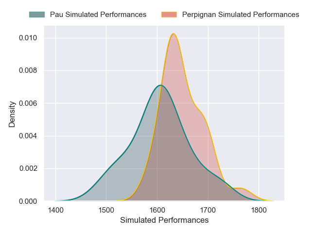

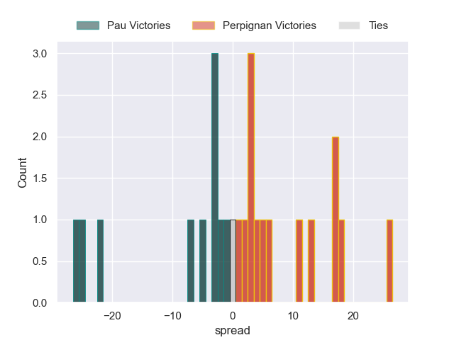

### Montpellier Herault V Clermont Auvergne on 2025/04/04

Average Margin: Montpellier Herault by 1.7

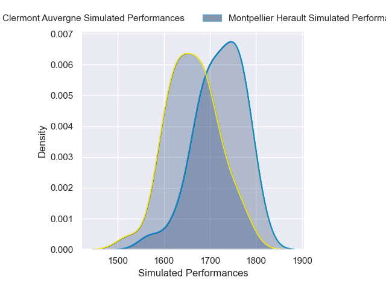
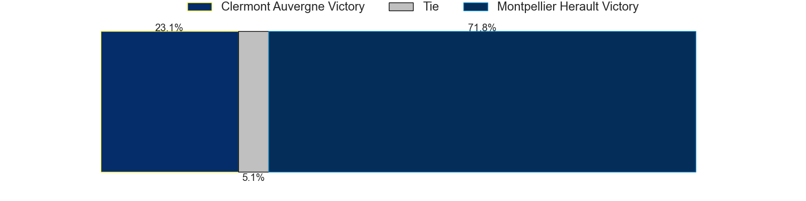
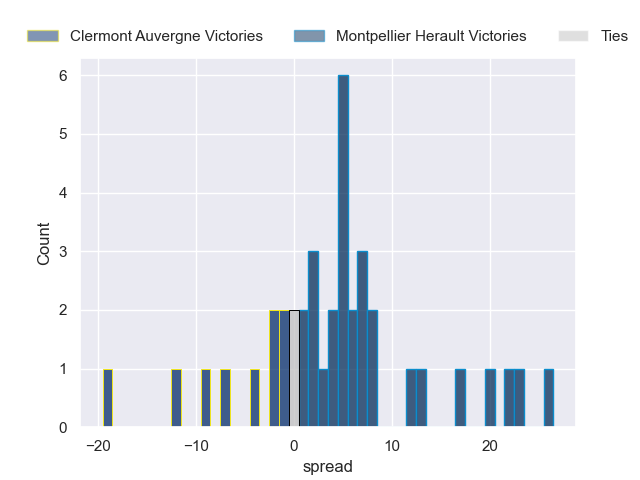

### Cheetahs V Stormers on 2025/04/04

Average Margin: Cheetahs by 3.3

### Connacht V Scarlets on 2025/04/04

Average Margin: Connacht by 13.7

### Connacht V Lions on 2025/04/04

Average Margin: Connacht by 1.5

### Edinburgh V Pau on 2025/04/04

Average Margin: Edinburgh by 7.3

### Black Lion V Racing 92 on 2025/04/04

Average Margin: Black Lion by 2.8

### Edinburgh V Black Lion on 2025/04/04

Average Margin: Edinburgh by 7.2

### Lions V Lyon on 2025/04/04

Average Margin: Lions by 13.2

### Edinburgh V Perpignan on 2025/04/04

Average Margin: Edinburgh by 8.0

### Edinburgh V Scarlets on 2025/04/04

Average Margin: Edinburgh by 11.9

### Ospreys V Cardiff Blues on 2025/04/04

Average Margin: Ospreys by 9.0

### Pau V Ospreys on 2025/04/04

Average Margin: Pau by 5.1

### Gloucester Rugby V Ulster on 2025/04/04

Average Margin: Gloucester Rugby by 1.7

### Gloucester Rugby V Sharks on 2025/04/04

Average Margin: Gloucester Rugby by 3.2

### Ospreys V Lions on 2025/04/04

Average Margin: Lions by 1.8

### Connacht V Harlequins on 2025/04/04

Average Margin: Connacht by 0.7

### Bayonne V Racing 92 on 2025/04/04

Average Margin: Bayonne by 4.6

## Quarterfinals

### Edinburgh V Harlequins on 2025/04/11

Average Margin: Edinburgh by 1.0

### Gloucester Rugby V Harlequins on 2025/04/11

Average Margin: Harlequins by 0.3

### Lions V Clermont Auvergne on 2025/04/11

Average Margin: Lions by 5.0

### Perpignan V Montpellier Herault on 2025/04/11

Average Margin: Montpellier Herault by 3.5

### Lions V Gloucester Rugby on 2025/04/11

Average Margin: Lions by 8.7

### Perpignan V Cheetahs on 2025/04/11

Average Margin: Perpignan by 4.1

### Lyon V Ospreys on 2025/04/11

Average Margin: Lyon by 4.8

### Gloucester Rugby V Sharks on 2025/04/11

Average Margin: Gloucester Rugby by 3.2

### Edinburgh V Perpignan on 2025/04/11

Average Margin: Edinburgh by 8.0

### Montpellier Herault V Bulls on 2025/04/11

Average Margin: Bulls by 1.6

### Black Lion V Clermont Auvergne on 2025/04/11

Average Margin: Black Lion by 1.7

### Black Lion V Montpellier Herault on 2025/04/11

Average Margin: Black Lion by 6.2

### Pau V La Rochelle on 2025/04/11

Average Margin: La Rochelle by 8.0

### Edinburgh V Northampton Saints on 2025/04/11

Average Margin: Edinburgh by 6.3

### Montpellier Herault V Bristol Rugby on 2025/04/11

Average Margin: Montpellier Herault by 0.6

### Ospreys V Bayonne on 2025/04/11

Average Margin: Ospreys by 2.8

### Pau V Cheetahs on 2025/04/11

Average Margin: Pau by 8.4

### Cheetahs V Ospreys on 2025/04/11

Average Margin: Cheetahs by 11.5

### Connacht V Gloucester Rugby on 2025/04/11

Average Margin: Connacht by 2.9

### Lyon V Bayonne on 2025/04/11

Average Margin: Lyon by 1.9

### Ospreys V Clermont Auvergne on 2025/04/11

Average Margin: Clermont Auvergne by 0.2

### Black Lion V Harlequins on 2025/04/11

Average Margin: Harlequins by 1.8

### Ospreys V Black Lion on 2025/04/11

Average Margin: Ospreys by 2.6

### Perpignan V Stormers on 2025/04/11

Average Margin: Stormers by 3.7

### Connacht V Edinburgh on 2025/04/11

Average Margin: Connacht by 2.4

### Lions V Bayonne on 2025/04/11

Average Margin: Lions by 8.3

### Edinburgh V Munster on 2025/04/11

Average Margin: Edinburgh by 3.2

### Connacht V Lions on 2025/04/11

Average Margin: Connacht by 1.5

### Lions V Castres Olympique on 2025/04/11

Average Margin: Lions by 6.0

### Connacht V Clermont Auvergne on 2025/04/11

Average Margin: Connacht by 1.6

### Montpellier Herault V Black Lion on 2025/04/11

Average Margin: Montpellier Herault by 5.0

### Black Lion V Perpignan on 2025/04/11

Average Margin: Black Lion by 10.4

### Gloucester Rugby V Bayonne on 2025/04/11

Average Margin: Gloucester Rugby by 6.2

### Ospreys V Edinburgh on 2025/04/11

Average Margin: Ospreys by 2.5

### Pau V Clermont Auvergne on 2025/04/11

Average Margin: Pau by 3.0

### Pau V Benetton Treviso on 2025/04/11

Average Margin: Pau by 7.0

### Gloucester Rugby V Cardiff Blues on 2025/04/11

Average Margin: Gloucester Rugby by 11.7

### Edinburgh V Leicester Tigers on 2025/04/11

Average Margin: Edinburgh by 5.0

### Ospreys V Munster on 2025/04/11

Average Margin: Munster by 1.0

### Bayonne V Racing 92 on 2025/04/11

Average Margin: Bayonne by 4.6

### Perpignan V Castres Olympique on 2025/04/11

Average Margin: Perpignan by 1.3

### Bayonne V Stormers on 2025/04/11

Average Margin: Bayonne by 1.3

### Montpellier Herault V Scarlets on 2025/04/11

Average Margin: Montpellier Herault by 9.6

### Gloucester Rugby V Racing 92 on 2025/04/11

Average Margin: Gloucester Rugby by 4.1

### Cheetahs V Leicester Tigers on 2025/04/11

Average Margin: Cheetahs by 1.4

### Lions V Northampton Saints on 2025/04/11

Average Margin: Lions by 3.7

### Edinburgh V Gloucester Rugby on 2025/04/11

Average Margin: Edinburgh by 4.6

### Montpellier Herault V Sharks on 2025/04/11

Average Margin: Montpellier Herault by 3.0

### Lyon V Montpellier Herault on 2025/04/11

Average Margin: Lyon by 2.8

### Pau V Ospreys on 2025/04/11

Average Margin: Pau by 5.1

### Cheetahs V Bath Rugby on 2025/04/11

Average Margin: Bath Rugby by 4.8

### Ospreys V Sale Sharks on 2025/04/11

Average Margin: Ospreys by 4.1

### Pau V Racing 92 on 2025/04/11

Average Margin: Pau by 3.1

### Lions V Ulster on 2025/04/11

Average Margin: Lions by 5.6

### Connacht V Ulster on 2025/04/11

Average Margin: Ulster by 0.5

### Lions V Montpellier Herault on 2025/04/11

Average Margin: Lions by 7.1

### Lyon V Pau on 2025/04/11

Average Margin: Lyon by 4.8

### Lions V Cheetahs on 2025/04/11

Average Margin: Lions by 7.1

### Montpellier Herault V Sale Sharks on 2025/04/11

Average Margin: Montpellier Herault by 2.9

### Bayonne V Benetton Treviso on 2025/04/11

Average Margin: Bayonne by 7.9

### Pau V Stormers on 2025/04/11

Average Margin: Pau by 0.5

### Gloucester Rugby V Pau on 2025/04/11

Average Margin: Gloucester Rugby by 5.6

### Perpignan V Scarlets on 2025/04/11

Average Margin: Perpignan by 6.9

### Gloucester Rugby V Scarlets on 2025/04/11

Average Margin: Gloucester Rugby by 8.6

### Montpellier Herault V Ospreys on 2025/04/11

Average Margin: Montpellier Herault by 7.9

### Lions V Pau on 2025/04/11

Average Margin: Lions by 9.7

### Lyon V Leicester Tigers on 2025/04/11

Average Margin: Leicester Tigers by 2.2

### Lyon V Harlequins on 2025/04/11

Average Margin: Lyon by 0.3

### Edinburgh V Vannes on 2025/04/11

Average Margin: Edinburgh by 14.6

### Pau V Edinburgh on 2025/04/11

Average Margin: Edinburgh by 0.3

### Montpellier Herault V Vannes on 2025/04/11

Average Margin: Montpellier Herault by 9.2

### Cheetahs V Bulls on 2025/04/11

Average Margin: Bulls by 6.0

### Bayonne V Montpellier Herault on 2025/04/11

Average Margin: Bayonne by 6.4

### Lions V Sharks on 2025/04/11

Average Margin: Lions by 4.8

### Connacht V Vannes on 2025/04/11

Average Margin: Connacht by 10.9

### Lyon V Newcastle Falcons on 2025/04/11

Average Margin: Lyon by 6.3

### Cheetahs V Lyon on 2025/04/11

Average Margin: Cheetahs by 7.8

### Montpellier Herault V Toulon on 2025/04/11

Average Margin: Toulon by 5.0

### Edinburgh V Sharks on 2025/04/11

Average Margin: Edinburgh by 7.3

### Pau V Perpignan on 2025/04/11

Average Margin: Pau by 8.2

### Pau V Bulls on 2025/04/11

Average Margin: Bulls by 3.2

### Connacht V Bristol Rugby on 2025/04/11

Average Margin: Connacht by 1.0

### Bayonne V Bristol Rugby on 2025/04/11

Average Margin: Bristol Rugby by 1.6

### Lyon V Cardiff Blues on 2025/04/11

Average Margin: Lyon by 9.6

### Bayonne V Scarlets on 2025/04/11

Average Margin: Bayonne by 11.1

### Ospreys V Stade Francais Paris on 2025/04/11

Average Margin: Ospreys by 2.4

### Bayonne V Bath Rugby on 2025/04/11

Average Margin: Bath Rugby by 3.5

### Lions V Leicester Tigers on 2025/04/11

Average Margin: Lions by 5.2

### Ospreys V Bulls on 2025/04/11

Average Margin: Bulls by 6.1

### Lyon V Gloucester Rugby on 2025/04/11

Average Margin: Lyon by 4.8

### Ospreys V Bath Rugby on 2025/04/11

Average Margin: Bath Rugby by 1.4

### Pau V Scarlets on 2025/04/11

Average Margin: Pau by 4.2

### Cheetahs V Clermont Auvergne on 2025/04/11

Average Margin: Cheetahs by 1.3

### Montpellier Herault V La Rochelle on 2025/04/11

Average Margin: La Rochelle by 3.6

### Montpellier Herault V Clermont Auvergne on 2025/04/11

Average Margin: Montpellier Herault by 1.7

### Black Lion V Edinburgh on 2025/04/11

Average Margin: Black Lion by 6.5

### Connacht V Montpellier Herault on 2025/04/11

Average Margin: Connacht by 1.2

### Bayonne V Edinburgh on 2025/04/11

Average Margin: Bayonne by 3.7

### Perpignan V Harlequins on 2025/04/11

Average Margin: Harlequins by 1.8

### Gloucester Rugby V Stade Francais Paris on 2025/04/11

Average Margin: Gloucester Rugby by 1.9

### Lyon V Vannes on 2025/04/11

Average Margin: Lyon by 9.6

### Bayonne V Pau on 2025/04/11

Average Margin: Bayonne by 0.2

### Perpignan V Cardiff Blues on 2025/04/11

Average Margin: Perpignan by 4.7

### Cheetahs V Racing 92 on 2025/04/11

Average Margin: Racing 92 by 3.4

### Bulls V Bristol Rugby on 2025/04/11

Average Margin: Bulls by 2.0

### Perpignan V Benetton Treviso on 2025/04/11

Average Margin: Perpignan by 1.6

### Perpignan V Racing 92 on 2025/04/11

Average Margin: Perpignan by 0.5

### Cheetahs V Lions on 2025/04/11

Average Margin: Lions by 4.5

### Bayonne V Bulls on 2025/04/11

Average Margin: Bayonne by 1.4

### Gloucester Rugby V Ulster on 2025/04/11

Average Margin: Gloucester Rugby by 1.7

### Black Lion V Exeter Chiefs on 2025/04/11

Average Margin: Black Lion by 7.5

### Connacht V Scarlets on 2025/04/11

Average Margin: Connacht by 13.7

### Montpellier Herault V Newcastle Falcons on 2025/04/11

Average Margin: Montpellier Herault by 7.2

### Cheetahs V Connacht on 2025/04/11

Average Margin: Connacht by 2.0

### Ospreys V Pau on 2025/04/11

Average Margin: Ospreys by 8.0

### Edinburgh V Stade Francais Paris on 2025/04/11

Average Margin: Edinburgh by 7.3

### Edinburgh V Castres Olympique on 2025/04/11

Average Margin: Edinburgh by 3.5

### Vannes V Harlequins on 2025/04/11

Average Margin: Vannes by 0.7

### Bayonne V Toulon on 2025/04/11

Average Margin: Bayonne by 1.5

### Bayonne V Ulster on 2025/04/11

Average Margin: Bayonne by 5.4

### Connacht V Cardiff Blues on 2025/04/11

Average Margin: Connacht by 8.1

### Montpellier Herault V Cardiff Blues on 2025/04/11

Average Margin: Montpellier Herault by 10.3

### Montpellier Herault V Stade Francais Paris on 2025/04/11

Average Margin: Montpellier Herault by 4.0

### Black Lion V Lyon on 2025/04/11

Average Margin: Black Lion by 5.8

### Ospreys V Leicester Tigers on 2025/04/11

Average Margin: Ospreys by 1.7

### Perpignan V Lions on 2025/04/11

Average Margin: Perpignan by 1.4

### Black Lion V Benetton Treviso on 2025/04/11

Average Margin: Black Lion by 7.7

### Perpignan V Ospreys on 2025/04/11

Average Margin: Perpignan by 1.9

### Lyon V Bath Rugby on 2025/04/11

Average Margin: Bath Rugby by 4.4

### Bayonne V Ospreys on 2025/04/11

Average Margin: Bayonne by 6.7

### Edinburgh V Bulls on 2025/04/11

Average Margin: Bulls by 1.1

### Montpellier Herault V Perpignan on 2025/04/11

Average Margin: Montpellier Herault by 7.1

### Perpignan V Northampton Saints on 2025/04/11

Average Margin: Northampton Saints by 3.2

### Montpellier Herault V Pau on 2025/04/11

Average Margin: Montpellier Herault by 5.9

### Ospreys V Gloucester Rugby on 2025/04/11

Average Margin: Ospreys by 2.0

### Edinburgh V Stormers on 2025/04/11

Average Margin: Edinburgh by 2.3

### Black Lion V La Rochelle on 2025/04/11

Average Margin: Black Lion by 1.3

### Montpellier Herault V Leicester Tigers on 2025/04/11

Average Margin: Montpellier Herault by 5.7

### Perpignan V Bulls on 2025/04/11

Average Margin: Bulls by 8.3

### Montpellier Herault V Lyon on 2025/04/11

Average Margin: Montpellier Herault by 4.2

### Gloucester Rugby V Lions on 2025/04/11

Average Margin: Gloucester Rugby by 1.0

### Cardiff Blues V Bristol Rugby on 2025/04/11

Average Margin: Bristol Rugby by 3.8

### Edinburgh V Newcastle Falcons on 2025/04/11

Average Margin: Edinburgh by 14.2

### Montpellier Herault V Munster on 2025/04/11

Average Margin: Munster by 1.1

### Lions V Connacht on 2025/04/11

Average Margin: Lions by 8.4

### Ospreys V Sharks on 2025/04/11

Average Margin: Ospreys by 2.7

### Gloucester Rugby V Bath Rugby on 2025/04/11

Average Margin: Bath Rugby by 4.2

### Perpignan V Connacht on 2025/04/11

Average Margin: Perpignan by 2.1

### Connacht V Harlequins on 2025/04/11

Average Margin: Connacht by 0.7

### Black Lion V Sharks on 2025/04/11

Average Margin: Black Lion by 5.6

### Edinburgh V Benetton Treviso on 2025/04/11

Average Margin: Edinburgh by 5.7

### Gloucester Rugby V Exeter Chiefs on 2025/04/11

Average Margin: Gloucester Rugby by 1.1

### Bayonne V Gloucester Rugby on 2025/04/11

Average Margin: Bayonne by 6.7

### Connacht V La Rochelle on 2025/04/11

Average Margin: Connacht by 1.9

### Lions V Stade Francais Paris on 2025/04/11

Average Margin: Lions by 6.9

### Lyon V Racing 92 on 2025/04/11

Average Margin: Lyon by 4.0

### Pau V Stade Francais Paris on 2025/04/11

Average Margin: Pau by 3.4

### Black Lion V Northampton Saints on 2025/04/11

Average Margin: Northampton Saints by 0.5

### Gloucester Rugby V La Rochelle on 2025/04/11

Average Margin: La Rochelle by 0.4

### Cheetahs V Perpignan on 2025/04/11

Average Margin: Cheetahs by 3.5

### Pau V Sharks on 2025/04/11

Average Margin: Pau by 2.1

### Connacht V Bayonne on 2025/04/11

Average Margin: Connacht by 3.1

### Black Lion V Castres Olympique on 2025/04/11

Average Margin: Black Lion by 4.4

### Montpellier Herault V Gloucester Rugby on 2025/04/11

Average Margin: Montpellier Herault by 5.1

### Ospreys V Stormers on 2025/04/11

Average Margin: Ospreys by 1.8

### Black Lion V Connacht on 2025/04/11

Average Margin: Black Lion by 4.9

### Ospreys V Ulster on 2025/04/11

Average Margin: Ospreys by 2.1

### Perpignan V Edinburgh on 2025/04/11

Average Margin: Edinburgh by 2.2

### Gloucester Rugby V Stormers on 2025/04/11

Average Margin: Gloucester Rugby by 4.2

### Connacht V Benetton Treviso on 2025/04/11

Average Margin: Connacht by 7.6

### Gloucester Rugby V Castres Olympique on 2025/04/11

Average Margin: Gloucester Rugby by 4.2

### Connacht V Black Lion on 2025/04/11

Average Margin: Connacht by 5.3

### Ospreys V Connacht on 2025/04/11

Average Margin: Ospreys by 0.4

### Perpignan V Stade Francais Paris on 2025/04/11

Average Margin: Stade Francais Paris by 0.6

### Black Lion V Bristol Rugby on 2025/04/11

Average Margin: Bristol Rugby by 0.5

### Lions V Lyon on 2025/04/11

Average Margin: Lions by 13.2

### Connacht V Bulls on 2025/04/11

Average Margin: Bulls by 5.6

### Bayonne V Connacht on 2025/04/11

Average Margin: Bayonne by 3.0

### Ospreys V Benetton Treviso on 2025/04/11

Average Margin: Ospreys by 4.1

### Edinburgh V Cardiff Blues on 2025/04/11

Average Margin: Edinburgh by 11.9

### Pau V Bath Rugby on 2025/04/11

Average Margin: Bath Rugby by 3.3

### Connacht V Pau on 2025/04/11

Average Margin: Connacht by 5.2

### Edinburgh V Lyon on 2025/04/11

Average Margin: Edinburgh by 5.0

### Lyon V Scarlets on 2025/04/11

Average Margin: Lyon by 9.8

### Gloucester Rugby V Leicester Tigers on 2025/04/11

Average Margin: Gloucester Rugby by 3.3

### Black Lion V Racing 92 on 2025/04/11

Average Margin: Black Lion by 2.8

### Lyon V Lions on 2025/04/11

Average Margin: Lyon by 0.1

### Pau V Ulster on 2025/04/11

Average Margin: Pau by 0.2

### Gloucester Rugby V Bulls on 2025/04/11

Average Margin: Bulls by 5.6

### Montpellier Herault V Connacht on 2025/04/11

Average Margin: Montpellier Herault by 4.3

### Lyon V Edinburgh on 2025/04/11

Average Margin: Lyon by 0.8

### Perpignan V Lyon on 2025/04/11

Average Margin: Perpignan by 2.0

### Edinburgh V Scarlets on 2025/04/11

Average Margin: Edinburgh by 11.9

### Perpignan V Bath Rugby on 2025/04/11

Average Margin: Bath Rugby by 4.0

### Cheetahs V Pau on 2025/04/11

Average Margin: Cheetahs by 4.5

### Montpellier Herault V Ulster on 2025/04/11

Average Margin: Montpellier Herault by 4.6

### Bayonne V Sharks on 2025/04/11

Average Margin: Bayonne by 1.8

### Lions V Ospreys on 2025/04/11

Average Margin: Lions by 3.1

### Black Lion V Cheetahs on 2025/04/11

Average Margin: Black Lion by 10.0

### Ospreys V Harlequins on 2025/04/11

Average Margin: Harlequins by 0.9

### Black Lion V Gloucester Rugby on 2025/04/11

Average Margin: Black Lion by 6.1

### Connacht V Northampton Saints on 2025/04/11

Average Margin: Connacht by 1.0

### Gloucester Rugby V Vannes on 2025/04/11

Average Margin: Gloucester Rugby by 7.2

### Perpignan V Vannes on 2025/04/11

Average Margin: Perpignan by 8.7

### Pau V Bayonne on 2025/04/11

Average Margin: Pau by 3.5

### Edinburgh V Toulon on 2025/04/11

Average Margin: Edinburgh by 0.1

### Black Lion V Bath Rugby on 2025/04/11

Average Margin: Bath Rugby by 1.4

### Lyon V Toulon on 2025/04/11

Average Margin: Toulon by 3.9

### Edinburgh V Bayonne on 2025/04/11

Average Margin: Edinburgh by 6.9

### Pau V Black Lion on 2025/04/11

Average Margin: Pau by 0.9

### Gloucester Rugby V Ospreys on 2025/04/11

Average Margin: Gloucester Rugby by 5.7

### Montpellier Herault V Bayonne on 2025/04/11

Average Margin: Montpellier Herault by 5.0

### Edinburgh V Bath Rugby on 2025/04/11

Average Margin: Bath Rugby by 1.2

### Lions V Bulls on 2025/04/11

Average Margin: Bulls by 0.9

### Lions V Bath Rugby on 2025/04/11

Average Margin: Lions by 3.2

### Lyon V Cheetahs on 2025/04/11

Average Margin: Lyon by 10.9

### Lyon V Clermont Auvergne on 2025/04/11

Average Margin: Clermont Auvergne by 3.4

### Pau V Connacht on 2025/04/11

Average Margin: Pau by 3.1

### Edinburgh V La Rochelle on 2025/04/11

Average Margin: La Rochelle by 8.0

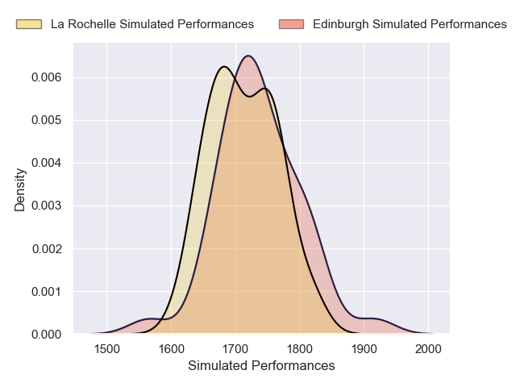

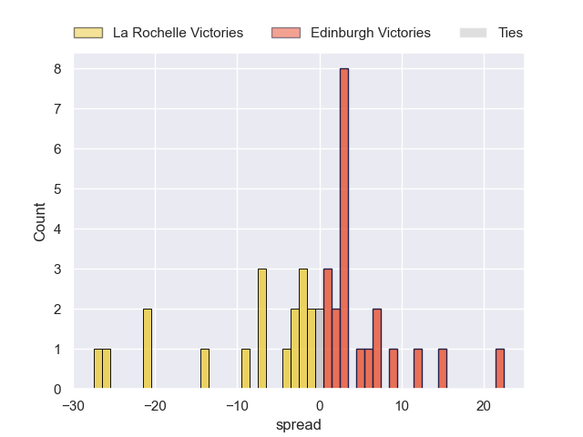

### Lyon V Black Lion on 2025/04/11

Average Margin: Lyon by 3.0

### Edinburgh V Connacht on 2025/04/11

Average Margin: Edinburgh by 4.1

### Pau V Lyon on 2025/04/11

Average Margin: Pau by 4.9

### Cheetahs V Stormers on 2025/04/11

Average Margin: Cheetahs by 3.3

### Bayonne V Perpignan on 2025/04/11

Average Margin: Bayonne by 7.0

### Montpellier Herault V Cheetahs on 2025/04/11

Average Margin: Montpellier Herault by 9.5

### Lyon V Exeter Chiefs on 2025/04/11

Average Margin: Lyon by 2.4

### Edinburgh V Lions on 2025/04/11

Average Margin: Edinburgh by 2.9

### Gloucester Rugby V Clermont Auvergne on 2025/04/11

Average Margin: Gloucester Rugby by 1.1

### Montpellier Herault V Zebre on 2025/04/11

Average Margin: Montpellier Herault by 18.3

### Ospreys V Cheetahs on 2025/04/11

Average Margin: Ospreys by 10.0

### Ospreys V Vannes on 2025/04/11

Average Margin: Ospreys by 6.6

### Connacht V Toulon on 2025/04/11

Average Margin: Connacht by 0.3

### Lions V Cardiff Blues on 2025/04/11

Average Margin: Lions by 11.1

### Cheetahs V Stade Francais Paris on 2025/04/11

Average Margin: Cheetahs by 4.1

### Lyon V Bulls on 2025/04/11

Average Margin: Bulls by 1.4

### Ospreys V Cardiff Blues on 2025/04/11

Average Margin: Ospreys by 9.0

### Montpellier Herault V Edinburgh on 2025/04/11

Average Margin: Montpellier Herault by 1.0

### Lyon V Bristol Rugby on 2025/04/11

Average Margin: Bristol Rugby by 0.4

### Lions V Perpignan on 2025/04/11

Average Margin: Lions by 11.9

### Cheetahs V Ulster on 2025/04/11

Average Margin: Ulster by 0.5

### Connacht V Castres Olympique on 2025/04/11

Average Margin: Connacht by 1.2

### Black Lion V Ospreys on 2025/04/11

Average Margin: Black Lion by 4.4

### Bayonne V Leicester Tigers on 2025/04/11

Average Margin: Bayonne by 0.9

### Connacht V Stormers on 2025/04/11

Average Margin: Connacht by 2.9

### Lyon V Sharks on 2025/04/11

Average Margin: Sharks by 0.6

### Lions V Stormers on 2025/04/11

Average Margin: Lions by 5.6

### Connacht V Perpignan on 2025/04/11

Average Margin: Connacht by 5.8

### Montpellier Herault V Benetton Treviso on 2025/04/11

Average Margin: Montpellier Herault by 8.2

### Gloucester Rugby V Black Lion on 2025/04/11

Average Margin: Gloucester Rugby by 4.9

### Perpignan V Gloucester Rugby on 2025/04/11

Average Margin: Perpignan by 0.3

### Gloucester Rugby V Montpellier Herault on 2025/04/11

Average Margin: Gloucester Rugby by 2.8

### Pau V Leicester Tigers on 2025/04/11

Average Margin: Pau by 4.8

### Bayonne V Clermont Auvergne on 2025/04/11

Average Margin: Clermont Auvergne by 0.2

### Edinburgh V Cheetahs on 2025/04/11

Average Margin: Edinburgh by 9.7

### Perpignan V Bayonne on 2025/04/11

Average Margin: Perpignan by 1.0

### Edinburgh V Zebre on 2025/04/11

Average Margin: Edinburgh by 8.9

### Lyon V Benetton Treviso on 2025/04/11

Average Margin: Lyon by 1.3

### Edinburgh V Pau on 2025/04/11

Average Margin: Edinburgh by 7.3

### Lions V Bristol Rugby on 2025/04/11

Average Margin: Bristol Rugby by 0.7

### Pau V Harlequins on 2025/04/11

Average Margin: Pau by 1.4

### Gloucester Rugby V Connacht on 2025/04/11

Average Margin: Gloucester Rugby by 2.8

### Edinburgh V Ulster on 2025/04/11

Average Margin: Edinburgh by 3.2

### Perpignan V Munster on 2025/04/11

Average Margin: Munster by 0.3

### Perpignan V Black Lion on 2025/04/11

Average Margin: Perpignan by 3.8

### Ospreys V Exeter Chiefs on 2025/04/11

Average Margin: Ospreys by 1.8

### Perpignan V Pau on 2025/04/11

Average Margin: Perpignan by 4.1

### Montpellier Herault V Northampton Saints on 2025/04/11

Average Margin: Montpellier Herault by 1.8

### Cheetahs V Bristol Rugby on 2025/04/11

Average Margin: Bristol Rugby by 5.6

### Connacht V Bath Rugby on 2025/04/11

Average Margin: Bath Rugby by 0.9

### Gloucester Rugby V Lyon on 2025/04/11

Average Margin: Gloucester Rugby by 3.4

### Ospreys V Lions on 2025/04/11

Average Margin: Lions by 1.8

### Gloucester Rugby V Edinburgh on 2025/04/11

Average Margin: Gloucester Rugby by 2.4

### Black Lion V Pau on 2025/04/11

Average Margin: Black Lion by 12.7

### Bayonne V Black Lion on 2025/04/11

Average Margin: Bayonne by 8.3

### Lions V La Rochelle on 2025/04/11

Average Margin: Lions by 3.6

### Pau V Vannes on 2025/04/11

Average Margin: Pau by 12.3

### Pau V Cardiff Blues on 2025/04/11

Average Margin: Pau by 7.8

### Pau V Montpellier Herault on 2025/04/11

Average Margin: Pau by 3.3

### Gloucester Rugby V Bristol Rugby on 2025/04/11

Average Margin: Bristol Rugby by 0.7

### Black Lion V Bayonne on 2025/04/11

Average Margin: Black Lion by 7.9

### Bayonne V Harlequins on 2025/04/11

Average Margin: Bayonne by 1.8

### Perpignan V Exeter Chiefs on 2025/04/11

Average Margin: Exeter Chiefs by 0.5

### Black Lion V Bulls on 2025/04/11

Average Margin: Bulls by 4.5

### Connacht V Stade Francais Paris on 2025/04/11

Average Margin: Connacht by 10.2

### Montpellier Herault V Saracens on 2025/04/11

Average Margin: Saracens by 5.9

### Ospreys V Perpignan on 2025/04/11

Average Margin: Ospreys by 8.3

### Perpignan V Clermont Auvergne on 2025/04/11

Average Margin: Clermont Auvergne by 0.3

### Lyon V Stormers on 2025/04/11

Average Margin: Lyon by 3.1

### Connacht V Racing 92 on 2025/04/11

Average Margin: Connacht by 0.2

### Ospreys V Racing 92 on 2025/04/11

Average Margin: Ospreys by 2.5

### Lyon V La Rochelle on 2025/04/11

Average Margin: La Rochelle by 0.8

### Pau V Lions on 2025/04/11

Average Margin: Lions by 0.0

### Edinburgh V Bristol Rugby on 2025/04/11

Average Margin: Edinburgh by 0.7

### Ospreys V Montpellier Herault on 2025/04/11

Average Margin: Ospreys by 4.0

### Gloucester Rugby V Perpignan on 2025/04/11

Average Margin: Gloucester Rugby by 7.7

### Edinburgh V Black Lion on 2025/04/11

Average Margin: Edinburgh by 7.2

### Black Lion V Leicester Tigers on 2025/04/11

Average Margin: Black Lion by 0.1

### Montpellier Herault V Racing 92 on 2025/04/11

Average Margin: Montpellier Herault by 4.1

### Gloucester Rugby V Cheetahs on 2025/04/11

Average Margin: Gloucester Rugby by 5.3

### Montpellier Herault V Lions on 2025/04/11

Average Margin: Montpellier Herault by 2.8

### Bayonne V Lions on 2025/04/11

Average Margin: Bayonne by 1.1

### Connacht V Ospreys on 2025/04/11

Average Margin: Connacht by 5.0

### Edinburgh V Clermont Auvergne on 2025/04/11

Average Margin: Edinburgh by 4.9

### Pau V Gloucester Rugby on 2025/04/11

Average Margin: Pau by 2.6

### Connacht V Exeter Chiefs on 2025/04/11

Average Margin: Connacht by 0.5

### Perpignan V Ulster on 2025/04/11

Average Margin: Ulster by 0.9

### Lyon V Ulster on 2025/04/11

Average Margin: Lyon by 2.4

### Ospreys V Castres Olympique on 2025/04/11

Average Margin: Ospreys by 1.0

### Lions V Edinburgh on 2025/04/11

Average Margin: Lions by 6.2

### Connacht V Lyon on 2025/04/11

Average Margin: Connacht by 5.3

### Pau V Castres Olympique on 2025/04/11

Average Margin: Pau by 2.6

### Ospreys V Bristol Rugby on 2025/04/11

Average Margin: Bristol Rugby by 2.9

### Bayonne V Exeter Chiefs on 2025/04/11

Average Margin: Bayonne by 1.6

### Bayonne V Castres Olympique on 2025/04/11

Average Margin: Bayonne by 3.7

### Lions V Munster on 2025/04/11

Average Margin: Lions by 5.2

### Montpellier Herault V Exeter Chiefs on 2025/04/11

Average Margin: Montpellier Herault by 1.8

### Black Lion V Lions on 2025/04/11

Average Margin: Black Lion by 5.1

### Edinburgh V Montpellier Herault on 2025/04/11

Average Margin: Edinburgh by 2.7

### Edinburgh V Racing 92 on 2025/04/11

Average Margin: Edinburgh by 7.1

### Ospreys V Scarlets on 2025/04/11

Average Margin: Ospreys by 4.6

### Black Lion V Scarlets on 2025/04/11

Average Margin: Black Lion by 4.5

### Montpellier Herault V Bath Rugby on 2025/04/11

Average Margin: Bath Rugby by 1.0

### Connacht V Leicester Tigers on 2025/04/11

Average Margin: Leicester Tigers by 0.8

### Black Lion V Stormers on 2025/04/11

Average Margin: Black Lion by 2.9

### Pau V Bristol Rugby on 2025/04/11

Average Margin: Bristol Rugby by 1.2

### Perpignan V Bristol Rugby on 2025/04/11

Average Margin: Bristol Rugby by 4.9

### Gloucester Rugby V Northampton Saints on 2025/04/11

Average Margin: Northampton Saints by 2.7

### Lyon V Stade Francais Paris on 2025/04/11

Average Margin: Lyon by 0.8

### Edinburgh V Ospreys on 2025/04/11

Average Margin: Edinburgh by 5.0

### Perpignan V Leicester Tigers on 2025/04/11

Average Margin: Perpignan by 0.2

### Lyon V Castres Olympique on 2025/04/11

Average Margin: Lyon by 2.5

### Black Lion V Cardiff Blues on 2025/04/11

Average Margin: Black Lion by 11.1

### Black Lion V Ulster on 2025/04/11

Average Margin: Black Lion by 1.4

### Pau V Sale Sharks on 2025/04/11

Average Margin: Pau by 0.2

### Montpellier Herault V Harlequins on 2025/04/11

Average Margin: Harlequins by 0.1

### Connacht V Sharks on 2025/04/11

Average Margin: Connacht by 4.8

### Bayonne V Cheetahs on 2025/04/11

Average Margin: Bayonne by 8.9

### Edinburgh V Sale Sharks on 2025/04/11

Average Margin: Edinburgh by 6.9

### Lions V Exeter Chiefs on 2025/04/11

Average Margin: Exeter Chiefs by 0.3

### Lions V Black Lion on 2025/04/11

Average Margin: Lions by 8.2

### Lyon V Perpignan on 2025/04/11

Average Margin: Lyon by 6.1

### Gloucester Rugby V Sale Sharks on 2025/04/11

Average Margin: Gloucester Rugby by 5.2

### Lions V Racing 92 on 2025/04/11

Average Margin: Lions by 6.8

### Lyon V Connacht on 2025/04/11

Average Margin: Lyon by 5.0

### Montpellier Herault V Dragons on 2025/04/11

Average Margin: Montpellier Herault by 14.6

### Montpellier Herault V Stormers on 2025/04/11

Average Margin: Montpellier Herault by 2.6

### Montpellier Herault V Castres Olympique on 2025/04/11

Average Margin: Montpellier Herault by 4.6

### Edinburgh V Exeter Chiefs on 2025/04/11

Average Margin: Edinburgh by 5.4

### Lions V Harlequins on 2025/04/11

Average Margin: Lions by 3.8

### Connacht V Cheetahs on 2025/04/11

Average Margin: Connacht by 8.1

### Ospreys V Lyon on 2025/04/11

Average Margin: Ospreys by 3.9

### Perpignan V Sharks on 2025/04/11

Average Margin: Sharks by 0.4

### Pau V Exeter Chiefs on 2025/04/11

Average Margin: Pau by 0.3

## Semifinals

### Connacht V Stade Francais Paris on 2025/05/02

Average Margin: Connacht by 10.2

### Connacht V Clermont Auvergne on 2025/05/02

Average Margin: Connacht by 1.6

### Perpignan V Toulon on 2025/05/02

Average Margin: Perpignan by 2.7

### Perpignan V Exeter Chiefs on 2025/05/02

Average Margin: Exeter Chiefs by 0.5

### Cheetahs V Leicester Tigers on 2025/05/02

Average Margin: Cheetahs by 1.4

### Montpellier Herault V Northampton Saints on 2025/05/02

Average Margin: Montpellier Herault by 1.8

### Lyon V Leicester Tigers on 2025/05/02

Average Margin: Leicester Tigers by 2.2

### Black Lion V Exeter Chiefs on 2025/05/02

Average Margin: Black Lion by 7.5

### Perpignan V Sharks on 2025/05/02

Average Margin: Sharks by 0.4

### Lions V Northampton Saints on 2025/05/02

Average Margin: Lions by 3.7

### Connacht V Benetton Treviso on 2025/05/02

Average Margin: Connacht by 7.6

### Bayonne V Bath Rugby on 2025/05/02

Average Margin: Bath Rugby by 3.5

### Bulls V Bristol Rugby on 2025/05/02

Average Margin: Bulls by 2.0

### Black Lion V Harlequins on 2025/05/02

Average Margin: Harlequins by 1.8

### Edinburgh V Cardiff Blues on 2025/05/02

Average Margin: Edinburgh by 11.9

### Edinburgh V La Rochelle on 2025/05/02

Average Margin: La Rochelle by 8.0

### Bayonne V Ulster on 2025/05/02

Average Margin: Bayonne by 5.4

### Ospreys V Exeter Chiefs on 2025/05/02

Average Margin: Ospreys by 1.8

### Black Lion V Clermont Auvergne on 2025/05/02

Average Margin: Black Lion by 1.7

### Lions V Pau on 2025/05/02

Average Margin: Lions by 9.7

### Cheetahs V Harlequins on 2025/05/02

Average Margin: Harlequins by 1.2

### Edinburgh V Northampton Saints on 2025/05/02

Average Margin: Edinburgh by 6.3

### Bayonne V Perpignan on 2025/05/02

Average Margin: Bayonne by 7.0

### Pau V Scarlets on 2025/05/02

Average Margin: Pau by 4.2

### Gloucester Rugby V Sharks on 2025/05/02

Average Margin: Gloucester Rugby by 3.2

### Pau V Harlequins on 2025/05/02

Average Margin: Pau by 1.4

### Ospreys V Cardiff Blues on 2025/05/02

Average Margin: Ospreys by 9.0

### Gloucester Rugby V Exeter Chiefs on 2025/05/02

Average Margin: Gloucester Rugby by 1.1

### Black Lion V Racing 92 on 2025/05/02

Average Margin: Black Lion by 2.8

### Bayonne V Clermont Auvergne on 2025/05/02

Average Margin: Clermont Auvergne by 0.2

### Lions V La Rochelle on 2025/05/02

Average Margin: Lions by 3.6

### Perpignan V Edinburgh on 2025/05/02

Average Margin: Edinburgh by 2.2

### Bayonne V Montpellier Herault on 2025/05/02

Average Margin: Bayonne by 6.4

### Edinburgh V Vannes on 2025/05/02

Average Margin: Edinburgh by 14.6

### Ospreys V Stormers on 2025/05/02

Average Margin: Ospreys by 1.8

### Lions V Sharks on 2025/05/02

Average Margin: Lions by 4.8

### Bayonne V Scarlets on 2025/05/02

Average Margin: Bayonne by 11.1

### Edinburgh V Toulon on 2025/05/02

Average Margin: Edinburgh by 0.1

### Connacht V Scarlets on 2025/05/02

Average Margin: Connacht by 13.7

### Pau V Clermont Auvergne on 2025/05/02

Average Margin: Pau by 3.0

### Gloucester Rugby V Racing 92 on 2025/05/02

Average Margin: Gloucester Rugby by 4.1

### Edinburgh V Newcastle Falcons on 2025/05/02

Average Margin: Edinburgh by 14.2

### Gloucester Rugby V Benetton Treviso on 2025/05/02

Average Margin: Gloucester Rugby by 2.0

### Connacht V Vannes on 2025/05/02

Average Margin: Connacht by 10.9

### Lions V Perpignan on 2025/05/02

Average Margin: Lions by 11.9

### Ospreys V Bath Rugby on 2025/05/02

Average Margin: Bath Rugby by 1.4

### Bayonne V Bristol Rugby on 2025/05/02

Average Margin: Bristol Rugby by 1.6

### Perpignan V Pau on 2025/05/02

Average Margin: Perpignan by 4.1

### Edinburgh V Scarlets on 2025/05/02

Average Margin: Edinburgh by 11.9

### Lions V Stade Francais Paris on 2025/05/02

Average Margin: Lions by 6.9

### Cheetahs V Castres Olympique on 2025/05/02

Average Margin: Castres Olympique by 0.4

### Perpignan V Bayonne on 2025/05/02

Average Margin: Perpignan by 1.0

### Bayonne V Gloucester Rugby on 2025/05/02

Average Margin: Bayonne by 6.7

### Lions V Stormers on 2025/05/02

Average Margin: Lions by 5.6

### Ospreys V Vannes on 2025/05/02

Average Margin: Ospreys by 6.6

### Lyon V Racing 92 on 2025/05/02

Average Margin: Lyon by 4.0

### Pau V Cardiff Blues on 2025/05/02

Average Margin: Pau by 7.8

### Cheetahs V Racing 92 on 2025/05/02

Average Margin: Racing 92 by 3.4

### Connacht V Ulster on 2025/05/02

Average Margin: Ulster by 0.5

### Pau V Stormers on 2025/05/02

Average Margin: Pau by 0.5

### Black Lion V Ulster on 2025/05/02

Average Margin: Black Lion by 1.4

### Lions V Edinburgh on 2025/05/02

Average Margin: Lions by 6.2

### Pau V Bayonne on 2025/05/02

Average Margin: Pau by 3.5

### Gloucester Rugby V Bath Rugby on 2025/05/02

Average Margin: Bath Rugby by 4.2

### Black Lion V Bulls on 2025/05/02

Average Margin: Bulls by 4.5

### Connacht V Black Lion on 2025/05/02

Average Margin: Connacht by 5.3

### Pau V Exeter Chiefs on 2025/05/02

Average Margin: Pau by 0.3

### Ospreys V Edinburgh on 2025/05/02

Average Margin: Ospreys by 2.5

### Lions V Castres Olympique on 2025/05/02

Average Margin: Lions by 6.0

### Edinburgh V Stade Francais Paris on 2025/05/02

Average Margin: Edinburgh by 7.3

### Ospreys V Harlequins on 2025/05/02

Average Margin: Harlequins by 0.9

### Connacht V Castres Olympique on 2025/05/02

Average Margin: Connacht by 1.2

### Lyon V Clermont Auvergne on 2025/05/02

Average Margin: Clermont Auvergne by 3.4

### Bayonne V Harlequins on 2025/05/02

Average Margin: Bayonne by 1.8

### Ospreys V Munster on 2025/05/02

Average Margin: Munster by 1.0

### Lyon V Cheetahs on 2025/05/02

Average Margin: Lyon by 10.9

### Perpignan V Ospreys on 2025/05/02

Average Margin: Perpignan by 1.9

### Bayonne V Pau on 2025/05/02

Average Margin: Bayonne by 0.2

### Lyon V Sharks on 2025/05/02

Average Margin: Sharks by 0.6

### Perpignan V Clermont Auvergne on 2025/05/02

Average Margin: Clermont Auvergne by 0.3

### Lions V Cardiff Blues on 2025/05/02

Average Margin: Lions by 11.1

### Lyon V Toulon on 2025/05/02

Average Margin: Toulon by 3.9

### Edinburgh V Sharks on 2025/05/02

Average Margin: Edinburgh by 7.3

### Montpellier Herault V Harlequins on 2025/05/02

Average Margin: Harlequins by 0.1

### Ospreys V Sale Sharks on 2025/05/02

Average Margin: Ospreys by 4.1

### Lions V Ospreys on 2025/05/02

Average Margin: Lions by 3.1

### Black Lion V Stormers on 2025/05/02

Average Margin: Black Lion by 2.9

### Montpellier Herault V Stade Francais Paris on 2025/05/02

Average Margin: Montpellier Herault by 4.0

### Perpignan V Gloucester Rugby on 2025/05/02

Average Margin: Perpignan by 0.3

### Lyon V Perpignan on 2025/05/02

Average Margin: Lyon by 6.1

### Edinburgh V Bulls on 2025/05/02

Average Margin: Bulls by 1.1

### Lions V Montpellier Herault on 2025/05/02

Average Margin: Lions by 7.1

### Gloucester Rugby V Clermont Auvergne on 2025/05/02

Average Margin: Gloucester Rugby by 1.1

### Lions V Bath Rugby on 2025/05/02

Average Margin: Lions by 3.2

### Bayonne V Cheetahs on 2025/05/02

Average Margin: Bayonne by 8.9

### Edinburgh V Perpignan on 2025/05/02

Average Margin: Edinburgh by 8.0

### Connacht V Harlequins on 2025/05/02

Average Margin: Connacht by 0.7

### Pau V Bulls on 2025/05/02

Average Margin: Bulls by 3.2

### Lions V Cheetahs on 2025/05/02

Average Margin: Lions by 7.1

### Edinburgh V Ulster on 2025/05/02

Average Margin: Edinburgh by 3.2

### Pau V Lions on 2025/05/02

Average Margin: Lions by 0.0

### Pau V Lyon on 2025/05/02

Average Margin: Pau by 4.9

### Lyon V Ulster on 2025/05/02

Average Margin: Lyon by 2.4

### Ospreys V Montpellier Herault on 2025/05/02

Average Margin: Ospreys by 4.0

### Connacht V Edinburgh on 2025/05/02

Average Margin: Connacht by 2.4

### Pau V Black Lion on 2025/05/02

Average Margin: Pau by 0.9

### Perpignan V Bulls on 2025/05/02

Average Margin: Bulls by 8.3

### Gloucester Rugby V Perpignan on 2025/05/02

Average Margin: Gloucester Rugby by 7.7

### Lyon V Harlequins on 2025/05/02

Average Margin: Lyon by 0.3

### Pau V Bath Rugby on 2025/05/02

Average Margin: Bath Rugby by 3.3

### Gloucester Rugby V Bristol Rugby on 2025/05/02

Average Margin: Bristol Rugby by 0.7

### Montpellier Herault V Racing 92 on 2025/05/02

Average Margin: Montpellier Herault by 4.1

### Connacht V Bulls on 2025/05/02

Average Margin: Bulls by 5.6

### Montpellier Herault V Ospreys on 2025/05/02

Average Margin: Montpellier Herault by 7.9

### Edinburgh V Harlequins on 2025/05/02

Average Margin: Edinburgh by 1.0

### Connacht V Perpignan on 2025/05/02

Average Margin: Connacht by 5.8

### Ospreys V Bristol Rugby on 2025/05/02

Average Margin: Bristol Rugby by 2.9

### Lyon V Black Lion on 2025/05/02

Average Margin: Lyon by 3.0

### Edinburgh V Lions on 2025/05/02

Average Margin: Edinburgh by 2.9

### Ospreys V Connacht on 2025/05/02

Average Margin: Ospreys by 0.4

### Pau V Connacht on 2025/05/02

Average Margin: Pau by 3.1

### Cheetahs V Bristol Rugby on 2025/05/02

Average Margin: Bristol Rugby by 5.6

### Black Lion V Gloucester Rugby on 2025/05/02

Average Margin: Black Lion by 6.1

### Bayonne V Stormers on 2025/05/02

Average Margin: Bayonne by 1.3

### Montpellier Herault V Pau on 2025/05/02

Average Margin: Montpellier Herault by 5.9

### Edinburgh V Ospreys on 2025/05/02

Average Margin: Edinburgh by 5.0

### Montpellier Herault V Munster on 2025/05/02

Average Margin: Munster by 1.1

### Connacht V La Rochelle on 2025/05/02

Average Margin: Connacht by 1.9

### Montpellier Herault V Lyon on 2025/05/02

Average Margin: Montpellier Herault by 4.2

### Black Lion V Pau on 2025/05/02

Average Margin: Black Lion by 12.7

### Black Lion V Bayonne on 2025/05/02

Average Margin: Black Lion by 7.9

### Bayonne V Edinburgh on 2025/05/02

Average Margin: Bayonne by 3.7

### Cheetahs V Lions on 2025/05/02

Average Margin: Lions by 4.5

### Ospreys V Bulls on 2025/05/02

Average Margin: Bulls by 6.1

### Lions V Connacht on 2025/05/02

Average Margin: Lions by 8.4

### Montpellier Herault V Saracens on 2025/05/02

Average Margin: Saracens by 5.9

### Lyon V Gloucester Rugby on 2025/05/02

Average Margin: Lyon by 4.8

### Montpellier Herault V Clermont Auvergne on 2025/05/02

Average Margin: Montpellier Herault by 1.7

### Edinburgh V Racing 92 on 2025/05/02

Average Margin: Edinburgh by 7.1

### Perpignan V Montpellier Herault on 2025/05/02

Average Margin: Montpellier Herault by 3.5

### Edinburgh V Cheetahs on 2025/05/02

Average Margin: Edinburgh by 9.7

### Edinburgh V Benetton Treviso on 2025/05/02

Average Margin: Edinburgh by 5.7

### Connacht V Northampton Saints on 2025/05/02

Average Margin: Connacht by 1.0

### Bayonne V Racing 92 on 2025/05/02

Average Margin: Bayonne by 4.6

### Perpignan V Lions on 2025/05/02

Average Margin: Perpignan by 1.4

### Gloucester Rugby V Connacht on 2025/05/02

Average Margin: Gloucester Rugby by 2.8

### Edinburgh V Lyon on 2025/05/02

Average Margin: Edinburgh by 5.0

### Gloucester Rugby V Edinburgh on 2025/05/02

Average Margin: Gloucester Rugby by 2.4

### Perpignan V Racing 92 on 2025/05/02

Average Margin: Perpignan by 0.5

### Montpellier Herault V Lions on 2025/05/02

Average Margin: Montpellier Herault by 2.8

### Montpellier Herault V Connacht on 2025/05/02

Average Margin: Montpellier Herault by 4.3

### Connacht V Exeter Chiefs on 2025/05/02

Average Margin: Connacht by 0.5

### Montpellier Herault V Scarlets on 2025/05/02

Average Margin: Montpellier Herault by 9.6

### Bayonne V Lions on 2025/05/02

Average Margin: Bayonne by 1.1

### Cheetahs V Clermont Auvergne on 2025/05/02

Average Margin: Cheetahs by 1.3

### Lyon V Pau on 2025/05/02

Average Margin: Lyon by 4.8

### Lyon V Stormers on 2025/05/02

Average Margin: Lyon by 3.1

### Connacht V Stormers on 2025/05/02

Average Margin: Connacht by 2.9

### Edinburgh V Black Lion on 2025/05/02

Average Margin: Edinburgh by 7.2

### Pau V La Rochelle on 2025/05/02

Average Margin: La Rochelle by 8.0

### Edinburgh V Connacht on 2025/05/02

Average Margin: Edinburgh by 4.1

### Montpellier Herault V Cheetahs on 2025/05/02

Average Margin: Montpellier Herault by 9.5

### Pau V Bristol Rugby on 2025/05/02

Average Margin: Bristol Rugby by 1.2

### Lions V Bulls on 2025/05/02

Average Margin: Bulls by 0.9

### Lyon V Bath Rugby on 2025/05/02

Average Margin: Bath Rugby by 4.4

### Connacht V Leicester Tigers on 2025/05/02

Average Margin: Leicester Tigers by 0.8

### Connacht V Bath Rugby on 2025/05/02

Average Margin: Bath Rugby by 0.9

### Montpellier Herault V Sharks on 2025/05/02

Average Margin: Montpellier Herault by 3.0

### Connacht V Toulon on 2025/05/02

Average Margin: Connacht by 0.3

### Montpellier Herault V Bayonne on 2025/05/02

Average Margin: Montpellier Herault by 5.0

### Gloucester Rugby V Montpellier Herault on 2025/05/02

Average Margin: Gloucester Rugby by 2.8

### Connacht V Lions on 2025/05/02

Average Margin: Connacht by 1.5

### Edinburgh V Gloucester Rugby on 2025/05/02

Average Margin: Edinburgh by 4.6

### Lyon V Bristol Rugby on 2025/05/02

Average Margin: Bristol Rugby by 0.4

### Montpellier Herault V Bristol Rugby on 2025/05/02

Average Margin: Montpellier Herault by 0.6

### Connacht V Pau on 2025/05/02

Average Margin: Connacht by 5.2

### Pau V Cheetahs on 2025/05/02

Average Margin: Pau by 8.4

### Cheetahs V Pau on 2025/05/02

Average Margin: Cheetahs by 4.5

### Black Lion V Bath Rugby on 2025/05/02

Average Margin: Bath Rugby by 1.4

### Perpignan V Leicester Tigers on 2025/05/02

Average Margin: Perpignan by 0.2

### Gloucester Rugby V Northampton Saints on 2025/05/02

Average Margin: Northampton Saints by 2.7

### Black Lion V Lyon on 2025/05/02

Average Margin: Black Lion by 5.8

### Black Lion V Connacht on 2025/05/02

Average Margin: Black Lion by 4.9

### Montpellier Herault V Toulon on 2025/05/02

Average Margin: Toulon by 5.0

### Lyon V Ospreys on 2025/05/02

Average Margin: Lyon by 4.8

### Pau V Perpignan on 2025/05/02

Average Margin: Pau by 8.2

### Ospreys V Black Lion on 2025/05/02

Average Margin: Ospreys by 2.6

### Lyon V Connacht on 2025/05/02

Average Margin: Lyon by 5.0

### Edinburgh V Exeter Chiefs on 2025/05/02

Average Margin: Edinburgh by 5.4

### Black Lion V Edinburgh on 2025/05/02

Average Margin: Black Lion by 6.5

### Pau V Edinburgh on 2025/05/02

Average Margin: Edinburgh by 0.3

### Lyon V Bayonne on 2025/05/02

Average Margin: Lyon by 1.9

### Lyon V Lions on 2025/05/02

Average Margin: Lyon by 0.1

### Montpellier Herault V Bulls on 2025/05/02

Average Margin: Bulls by 1.6

### Lions V Lyon on 2025/05/02

Average Margin: Lions by 13.2

### Perpignan V Scarlets on 2025/05/02

Average Margin: Perpignan by 6.9

### Gloucester Rugby V Lyon on 2025/05/02

Average Margin: Gloucester Rugby by 3.4

### Pau V Sharks on 2025/05/02

Average Margin: Pau by 2.1

### Perpignan V Stade Francais Paris on 2025/05/02

Average Margin: Stade Francais Paris by 0.6

### Edinburgh V Pau on 2025/05/02

Average Margin: Edinburgh by 7.3

### Gloucester Rugby V Lions on 2025/05/02

Average Margin: Gloucester Rugby by 1.0

### Black Lion V Bristol Rugby on 2025/05/02

Average Margin: Bristol Rugby by 0.5

### Connacht V Bayonne on 2025/05/02

Average Margin: Connacht by 3.1

### Ospreys V Pau on 2025/05/02

Average Margin: Ospreys by 8.0

### Edinburgh V Leicester Tigers on 2025/05/02

Average Margin: Edinburgh by 5.0

### Pau V Montpellier Herault on 2025/05/02

Average Margin: Pau by 3.3

### Connacht V Montpellier Herault on 2025/05/02

Average Margin: Connacht by 1.2

### Edinburgh V Bayonne on 2025/05/02

Average Margin: Edinburgh by 6.9

### Gloucester Rugby V Bayonne on 2025/05/02

Average Margin: Gloucester Rugby by 6.2

### Ospreys V Lyon on 2025/05/02

Average Margin: Ospreys by 3.9

### Pau V Gloucester Rugby on 2025/05/02

Average Margin: Pau by 2.6

### Montpellier Herault V Gloucester Rugby on 2025/05/02

Average Margin: Montpellier Herault by 5.1

### Vannes V Harlequins on 2025/05/02

Average Margin: Vannes by 0.7

### Gloucester Rugby V Pau on 2025/05/02

Average Margin: Gloucester Rugby by 5.6

### Lyon V Edinburgh on 2025/05/02

Average Margin: Lyon by 0.8

### Cheetahs V Stade Francais Paris on 2025/05/02

Average Margin: Cheetahs by 4.1

### Gloucester Rugby V Bulls on 2025/05/02

Average Margin: Bulls by 5.6

### Montpellier Herault V La Rochelle on 2025/05/02

Average Margin: La Rochelle by 3.6

### Edinburgh V Castres Olympique on 2025/05/02

Average Margin: Edinburgh by 3.5

### Ospreys V Cheetahs on 2025/05/02

Average Margin: Ospreys by 10.0

### Perpignan V Stormers on 2025/05/02

Average Margin: Stormers by 3.7

### Ospreys V Lions on 2025/05/02

Average Margin: Lions by 1.8

### Lyon V Castres Olympique on 2025/05/02

Average Margin: Lyon by 2.5

### Connacht V Lyon on 2025/05/02

Average Margin: Connacht by 5.3

### Edinburgh V Sale Sharks on 2025/05/02

Average Margin: Edinburgh by 6.9

### Lyon V Cardiff Blues on 2025/05/02

Average Margin: Lyon by 9.6

### Edinburgh V Stormers on 2025/05/02

Average Margin: Edinburgh by 2.3

### Edinburgh V Bath Rugby on 2025/05/02

Average Margin: Bath Rugby by 1.2

### Pau V Castres Olympique on 2025/05/02

Average Margin: Pau by 2.6

### Cheetahs V Connacht on 2025/05/02

Average Margin: Connacht by 2.0

### Connacht V Cardiff Blues on 2025/05/02

Average Margin: Connacht by 8.1

### Montpellier Herault V Leicester Tigers on 2025/05/02

Average Margin: Montpellier Herault by 5.7

### Montpellier Herault V Perpignan on 2025/05/02

Average Margin: Montpellier Herault by 7.1

### Pau V Ospreys on 2025/05/02

Average Margin: Pau by 5.1

### Edinburgh V Munster on 2025/05/02

Average Margin: Edinburgh by 3.2

### Perpignan V Black Lion on 2025/05/02

Average Margin: Perpignan by 3.8

### Lions V Ulster on 2025/05/02

Average Margin: Lions by 5.6

### Gloucester Rugby V Ospreys on 2025/05/02

Average Margin: Gloucester Rugby by 5.7

### Montpellier Herault V Ulster on 2025/05/02

Average Margin: Montpellier Herault by 4.6

### Black Lion V Perpignan on 2025/05/02

Average Margin: Black Lion by 10.4

### Bayonne V Black Lion on 2025/05/02

Average Margin: Bayonne by 8.3

### Montpellier Herault V Exeter Chiefs on 2025/05/02

Average Margin: Montpellier Herault by 1.8

### Lyon V Bulls on 2025/05/02

Average Margin: Bulls by 1.4

### Gloucester Rugby V Black Lion on 2025/05/02

Average Margin: Gloucester Rugby by 4.9

### Pau V Leicester Tigers on 2025/05/02

Average Margin: Pau by 4.8

### Montpellier Herault V Bath Rugby on 2025/05/02

Average Margin: Bath Rugby by 1.0

### Edinburgh V Bristol Rugby on 2025/05/02

Average Margin: Edinburgh by 0.7

### Connacht V Sharks on 2025/05/02

Average Margin: Connacht by 4.8

### Black Lion V Montpellier Herault on 2025/05/02

Average Margin: Black Lion by 6.2

### Gloucester Rugby V Stormers on 2025/05/02

Average Margin: Gloucester Rugby by 4.2

### Ospreys V Gloucester Rugby on 2025/05/02

Average Margin: Ospreys by 2.0

### Gloucester Rugby V Harlequins on 2025/05/02

Average Margin: Harlequins by 0.3

### Connacht V Ospreys on 2025/05/02

Average Margin: Connacht by 5.0

### Montpellier Herault V Stormers on 2025/05/02

Average Margin: Montpellier Herault by 2.6

### Lyon V Stade Francais Paris on 2025/05/02

Average Margin: Lyon by 0.8

### Bayonne V Bulls on 2025/05/02

Average Margin: Bayonne by 1.4

### Perpignan V Bristol Rugby on 2025/05/02

Average Margin: Bristol Rugby by 4.9

### Lions V Harlequins on 2025/05/02

Average Margin: Lions by 3.8

### Edinburgh V Montpellier Herault on 2025/05/02

Average Margin: Edinburgh by 2.7

### Perpignan V Connacht on 2025/05/02

Average Margin: Perpignan by 2.1

### Lions V Bayonne on 2025/05/02

Average Margin: Lions by 8.3

### Ospreys V Clermont Auvergne on 2025/05/02

Average Margin: Clermont Auvergne by 0.2

### Lions V Black Lion on 2025/05/02

Average Margin: Lions by 8.2

### Perpignan V Lyon on 2025/05/02

Average Margin: Perpignan by 2.0

### Lions V Bristol Rugby on 2025/05/02

Average Margin: Bristol Rugby by 0.7

### Lyon V Montpellier Herault on 2025/05/02

Average Margin: Lyon by 2.8

### Lyon V Exeter Chiefs on 2025/05/02

Average Margin: Lyon by 2.4

### Black Lion V Ospreys on 2025/05/02

Average Margin: Black Lion by 4.4

### Ospreys V Perpignan on 2025/05/02

Average Margin: Ospreys by 8.3

### Montpellier Herault V Black Lion on 2025/05/02

Average Margin: Montpellier Herault by 5.0

### Montpellier Herault V Castres Olympique on 2025/05/02

Average Margin: Montpellier Herault by 4.6

### Connacht V Gloucester Rugby on 2025/05/02

Average Margin: Connacht by 2.9

### Cheetahs V Ospreys on 2025/05/02

Average Margin: Cheetahs by 11.5

### Pau V Ulster on 2025/05/02

Average Margin: Pau by 0.2

### Pau V Racing 92 on 2025/05/02

Average Margin: Pau by 3.1

### Gloucester Rugby V Castres Olympique on 2025/05/02

Average Margin: Gloucester Rugby by 4.2

### Connacht V Racing 92 on 2025/05/02

Average Margin: Connacht by 0.2

### Lions V Gloucester Rugby on 2025/05/02

Average Margin: Lions by 8.7

### Connacht V Bristol Rugby on 2025/05/02

Average Margin: Connacht by 1.0

### Black Lion V Lions on 2025/05/02

Average Margin: Black Lion by 5.1

### Bayonne V Sharks on 2025/05/02

Average Margin: Bayonne by 1.8

### Edinburgh V Clermont Auvergne on 2025/05/02

Average Margin: Edinburgh by 4.9

### Gloucester Rugby V Cheetahs on 2025/05/02

Average Margin: Gloucester Rugby by 5.3

### Cheetahs V Lyon on 2025/05/02

Average Margin: Cheetahs by 7.8

### Ospreys V Ulster on 2025/05/02

Average Margin: Ospreys by 2.1

### Montpellier Herault V Edinburgh on 2025/05/02

Average Margin: Montpellier Herault by 1.0

### Ospreys V Bayonne on 2025/05/02

Average Margin: Ospreys by 2.8

### Connacht V Cheetahs on 2025/05/02

Average Margin: Connacht by 8.1

## Finals

### Edinburgh V Gloucester Rugby on 2025/05/24

Average Margin: Edinburgh by 4.6

### Montpellier Herault V Bayonne on 2025/05/24

Average Margin: Montpellier Herault by 5.0

### Perpignan V Gloucester Rugby on 2025/05/24

Average Margin: Perpignan by 0.3

### Lyon V Bulls on 2025/05/24

Average Margin: Bulls by 1.4

### Bayonne V Bulls on 2025/05/24

Average Margin: Bayonne by 1.4

### Perpignan V Ulster on 2025/05/24

Average Margin: Ulster by 0.9

### Lions V Montpellier Herault on 2025/05/24

Average Margin: Lions by 7.1

### Gloucester Rugby V Lyon on 2025/05/24

Average Margin: Gloucester Rugby by 3.4

### Perpignan V Clermont Auvergne on 2025/05/24

Average Margin: Clermont Auvergne by 0.3

### Ospreys V Bayonne on 2025/05/24

Average Margin: Ospreys by 2.8

### Bayonne V Ospreys on 2025/05/24

Average Margin: Bayonne by 6.7

### Pau V Stormers on 2025/05/24

Average Margin: Pau by 0.5

### Perpignan V Montpellier Herault on 2025/05/24

Average Margin: Montpellier Herault by 3.5

### Connacht V Montpellier Herault on 2025/05/24

Average Margin: Connacht by 1.2

### Lyon V Lions on 2025/05/24

Average Margin: Lyon by 0.1

### Ospreys V Clermont Auvergne on 2025/05/24

Average Margin: Clermont Auvergne by 0.2

### Montpellier Herault V La Rochelle on 2025/05/24

Average Margin: La Rochelle by 3.6

### Lions V Black Lion on 2025/05/24

Average Margin: Lions by 8.2

### Lyon V La Rochelle on 2025/05/24

Average Margin: La Rochelle by 0.8

### Black Lion V Lyon on 2025/05/24

Average Margin: Black Lion by 5.8

### Montpellier Herault V Exeter Chiefs on 2025/05/24

Average Margin: Montpellier Herault by 1.8

### Black Lion V Edinburgh on 2025/05/24

Average Margin: Black Lion by 6.5

### Ospreys V Lions on 2025/05/24

Average Margin: Lions by 1.8

### Gloucester Rugby V Montpellier Herault on 2025/05/24

Average Margin: Gloucester Rugby by 2.8

### Lyon V Clermont Auvergne on 2025/05/24

Average Margin: Clermont Auvergne by 3.4

### Pau V Black Lion on 2025/05/24

Average Margin: Pau by 0.9

### Lyon V Connacht on 2025/05/24

Average Margin: Lyon by 5.0

### Perpignan V Castres Olympique on 2025/05/24

Average Margin: Perpignan by 1.3

### Connacht V Bath Rugby on 2025/05/24

Average Margin: Bath Rugby by 0.9

### Montpellier Herault V Connacht on 2025/05/24

Average Margin: Montpellier Herault by 4.3

### Perpignan V Pau on 2025/05/24

Average Margin: Perpignan by 4.1

### Montpellier Herault V Edinburgh on 2025/05/24

Average Margin: Montpellier Herault by 1.0

### Edinburgh V Sharks on 2025/05/24

Average Margin: Edinburgh by 7.3

### Montpellier Herault V Bristol Rugby on 2025/05/24

Average Margin: Montpellier Herault by 0.6

### Black Lion V Bulls on 2025/05/24

Average Margin: Bulls by 4.5

### Gloucester Rugby V Lions on 2025/05/24

Average Margin: Gloucester Rugby by 1.0

### Connacht V Racing 92 on 2025/05/24

Average Margin: Connacht by 0.2

### Ospreys V Connacht on 2025/05/24

Average Margin: Ospreys by 0.4

### Connacht V Perpignan on 2025/05/24

Average Margin: Connacht by 5.8

### Lyon V Bath Rugby on 2025/05/24

Average Margin: Bath Rugby by 4.4

### Perpignan V Connacht on 2025/05/24

Average Margin: Perpignan by 2.1

### Lions V Ulster on 2025/05/24

Average Margin: Lions by 5.6

### Ospreys V Bath Rugby on 2025/05/24

Average Margin: Bath Rugby by 1.4

### Pau V La Rochelle on 2025/05/24

Average Margin: La Rochelle by 8.0

### Lyon V Ospreys on 2025/05/24

Average Margin: Lyon by 4.8

### Pau V Edinburgh on 2025/05/24

Average Margin: Edinburgh by 0.3

### Lyon V Exeter Chiefs on 2025/05/24

Average Margin: Lyon by 2.4

### Edinburgh V Castres Olympique on 2025/05/24

Average Margin: Edinburgh by 3.5

### Bayonne V Bath Rugby on 2025/05/24

Average Margin: Bath Rugby by 3.5

### Perpignan V Black Lion on 2025/05/24

Average Margin: Perpignan by 3.8

### Pau V Racing 92 on 2025/05/24

Average Margin: Pau by 3.1

### Pau V Exeter Chiefs on 2025/05/24

Average Margin: Pau by 0.3

### Connacht V Cheetahs on 2025/05/24

Average Margin: Connacht by 8.1

### Gloucester Rugby V Edinburgh on 2025/05/24

Average Margin: Gloucester Rugby by 2.4

### Edinburgh V Connacht on 2025/05/24

Average Margin: Edinburgh by 4.1

### Perpignan V Harlequins on 2025/05/24

Average Margin: Harlequins by 1.8

### Perpignan V Lions on 2025/05/24

Average Margin: Perpignan by 1.4

### Lyon V Edinburgh on 2025/05/24

Average Margin: Lyon by 0.8

### Montpellier Herault V Lions on 2025/05/24

Average Margin: Montpellier Herault by 2.8

### Edinburgh V Lyon on 2025/05/24

Average Margin: Edinburgh by 5.0

### Lyon V Sharks on 2025/05/24

Average Margin: Sharks by 0.6

### Bayonne V Black Lion on 2025/05/24

Average Margin: Bayonne by 8.3

### Montpellier Herault V Sale Sharks on 2025/05/24

Average Margin: Montpellier Herault by 2.9

### Gloucester Rugby V Ospreys on 2025/05/24

Average Margin: Gloucester Rugby by 5.7

### Lyon V Gloucester Rugby on 2025/05/24

Average Margin: Lyon by 4.8

### Lions V Racing 92 on 2025/05/24

Average Margin: Lions by 6.8

### Ospreys V Montpellier Herault on 2025/05/24

Average Margin: Ospreys by 4.0

### Edinburgh V Montpellier Herault on 2025/05/24

Average Margin: Edinburgh by 2.7

### Montpellier Herault V Leicester Tigers on 2025/05/24

Average Margin: Montpellier Herault by 5.7

### Black Lion V Perpignan on 2025/05/24

Average Margin: Black Lion by 10.4

### Montpellier Herault V Ulster on 2025/05/24

Average Margin: Montpellier Herault by 4.6

### Lyon V Racing 92 on 2025/05/24

Average Margin: Lyon by 4.0

### Edinburgh V Pau on 2025/05/24

Average Margin: Edinburgh by 7.3

### Bayonne V Bristol Rugby on 2025/05/24

Average Margin: Bristol Rugby by 1.6

### Lyon V Ulster on 2025/05/24

Average Margin: Lyon by 2.4

### Edinburgh V Perpignan on 2025/05/24

Average Margin: Edinburgh by 8.0

### Perpignan V Edinburgh on 2025/05/24

Average Margin: Edinburgh by 2.2

### Pau V Gloucester Rugby on 2025/05/24

Average Margin: Pau by 2.6

### Gloucester Rugby V Bath Rugby on 2025/05/24

Average Margin: Bath Rugby by 4.2

### Connacht V Lyon on 2025/05/24

Average Margin: Connacht by 5.3

### Montpellier Herault V Clermont Auvergne on 2025/05/24

Average Margin: Montpellier Herault by 1.7

### Black Lion V Bath Rugby on 2025/05/24

Average Margin: Bath Rugby by 1.4

### Black Lion V Lions on 2025/05/24

Average Margin: Black Lion by 5.1

### Cheetahs V Bulls on 2025/05/24

Average Margin: Bulls by 6.0

### Connacht V Exeter Chiefs on 2025/05/24

Average Margin: Connacht by 0.5

### Cheetahs V Stormers on 2025/05/24

Average Margin: Cheetahs by 3.3

### Bayonne V Gloucester Rugby on 2025/05/24

Average Margin: Bayonne by 6.7

### Ospreys V Edinburgh on 2025/05/24

Average Margin: Ospreys by 2.5

### Montpellier Herault V Pau on 2025/05/24

Average Margin: Montpellier Herault by 5.9

### Gloucester Rugby V Bulls on 2025/05/24

Average Margin: Bulls by 5.6

### Bayonne V Castres Olympique on 2025/05/24

Average Margin: Bayonne by 3.7

### Perpignan V Bath Rugby on 2025/05/24

Average Margin: Bath Rugby by 4.0

### Perpignan V Munster on 2025/05/24

Average Margin: Munster by 0.3

### Lions V Gloucester Rugby on 2025/05/24

Average Margin: Lions by 8.7

### Montpellier Herault V Bulls on 2025/05/24

Average Margin: Bulls by 1.6

### Montpellier Herault V Black Lion on 2025/05/24

Average Margin: Montpellier Herault by 5.0

### Perpignan V Bayonne on 2025/05/24

Average Margin: Perpignan by 1.0

### Pau V Castres Olympique on 2025/05/24

Average Margin: Pau by 2.6

### Lyon V Benetton Treviso on 2025/05/24

Average Margin: Lyon by 1.3

### Connacht V Bristol Rugby on 2025/05/24

Average Margin: Connacht by 1.0

### Ospreys V Racing 92 on 2025/05/24

Average Margin: Ospreys by 2.5

### Black Lion V Bayonne on 2025/05/24

Average Margin: Black Lion by 7.9

### Montpellier Herault V Perpignan on 2025/05/24

Average Margin: Montpellier Herault by 7.1

### Gloucester Rugby V Northampton Saints on 2025/05/24

Average Margin: Northampton Saints by 2.7

### Gloucester Rugby V Connacht on 2025/05/24

Average Margin: Gloucester Rugby by 2.8

### Pau V Cardiff Blues on 2025/05/24

Average Margin: Pau by 7.8

### Edinburgh V Ospreys on 2025/05/24

Average Margin: Edinburgh by 5.0

### Lyon V Stormers on 2025/05/24

Average Margin: Lyon by 3.1

### Connacht V Black Lion on 2025/05/24

Average Margin: Connacht by 5.3

### Bayonne V Montpellier Herault on 2025/05/24

Average Margin: Bayonne by 6.4

### Connacht V Ospreys on 2025/05/24

Average Margin: Connacht by 5.0

### Gloucester Rugby V Leicester Tigers on 2025/05/24

Average Margin: Gloucester Rugby by 3.3

### Cheetahs V Connacht on 2025/05/24

Average Margin: Connacht by 2.0

### Ospreys V Cheetahs on 2025/05/24

Average Margin: Ospreys by 10.0

### Black Lion V Ospreys on 2025/05/24

Average Margin: Black Lion by 4.4

### Gloucester Rugby V Racing 92 on 2025/05/24

Average Margin: Gloucester Rugby by 4.1

### Lyon V Bayonne on 2025/05/24

Average Margin: Lyon by 1.9

### Edinburgh V Leicester Tigers on 2025/05/24

Average Margin: Edinburgh by 5.0

### Edinburgh V Bulls on 2025/05/24

Average Margin: Bulls by 1.1

### Connacht V Stormers on 2025/05/24

Average Margin: Connacht by 2.9

### Edinburgh V La Rochelle on 2025/05/24

Average Margin: La Rochelle by 8.0

### Lions V Ospreys on 2025/05/24

Average Margin: Lions by 3.1

### Ospreys V Black Lion on 2025/05/24

Average Margin: Ospreys by 2.6

### Edinburgh V Bayonne on 2025/05/24

Average Margin: Edinburgh by 6.9

### Montpellier Herault V Vannes on 2025/05/24

Average Margin: Montpellier Herault by 9.2

### Edinburgh V Racing 92 on 2025/05/24

Average Margin: Edinburgh by 7.1

### Ospreys V Gloucester Rugby on 2025/05/24

Average Margin: Ospreys by 2.0

### Perpignan V Cheetahs on 2025/05/24

Average Margin: Perpignan by 4.1

### Lyon V Castres Olympique on 2025/05/24

Average Margin: Lyon by 2.5

### Pau V Bath Rugby on 2025/05/24

Average Margin: Bath Rugby by 3.3

### Connacht V Harlequins on 2025/05/24

Average Margin: Connacht by 0.7

### Ospreys V Bristol Rugby on 2025/05/24

Average Margin: Bristol Rugby by 2.9

### Gloucester Rugby V Castres Olympique on 2025/05/24

Average Margin: Gloucester Rugby by 4.2

### Edinburgh V Bath Rugby on 2025/05/24

Average Margin: Bath Rugby by 1.2

### Gloucester Rugby V Bristol Rugby on 2025/05/24

Average Margin: Bristol Rugby by 0.7

### Gloucester Rugby V Perpignan on 2025/05/24

Average Margin: Gloucester Rugby by 7.7

### Edinburgh V Stade Francais Paris on 2025/05/24

Average Margin: Edinburgh by 7.3

### Lions V Stormers on 2025/05/24

Average Margin: Lions by 5.6

### Ospreys V Harlequins on 2025/05/24

Average Margin: Harlequins by 0.9

### Montpellier Herault V Harlequins on 2025/05/24

Average Margin: Harlequins by 0.1

### Edinburgh V Clermont Auvergne on 2025/05/24

Average Margin: Edinburgh by 4.9

### Gloucester Rugby V Black Lion on 2025/05/24

Average Margin: Gloucester Rugby by 4.9

### Black Lion V Bristol Rugby on 2025/05/24

Average Margin: Bristol Rugby by 0.5

### Edinburgh V Cheetahs on 2025/05/24

Average Margin: Edinburgh by 9.7

### Perpignan V Lyon on 2025/05/24

Average Margin: Perpignan by 2.0

### Bulls V Bristol Rugby on 2025/05/24

Average Margin: Bulls by 2.0

### Lyon V Leicester Tigers on 2025/05/24

Average Margin: Leicester Tigers by 2.2

### Black Lion V Cheetahs on 2025/05/24

Average Margin: Black Lion by 10.0

### Connacht V Gloucester Rugby on 2025/05/24

Average Margin: Connacht by 2.9

### Edinburgh V Lions on 2025/05/24

Average Margin: Edinburgh by 2.9

### Pau V Lions on 2025/05/24

Average Margin: Lions by 0.0

### Lions V Perpignan on 2025/05/24

Average Margin: Lions by 11.9

### Connacht V Bulls on 2025/05/24

Average Margin: Bulls by 5.6

### Lions V Edinburgh on 2025/05/24

Average Margin: Lions by 6.2

### Ospreys V Lyon on 2025/05/24

Average Margin: Ospreys by 3.9

### Perpignan V Bulls on 2025/05/24

Average Margin: Bulls by 8.3

### Gloucester Rugby V Pau on 2025/05/24

Average Margin: Gloucester Rugby by 5.6

### Pau V Ospreys on 2025/05/24

Average Margin: Pau by 5.1

### Black Lion V Montpellier Herault on 2025/05/24

Average Margin: Black Lion by 6.2

### Lions V Stade Francais Paris on 2025/05/24

Average Margin: Lions by 6.9

### Edinburgh V Northampton Saints on 2025/05/24

Average Margin: Edinburgh by 6.3

### Black Lion V Gloucester Rugby on 2025/05/24

Average Margin: Black Lion by 6.1

### Lyon V Bristol Rugby on 2025/05/24

Average Margin: Bristol Rugby by 0.4

### Montpellier Herault V Gloucester Rugby on 2025/05/24

Average Margin: Montpellier Herault by 5.1

### Black Lion V Connacht on 2025/05/24

Average Margin: Black Lion by 4.9

### Montpellier Herault V Ospreys on 2025/05/24

Average Margin: Montpellier Herault by 7.9

### Edinburgh V Bristol Rugby on 2025/05/24

Average Margin: Edinburgh by 0.7

### Connacht V Edinburgh on 2025/05/24

Average Margin: Connacht by 2.4

### Edinburgh V Munster on 2025/05/24

Average Margin: Edinburgh by 3.2

### Pau V Bayonne on 2025/05/24

Average Margin: Pau by 3.5

### Montpellier Herault V Toulon on 2025/05/24

Average Margin: Toulon by 5.0

### Lions V Bristol Rugby on 2025/05/24

Average Margin: Bristol Rugby by 0.7

### Edinburgh V Toulon on 2025/05/24

Average Margin: Edinburgh by 0.1

### Connacht V Ulster on 2025/05/24

Average Margin: Ulster by 0.5

### Pau V Bulls on 2025/05/24

Average Margin: Bulls by 3.2

### Montpellier Herault V Stormers on 2025/05/24

Average Margin: Montpellier Herault by 2.6

### Lyon V Black Lion on 2025/05/24

Average Margin: Lyon by 3.0

### Lyon V Montpellier Herault on 2025/05/24

Average Margin: Lyon by 2.8

### Edinburgh V Ulster on 2025/05/24

Average Margin: Edinburgh by 3.2

### Bayonne V Edinburgh on 2025/05/24

Average Margin: Bayonne by 3.7

### Pau V Bristol Rugby on 2025/05/24

Average Margin: Bristol Rugby by 1.2

### Montpellier Herault V Cheetahs on 2025/05/24

Average Margin: Montpellier Herault by 9.5

### Pau V Montpellier Herault on 2025/05/24

Average Margin: Pau by 3.3

### Gloucester Rugby V Cardiff Blues on 2025/05/24

Average Margin: Gloucester Rugby by 11.7

### Montpellier Herault V Saracens on 2025/05/24

Average Margin: Saracens by 5.9

### Ospreys V Scarlets on 2025/05/24

Average Margin: Ospreys by 4.6

### Perpignan V Ospreys on 2025/05/24

Average Margin: Perpignan by 1.9

### Black Lion V Pau on 2025/05/24

Average Margin: Black Lion by 12.7

### Lions V Lyon on 2025/05/24

Average Margin: Lions by 13.2

### Pau V Lyon on 2025/05/24

Average Margin: Pau by 4.9

### Connacht V Sharks on 2025/05/24

Average Margin: Connacht by 4.8

### Edinburgh V Black Lion on 2025/05/24

Average Margin: Edinburgh by 7.2

### Lions V La Rochelle on 2025/05/24

Average Margin: Lions by 3.6

### Bayonne V Perpignan on 2025/05/24

Average Margin: Bayonne by 7.0

### Lions V Cheetahs on 2025/05/24

Average Margin: Lions by 7.1

### Connacht V Bayonne on 2025/05/24

Average Margin: Connacht by 3.1

### Ospreys V Bulls on 2025/05/24

Average Margin: Bulls by 6.1

### Montpellier Herault V Lyon on 2025/05/24

Average Margin: Montpellier Herault by 4.2

### Lions V Bulls on 2025/05/24

Average Margin: Bulls by 0.9

### Black Lion V La Rochelle on 2025/05/24

Average Margin: Black Lion by 1.3

### Connacht V La Rochelle on 2025/05/24

Average Margin: Connacht by 1.9

### Gloucester Rugby V Bayonne on 2025/05/24

Average Margin: Gloucester Rugby by 6.2

### Gloucester Rugby V Stormers on 2025/05/24

Average Margin: Gloucester Rugby by 4.2

### Ospreys V Stormers on 2025/05/24

Average Margin: Ospreys by 1.8

### Lions V Leicester Tigers on 2025/05/24

Average Margin: Lions by 5.2

### Connacht V Lions on 2025/05/24

Average Margin: Connacht by 1.5

### Edinburgh V Stormers on 2025/05/24

Average Margin: Edinburgh by 2.3

### Pau V Harlequins on 2025/05/24

Average Margin: Pau by 1.4

### Pau V Perpignan on 2025/05/24

Average Margin: Pau by 8.2

### Lions V Bath Rugby on 2025/05/24

Average Margin: Lions by 3.2

### Connacht V Pau on 2025/05/24

Average Margin: Connacht by 5.2

### Lyon V Pau on 2025/05/24

Average Margin: Lyon by 4.8

### Ospreys V Perpignan on 2025/05/24

Average Margin: Ospreys by 8.3

### Gloucester Rugby V Clermont Auvergne on 2025/05/24

Average Margin: Gloucester Rugby by 1.1

### Black Lion V Racing 92 on 2025/05/24

Average Margin: Black Lion by 2.8

### Lyon V Perpignan on 2025/05/24

Average Margin: Lyon by 6.1

### Black Lion V Clermont Auvergne on 2025/05/24

Average Margin: Black Lion by 1.7

### Montpellier Herault V Bath Rugby on 2025/05/24

Average Margin: Bath Rugby by 1.0

### Edinburgh V Harlequins on 2025/05/24

Average Margin: Edinburgh by 1.0

### Bayonne V Lions on 2025/05/24

Average Margin: Bayonne by 1.1

### Bayonne V Pau on 2025/05/24

Average Margin: Bayonne by 0.2

# Completed Match Review

| Match                                       |   Result |   Lineup Prediction |   Minutes Prediction |   Club Prediction |
|:--------------------------------------------|---------:|--------------------:|---------------------:|------------------:|
| Dragons V Montpellier Herault on 2024/12/06 |       -4 |                16.6 |                 85.5 |              -6.1 |
| Gloucester Rugby V Edinburgh on 2024/12/06  |        5 |                 5.3 |                  6.3 |               1.8 |
| Bayonne V Scarlets on 2024/12/07            |        1 |                13.1 |                 10.5 |               9.1 |
| Black Lion V Vannes on 2024/12/07           |        3 |                 7   |                  1   |               8.9 |
| Lyon V Cardiff Blues on 2024/12/07          |       11 |                 1.8 |                  3.1 |               9.1 |
| Connacht V Zebre on 2024/12/07              |       31 |                 2.8 |                  1.4 |              14.2 |
| Cheetahs V Perpignan on 2024/12/08          |        0 |                 5.8 |                  6.2 |               3.9 |
| Pau V Newcastle Falcons on 2024/12/08       |       13 |                -5.8 |                -12.8 |              11.6 |
| Ospreys V Lions on 2024/12/08               |       16 |                 4.9 |                  0.5 |               0   |
| Edinburgh V Bayonne on 2024/12/13           |       12 |                 8.1 |                 -0.5 |               6.3 |

# Model Accuracies

| Model | Percent Correct Predictions | Spread Error |
| ------ | ------ | ------ |
| Club Level | 80.0% | 6.5 |
| Player Level: Lineup | 38.9% | 11.4 |
| Player Level: Minutes | 60.0% | 20.0 |

