---  
title: "European Rugby Challenge Cup 2024 Status"  
date: 2024-07-19 6:00:00 -0500  
categories: model review projection  
layout: article  
aside:  
    toc: true  
---
# Current Team Rankings

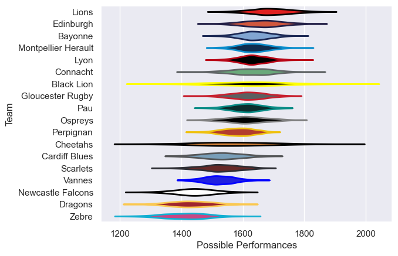
# Standings

## Projected Total Table

| Club                |   Total Matches |   Wins |   Point Differential |   Losing Bonus Points |   Try Bonus Points |   Competition Points |
|:--------------------|----------------:|-------:|---------------------:|----------------------:|-------------------:|---------------------:|
| Lyon                |               4 |    3.1 |             23.5932  |                   0.7 |                2   |                 15.4 |
| Lions               |               4 |    2.9 |             22.1051  |                   1   |                2.7 |                 15.3 |
| Montpellier Herault |               4 |    3.2 |             14.6778  |                   0.8 |                1.8 |                 15.3 |
| Perpignan           |               4 |    2.9 |             11.5848  |                   0.9 |                1.7 |                 14.2 |
| Pau                 |               4 |    2.8 |             14.0868  |                   0.7 |                1.9 |                 13.8 |
| Edinburgh           |               4 |    3   |             14.9592  |                   0.9 |                0.9 |                 13.6 |
| Connacht            |               4 |    2.7 |             17.4758  |                   1.2 |                1.6 |                 13.4 |
| Gloucester Rugby    |               4 |    2.7 |             13.2148  |                   1.2 |                1.3 |                 13.4 |
| Bayonne             |               4 |    2.2 |              4.67014 |                   1.2 |                1.2 |                 11.3 |
| Cheetahs            |               4 |    2   |              3.88361 |                   1.1 |                1.7 |                 10.9 |
| Ospreys             |               4 |    1.9 |              4.9982  |                   1.7 |                1.3 |                 10.6 |
| Black Lion          |               4 |    2   |             -1.8964  |                   1.2 |                0.6 |                  9.7 |
| Cardiff Blues       |               4 |    1.2 |            -11.2908  |                   1.7 |                1   |                  7.5 |
| Vannes              |               4 |    0.9 |            -13.0054  |                   2.3 |                0.8 |                  6.9 |
| Scarlets            |               4 |    1.2 |            -17.9424  |                   1.1 |                0.7 |                  6.7 |
| Newcastle Falcons   |               4 |    1   |            -21.3996  |                   1   |                0.9 |                  6   |
| Dragons             |               4 |    0.2 |            -34.4683  |                   1.6 |                0.6 |                  3   |
| Zebre               |               4 |    0.1 |            -45.2466  |                   0.9 |                0.9 |                  2.1 |

# Future Predictions

## Week 1

### Gloucester Rugby V Edinburgh on 2024/12/06

Average Margin: Gloucester Rugby by 2.3

Average Scoreline: 27-24

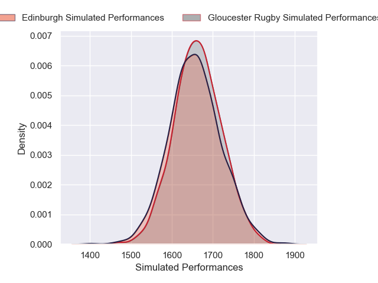
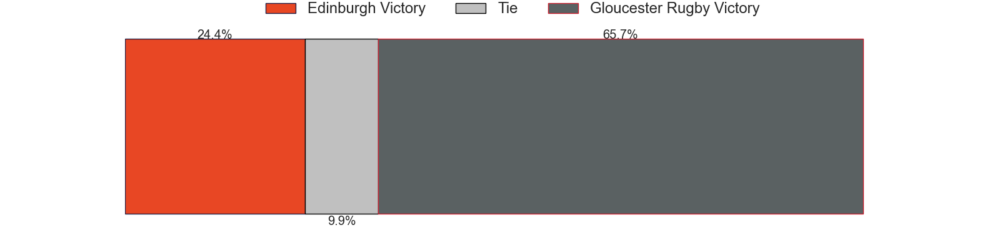
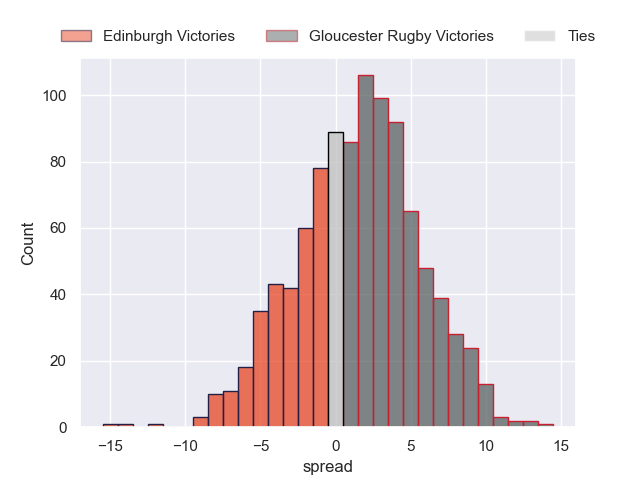

### Dragons V Montpellier Herault on 2024/12/06

Average Margin: Montpellier Herault by 6.3

Average Scoreline: 36-30

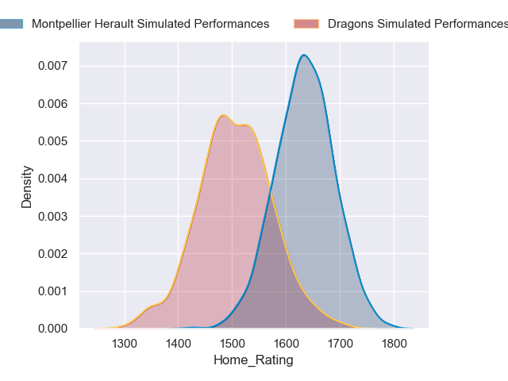
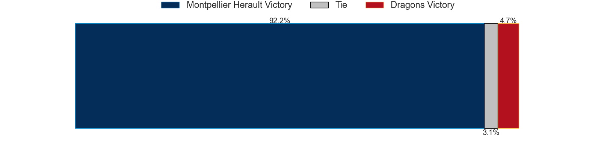
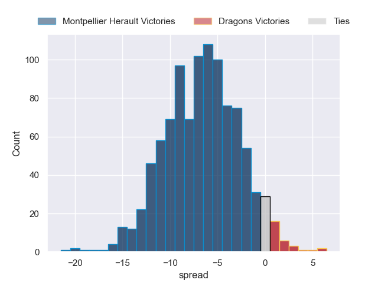

### Lyon V Cardiff Blues on 2024/12/07

Average Margin: Lyon by 8.3

Average Scoreline: 33-24

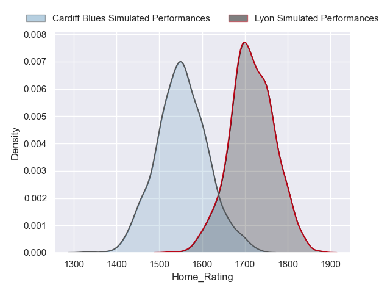

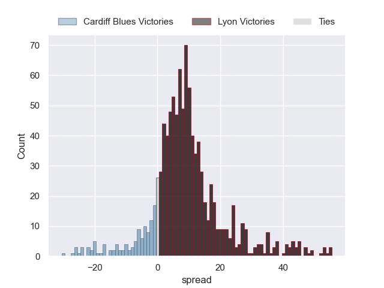

### Connacht V Zebre on 2024/12/07

Average Margin: Connacht by 15.9

Average Scoreline: 39-23

### Black Lion V Vannes on 2024/12/07

Average Margin: Black Lion by 5.4

Average Scoreline: 20-15

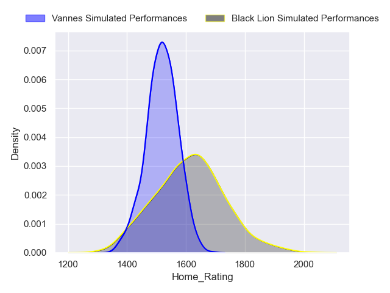

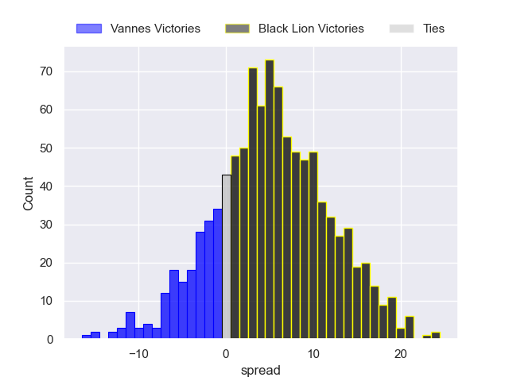

### Bayonne V Scarlets on 2024/12/07

Average Margin: Bayonne by 9.2

Average Scoreline: 30-21

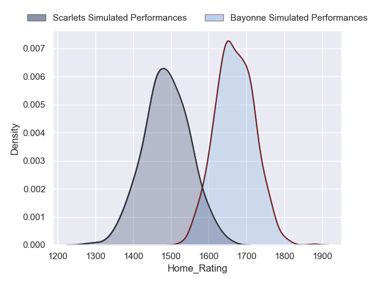
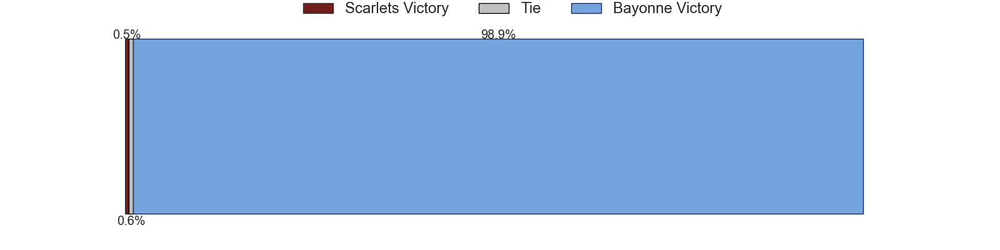
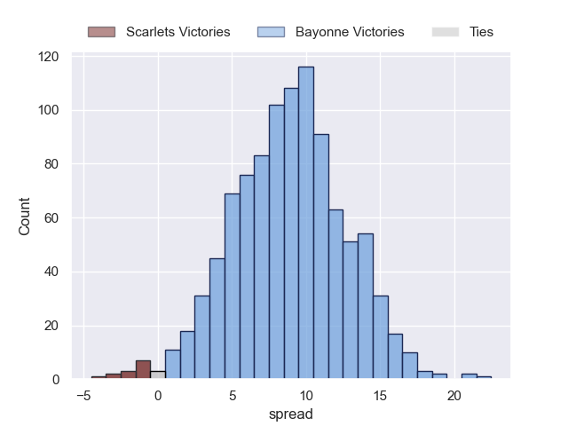

### Pau V Newcastle Falcons on 2024/12/08

Average Margin: Pau by 11.0

Average Scoreline: 29-18

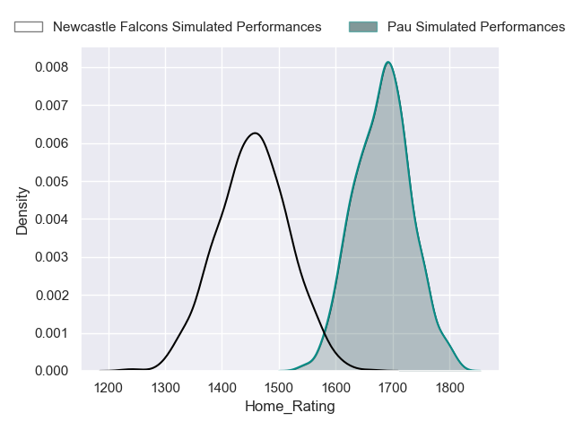

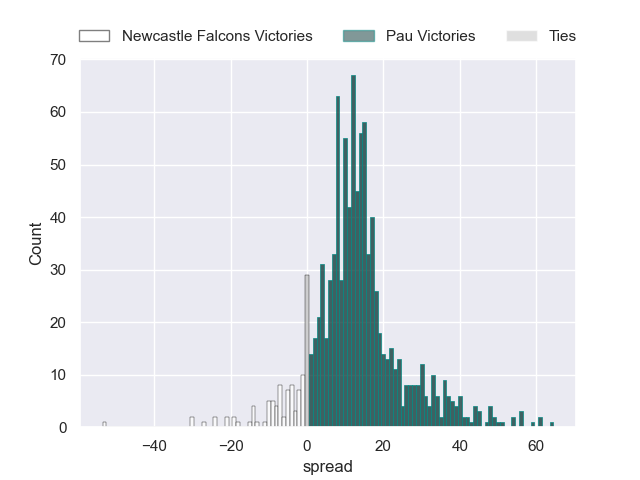

### Ospreys V Lions on 2024/12/08

Average Margin: Lions by 0.0

Average Scoreline: 33-33

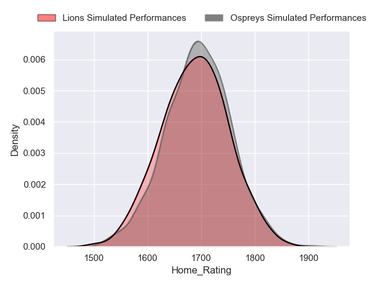

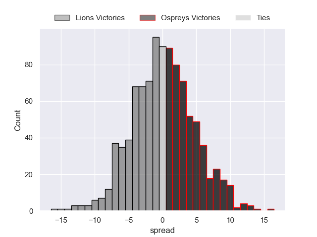

### Cheetahs V Perpignan on 2024/12/08

Average Margin: Cheetahs by 2.0

Average Scoreline: 27-25

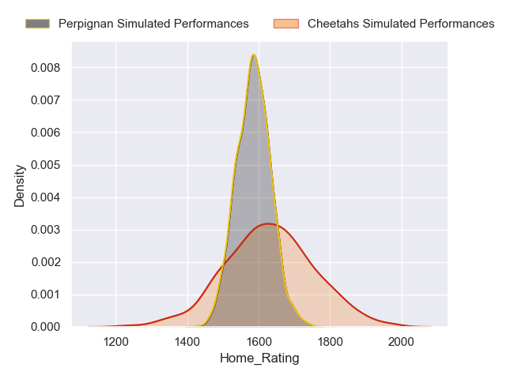
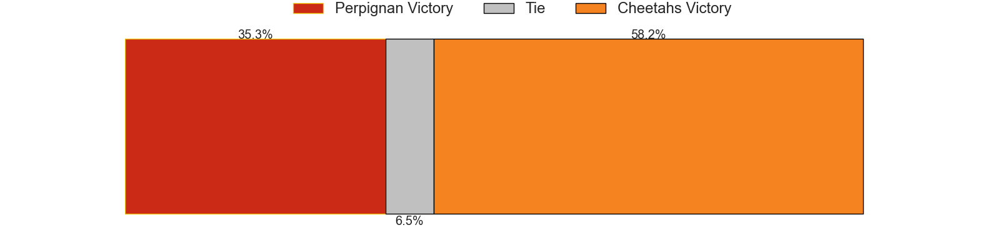
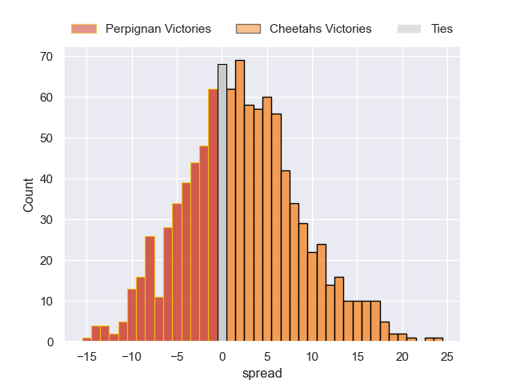

## Week 2

### Edinburgh V Bayonne on 2024/12/13

Average Margin: Edinburgh by 5.9

Average Scoreline: 28-22

### Montpellier Herault V Ospreys on 2024/12/14

Average Margin: Montpellier Herault by 3.3

Average Scoreline: 27-24

### Zebre V Lyon on 2024/12/14

Average Margin: Lyon by 10.0

Average Scoreline: 34-24

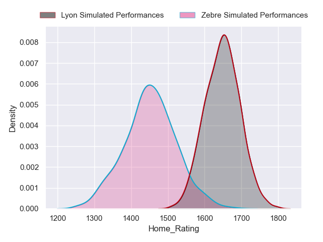

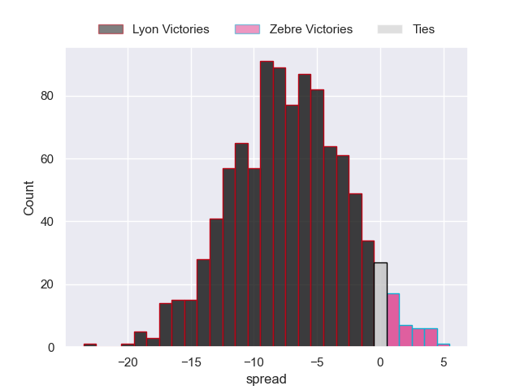

### Lions V Pau on 2024/12/14

Average Margin: Lions by 6.5

Average Scoreline: 38-31

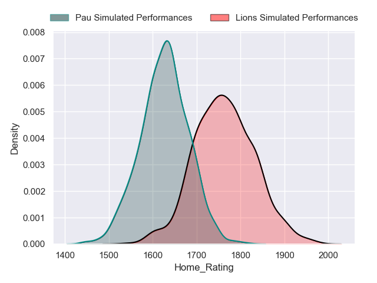
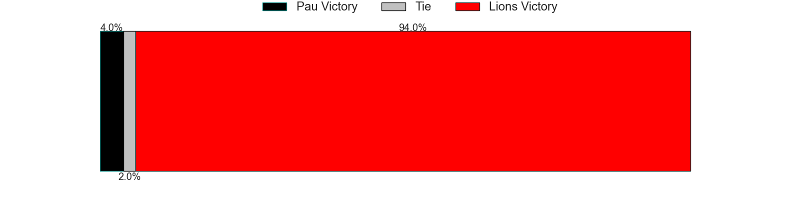
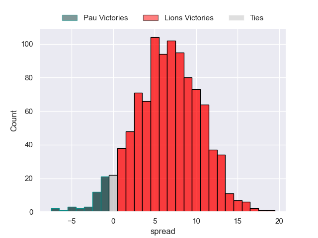

### Vannes V Gloucester Rugby on 2024/12/14

Average Margin: Gloucester Rugby by 2.3

Average Scoreline: 22-20

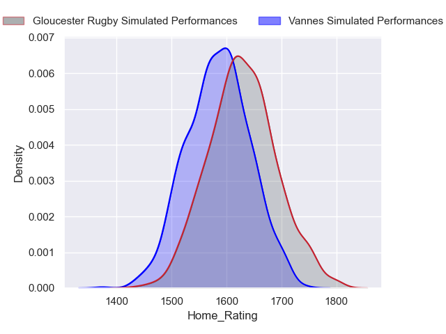

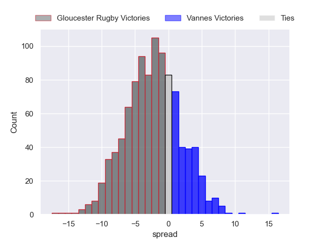

### Cardiff Blues V Cheetahs on 2024/12/14

Average Margin: Cardiff Blues by 3.0

Average Scoreline: 26-23

### Newcastle Falcons V Dragons on 2024/12/15

Average Margin: Newcastle Falcons by 5.7

Average Scoreline: 31-26

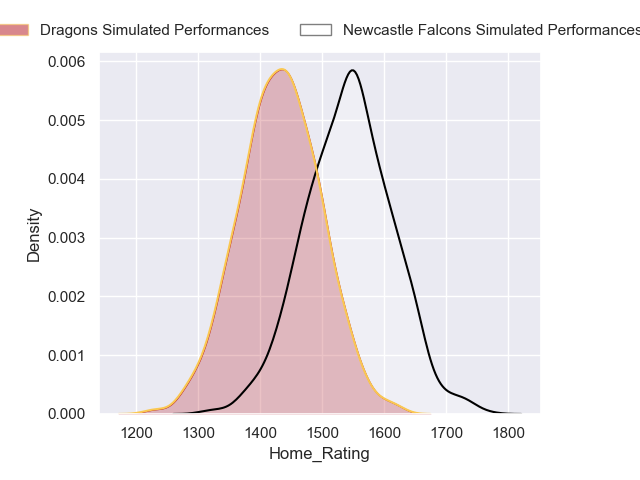
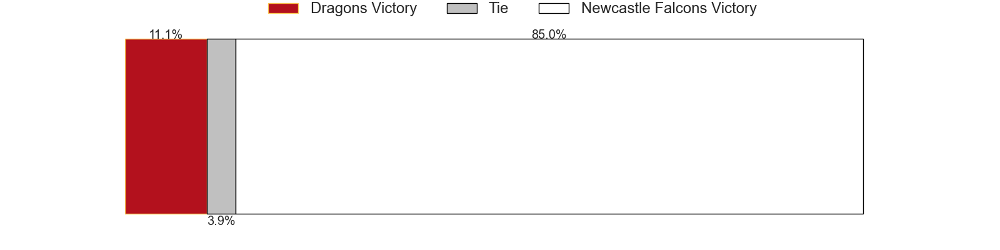
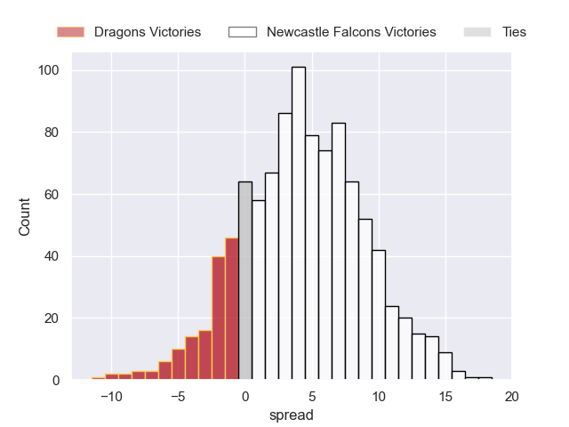

### Scarlets V Black Lion on 2024/12/15

Average Margin: Black Lion by 0.0

Average Scoreline: 23-23

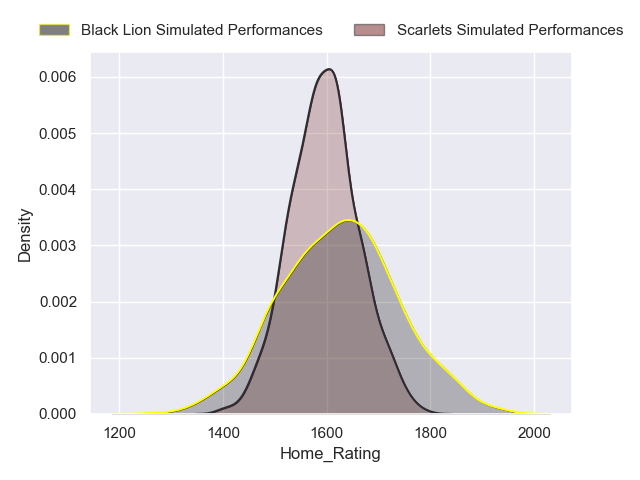

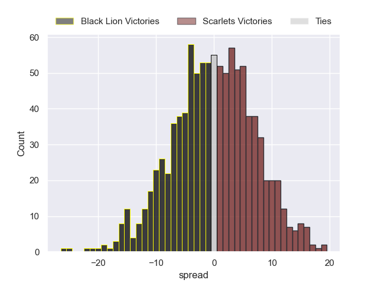

### Perpignan V Connacht on 2024/12/15

Average Margin: Perpignan by 1.4

Average Scoreline: 23-22

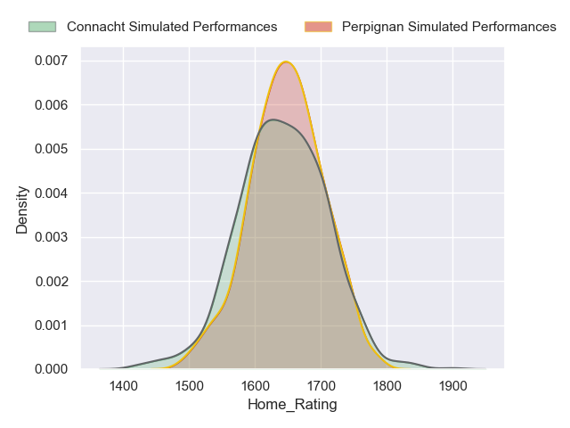

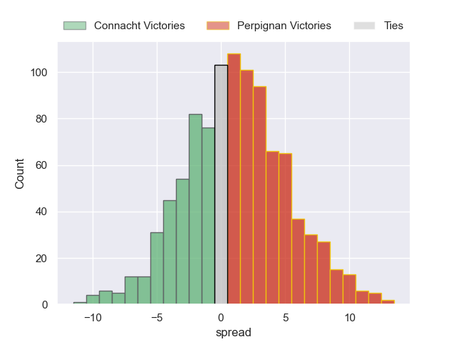

## Week 3

### Gloucester Rugby V Scarlets on 2025/01/10

Average Margin: Gloucester Rugby by 10.7

Average Scoreline: 29-19

### Connacht V Lyon on 2025/01/11

Average Margin: Connacht by 2.3

Average Scoreline: 31-29

### Vannes V Edinburgh on 2025/01/11

Average Margin: Edinburgh by 3.4

Average Scoreline: 23-20

### Perpignan V Cardiff Blues on 2025/01/11

Average Margin: Perpignan by 5.3

Average Scoreline: 27-21

### Black Lion V Bayonne on 2025/01/11

Average Margin: Black Lion by 0.8

Average Scoreline: 22-21

### Montpellier Herault V Lions on 2025/01/11

Average Margin: Montpellier Herault by 0.5

Average Scoreline: 39-39

### Ospreys V Newcastle Falcons on 2025/01/11

Average Margin: Ospreys by 11.5

Average Scoreline: 34-23

### Dragons V Pau on 2025/01/12

Average Margin: Pau by 6.2

Average Scoreline: 35-29

### Cheetahs V Zebre on 2025/01/12

Average Margin: Cheetahs by 12.4

Average Scoreline: 35-23

## Week 4

### Newcastle Falcons V Montpellier Herault on 2025/01/17

Average Margin: Montpellier Herault by 4.6

Average Scoreline: 28-23

### Cardiff Blues V Connacht on 2025/01/17

Average Margin: Connacht by 0.7

Average Scoreline: 25-24

### Scarlets V Vannes on 2025/01/18

Average Margin: Scarlets by 1.9

Average Scoreline: 19-17

### Lions V Dragons on 2025/01/18

Average Margin: Lions by 16.2

Average Scoreline: 44-28

### Pau V Ospreys on 2025/01/18

Average Margin: Pau by 3.3

Average Scoreline: 30-27

### Lyon V Cheetahs on 2025/01/18

Average Margin: Lyon by 7.5

Average Scoreline: 33-25

### Bayonne V Gloucester Rugby on 2025/01/19

Average Margin: Bayonne by 2.1

Average Scoreline: 25-23

### Zebre V Perpignan on 2025/01/19

Average Margin: Perpignan by 6.9

Average Scoreline: 32-25

### Edinburgh V Black Lion on 2025/01/19

Average Margin: Edinburgh by 8.0

Average Scoreline: 27-19

