---  
title: "European Rugby Challenge Cup 2024 Status"  
date: 2025-01-13 6:00:00 -0500  
categories: model review projection  
layout: article  
aside:  
    toc: true  
---
# Current Team Rankings

# Pool Results

## Pool A

## Current Standings

| Club          |   Played |   Wins |   Point Differential |   Losing Bonus Points |   Try Bonus Points |
|:--------------|---------:|-------:|---------------------:|----------------------:|-------------------:|
| Connacht      |        3 |      3 |                   72 |                     0 |                  3 |
| Lyon          |        3 |      2 |                  -15 |                     0 |                  1 |
| Cardiff Blues |        3 |      1 |                    2 |                     1 |                  2 |
| Perpignan     |        3 |      1 |                  -10 |                     0 |                  0 |
| Cheetahs      |        3 |      1 |                  -12 |                     0 |                  0 |
| Zebre         |        3 |      0 |                  -37 |                     2 |                  0 |

### Projected Total Table

| Club          |   Played |   Wins |   Point Differential |   Losing Bonus Points |   Try Bonus Points |   Competition Points |
|:--------------|---------:|-------:|---------------------:|----------------------:|-------------------:|---------------------:|
| Connacht      |        4 |    3.3 |             67.3154  |                   0.4 |                3.2 |                 16.7 |
| Lyon          |        4 |    2.4 |            -16.9929  |                   0.3 |                1.2 |                 11.1 |
| Cardiff Blues |        4 |    1.7 |              6.68462 |                   1.2 |                2.2 |                 10.3 |
| Cheetahs      |        4 |    1.6 |            -10.0071  |                   0.2 |                0.5 |                  9.1 |
| Perpignan     |        4 |    1.1 |            -18.7748  |                   0.3 |                0.1 |                  6.9 |
| Zebre         |        4 |    0.9 |            -28.2252  |                   2.1 |                0.5 |                  6   |

## Pool B

## Current Standings

| Club                |   Played |   Wins |   Point Differential |   Losing Bonus Points |   Try Bonus Points |
|:--------------------|---------:|-------:|---------------------:|----------------------:|-------------------:|
| Montpellier Herault |        3 |      3 |                   71 |                     0 |                  2 |
| Pau                 |        3 |      2 |                   14 |                     0 |                  2 |
| Ospreys             |        3 |      2 |                   -8 |                     0 |                  2 |
| Dragons             |        3 |      1 |                   -5 |                     1 |                  0 |
| Lions               |        3 |      1 |                  -31 |                     0 |                  1 |
| Newcastle Falcons   |        3 |      0 |                  -41 |                     0 |                  0 |

### Projected Total Table

| Club                |   Played |   Wins |   Point Differential |   Losing Bonus Points |   Try Bonus Points |   Competition Points |
|:--------------------|---------:|-------:|---------------------:|----------------------:|-------------------:|---------------------:|
| Montpellier Herault |        4 |    3.7 |             75.4375  |                   0.2 |                2.5 |                 17.5 |
| Ospreys             |        4 |    2.5 |             -8.16686 |                   0.3 |                2.3 |                 12.6 |
| Pau                 |        4 |    2.5 |             14.1669  |                   0.4 |                2.1 |                 12.5 |
| Lions               |        4 |    1.6 |            -28.3887  |                   0.2 |                1.6 |                  8.3 |
| Dragons             |        4 |    1.4 |             -7.61129 |                   1.3 |                0.3 |                  7.1 |
| Newcastle Falcons   |        4 |    0.3 |            -45.4375  |                   0.4 |                0.1 |                  1.7 |

## Pool C

## Current Standings

| Club             |   Played |   Wins |   Point Differential |   Losing Bonus Points |   Try Bonus Points |
|:-----------------|---------:|-------:|---------------------:|----------------------:|-------------------:|
| Edinburgh        |        3 |      2 |                   39 |                     1 |                  2 |
| Gloucester Rugby |        3 |      2 |                    5 |                     0 |                  1 |
| Bayonne          |        3 |      2 |                  -14 |                     0 |                  1 |
| Vannes           |        3 |      1 |                   17 |                     2 |                  1 |
| Scarlets         |        3 |      1 |                   -7 |                     1 |                  1 |
| Black Lion       |        3 |      1 |                  -40 |                     0 |                  0 |

### Projected Total Table

| Club             |   Played |   Wins |   Point Differential |   Losing Bonus Points |   Try Bonus Points |   Competition Points |
|:-----------------|---------:|-------:|---------------------:|----------------------:|-------------------:|---------------------:|
| Edinburgh        |        4 |    2.4 |            34.7787   |                   1.2 |                2.1 |                 12.8 |
| Bayonne          |        4 |    2.8 |            -7.99558  |                   0.1 |                1.4 |                 12.7 |
| Gloucester Rugby |        4 |    2.2 |            -1.00442  |                   0.4 |                1.2 |                 10.5 |
| Scarlets         |        4 |    1.9 |             0.547125 |                   1.1 |                1.2 |                  9.8 |
| Vannes           |        4 |    1.1 |             9.45287  |                   2.4 |                1.2 |                  8.1 |
| Black Lion       |        4 |    1.6 |           -35.7787   |                   0.2 |                0.2 |                  7   |

# Projected Playoff Results

|                      | Reach Round of Sixteen   | Reach Quarterfinals   | Reach Semifinals   | Reach Final   | Win Final   |
|:---------------------|:-------------------------|:----------------------|:-------------------|:--------------|:------------|
| Montpellier Herault  | 85.4 %                   | 81.5 %                | 66.9 %             | 49.2 %        | 27.4 %      |
| Cheetahs             | 59.6 %                   | 50.4 %                | 31.3 %             | 21.5 %        | 16.4 %      |
| Connacht             | 78.3 %                   | 74.0 %                | 52.4 %             | 35.1 %        | 16.2 %      |
| Ospreys              | 72.2 %                   | 70.1 %                | 42.3 %             | 21.1 %        | 10.7 %      |
| Edinburgh            | 65.3 %                   | 80.7 %                | 46.5 %             | 22.1 %        | 9.3 %       |
| Cardiff Blues        | 63.8 %                   | 66.2 %                | 34.0 %             | 15.8 %        | 7.6 %       |
| Lions                | 47.9 %                   | 21.9 %                | 8.2 %              | 4.8 %         | 3.0 %       |
| Bayonne              | 67.9 %                   | 61.1 %                | 30.1 %             | 9.8 %         | 2.8 %       |
| Dragons              | 29.4 %                   | 13.8 %                | 5.0 %              | 2.4 %         | 1.8 %       |
| Pau                  | 56.6 %                   | 68.5 %                | 25.2 %             | 5.8 %         | 0.9 %       |
| Lyon                 | 69.4 %                   | 40.8 %                | 14.8 %             | 2.9 %         | 0.9 %       |
| Black Lion           | 1.1 %                    | 1.2 %                 | 1.1 %              | 1.1 %         | 0.9 %       |
| Gloucester Rugby     | 74.5 %                   | 35.2 %                | 12.1 %             | 3.1 %         | 0.6 %       |
| Scarlets             | 51.6 %                   | 45.4 %                | 11.7 %             | 2.4 %         | 0.4 %       |
| Ulster               | 67.0 %                   | 20.7 %                | 5.1 %              | 0.7 %         | 0.2 %       |
| Stade Francais Paris | 82.3 %                   | 16.9 %                | 2.0 %              | 0.5 %         | 0.2 %       |
| Stormers             | 17.9 %                   | 5.9 %                 | 2.1 %              | 0.4 %         | 0.2 %       |
| Harlequins           | 26.0 %                   | 4.7 %                 | 0.9 %              | 0.4 %         | 0.2 %       |
| Bath Rugby           | 56.2 %                   | 10.1 %                | 2.0 %              | 0.4 %         | 0.1 %       |
| Benetton Treviso     | 13.6 %                   | 4.9 %                 | 1.6 %              | 0.1 %         | 0.1 %       |
| Zebre                | 4.1 %                    | 1.2 %                 | 0.3 %              | 0.1 %         | 0.1 %       |
| Vannes               | 9.4 %                    | 9.6 %                 | 2.1 %              | 0.2 %         | 0.0 %       |
| Exeter Chiefs        | 14.5 %                   | 3.3 %                 | 0.6 %              | 0.1 %         | 0.0 %       |
| Sale Sharks          | 30.2 %                   | 3.3 %                 | 0.9 %              | 0.0 %         | 0.0 %       |
| Perpignan            | 22.1 %                   | 2.9 %                 | 0.4 %              | 0.0 %         | 0.0 %       |
| Racing 92            | 13.7 %                   | 2.5 %                 | 0.3 %              | 0.0 %         | 0.0 %       |
| Bulls                | 1.8 %                    | 0.2 %                 | 0.1 %              | 0.0 %         | 0.0 %       |
| Bristol Rugby        | 4.8 %                    | 1.5 %                 | 0.0 %              | 0.0 %         | 0.0 %       |
| Clermont Auvergne    | 11.7 %                   | 0.7 %                 | 0.0 %              | 0.0 %         | 0.0 %       |
| Castres Olympique    | 0.4 %                    | 0.5 %                 | 0.0 %              | 0.0 %         | 0.0 %       |
| chall SS_3           | 0.2 %                    | 0.2 %                 | 0.0 %              | 0.0 %         | 0.0 %       |
| chall SS_2           | 0.0 %                    | 0.1 %                 | 0.0 %              | 0.0 %         | 0.0 %       |
| chall SS_13          | 0.3 %                    | 0.0 %                 | 0.0 %              | 0.0 %         | 0.0 %       |
| Sharks               | 0.2 %                    | 0.0 %                 | 0.0 %              | 0.0 %         | 0.0 %       |
| La Rochelle          | 0.1 %                    | 0.0 %                 | 0.0 %              | 0.0 %         | 0.0 %       |
| chall SS_15          | 0.1 %                    | 0.0 %                 | 0.0 %              | 0.0 %         | 0.0 %       |
| chall SS_16          | 0.1 %                    | 0.0 %                 | 0.0 %              | 0.0 %         | 0.0 %       |
| chall SS_5           | 0.1 %                    | 0.0 %                 | 0.0 %              | 0.0 %         | 0.0 %       |
| chall SS_6           | 0.1 %                    | 0.0 %                 | 0.0 %              | 0.0 %         | 0.0 %       |
| chall SS_8           | 0.1 %                    | 0.0 %                 | 0.0 %              | 0.0 %         | 0.0 %       |

# Pool Match Predictions

## Pool A

### Cardiff Blues V Connacht on 2025/01/17

Average Margin: Cardiff Blues by 4.7

Average Scoreline: 29-24

### Lyon V Cheetahs on 2025/01/18

Average Margin: Cheetahs by 2.0

Average Scoreline: 28-26

### Zebre V Perpignan on 2025/01/19

Average Margin: Zebre by 8.8

Average Scoreline: 30-22

## Pool B

### Newcastle Falcons V Montpellier Herault on 2025/01/17

Average Margin: Montpellier Herault by 4.4

Average Scoreline: 28-23

### Lions V Dragons on 2025/01/18

Average Margin: Lions by 2.6

Average Scoreline: 31-28

### Pau V Ospreys on 2025/01/18

Average Margin: Pau by 0.2

Average Scoreline: 31-31

## Pool C

### Scarlets V Vannes on 2025/01/18

Average Margin: Scarlets by 7.5

Average Scoreline: 27-19

### Edinburgh V Black Lion on 2025/01/19

Average Margin: Black Lion by 4.2

Average Scoreline: 21-17

### Bayonne V Gloucester Rugby on 2025/01/19

Average Margin: Bayonne by 6.0

Average Scoreline: 29-23

# Knockout Match Predictions

## Sixteens

### Cheetahs V Stade Francais Paris on 2025/04/04

Average Margin: Cheetahs by 12.0

### Pau V Bayonne on 2025/04/04

Average Margin: Pau by 4.1

### Edinburgh V Sale Sharks on 2025/04/04

Average Margin: Edinburgh by 10.7

### Lyon V Stormers on 2025/04/04

Average Margin: Stormers by 0.8

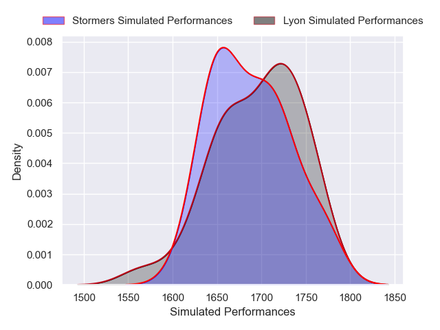

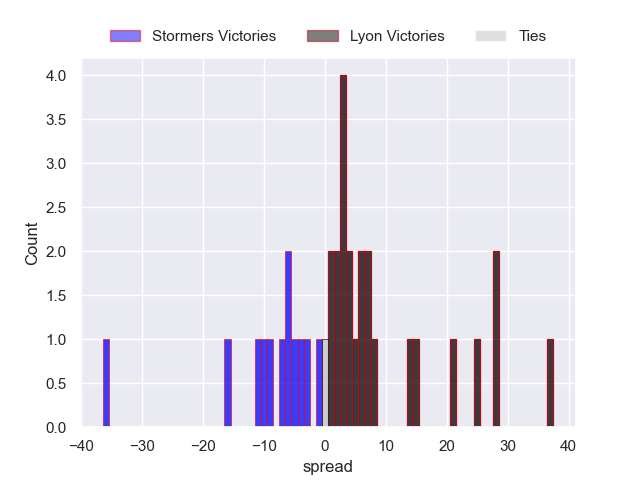

### Edinburgh V Cheetahs on 2025/04/04

Average Margin: Cheetahs by 2.5

### Lyon V Scarlets on 2025/04/04

Average Margin: Lyon by 0.9

### Pau V Lions on 2025/04/04

Average Margin: Lions by 2.6

### Connacht V Ospreys on 2025/04/04

Average Margin: Connacht by 2.4

### Pau V Sale Sharks on 2025/04/04

Average Margin: Pau by 11.0

### Ospreys V Ulster on 2025/04/04

Average Margin: Ospreys by 6.3

### Edinburgh V Stormers on 2025/04/04

Average Margin: Edinburgh by 2.0

### Bayonne V Scarlets on 2025/04/04

Average Margin: Bayonne by 3.9

### Bayonne V Sale Sharks on 2025/04/04

Average Margin: Bayonne by 11.4

### Pau V Gloucester Rugby on 2025/04/04

Average Margin: Pau by 2.9

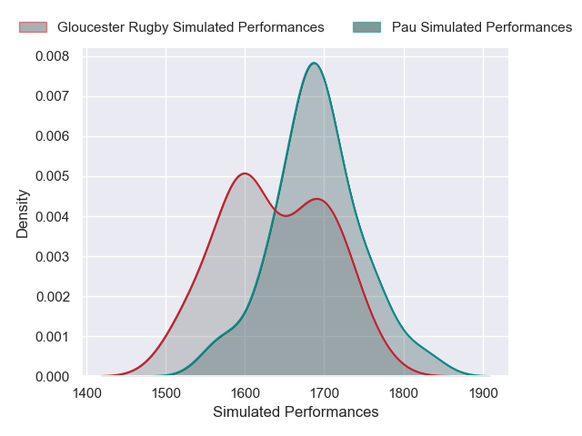

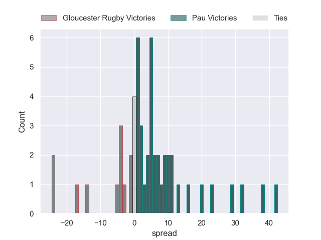

### Connacht V Vannes on 2025/04/04

Average Margin: Connacht by 5.7

### Gloucester Rugby V Lions on 2025/04/04

Average Margin: Lions by 1.0

### Bayonne V Vannes on 2025/04/04

Average Margin: Bayonne by 2.3

### Pau V Vannes on 2025/04/04

Average Margin: Pau by 6.8

### Connacht V Cheetahs on 2025/04/04

Average Margin: Cheetahs by 2.2

### Gloucester Rugby V Dragons on 2025/04/04

Average Margin: Dragons by 4.7

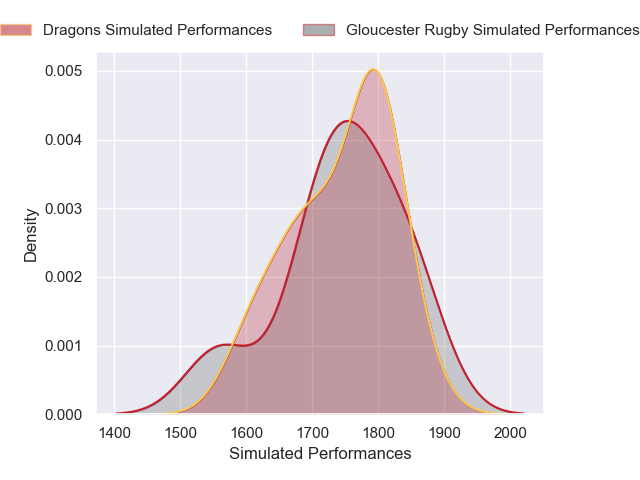

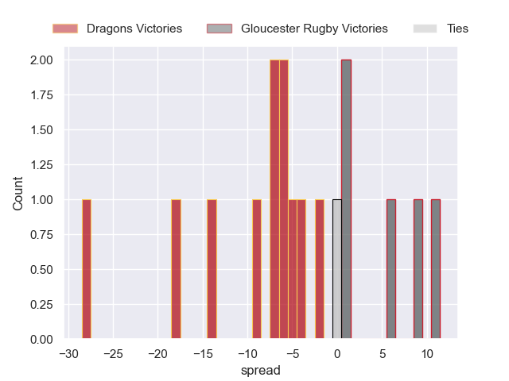

### Lyon V Cardiff Blues on 2025/04/04

Average Margin: Cardiff Blues by 0.3

### Edinburgh V Pau on 2025/04/04

Average Margin: Edinburgh by 7.7

### Bayonne V Lions on 2025/04/04

Average Margin: Lions by 0.2

### Montpellier Herault V Vannes on 2025/04/04

Average Margin: Montpellier Herault by 10.8

### Bayonne V Gloucester Rugby on 2025/04/04

Average Margin: Bayonne by 5.4

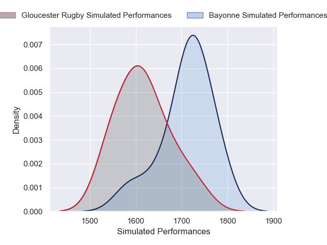
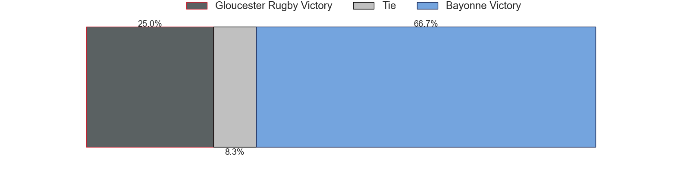
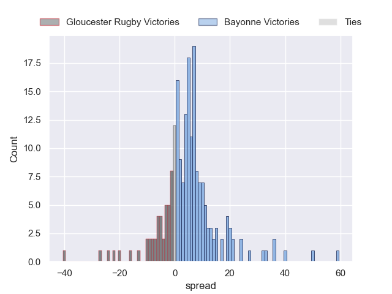

### Edinburgh V Stade Francais Paris on 2025/04/04

Average Margin: Edinburgh by 7.9

### Edinburgh V Bayonne on 2025/04/04

Average Margin: Edinburgh by 2.8

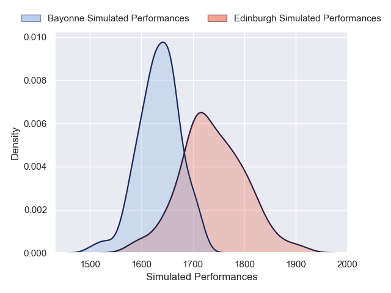

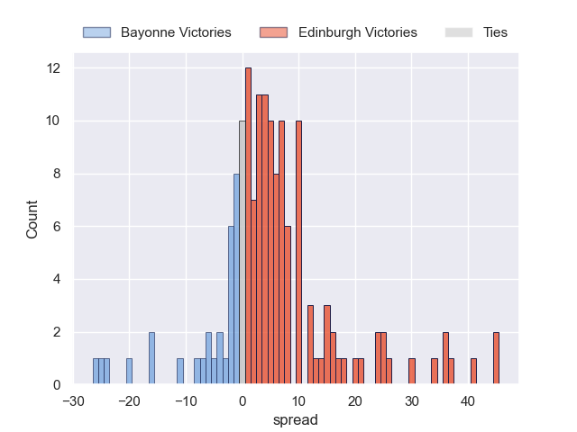

### Bayonne V Pau on 2025/04/04

Average Margin: Bayonne by 5.1

### Pau V Bristol Rugby on 2025/04/04

Average Margin: Pau by 2.4

### Vannes V Bath Rugby on 2025/04/04

Average Margin: Vannes by 7.3

### Pau V Stormers on 2025/04/04

Average Margin: Pau by 0.8

### Edinburgh V Ulster on 2025/04/04

Average Margin: Edinburgh by 6.3

### Bayonne V Bath Rugby on 2025/04/04

Average Margin: Bayonne by 5.8

### Scarlets V Stormers on 2025/04/04

Average Margin: Scarlets by 2.5

### Montpellier Herault V Pau on 2025/04/04

Average Margin: Montpellier Herault by 9.2

### Connacht V Zebre on 2025/04/04

Average Margin: Connacht by 4.5

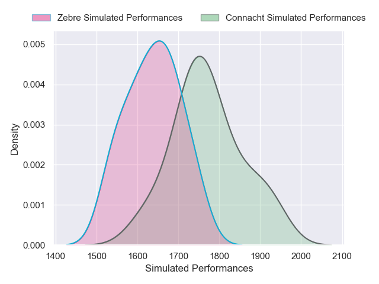

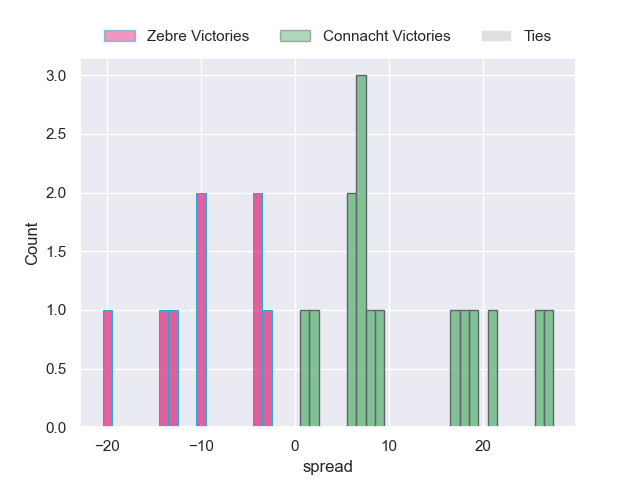

### Ospreys V Lions on 2025/04/04

Average Margin: Ospreys by 2.4

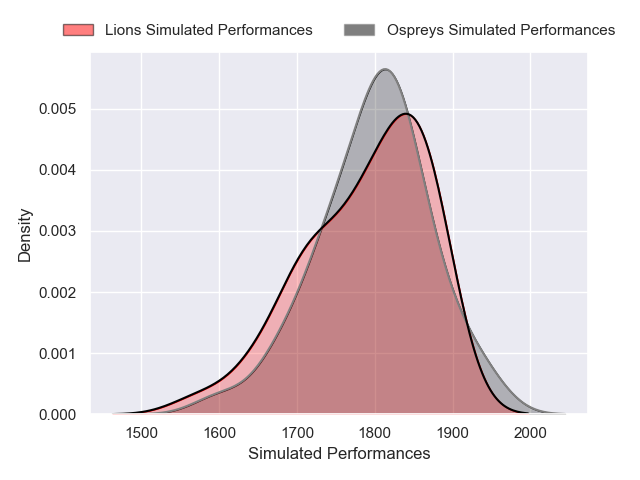

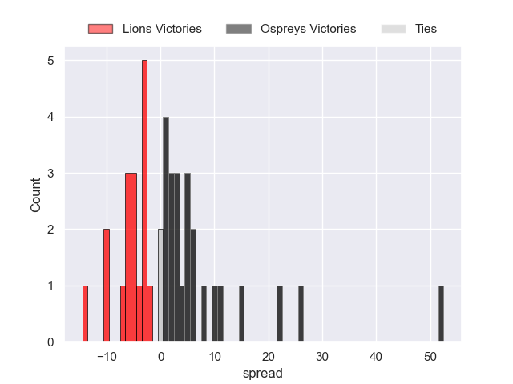

### Ospreys V Dragons on 2025/04/04

Average Margin: Ospreys by 3.9

### Bayonne V Ospreys on 2025/04/04

Average Margin: Bayonne by 0.6

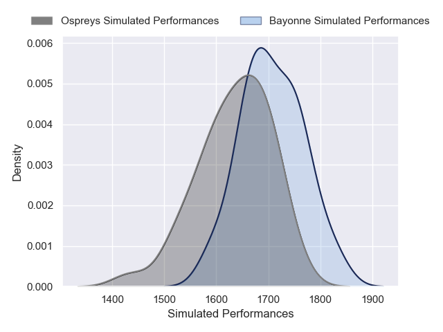

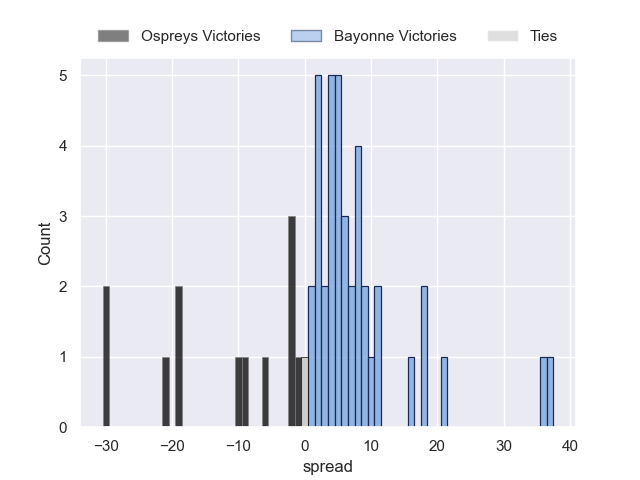

### Pau V Lyon on 2025/04/04

Average Margin: Pau by 6.4

### Gloucester Rugby V Edinburgh on 2025/04/04

Average Margin: Gloucester Rugby by 2.5

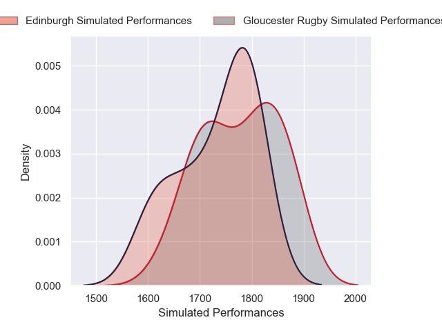

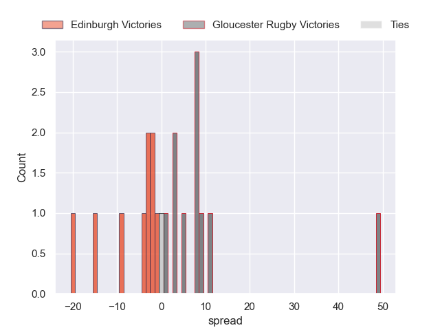

### Connacht V Dragons on 2025/04/04

Average Margin: Connacht by 2.3

### Ospreys V Bayonne on 2025/04/04

Average Margin: Ospreys by 8.3

### Edinburgh V Racing 92 on 2025/04/04

Average Margin: Edinburgh by 8.1

### Lyon V Racing 92 on 2025/04/04

Average Margin: Lyon by 0.1

### Vannes V Harlequins on 2025/04/04

Average Margin: Vannes by 4.5

### Cheetahs V Sale Sharks on 2025/04/04

Average Margin: Cheetahs by 15.8

### Ospreys V Pau on 2025/04/04

Average Margin: Ospreys by 9.4

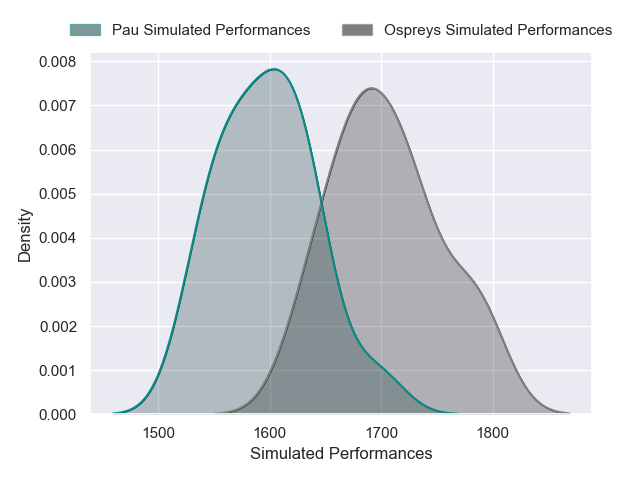

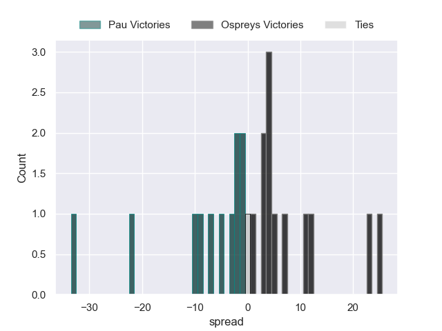

### Pau V Dragons on 2025/04/04

Average Margin: Dragons by 5.2

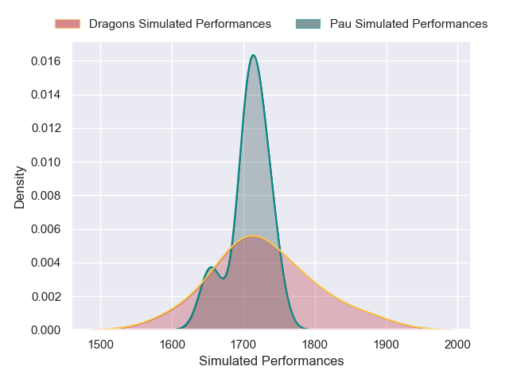

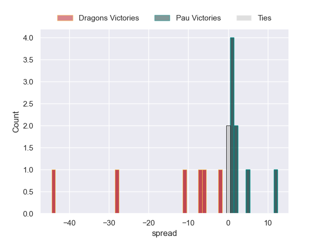

### Ospreys V Racing 92 on 2025/04/04

Average Margin: Ospreys by 7.5

### Pau V Stade Francais Paris on 2025/04/04

Average Margin: Pau by 3.8

### Connacht V Cardiff Blues on 2025/04/04

Average Margin: Connacht by 5.1

### Pau V Harlequins on 2025/04/04

Average Margin: Pau by 6.0

### Ospreys V Lyon on 2025/04/04

Average Margin: Ospreys by 9.0

### Montpellier Herault V Scarlets on 2025/04/04

Average Margin: Montpellier Herault by 6.3

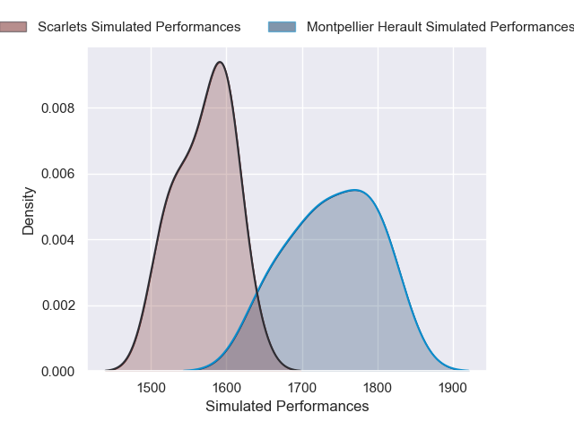

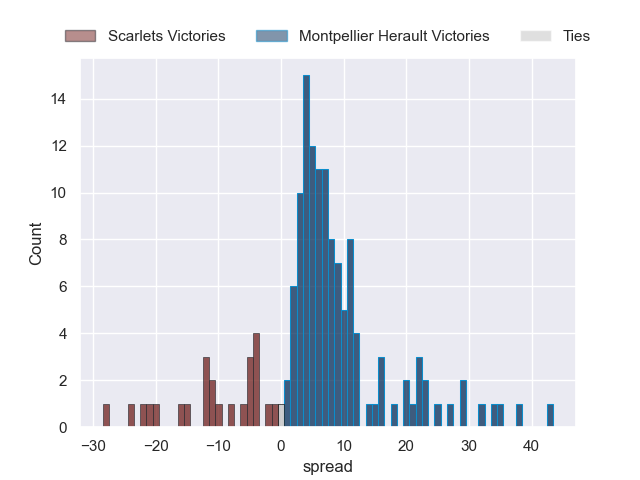

### Scarlets V Clermont Auvergne on 2025/04/04

Average Margin: Scarlets by 8.9

### Bayonne V Dragons on 2025/04/04

Average Margin: Bayonne by 1.2

### Ospreys V Clermont Auvergne on 2025/04/04

Average Margin: Ospreys by 13.0

### Ospreys V Perpignan on 2025/04/04

Average Margin: Ospreys by 17.7

### Cheetahs V Clermont Auvergne on 2025/04/04

Average Margin: Cheetahs by 16.7

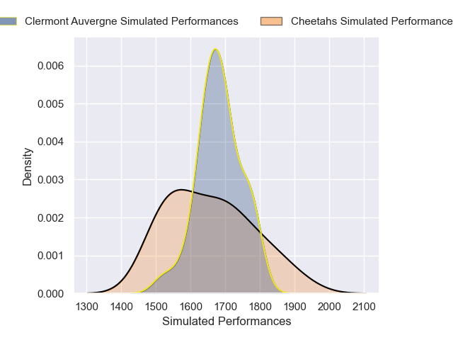

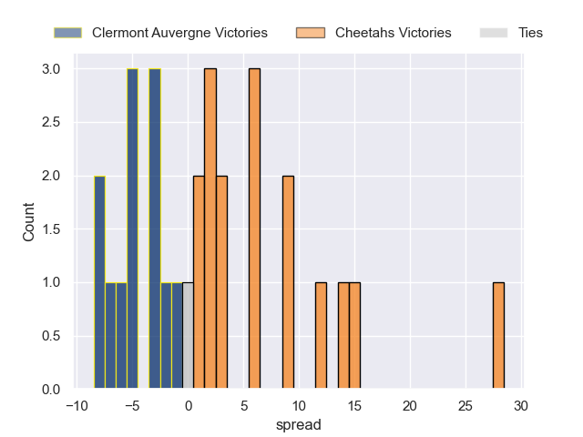

### Pau V Racing 92 on 2025/04/04

Average Margin: Pau by 4.0

### Cheetahs V Racing 92 on 2025/04/04

Average Margin: Cheetahs by 12.9

### Pau V Ulster on 2025/04/04

Average Margin: Ulster by 3.4

### Vannes V Ulster on 2025/04/04

Average Margin: Vannes by 3.4

### Gloucester Rugby V Clermont Auvergne on 2025/04/04

Average Margin: Gloucester Rugby by 2.7

### Ospreys V Stormers on 2025/04/04

Average Margin: Ospreys by 4.9

### Pau V Perpignan on 2025/04/04

Average Margin: Pau by 12.6

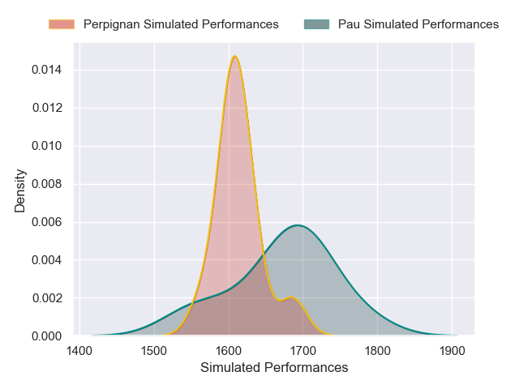

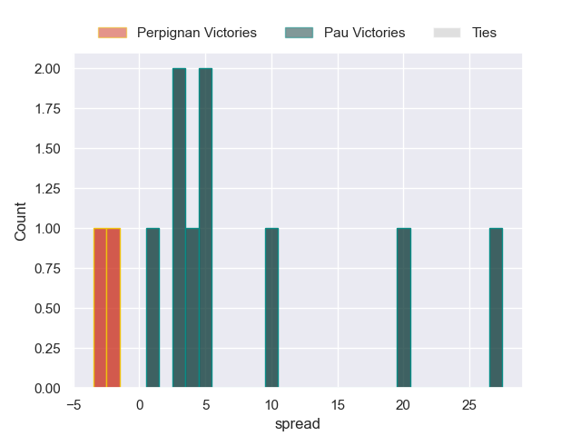

### Cardiff Blues V Clermont Auvergne on 2025/04/04

Average Margin: Cardiff Blues by 10.2

### Edinburgh V Bath Rugby on 2025/04/04

Average Margin: Edinburgh by 9.3

### Pau V Benetton Treviso on 2025/04/04

Average Margin: Benetton Treviso by 0.2

### Bayonne V Perpignan on 2025/04/04

Average Margin: Bayonne by 10.7

### Bayonne V Cardiff Blues on 2025/04/04

Average Margin: Cardiff Blues by 1.3

### Ospreys V Cheetahs on 2025/04/04

Average Margin: Ospreys by 2.3

### Scarlets V Racing 92 on 2025/04/04

Average Margin: Scarlets by 2.5

### Ospreys V Cardiff Blues on 2025/04/04

Average Margin: Ospreys by 6.5

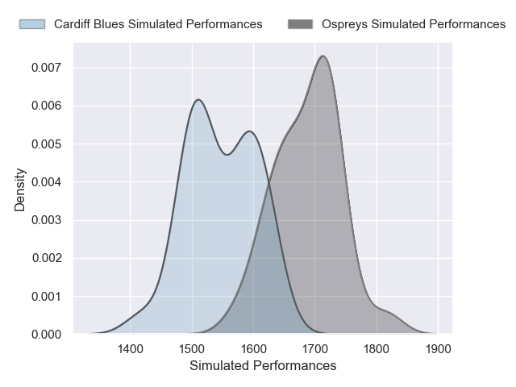

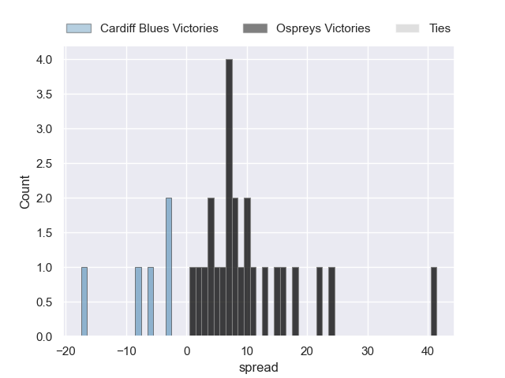

### Bayonne V Lyon on 2025/04/04

Average Margin: Bayonne by 3.8

### Scarlets V Sale Sharks on 2025/04/04

Average Margin: Scarlets by 15.5

### Edinburgh V Dragons on 2025/04/04

Average Margin: Edinburgh by 1.4

### Pau V Clermont Auvergne on 2025/04/04

Average Margin: Pau by 13.2

### Lyon V Pau on 2025/04/04

Average Margin: Lyon by 5.4

### Bayonne V Racing 92 on 2025/04/04

Average Margin: Bayonne by 6.3

### Vannes V Sale Sharks on 2025/04/04

Average Margin: Vannes by 7.7

### Gloucester Rugby V Stade Francais Paris on 2025/04/04

Average Margin: Gloucester Rugby by 2.3

### Cardiff Blues V Sale Sharks on 2025/04/04

Average Margin: Cardiff Blues by 11.8

### Edinburgh V Harlequins on 2025/04/04

Average Margin: Edinburgh by 6.1

### Vannes V Stormers on 2025/04/04

Average Margin: Stormers by 0.6

### Edinburgh V Ospreys on 2025/04/04

Average Margin: Edinburgh by 4.1

### Bayonne V Cheetahs on 2025/04/04

Average Margin: Cheetahs by 5.7

### Gloucester Rugby V Cardiff Blues on 2025/04/04

Average Margin: Gloucester Rugby by 0.1

### Gloucester Rugby V Ospreys on 2025/04/04

Average Margin: Ospreys by 0.1

### Gloucester Rugby V Scarlets on 2025/04/04

Average Margin: Gloucester Rugby by 5.8

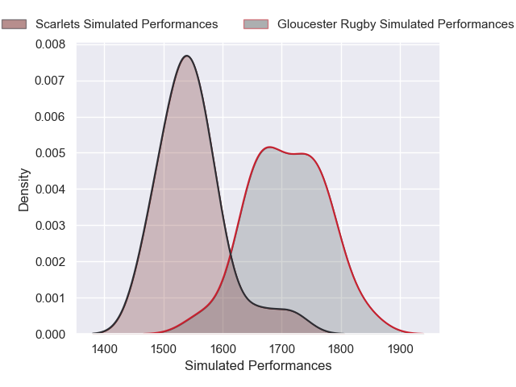
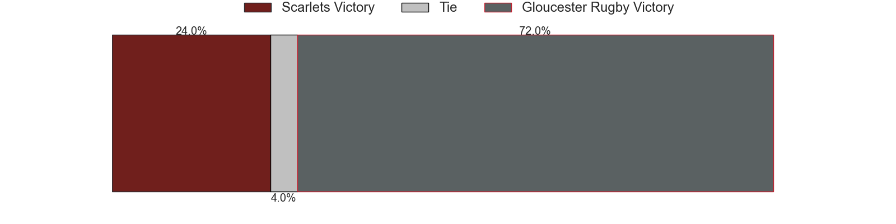
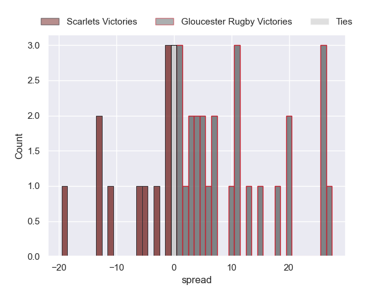

### Cheetahs V Bath Rugby on 2025/04/04

Average Margin: Cheetahs by 15.8

### Gloucester Rugby V Bayonne on 2025/04/04

Average Margin: Gloucester Rugby by 4.7

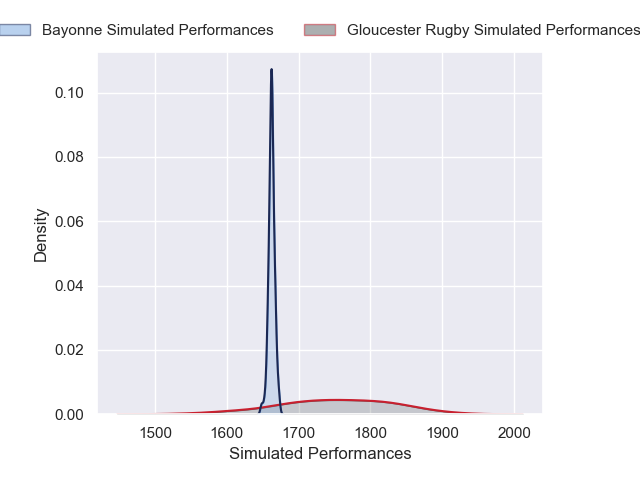
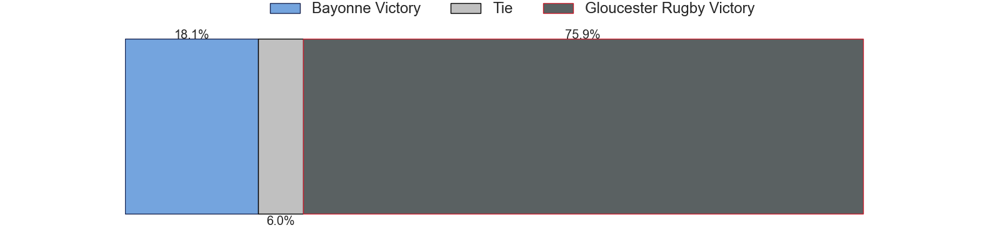
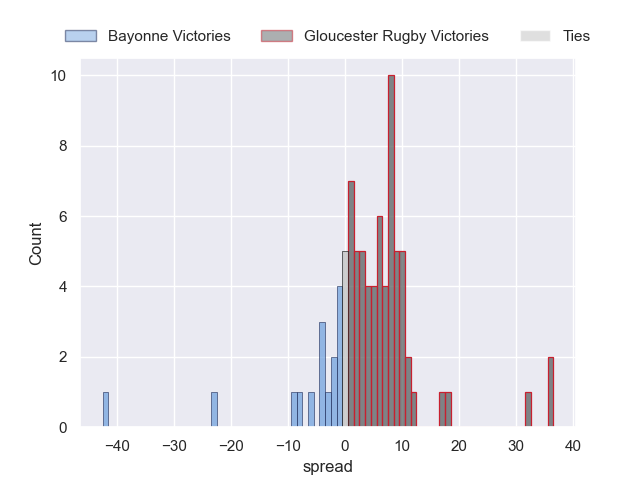

### Edinburgh V Exeter Chiefs on 2025/04/04

Average Margin: Edinburgh by 8.5

### Cardiff Blues V Racing 92 on 2025/04/04

Average Margin: Cardiff Blues by 11.3

### Cardiff Blues V Ulster on 2025/04/04

Average Margin: Cardiff Blues by 8.2

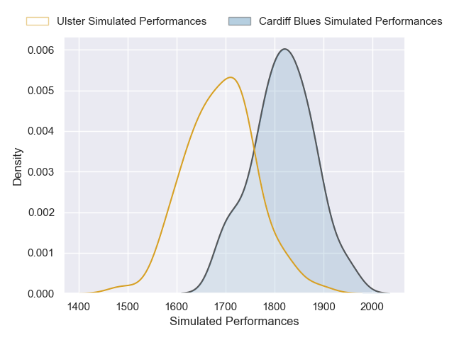
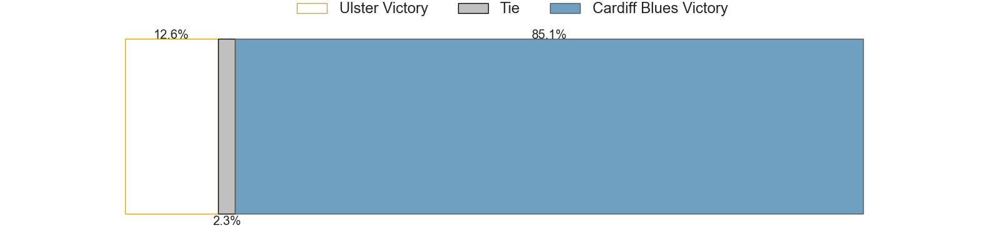
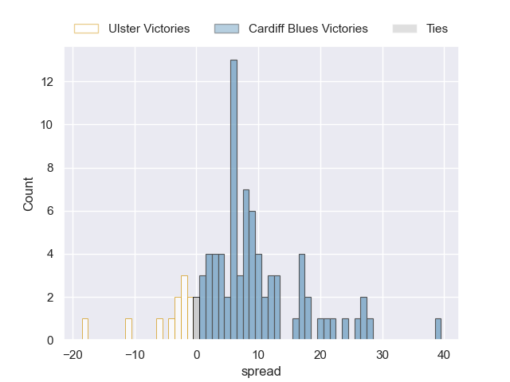

### Montpellier Herault V Ospreys on 2025/04/04

Average Margin: Montpellier Herault by 3.4

### Scarlets V Bristol Rugby on 2025/04/04

Average Margin: Scarlets by 7.0

### Cheetahs V Stormers on 2025/04/04

Average Margin: Cheetahs by 15.5

### Edinburgh V Perpignan on 2025/04/04

Average Margin: Edinburgh by 10.2

### Ospreys V Bath Rugby on 2025/04/04

Average Margin: Ospreys by 10.5

### Scarlets V Benetton Treviso on 2025/04/04

Average Margin: Scarlets by 2.3

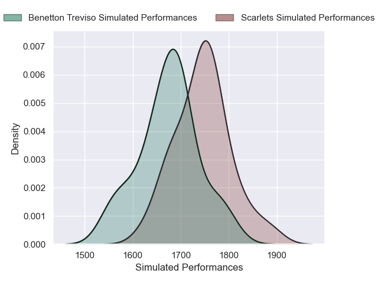

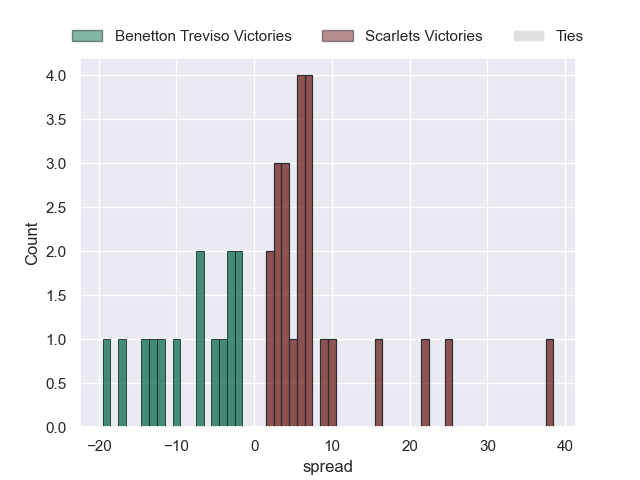

### Ospreys V Benetton Treviso on 2025/04/04

Average Margin: Ospreys by 0.6

### Gloucester Rugby V Ulster on 2025/04/04

Average Margin: Gloucester Rugby by 5.0

### Connacht V Bayonne on 2025/04/04

Average Margin: Connacht by 6.0

### Edinburgh V Lyon on 2025/04/04

Average Margin: Edinburgh by 8.6

### Edinburgh V Benetton Treviso on 2025/04/04

Average Margin: Edinburgh by 2.5

### Lyon V Sale Sharks on 2025/04/04

Average Margin: Lyon by 10.2

### Ospreys V Edinburgh on 2025/04/04

Average Margin: Ospreys by 6.2

### Montpellier Herault V Lyon on 2025/04/04

Average Margin: Montpellier Herault by 9.6

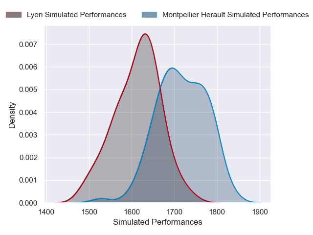

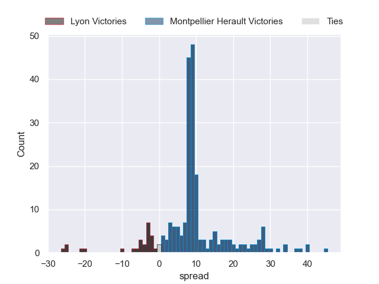

### Cheetahs V Benetton Treviso on 2025/04/04

Average Margin: Cheetahs by 13.2

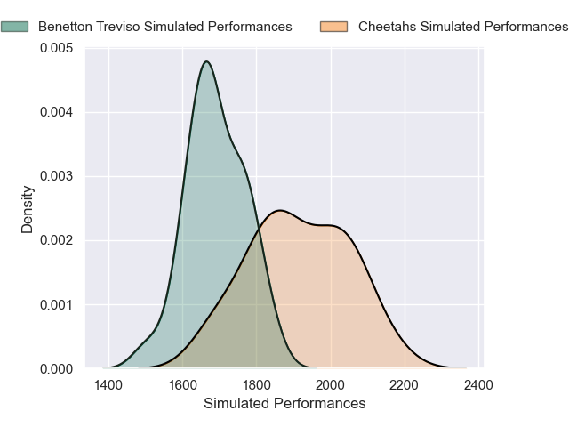
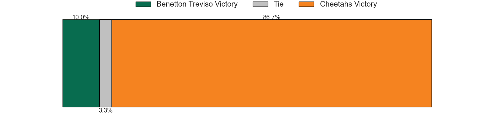
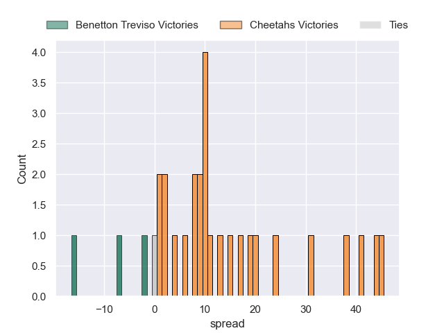

### Montpellier Herault V Cheetahs on 2025/04/04

Average Margin: Montpellier Herault by 0.5

### Montpellier Herault V Edinburgh on 2025/04/04

Average Margin: Montpellier Herault by 4.5

### Ospreys V Stade Francais Paris on 2025/04/04

Average Margin: Ospreys by 5.6

### Montpellier Herault V Perpignan on 2025/04/04

Average Margin: Montpellier Herault by 15.3

### Montpellier Herault V Lions on 2025/04/04

Average Margin: Montpellier Herault by 5.1

### Montpellier Herault V Gloucester Rugby on 2025/04/04

Average Margin: Montpellier Herault by 10.8

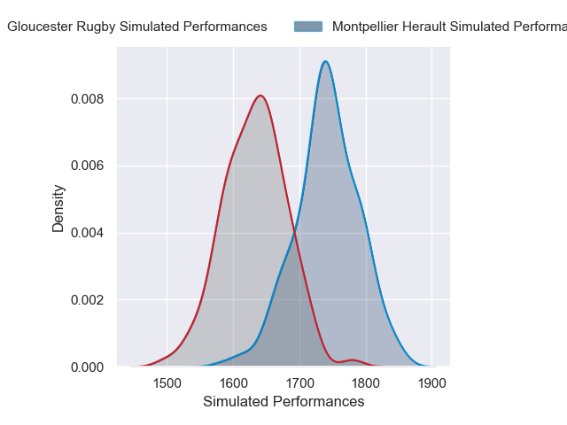
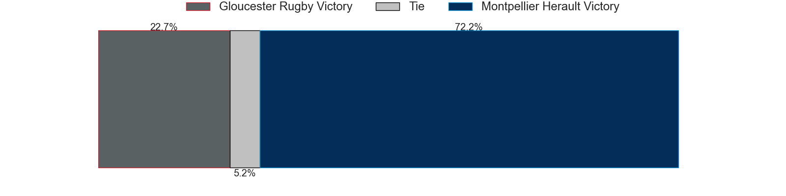
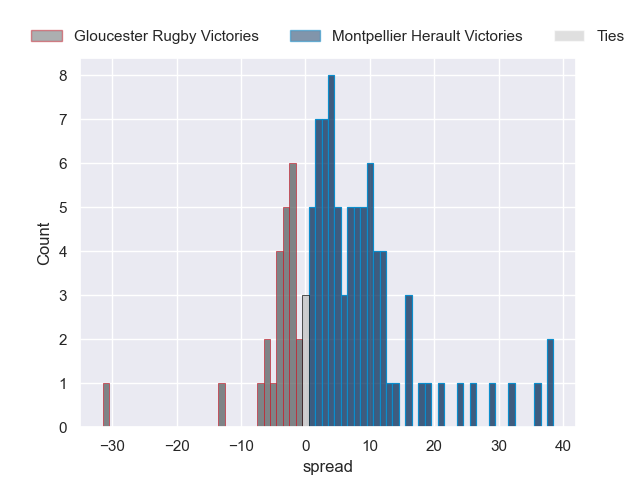

### Ospreys V Harlequins on 2025/04/04

Average Margin: Ospreys by 7.7

### Connacht V Lyon on 2025/04/04

Average Margin: Connacht by 8.3

### Cardiff Blues V Bath Rugby on 2025/04/04

Average Margin: Cardiff Blues by 9.5

### Lyon V Exeter Chiefs on 2025/04/04

Average Margin: Lyon by 5.1

### Bayonne V Harlequins on 2025/04/04

Average Margin: Bayonne by 5.3

### Lyon V Ulster on 2025/04/04

Average Margin: Lyon by 3.3

### Pau V Scarlets on 2025/04/04

Average Margin: Pau by 1.1

### Bayonne V Stade Francais Paris on 2025/04/04

Average Margin: Bayonne by 3.0

### Vannes V Stade Francais Paris on 2025/04/04

Average Margin: Vannes by 0.5

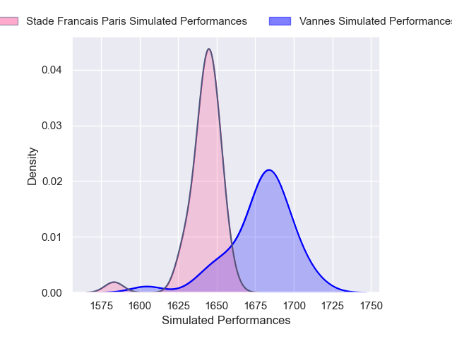
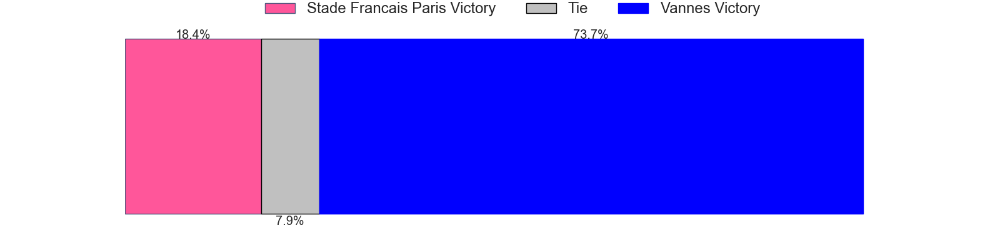
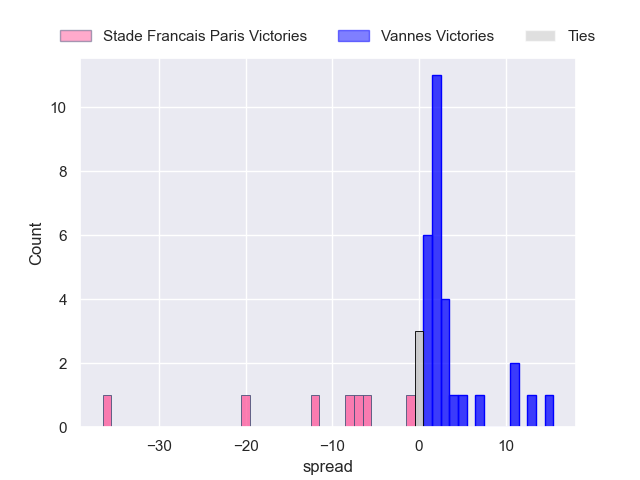

### Scarlets V Harlequins on 2025/04/04

Average Margin: Scarlets by 5.3

### Cardiff Blues V Benetton Treviso on 2025/04/04

Average Margin: Cardiff Blues by 7.4

### Gloucester Rugby V Pau on 2025/04/04

Average Margin: Gloucester Rugby by 11.4

### Bayonne V Stormers on 2025/04/04

Average Margin: Stormers by 0.7

### Scarlets V Bath Rugby on 2025/04/04

Average Margin: Scarlets by 8.2

### Connacht V Scarlets on 2025/04/04

Average Margin: Connacht by 5.4

### Cardiff Blues V Harlequins on 2025/04/04

Average Margin: Cardiff Blues by 9.2

### Ospreys V Gloucester Rugby on 2025/04/04

Average Margin: Ospreys by 8.8

### Cardiff Blues V Stade Francais Paris on 2025/04/04

Average Margin: Cardiff Blues by 7.7

### Edinburgh V Gloucester Rugby on 2025/04/04

Average Margin: Edinburgh by 8.2

### Pau V Bath Rugby on 2025/04/04

Average Margin: Pau by 7.0

### Lyon V Stade Francais Paris on 2025/04/04

Average Margin: Lyon by 3.5

### Pau V Cheetahs on 2025/04/04

Average Margin: Cheetahs by 4.0

### Gloucester Rugby V Benetton Treviso on 2025/04/04

Average Margin: Gloucester Rugby by 3.0

### Ospreys V Sale Sharks on 2025/04/04

Average Margin: Ospreys by 6.5

### Connacht V Pau on 2025/04/04

Average Margin: Connacht by 8.0

### Cardiff Blues V Stormers on 2025/04/04

Average Margin: Cardiff Blues by 7.4

### Lyon V Bath Rugby on 2025/04/04

Average Margin: Lyon by 8.4

### Scarlets V Stade Francais Paris on 2025/04/04

Average Margin: Scarlets by 5.4

### Connacht V Perpignan on 2025/04/04

Average Margin: Connacht by 13.0

### Ospreys V Bristol Rugby on 2025/04/04

Average Margin: Ospreys by 3.6

### Pau V Cardiff Blues on 2025/04/04

Average Margin: Cardiff Blues by 0.1

### Edinburgh V Vannes on 2025/04/04

Average Margin: Edinburgh by 9.0

### Montpellier Herault V Dragons on 2025/04/04

Average Margin: Montpellier Herault by 5.5

### Bayonne V Ulster on 2025/04/04

Average Margin: Bayonne by 3.0

### Gloucester Rugby V Bath Rugby on 2025/04/04

Average Margin: Gloucester Rugby by 6.4

### Montpellier Herault V Bayonne on 2025/04/04

Average Margin: Montpellier Herault by 7.7

### Cheetahs V Harlequins on 2025/04/04

Average Margin: Cheetahs by 13.9

### Lyon V Harlequins on 2025/04/04

Average Margin: Lyon by 4.5

### Bayonne V Exeter Chiefs on 2025/04/04

Average Margin: Bayonne by 5.7

### Gloucester Rugby V Exeter Chiefs on 2025/04/04

Average Margin: Gloucester Rugby by 2.0

### Edinburgh V Lions on 2025/04/04

Average Margin: Edinburgh by 2.4

### Montpellier Herault V Zebre on 2025/04/04

Average Margin: Montpellier Herault by 8.7

### Montpellier Herault V Cardiff Blues on 2025/04/04

Average Margin: Montpellier Herault by 4.3

### Gloucester Rugby V Lyon on 2025/04/04

Average Margin: Gloucester Rugby by 8.1

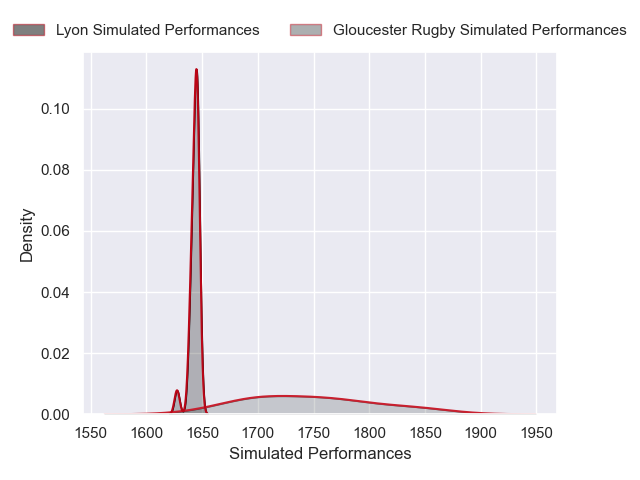

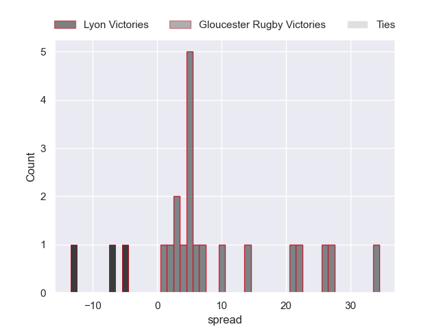

### Gloucester Rugby V Sale Sharks on 2025/04/04

Average Margin: Gloucester Rugby by 12.0

### Connacht V Gloucester Rugby on 2025/04/04

Average Margin: Connacht by 9.3

### Connacht V Lions on 2025/04/04

Average Margin: Connacht by 1.2

### Ospreys V Scarlets on 2025/04/04

Average Margin: Ospreys by 6.5

### Pau V Ospreys on 2025/04/04

Average Margin: Pau by 3.5

### Edinburgh V Scarlets on 2025/04/04

Average Margin: Edinburgh by 5.7

## Quarterfinals

### Scarlets V Cheetahs on 2025/04/11

Average Margin: Cheetahs by 3.6

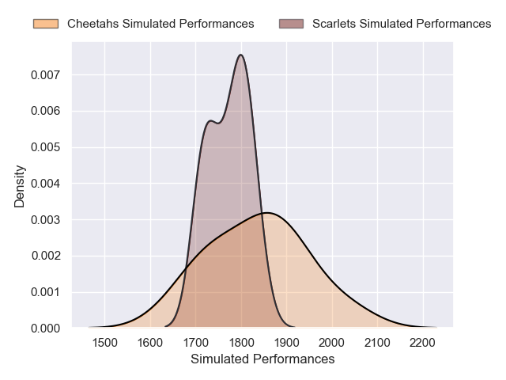

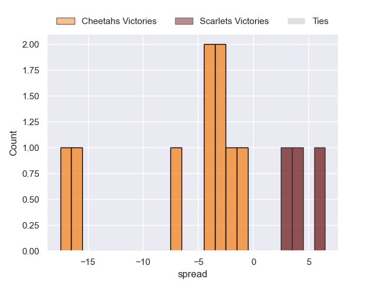

### Connacht V Edinburgh on 2025/04/11

Average Margin: Connacht by 3.0

### Ospreys V Ulster on 2025/04/11

Average Margin: Ospreys by 6.3

### Montpellier Herault V Benetton Treviso on 2025/04/11

Average Margin: Montpellier Herault by 6.7

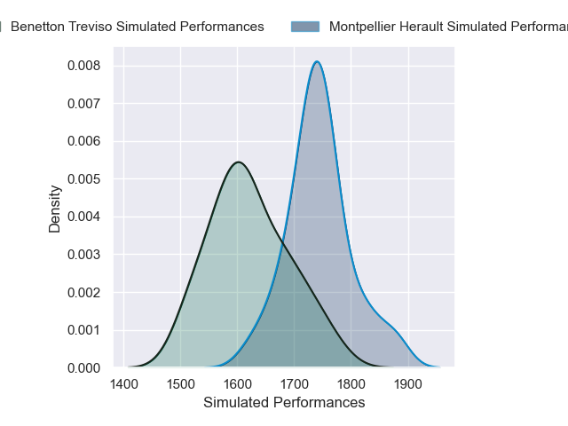

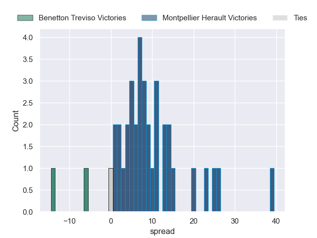

### Ospreys V Dragons on 2025/04/11

Average Margin: Ospreys by 3.9

### Gloucester Rugby V Bath Rugby on 2025/04/11

Average Margin: Gloucester Rugby by 6.4

### Ospreys V Edinburgh on 2025/04/11

Average Margin: Ospreys by 6.2

### Cardiff Blues V Edinburgh on 2025/04/11

Average Margin: Cardiff Blues by 1.2

### Ospreys V Bath Rugby on 2025/04/11

Average Margin: Ospreys by 10.5

### Vannes V Bath Rugby on 2025/04/11

Average Margin: Vannes by 7.3

### Cheetahs V Stade Francais Paris on 2025/04/11

Average Margin: Cheetahs by 12.0

### Pau V Bristol Rugby on 2025/04/11

Average Margin: Pau by 2.4

### Edinburgh V Ulster on 2025/04/11

Average Margin: Edinburgh by 6.3

### Scarlets V Benetton Treviso on 2025/04/11

Average Margin: Scarlets by 2.3

### Cheetahs V Bath Rugby on 2025/04/11

Average Margin: Cheetahs by 15.8

### Lyon V Ulster on 2025/04/11

Average Margin: Lyon by 3.3

### Lyon V Racing 92 on 2025/04/11

Average Margin: Lyon by 0.1

### Scarlets V Bath Rugby on 2025/04/11

Average Margin: Scarlets by 8.2

### Connacht V Dragons on 2025/04/11

Average Margin: Connacht by 2.3

### Edinburgh V Lions on 2025/04/11

Average Margin: Edinburgh by 2.4

### Connacht V Lyon on 2025/04/11

Average Margin: Connacht by 8.3

### Gloucester Rugby V Ospreys on 2025/04/11

Average Margin: Ospreys by 0.1

### Cheetahs V Sale Sharks on 2025/04/11

Average Margin: Cheetahs by 15.8

### Cardiff Blues V Pau on 2025/04/11

Average Margin: Cardiff Blues by 8.6

### Pau V Stormers on 2025/04/11

Average Margin: Pau by 0.8

### Cardiff Blues V Stormers on 2025/04/11

Average Margin: Cardiff Blues by 7.4

### Ospreys V Vannes on 2025/04/11

Average Margin: Ospreys by 9.5

### Cardiff Blues V Benetton Treviso on 2025/04/11

Average Margin: Cardiff Blues by 7.4

### Ospreys V Perpignan on 2025/04/11

Average Margin: Ospreys by 17.7

### Pau V Ulster on 2025/04/11

Average Margin: Ulster by 3.4

### Ospreys V Harlequins on 2025/04/11

Average Margin: Ospreys by 7.7

### Bayonne V Dragons on 2025/04/11

Average Margin: Bayonne by 1.2

### Montpellier Herault V Edinburgh on 2025/04/11

Average Margin: Montpellier Herault by 4.5

### Bayonne V Perpignan on 2025/04/11

Average Margin: Bayonne by 10.7

### Montpellier Herault V Exeter Chiefs on 2025/04/11

Average Margin: Montpellier Herault by 8.9

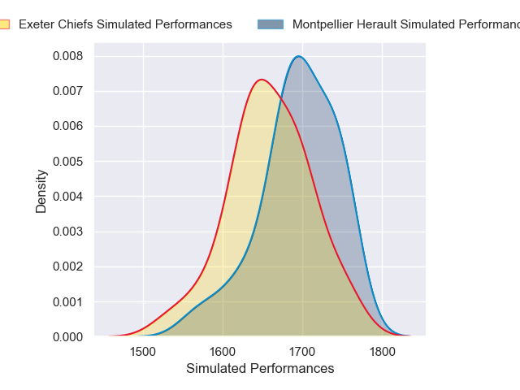

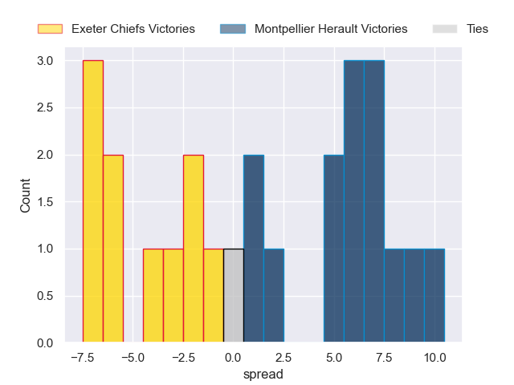

### Pau V Racing 92 on 2025/04/11

Average Margin: Pau by 4.0

### Cheetahs V Benetton Treviso on 2025/04/11

Average Margin: Cheetahs by 13.2

### Bayonne V Stormers on 2025/04/11

Average Margin: Stormers by 0.7

### Gloucester Rugby V Ulster on 2025/04/11

Average Margin: Gloucester Rugby by 5.0

### Pau V Sale Sharks on 2025/04/11

Average Margin: Pau by 11.0

### Scarlets V Stade Francais Paris on 2025/04/11

Average Margin: Scarlets by 5.4

### Gloucester Rugby V Pau on 2025/04/11

Average Margin: Gloucester Rugby by 11.4

### Lyon V Bath Rugby on 2025/04/11

Average Margin: Lyon by 8.4

### Ospreys V Stormers on 2025/04/11

Average Margin: Ospreys by 4.9

### Edinburgh V Dragons on 2025/04/11

Average Margin: Edinburgh by 1.4

### Ospreys V Stade Francais Paris on 2025/04/11

Average Margin: Ospreys by 5.6

### Cardiff Blues V Clermont Auvergne on 2025/04/11

Average Margin: Cardiff Blues by 10.2

### Ospreys V Sale Sharks on 2025/04/11

Average Margin: Ospreys by 6.5

### Edinburgh V Perpignan on 2025/04/11

Average Margin: Edinburgh by 10.2

### Gloucester Rugby V Edinburgh on 2025/04/11

Average Margin: Gloucester Rugby by 2.5

### Pau V Clermont Auvergne on 2025/04/11

Average Margin: Pau by 13.2

### Cheetahs V Harlequins on 2025/04/11

Average Margin: Cheetahs by 13.9

### Ospreys V Benetton Treviso on 2025/04/11

Average Margin: Ospreys by 0.6

### Edinburgh V Racing 92 on 2025/04/11

Average Margin: Edinburgh by 8.1

### Cheetahs V Cardiff Blues on 2025/04/11

Average Margin: Cheetahs by 9.8

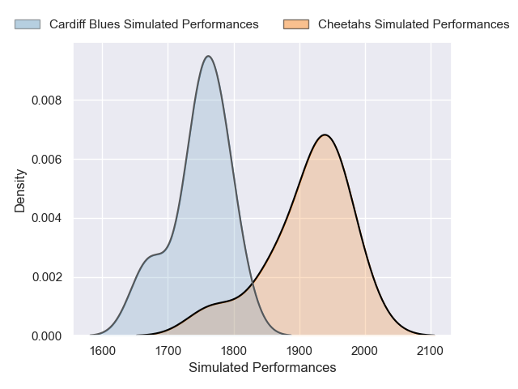

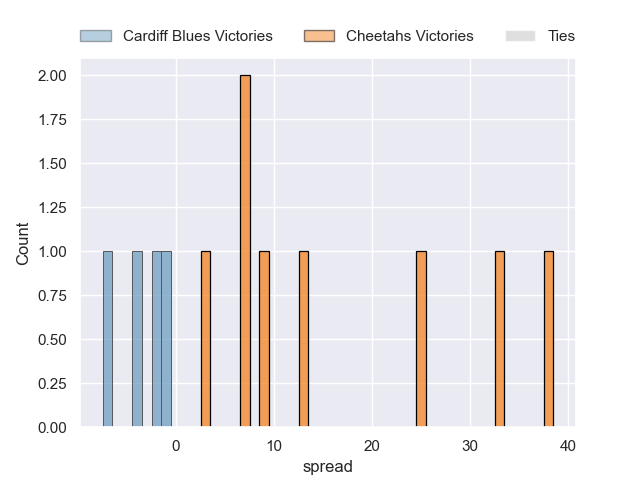

### Ospreys V Racing 92 on 2025/04/11

Average Margin: Ospreys by 7.5

### Gloucester Rugby V Dragons on 2025/04/11

Average Margin: Dragons by 4.7

### Montpellier Herault V Perpignan on 2025/04/11

Average Margin: Montpellier Herault by 15.3

### Montpellier Herault V Pau on 2025/04/11

Average Margin: Montpellier Herault by 9.2

### Bayonne V Lions on 2025/04/11

Average Margin: Lions by 0.2

### Bayonne V Ulster on 2025/04/11

Average Margin: Bayonne by 3.0

### Scarlets V Racing 92 on 2025/04/11

Average Margin: Scarlets by 2.5

### Lyon V Sale Sharks on 2025/04/11

Average Margin: Lyon by 10.2

### Gloucester Rugby V Lions on 2025/04/11

Average Margin: Lions by 1.0

### Bayonne V Racing 92 on 2025/04/11

Average Margin: Bayonne by 6.3

### Ospreys V Clermont Auvergne on 2025/04/11

Average Margin: Ospreys by 13.0

### Ospreys V Bristol Rugby on 2025/04/11

Average Margin: Ospreys by 3.6

### Ospreys V Scarlets on 2025/04/11

Average Margin: Ospreys by 6.5

### Cheetahs V Scarlets on 2025/04/11

Average Margin: Cheetahs by 15.3

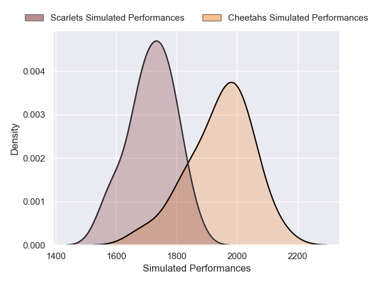
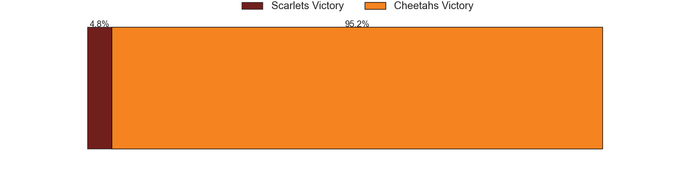
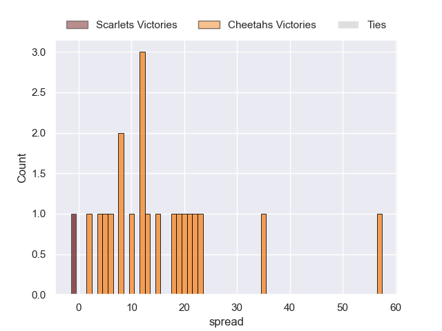

### Montpellier Herault V Zebre on 2025/04/11

Average Margin: Montpellier Herault by 8.7

### Scarlets V Stormers on 2025/04/11

Average Margin: Scarlets by 2.5

### Pau V Perpignan on 2025/04/11

Average Margin: Pau by 12.6

### Cheetahs V Ospreys on 2025/04/11

Average Margin: Cheetahs by 8.2

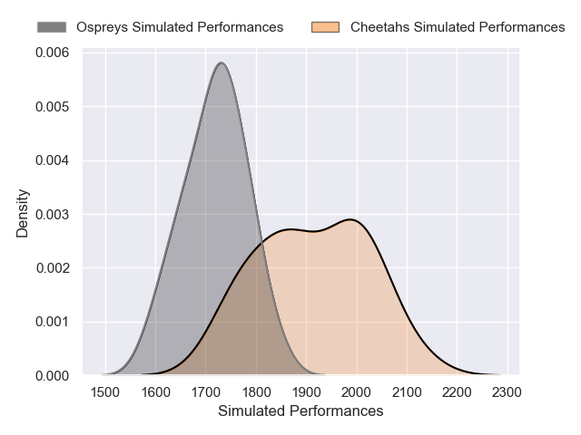
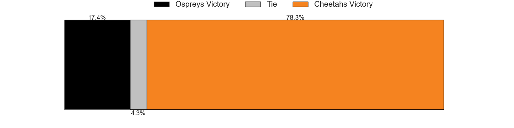
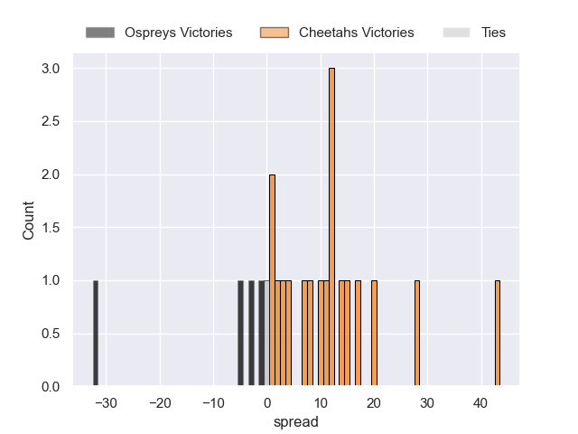

### Bayonne V Cardiff Blues on 2025/04/11

Average Margin: Cardiff Blues by 1.3

### Montpellier Herault V Ospreys on 2025/04/11

Average Margin: Montpellier Herault by 3.4

### Pau V Bath Rugby on 2025/04/11

Average Margin: Pau by 7.0

### Edinburgh V Exeter Chiefs on 2025/04/11

Average Margin: Edinburgh by 8.5

### Bayonne V Sale Sharks on 2025/04/11

Average Margin: Bayonne by 11.4

### Montpellier Herault V Stormers on 2025/04/11

Average Margin: Montpellier Herault by 6.6

### Edinburgh V Stade Francais Paris on 2025/04/11

Average Margin: Edinburgh by 7.9

### Cardiff Blues V Vannes on 2025/04/11

Average Margin: Cardiff Blues by 10.8

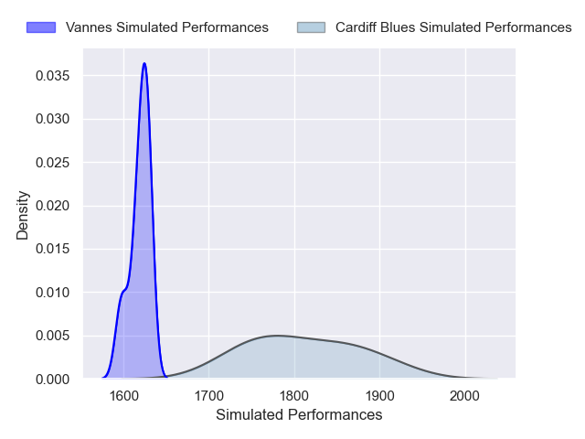

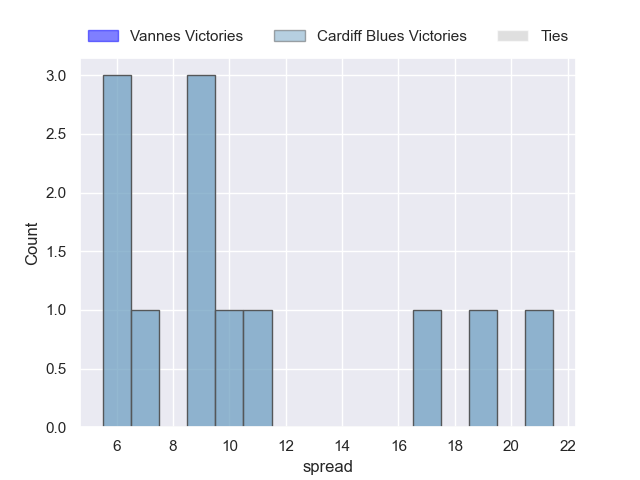

### Cardiff Blues V Scarlets on 2025/04/11

Average Margin: Cardiff Blues by 7.1

### Pau V Cheetahs on 2025/04/11

Average Margin: Cheetahs by 4.0

### Connacht V Ospreys on 2025/04/11

Average Margin: Connacht by 2.4

### Cardiff Blues V Cheetahs on 2025/04/11

Average Margin: Cheetahs by 2.8

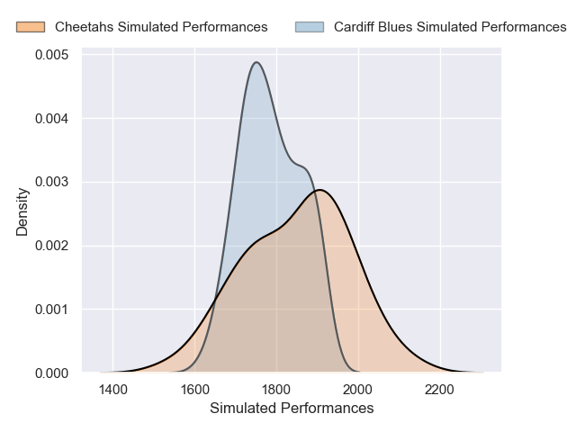

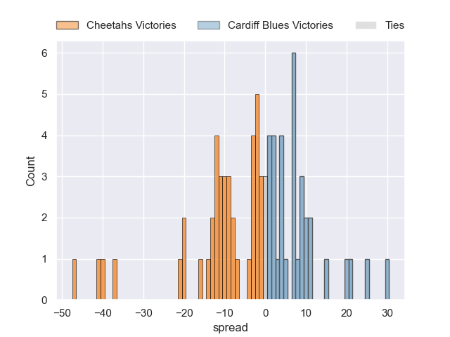

### Bayonne V Gloucester Rugby on 2025/04/11

Average Margin: Bayonne by 5.4

### Montpellier Herault V Cheetahs on 2025/04/11

Average Margin: Montpellier Herault by 0.5

### Bayonne V Pau on 2025/04/11

Average Margin: Bayonne by 5.1

### Connacht V Stade Francais Paris on 2025/04/11

Average Margin: Connacht by 5.4

### Connacht V Gloucester Rugby on 2025/04/11

Average Margin: Connacht by 9.3

### Cardiff Blues V Lions on 2025/04/11

Average Margin: Lions by 0.4

### Montpellier Herault V Bath Rugby on 2025/04/11

Average Margin: Montpellier Herault by 10.1

### Connacht V Perpignan on 2025/04/11

Average Margin: Connacht by 13.0

### Pau V Scarlets on 2025/04/11

Average Margin: Pau by 1.1

### Bayonne V Exeter Chiefs on 2025/04/11

Average Margin: Bayonne by 5.7

### Montpellier Herault V Ulster on 2025/04/11

Average Margin: Montpellier Herault by 7.0

### Lyon V Edinburgh on 2025/04/11

Average Margin: Lyon by 0.1

### Connacht V Benetton Treviso on 2025/04/11

Average Margin: Connacht by 4.8

### Bayonne V Vannes on 2025/04/11

Average Margin: Bayonne by 2.3

### Bayonne V Scarlets on 2025/04/11

Average Margin: Bayonne by 3.9

### Lyon V Cardiff Blues on 2025/04/11

Average Margin: Cardiff Blues by 0.3

### Lyon V Ospreys on 2025/04/11

Average Margin: Lyon by 2.4

### Connacht V Bayonne on 2025/04/11

Average Margin: Connacht by 6.0

### Edinburgh V Lyon on 2025/04/11

Average Margin: Edinburgh by 8.6

### Cardiff Blues V Gloucester Rugby on 2025/04/11

Average Margin: Cardiff Blues by 9.0

### Edinburgh V Bayonne on 2025/04/11

Average Margin: Edinburgh by 2.8

### Lyon V Stade Francais Paris on 2025/04/11

Average Margin: Lyon by 3.5

### Montpellier Herault V Lyon on 2025/04/11

Average Margin: Montpellier Herault by 9.6

### Cardiff Blues V Bath Rugby on 2025/04/11

Average Margin: Cardiff Blues by 9.5

### Edinburgh V Benetton Treviso on 2025/04/11

Average Margin: Edinburgh by 2.5

### Lyon V Stormers on 2025/04/11

Average Margin: Stormers by 0.8

### Pau V Edinburgh on 2025/04/11

Average Margin: Pau by 0.1

### Connacht V Harlequins on 2025/04/11

Average Margin: Connacht by 5.2

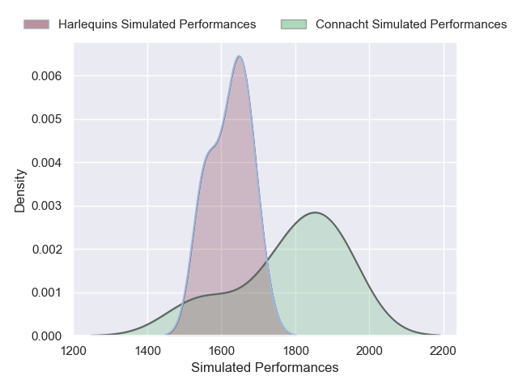

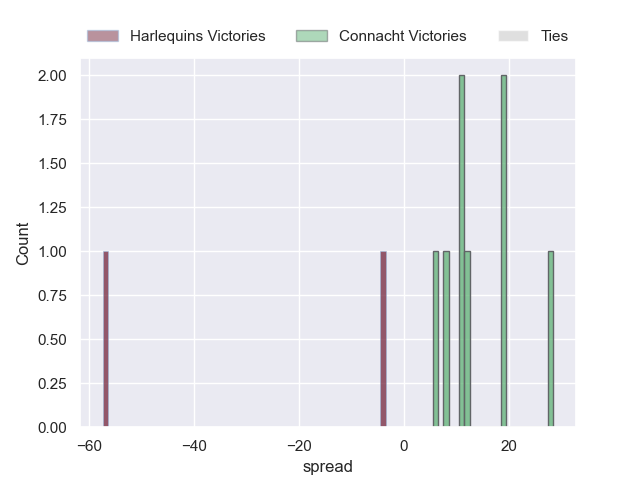

### Pau V Ospreys on 2025/04/11

Average Margin: Pau by 3.5

### Edinburgh V Cardiff Blues on 2025/04/11

Average Margin: Edinburgh by 3.5

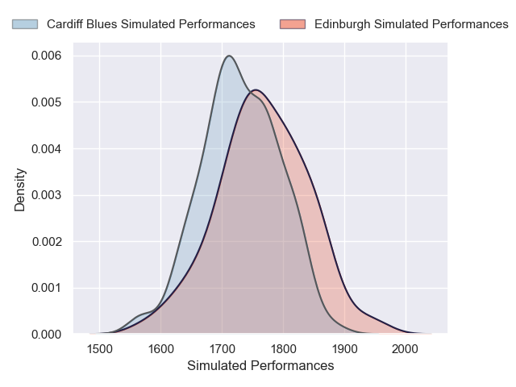
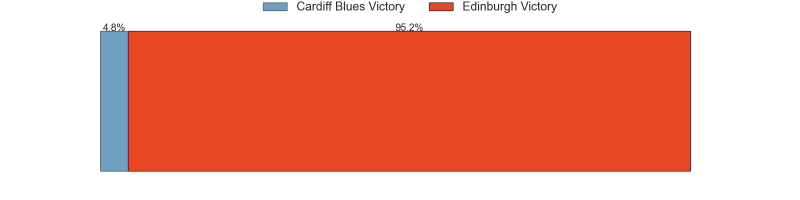
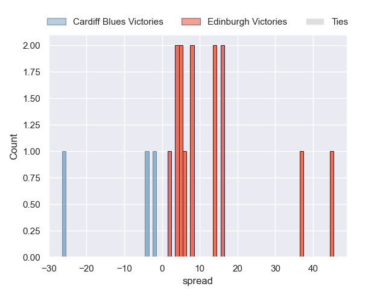

### Connacht V Zebre on 2025/04/11

Average Margin: Connacht by 4.5

### Gloucester Rugby V Stade Francais Paris on 2025/04/11

Average Margin: Gloucester Rugby by 2.3

### Pau V Vannes on 2025/04/11

Average Margin: Pau by 6.8

### Bayonne V Lyon on 2025/04/11

Average Margin: Bayonne by 3.8

### Ospreys V Gloucester Rugby on 2025/04/11

Average Margin: Ospreys by 8.8

### Edinburgh V Harlequins on 2025/04/11

Average Margin: Edinburgh by 6.1

### Pau V Dragons on 2025/04/11

Average Margin: Dragons by 5.2

### Pau V Harlequins on 2025/04/11

Average Margin: Pau by 6.0

### Ospreys V Cardiff Blues on 2025/04/11

Average Margin: Ospreys by 6.5

### Edinburgh V Stormers on 2025/04/11

Average Margin: Edinburgh by 2.0

### Bayonne V Bath Rugby on 2025/04/11

Average Margin: Bayonne by 5.8

### Connacht V Stormers on 2025/04/11

Average Margin: Connacht by 2.7

### Edinburgh V Ospreys on 2025/04/11

Average Margin: Edinburgh by 4.1

### Connacht V Pau on 2025/04/11

Average Margin: Connacht by 8.0

### Gloucester Rugby V Cheetahs on 2025/04/11

Average Margin: Cheetahs by 4.1

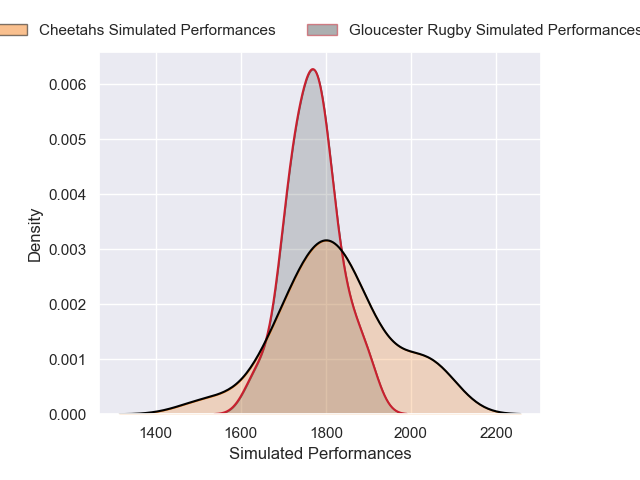

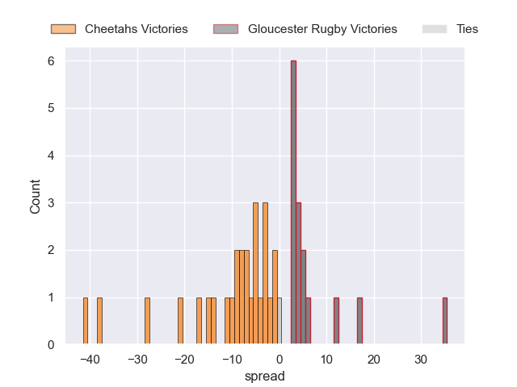

### Connacht V Cardiff Blues on 2025/04/11

Average Margin: Connacht by 5.1

### Montpellier Herault V Vannes on 2025/04/11

Average Margin: Montpellier Herault by 10.8

### Connacht V Scarlets on 2025/04/11

Average Margin: Connacht by 5.4

### Gloucester Rugby V Cardiff Blues on 2025/04/11

Average Margin: Gloucester Rugby by 0.1

### Lyon V Pau on 2025/04/11

Average Margin: Lyon by 5.4

### Lyon V Bayonne on 2025/04/11

Average Margin: Lyon by 4.6

### Lyon V Exeter Chiefs on 2025/04/11

Average Margin: Lyon by 5.1

### Connacht V Lions on 2025/04/11

Average Margin: Connacht by 1.2

### Pau V Cardiff Blues on 2025/04/11

Average Margin: Cardiff Blues by 0.1

### Edinburgh V Cheetahs on 2025/04/11

Average Margin: Cheetahs by 2.5

### Montpellier Herault V Scarlets on 2025/04/11

Average Margin: Montpellier Herault by 6.3

### Bayonne V Edinburgh on 2025/04/11

Average Margin: Bayonne by 0.9

### Ospreys V Lyon on 2025/04/11

Average Margin: Ospreys by 9.0

### Montpellier Herault V Cardiff Blues on 2025/04/11

Average Margin: Montpellier Herault by 4.3

### Gloucester Rugby V Bayonne on 2025/04/11

Average Margin: Gloucester Rugby by 4.7

### Bayonne V Stade Francais Paris on 2025/04/11

Average Margin: Bayonne by 3.0

### Connacht V Cheetahs on 2025/04/11

Average Margin: Cheetahs by 2.2

### Connacht V Bath Rugby on 2025/04/11

Average Margin: Connacht by 5.8

### Pau V Benetton Treviso on 2025/04/11

Average Margin: Benetton Treviso by 0.2

### Pau V Stade Francais Paris on 2025/04/11

Average Margin: Pau by 3.8

### Montpellier Herault V Dragons on 2025/04/11

Average Margin: Montpellier Herault by 5.5

### Gloucester Rugby V Scarlets on 2025/04/11

Average Margin: Gloucester Rugby by 5.8

### Cardiff Blues V Ospreys on 2025/04/11

Average Margin: Cardiff Blues by 3.5

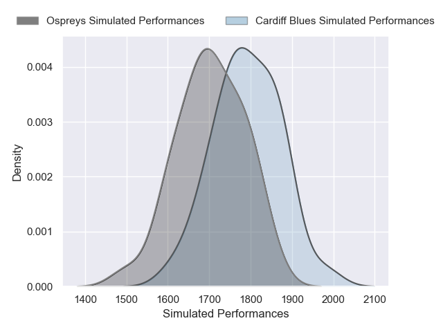

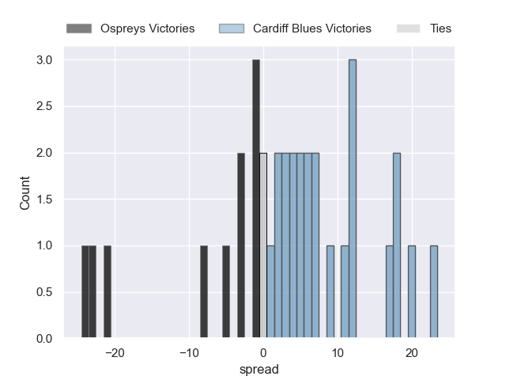

### Connacht V Exeter Chiefs on 2025/04/11

Average Margin: Connacht by 6.8

### Montpellier Herault V Bayonne on 2025/04/11

Average Margin: Montpellier Herault by 7.7

### Ospreys V Cheetahs on 2025/04/11

Average Margin: Ospreys by 2.3

### Connacht V Vannes on 2025/04/11

Average Margin: Connacht by 5.7

### Edinburgh V Sale Sharks on 2025/04/11

Average Margin: Edinburgh by 10.7

### Bayonne V Cheetahs on 2025/04/11

Average Margin: Cheetahs by 5.7

### Cardiff Blues V Ulster on 2025/04/11

Average Margin: Cardiff Blues by 8.2

### Bayonne V Ospreys on 2025/04/11

Average Margin: Bayonne by 0.6

### Pau V Lyon on 2025/04/11

Average Margin: Pau by 6.4

### Edinburgh V Scarlets on 2025/04/11

Average Margin: Edinburgh by 5.7

### Cheetahs V Pau on 2025/04/11

Average Margin: Cheetahs by 15.9

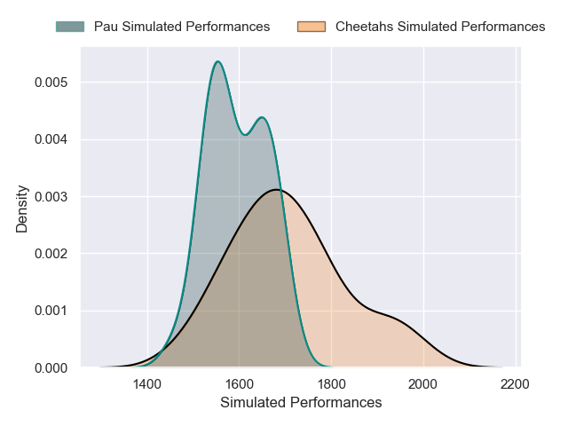

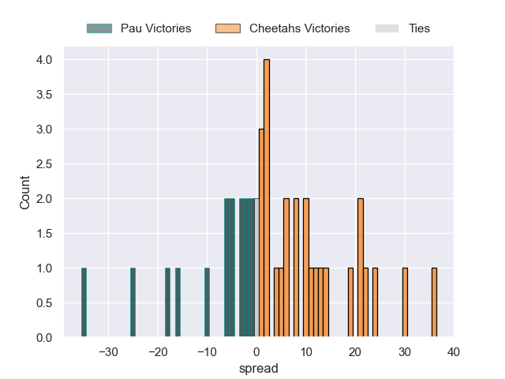

### Pau V Lions on 2025/04/11

Average Margin: Lions by 2.6

### Connacht V Ulster on 2025/04/11

Average Margin: Connacht by 4.8

### Montpellier Herault V Gloucester Rugby on 2025/04/11

Average Margin: Montpellier Herault by 10.8

### Vannes V Stade Francais Paris on 2025/04/11

Average Margin: Vannes by 0.5

### Edinburgh V Vannes on 2025/04/11

Average Margin: Edinburgh by 9.0

### Bayonne V Harlequins on 2025/04/11

Average Margin: Bayonne by 5.3

### Gloucester Rugby V Lyon on 2025/04/11

Average Margin: Gloucester Rugby by 8.1

### Edinburgh V Bath Rugby on 2025/04/11

Average Margin: Edinburgh by 9.3

### Ospreys V Lions on 2025/04/11

Average Margin: Ospreys by 2.4

### Montpellier Herault V Harlequins on 2025/04/11

Average Margin: Montpellier Herault by 8.0

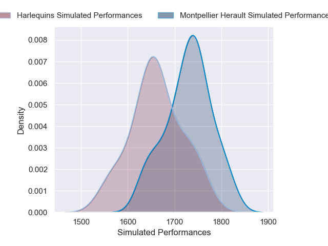

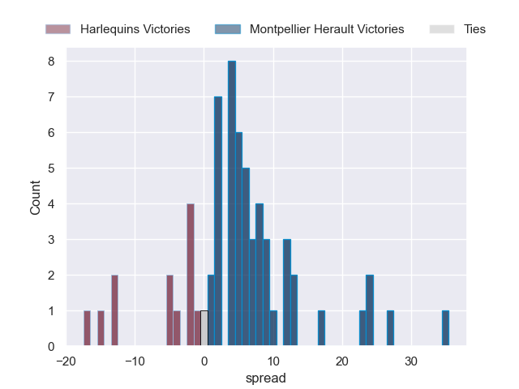

### Montpellier Herault V Stade Francais Paris on 2025/04/11

Average Margin: Montpellier Herault by 10.7

### Lyon V Scarlets on 2025/04/11

Average Margin: Lyon by 0.9

### Pau V Gloucester Rugby on 2025/04/11

Average Margin: Pau by 2.9

### Cardiff Blues V Stade Francais Paris on 2025/04/11

Average Margin: Cardiff Blues by 7.7

### Connacht V Sale Sharks on 2025/04/11

Average Margin: Connacht by 10.4

### Edinburgh V Gloucester Rugby on 2025/04/11

Average Margin: Edinburgh by 8.2

### Ospreys V Bayonne on 2025/04/11

Average Margin: Ospreys by 8.3

### Montpellier Herault V Lions on 2025/04/11

Average Margin: Montpellier Herault by 5.1

### Ospreys V Pau on 2025/04/11

Average Margin: Ospreys by 9.4

### Gloucester Rugby V Benetton Treviso on 2025/04/11

Average Margin: Gloucester Rugby by 3.0

### Pau V Bayonne on 2025/04/11

Average Margin: Pau by 4.1

### Edinburgh V Pau on 2025/04/11

Average Margin: Edinburgh by 7.7

## Semifinals

### Edinburgh V Pau on 2025/05/02

Average Margin: Edinburgh by 7.7

### Ospreys V Stade Francais Paris on 2025/05/02

Average Margin: Ospreys by 5.6

### Montpellier Herault V Exeter Chiefs on 2025/05/02

Average Margin: Montpellier Herault by 8.9

### Bayonne V Dragons on 2025/05/02

Average Margin: Bayonne by 1.2

### Edinburgh V Perpignan on 2025/05/02

Average Margin: Edinburgh by 10.2

### Cardiff Blues V Benetton Treviso on 2025/05/02

Average Margin: Cardiff Blues by 7.4

### Cheetahs V Stormers on 2025/05/02

Average Margin: Cheetahs by 15.5

### Ospreys V Scarlets on 2025/05/02

Average Margin: Ospreys by 6.5

### Bayonne V Gloucester Rugby on 2025/05/02

Average Margin: Bayonne by 5.4

### Connacht V Zebre on 2025/05/02

Average Margin: Connacht by 4.5

### Connacht V Pau on 2025/05/02

Average Margin: Connacht by 8.0

### Montpellier Herault V Scarlets on 2025/05/02

Average Margin: Montpellier Herault by 6.3

### Connacht V Bath Rugby on 2025/05/02

Average Margin: Connacht by 5.8

### Edinburgh V Exeter Chiefs on 2025/05/02

Average Margin: Edinburgh by 8.5

### Bayonne V Stormers on 2025/05/02

Average Margin: Stormers by 0.7

### Connacht V Bayonne on 2025/05/02

Average Margin: Connacht by 6.0

### Montpellier Herault V Bath Rugby on 2025/05/02

Average Margin: Montpellier Herault by 10.1

### Montpellier Herault V Stormers on 2025/05/02

Average Margin: Montpellier Herault by 6.6

### Pau V Bath Rugby on 2025/05/02

Average Margin: Pau by 7.0

### Lyon V Pau on 2025/05/02

Average Margin: Lyon by 5.4

### Cheetahs V Bath Rugby on 2025/05/02

Average Margin: Cheetahs by 15.8

### Gloucester Rugby V Scarlets on 2025/05/02

Average Margin: Gloucester Rugby by 5.8

### Ospreys V Ulster on 2025/05/02

Average Margin: Ospreys by 6.3

### Montpellier Herault V Dragons on 2025/05/02

Average Margin: Montpellier Herault by 5.5

### Gloucester Rugby V Bayonne on 2025/05/02

Average Margin: Gloucester Rugby by 4.7

### Ospreys V Dragons on 2025/05/02

Average Margin: Ospreys by 3.9

### Bayonne V Lyon on 2025/05/02

Average Margin: Bayonne by 3.8

### Edinburgh V Ulster on 2025/05/02

Average Margin: Edinburgh by 6.3

### Bayonne V Stade Francais Paris on 2025/05/02

Average Margin: Bayonne by 3.0

### Bayonne V Sale Sharks on 2025/05/02

Average Margin: Bayonne by 11.4

### Cardiff Blues V Racing 92 on 2025/05/02

Average Margin: Cardiff Blues by 11.3

### Gloucester Rugby V Dragons on 2025/05/02

Average Margin: Dragons by 4.7

### Scarlets V Benetton Treviso on 2025/05/02

Average Margin: Scarlets by 2.3

### Gloucester Rugby V Cardiff Blues on 2025/05/02

Average Margin: Gloucester Rugby by 0.1

### Montpellier Herault V Bayonne on 2025/05/02

Average Margin: Montpellier Herault by 7.7

### Pau V Lyon on 2025/05/02

Average Margin: Pau by 6.4

### Edinburgh V Bayonne on 2025/05/02

Average Margin: Edinburgh by 2.8

### Edinburgh V Vannes on 2025/05/02

Average Margin: Edinburgh by 9.0

### Cardiff Blues V Sale Sharks on 2025/05/02

Average Margin: Cardiff Blues by 11.8

### Gloucester Rugby V Pau on 2025/05/02

Average Margin: Gloucester Rugby by 11.4

### Montpellier Herault V Gloucester Rugby on 2025/05/02

Average Margin: Montpellier Herault by 10.8

### Edinburgh V Stade Francais Paris on 2025/05/02

Average Margin: Edinburgh by 7.9

### Gloucester Rugby V Edinburgh on 2025/05/02

Average Margin: Gloucester Rugby by 2.5

### Lyon V Stormers on 2025/05/02

Average Margin: Stormers by 0.8

### Gloucester Rugby V Ospreys on 2025/05/02

Average Margin: Ospreys by 0.1

### Edinburgh V Sale Sharks on 2025/05/02

Average Margin: Edinburgh by 10.7

### Montpellier Herault V Harlequins on 2025/05/02

Average Margin: Montpellier Herault by 8.0

### Cheetahs V Benetton Treviso on 2025/05/02

Average Margin: Cheetahs by 13.2

### Connacht V Cardiff Blues on 2025/05/02

Average Margin: Connacht by 5.1

### Bayonne V Bath Rugby on 2025/05/02

Average Margin: Bayonne by 5.8

### Montpellier Herault V Lions on 2025/05/02

Average Margin: Montpellier Herault by 5.1

### Cheetahs V Cardiff Blues on 2025/05/02

Average Margin: Cheetahs by 9.8

### Edinburgh V Cardiff Blues on 2025/05/02

Average Margin: Edinburgh by 3.5

### Ospreys V Lions on 2025/05/02

Average Margin: Ospreys by 2.4

### Ospreys V Sale Sharks on 2025/05/02

Average Margin: Ospreys by 6.5

### Gloucester Rugby V Lions on 2025/05/02

Average Margin: Lions by 1.0

### Ospreys V Bath Rugby on 2025/05/02

Average Margin: Ospreys by 10.5

### Pau V Lions on 2025/05/02

Average Margin: Lions by 2.6

### Connacht V Lions on 2025/05/02

Average Margin: Connacht by 1.2

### Montpellier Herault V Cheetahs on 2025/05/02

Average Margin: Montpellier Herault by 0.5

### Ospreys V Lyon on 2025/05/02

Average Margin: Ospreys by 9.0

### Ospreys V Cardiff Blues on 2025/05/02

Average Margin: Ospreys by 6.5

### Bayonne V Pau on 2025/05/02

Average Margin: Bayonne by 5.1

### Pau V Edinburgh on 2025/05/02

Average Margin: Pau by 0.1

### Cardiff Blues V Ulster on 2025/05/02

Average Margin: Cardiff Blues by 8.2

### Bayonne V Ospreys on 2025/05/02

Average Margin: Bayonne by 0.6

### Pau V Cardiff Blues on 2025/05/02

Average Margin: Cardiff Blues by 0.1

### Connacht V Perpignan on 2025/05/02

Average Margin: Connacht by 13.0

### Pau V Perpignan on 2025/05/02

Average Margin: Pau by 12.6

### Edinburgh V Stormers on 2025/05/02

Average Margin: Edinburgh by 2.0

### Lyon V Cardiff Blues on 2025/05/02

Average Margin: Cardiff Blues by 0.3

### Cardiff Blues V Edinburgh on 2025/05/02

Average Margin: Cardiff Blues by 1.2

### Cheetahs V Scarlets on 2025/05/02

Average Margin: Cheetahs by 15.3

### Ospreys V Stormers on 2025/05/02

Average Margin: Ospreys by 4.9

### Lyon V Harlequins on 2025/05/02

Average Margin: Lyon by 4.5

### Bayonne V Lions on 2025/05/02

Average Margin: Lions by 0.2

### Pau V Dragons on 2025/05/02

Average Margin: Dragons by 5.2

### Bayonne V Scarlets on 2025/05/02

Average Margin: Bayonne by 3.9

### Connacht V Stade Francais Paris on 2025/05/02

Average Margin: Connacht by 5.4

### Montpellier Herault V Stade Francais Paris on 2025/05/02

Average Margin: Montpellier Herault by 10.7

### Scarlets V Cheetahs on 2025/05/02

Average Margin: Cheetahs by 3.6

### Connacht V Lyon on 2025/05/02

Average Margin: Connacht by 8.3

### Cardiff Blues V Scarlets on 2025/05/02

Average Margin: Cardiff Blues by 7.1

### Cardiff Blues V Pau on 2025/05/02

Average Margin: Cardiff Blues by 8.6

### Pau V Scarlets on 2025/05/02

Average Margin: Pau by 1.1

### Edinburgh V Scarlets on 2025/05/02

Average Margin: Edinburgh by 5.7

### Connacht V Gloucester Rugby on 2025/05/02

Average Margin: Connacht by 9.3

### Montpellier Herault V Edinburgh on 2025/05/02

Average Margin: Montpellier Herault by 4.5

### Cardiff Blues V Cheetahs on 2025/05/02

Average Margin: Cheetahs by 2.8

### Ospreys V Edinburgh on 2025/05/02

Average Margin: Ospreys by 6.2

### Montpellier Herault V Benetton Treviso on 2025/05/02

Average Margin: Montpellier Herault by 6.7

### Ospreys V Bayonne on 2025/05/02

Average Margin: Ospreys by 8.3

### Connacht V Benetton Treviso on 2025/05/02

Average Margin: Connacht by 4.8

### Bayonne V Cheetahs on 2025/05/02

Average Margin: Cheetahs by 5.7

### Edinburgh V Gloucester Rugby on 2025/05/02

Average Margin: Edinburgh by 8.2

### Connacht V Dragons on 2025/05/02

Average Margin: Connacht by 2.3

### Connacht V Harlequins on 2025/05/02

Average Margin: Connacht by 5.2

### Bayonne V Edinburgh on 2025/05/02

Average Margin: Bayonne by 0.9

### Pau V Bayonne on 2025/05/02

Average Margin: Pau by 4.1

### Bayonne V Cardiff Blues on 2025/05/02

Average Margin: Cardiff Blues by 1.3

### Connacht V Cheetahs on 2025/05/02

Average Margin: Cheetahs by 2.2

### Edinburgh V Dragons on 2025/05/02

Average Margin: Edinburgh by 1.4

### Cardiff Blues V Bath Rugby on 2025/05/02

Average Margin: Cardiff Blues by 9.5

### Edinburgh V Ospreys on 2025/05/02

Average Margin: Edinburgh by 4.1

### Ospreys V Cheetahs on 2025/05/02

Average Margin: Ospreys by 2.3

### Edinburgh V Cheetahs on 2025/05/02

Average Margin: Cheetahs by 2.5

### Montpellier Herault V Ulster on 2025/05/02

Average Margin: Montpellier Herault by 7.0

### Connacht V Stormers on 2025/05/02

Average Margin: Connacht by 2.7

### Pau V Ospreys on 2025/05/02

Average Margin: Pau by 3.5

### Cardiff Blues V Lions on 2025/05/02

Average Margin: Lions by 0.4

### Cheetahs V Ospreys on 2025/05/02

Average Margin: Cheetahs by 8.2

### Montpellier Herault V Vannes on 2025/05/02

Average Margin: Montpellier Herault by 10.8

### Gloucester Rugby V Cheetahs on 2025/05/02

Average Margin: Cheetahs by 4.1

### Pau V Cheetahs on 2025/05/02

Average Margin: Cheetahs by 4.0

### Cardiff Blues V Stade Francais Paris on 2025/05/02

Average Margin: Cardiff Blues by 7.7

### Connacht V Scarlets on 2025/05/02

Average Margin: Connacht by 5.4

### Connacht V Vannes on 2025/05/02

Average Margin: Connacht by 5.7

### Lyon V Edinburgh on 2025/05/02

Average Margin: Lyon by 0.1

### Edinburgh V Lions on 2025/05/02

Average Margin: Edinburgh by 2.4

### Montpellier Herault V Cardiff Blues on 2025/05/02

Average Margin: Montpellier Herault by 4.3

### Ospreys V Vannes on 2025/05/02

Average Margin: Ospreys by 9.5

### Lyon V Scarlets on 2025/05/02

Average Margin: Lyon by 0.9

### Connacht V Montpellier Herault on 2025/05/02

Average Margin: Connacht by 1.3

### Pau V Gloucester Rugby on 2025/05/02

Average Margin: Pau by 2.9

### Edinburgh V Lyon on 2025/05/02

Average Margin: Edinburgh by 8.6

### Bayonne V Vannes on 2025/05/02

Average Margin: Bayonne by 2.3

### Cardiff Blues V Stormers on 2025/05/02

Average Margin: Cardiff Blues by 7.4

### Connacht V Ulster on 2025/05/02

Average Margin: Connacht by 4.8

### Ospreys V Pau on 2025/05/02

Average Margin: Ospreys by 9.4

### Gloucester Rugby V Lyon on 2025/05/02

Average Margin: Gloucester Rugby by 8.1

### Connacht V Ospreys on 2025/05/02

Average Margin: Connacht by 2.4

### Connacht V Edinburgh on 2025/05/02

Average Margin: Connacht by 3.0

### Cardiff Blues V Ospreys on 2025/05/02

Average Margin: Cardiff Blues by 3.5

### Montpellier Herault V Pau on 2025/05/02

Average Margin: Montpellier Herault by 9.2

### Montpellier Herault V Ospreys on 2025/05/02

Average Margin: Montpellier Herault by 3.4

### Ospreys V Gloucester Rugby on 2025/05/02

Average Margin: Ospreys by 8.8

### Montpellier Herault V Lyon on 2025/05/02

Average Margin: Montpellier Herault by 9.6

### Lyon V Stade Francais Paris on 2025/05/02

Average Margin: Lyon by 3.5

### Lyon V Ospreys on 2025/05/02

Average Margin: Lyon by 2.4

### Cheetahs V Pau on 2025/05/02

Average Margin: Cheetahs by 15.9

## Finals

### Connacht V Pau on 2025/05/24

Average Margin: Connacht by 8.0

### Edinburgh V Lions on 2025/05/24

Average Margin: Edinburgh by 2.4

### Ospreys V Harlequins on 2025/05/24

Average Margin: Ospreys by 7.7

### Ospreys V Cardiff Blues on 2025/05/24

Average Margin: Ospreys by 6.5

### Edinburgh V Cheetahs on 2025/05/24

Average Margin: Cheetahs by 2.5

### Ospreys V Lions on 2025/05/24

Average Margin: Ospreys by 2.4

### Lyon V Ulster on 2025/05/24

Average Margin: Lyon by 3.3

### Montpellier Herault V Bayonne on 2025/05/24

Average Margin: Montpellier Herault by 7.7

### Cardiff Blues V Lions on 2025/05/24

Average Margin: Lions by 0.4

### Edinburgh V Lyon on 2025/05/24

Average Margin: Edinburgh by 8.6

### Pau V Cheetahs on 2025/05/24

Average Margin: Cheetahs by 4.0

### Cardiff Blues V Harlequins on 2025/05/24

Average Margin: Cardiff Blues by 9.2

### Cardiff Blues V Cheetahs on 2025/05/24

Average Margin: Cheetahs by 2.8

### Montpellier Herault V Ospreys on 2025/05/24

Average Margin: Montpellier Herault by 3.4

### Ospreys V Bayonne on 2025/05/24

Average Margin: Ospreys by 8.3

### Montpellier Herault V Bath Rugby on 2025/05/24

Average Margin: Montpellier Herault by 10.1

### Ospreys V Edinburgh on 2025/05/24

Average Margin: Ospreys by 6.2

### Connacht V Cheetahs on 2025/05/24

Average Margin: Cheetahs by 2.2

### Edinburgh V Benetton Treviso on 2025/05/24

Average Margin: Edinburgh by 2.5

### Edinburgh V Gloucester Rugby on 2025/05/24

Average Margin: Edinburgh by 8.2

### Ospreys V Lyon on 2025/05/24

Average Margin: Ospreys by 9.0

### Connacht V Gloucester Rugby on 2025/05/24

Average Margin: Connacht by 9.3

### Connacht V Cardiff Blues on 2025/05/24

Average Margin: Connacht by 5.1

### Connacht V Edinburgh on 2025/05/24

Average Margin: Connacht by 3.0

### Bayonne V Lyon on 2025/05/24

Average Margin: Bayonne by 3.8

### Edinburgh V Dragons on 2025/05/24

Average Margin: Edinburgh by 1.4

### Ospreys V Gloucester Rugby on 2025/05/24

Average Margin: Ospreys by 8.8

### Gloucester Rugby V Lions on 2025/05/24

Average Margin: Lions by 1.0

### Edinburgh V Stade Francais Paris on 2025/05/24

Average Margin: Edinburgh by 7.9

### Montpellier Herault V Connacht on 2025/05/24

Average Margin: Montpellier Herault by 1.1

### Bayonne V Cheetahs on 2025/05/24

Average Margin: Cheetahs by 5.7

### Edinburgh V Ulster on 2025/05/24

Average Margin: Edinburgh by 6.3

### Montpellier Herault V Cheetahs on 2025/05/24

Average Margin: Montpellier Herault by 0.5

### Cardiff Blues V Edinburgh on 2025/05/24

Average Margin: Cardiff Blues by 1.2

### Gloucester Rugby V Ospreys on 2025/05/24

Average Margin: Ospreys by 0.1

### Edinburgh V Pau on 2025/05/24

Average Margin: Edinburgh by 7.7

### Edinburgh V Bayonne on 2025/05/24

Average Margin: Edinburgh by 2.8

### Montpellier Herault V Edinburgh on 2025/05/24

Average Margin: Montpellier Herault by 4.5

### Edinburgh V Cardiff Blues on 2025/05/24

Average Margin: Edinburgh by 3.5

### Pau V Dragons on 2025/05/24

Average Margin: Dragons by 5.2

### Connacht V Montpellier Herault on 2025/05/24

Average Margin: Connacht by 1.3

### Cheetahs V Ospreys on 2025/05/24

Average Margin: Cheetahs by 8.2

### Cheetahs V Cardiff Blues on 2025/05/24

Average Margin: Cheetahs by 9.8

### Montpellier Herault V Pau on 2025/05/24

Average Margin: Montpellier Herault by 9.2

### Bayonne V Gloucester Rugby on 2025/05/24

Average Margin: Bayonne by 5.4

### Montpellier Herault V Lyon on 2025/05/24

Average Margin: Montpellier Herault by 9.6

### Bayonne V Stade Francais Paris on 2025/05/24

Average Margin: Bayonne by 3.0

### Montpellier Herault V Stormers on 2025/05/24

Average Margin: Montpellier Herault by 6.6

### Cheetahs V Stade Francais Paris on 2025/05/24

Average Margin: Cheetahs by 12.0

### Cheetahs V Scarlets on 2025/05/24

Average Margin: Cheetahs by 15.3

### Edinburgh V Ospreys on 2025/05/24

Average Margin: Edinburgh by 4.1

### Connacht V Bayonne on 2025/05/24

Average Margin: Connacht by 6.0

### Pau V Scarlets on 2025/05/24

Average Margin: Pau by 1.1

### Connacht V Harlequins on 2025/05/24

Average Margin: Connacht by 5.2

### Scarlets V Cheetahs on 2025/05/24

Average Margin: Cheetahs by 3.6

### Ospreys V Ulster on 2025/05/24

Average Margin: Ospreys by 6.3

### Connacht V Scarlets on 2025/05/24

Average Margin: Connacht by 5.4

### Cheetahs V Bath Rugby on 2025/05/24

Average Margin: Cheetahs by 15.8

### Lyon V Cardiff Blues on 2025/05/24

Average Margin: Cardiff Blues by 0.3

### Connacht V Bath Rugby on 2025/05/24

Average Margin: Connacht by 5.8

### Ospreys V Stormers on 2025/05/24

Average Margin: Ospreys by 4.9

### Montpellier Herault V Cardiff Blues on 2025/05/24

Average Margin: Montpellier Herault by 4.3

### Bayonne V Ospreys on 2025/05/24

Average Margin: Bayonne by 0.6

### Bayonne V Edinburgh on 2025/05/24

Average Margin: Bayonne by 0.9

### Edinburgh V Scarlets on 2025/05/24

Average Margin: Edinburgh by 5.7

### Ospreys V Dragons on 2025/05/24

Average Margin: Ospreys by 3.9

### Montpellier Herault V Vannes on 2025/05/24

Average Margin: Montpellier Herault by 10.8

### Connacht V Lyon on 2025/05/24

Average Margin: Connacht by 8.3

### Ospreys V Scarlets on 2025/05/24

Average Margin: Ospreys by 6.5

### Ospreys V Cheetahs on 2025/05/24

Average Margin: Ospreys by 2.3

### Pau V Edinburgh on 2025/05/24

Average Margin: Pau by 0.1

### Gloucester Rugby V Cardiff Blues on 2025/05/24

Average Margin: Gloucester Rugby by 0.1

### Bayonne V Dragons on 2025/05/24

Average Margin: Bayonne by 1.2

### Pau V Stormers on 2025/05/24

Average Margin: Pau by 0.8

### Pau V Lions on 2025/05/24

Average Margin: Lions by 2.6

### Connacht V Ospreys on 2025/05/24

Average Margin: Connacht by 2.4

### Montpellier Herault V Gloucester Rugby on 2025/05/24

Average Margin: Montpellier Herault by 10.8

### Bayonne V Cardiff Blues on 2025/05/24

Average Margin: Cardiff Blues by 1.3

### Cardiff Blues V Ospreys on 2025/05/24

Average Margin: Cardiff Blues by 3.5

### Gloucester Rugby V Edinburgh on 2025/05/24

Average Margin: Gloucester Rugby by 2.5

### Pau V Lyon on 2025/05/24

Average Margin: Pau by 6.4

### Gloucester Rugby V Cheetahs on 2025/05/24

Average Margin: Cheetahs by 4.1

### Bayonne V Harlequins on 2025/05/24

Average Margin: Bayonne by 5.3

### Montpellier Herault V Scarlets on 2025/05/24

Average Margin: Montpellier Herault by 6.3

### Cardiff Blues V Scarlets on 2025/05/24

Average Margin: Cardiff Blues by 7.1

# Completed Match Review

| Match                                     |   Result |   Lineup Prediction |   Minutes Prediction |   Club Prediction |
|:------------------------------------------|---------:|--------------------:|---------------------:|------------------:|
| Black Lion V Vannes on 2024/12/07         |        3 |                11   |                  0.8 |               8.9 |
| Lyon V Cardiff Blues on 2024/12/07        |       11 |                -4.3 |                 -1.5 |               9.1 |
| Pau V Newcastle Falcons on 2024/12/08     |       13 |                -2.2 |                 -7.2 |              11.6 |
| Ospreys V Lions on 2024/12/08             |       16 |                 0.7 |                 -9.3 |               0   |
| Edinburgh V Bayonne on 2024/12/13         |       40 |                 7.9 |                  1   |               6.3 |
| Zebre V Lyon on 2024/12/14                |       -2 |                -4.5 |                 -2.2 |              -5.2 |
| Lions V Pau on 2024/12/14                 |        8 |                15.4 |                 13.6 |               8.3 |
| Cardiff Blues V Cheetahs on 2024/12/14    |       16 |                 2.7 |                 -3.1 |               2.7 |
| Perpignan V Connacht on 2024/12/15        |      -13 |               -12.8 |                -18.4 |               2.3 |
| Gloucester Rugby V Scarlets on 2025/01/10 |       24 |                 2.2 |                  6.2 |               6.8 |
| Vannes V Edinburgh on 2025/01/11          |       -4 |                -7.1 |                 -6   |              -2.1 |
| Black Lion V Bayonne on 2025/01/11        |      -25 |                 0.3 |                 -1.7 |               1   |
| Ospreys V Newcastle Falcons on 2025/01/11 |       20 |                 9.8 |                  8.6 |              12.3 |
| Connacht V Lyon on 2025/01/11             |       28 |                 6.2 |                  5.9 |               5   |
| Cheetahs V Zebre on 2025/01/12            |        4 |                 7.8 |                  7   |               8.3 |
| Dragons V Pau on 2025/01/12               |       -9 |               -13.1 |                -11.8 |              -3.6 |

# Model Accuracies

| Model | Percent Correct Predictions | Spread Error |
| ------ | ------ | ------ |
| Club Level | 81.5% | 12.0 |
| Player Level: Lineup | 81.2% | 12.5 |
| Player Level: Minutes | 75.0% | 13.2 |

