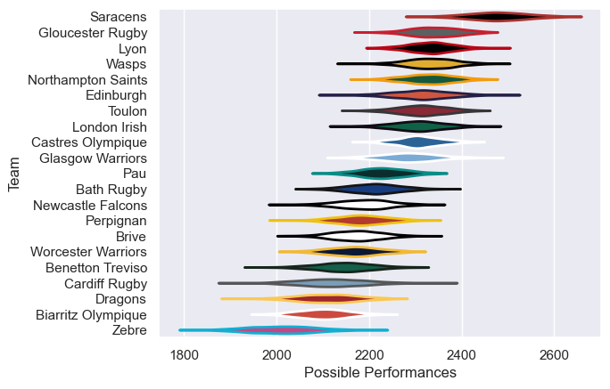

---  
title: "European Rugby Challenge Cup 21/22"  
date: 2025-07-29 6:00:00 -0500  
categories: model review projection  
layout: article  
aside:  
    toc: true  
---
# Current Team Rankings

# Standings

## Current Standings

| Club               |   Played |   Wins |   Point Differential |   Losing Bonus Points | Try Bonus Points   |   Competition Points |
|:-------------------|---------:|-------:|---------------------:|----------------------:|:-------------------|---------------------:|
| Lyon               |        8 |      8 |                  107 |                     0 |                    |                   32 |
| Toulon             |        7 |      5 |                   33 |                     1 |                    |                   21 |
| Edinburgh          |        6 |      4 |                  132 |                     2 |                    |                   18 |
| Saracens           |        6 |      4 |                   95 |                     1 |                    |                   17 |
| Gloucester Rugby   |        6 |      4 |                   58 |                     1 |                    |                   17 |
| London Irish       |        5 |      3 |                   32 |                     1 |                    |                   13 |
| Newcastle Falcons  |        4 |      3 |                    2 |                     0 |                    |                   12 |
| Wasps              |        3 |      2 |                   12 |                     1 |                    |                    9 |
| Biarritz Olympique |        4 |      2 |                    2 |                     1 |                    |                    9 |
| Benetton Treviso   |        5 |      2 |                  -39 |                     0 |                    |                    8 |
| Worcester Warriors |        4 |      1 |                  -20 |                     1 |                    |                    5 |
| Glasgow Warriors   |        2 |      1 |                    2 |                     0 |                    |                    4 |
| Perpignan          |        4 |      1 |                  -84 |                     0 |                    |                    4 |
| Brive              |        3 |      1 |                 -105 |                     0 |                    |                    4 |
| Dragons            |        4 |      0 |                  -38 |                     2 |                    |                    2 |
| Cardiff Rugby      |        1 |      0 |                   -7 |                     1 |                    |                    1 |
| Zebre              |        4 |      0 |                  -40 |                     1 |                    |                    1 |
| Northampton Saints |        1 |      0 |                  -10 |                     0 |                    |                    0 |
| Bath Rugby         |        1 |      0 |                  -22 |                     0 |                    |                    0 |
| Castres Olympique  |        1 |      0 |                  -37 |                     0 |                    |                    0 |
| Pau                |        3 |      0 |                  -73 |                     0 |                    |                    0 |

# Completed Match Review

| Model | Percent Correct Predictions | Spread Error |
| ------ | ------ | ------ |
| Club Level | 82.9% | 12.7 |
| Player Level: Lineup | nan% | nan |
| Player Level: Minutes | nan% | nan |

