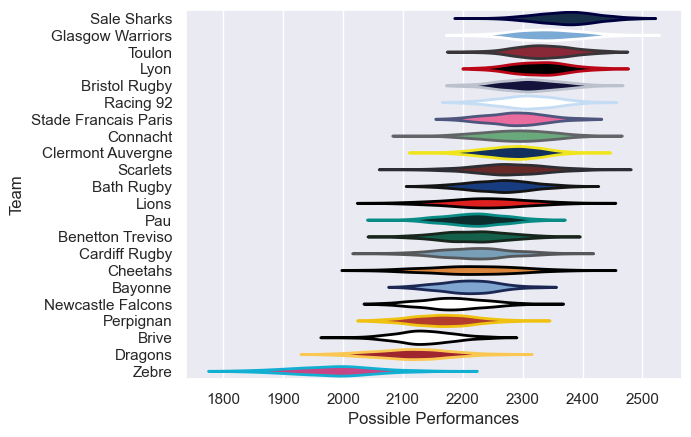

---  
title: "European Rugby Challenge Cup 22/23 Status"  
date: 2025-07-28 6:00:00 -0500  
categories: model review projection  
layout: article  
aside:  
    toc: true  
---
# Current Team Rankings

# Standings

## Current Standings

| Club                 |   Played |   Wins |   Point Differential |   Losing Bonus Points |   Try Bonus Points |   Competition Points |
|:---------------------|---------:|-------:|---------------------:|----------------------:|-------------------:|---------------------:|
| Toulon               |        8 |      7 |                  109 |                     0 |                  6 |                   36 |
| Glasgow Warriors     |        8 |      6 |                   93 |                     0 |                  5 |                   33 |
| Scarlets             |        7 |      6 |                   63 |                     0 |                  3 |                   27 |
| Benetton Treviso     |        7 |      5 |                   53 |                     0 |                  4 |                   24 |
| Cardiff Rugby        |        6 |      4 |                   94 |                     1 |                  3 |                   20 |
| Bristol Rugby        |        5 |      4 |                   60 |                     1 |                  3 |                   20 |
| Lions                |        6 |      3 |                   26 |                     0 |                  3 |                   17 |
| Connacht             |        5 |      3 |                   41 |                     0 |                  2 |                   14 |
| Dragons              |        5 |      1 |                  -45 |                     2 |                  3 |                   11 |
| Stade Francais Paris |        5 |      2 |                  -18 |                     1 |                  1 |                   10 |
| Cheetahs             |        5 |      2 |                  -29 |                     1 |                  1 |                   10 |
| Clermont Auvergne    |        2 |      1 |                    5 |                     1 |                  2 |                    7 |
| Pau                  |        4 |      1 |                   -8 |                     3 |                    |                    7 |
| Brive                |        5 |      1 |                 -103 |                     1 |                  1 |                    6 |
| Lyon                 |        2 |      1 |                   -8 |                     0 |                  1 |                    5 |
| Newcastle Falcons    |        4 |      1 |                  -69 |                     0 |                  1 |                    5 |
| Bath Rugby           |        4 |      0 |                  -37 |                     1 |                    |                    3 |
| Sale Sharks          |        1 |      0 |                   -1 |                     1 |                    |                    1 |
| Racing 92            |        1 |      0 |                  -23 |                     0 |                  1 |                    1 |
| Perpignan            |        4 |      0 |                  -50 |                     0 |                  1 |                    1 |
| Zebre                |        4 |      0 |                  -51 |                     1 |                    |                    1 |
| Bayonne              |        4 |      0 |                 -102 |                     0 |                    |                    0 |

# Completed Match Review

| Model | Percent Correct Predictions | Spread Error |
| ------ | ------ | ------ |
| Club Level | 62.7% | 13.3 |
| Player Level: Lineup | nan% | nan |
| Player Level: Minutes | nan% | nan |

