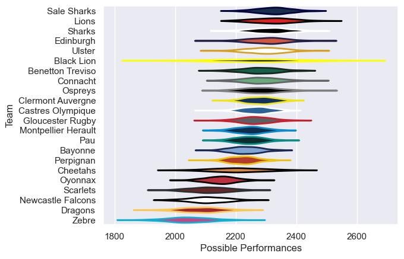

---  
title: "European Rugby Challenge Cup 23/24"  
date: 2025-07-29 6:00:00 -0500  
categories: model review projection  
layout: article  
aside:  
    toc: true  
---
# Current Team Rankings

# Standings

## Current Standings

| Club                |   Played |   Wins |   Point Differential |   Losing Bonus Points |   Try Bonus Points |   Competition Points |
|:--------------------|---------:|-------:|---------------------:|----------------------:|-------------------:|---------------------:|
| Sharks              |        8 |      7 |                  153 |                     1 |                  5 |                   34 |
| Gloucester Rugby    |        8 |      7 |                   65 |                     0 |                  2 |                   30 |
| Clermont Auvergne   |        7 |      5 |                   99 |                     1 |                  5 |                   26 |
| Benetton Treviso    |        7 |      5 |                   68 |                     0 |                  4 |                   24 |
| Ospreys             |        6 |      4 |                    6 |                     0 |                  2 |                   18 |
| Edinburgh           |        6 |      3 |                   23 |                     2 |                  3 |                   17 |
| Montpellier Herault |        5 |      3 |                   17 |                     0 |                  2 |                   14 |
| Cheetahs            |        5 |      2 |                    2 |                     2 |                  2 |                   12 |
| Pau                 |        5 |      3 |                  -33 |                     0 |                    |                   12 |
| Castres Olympique   |        5 |      2 |                   -8 |                     1 |                  2 |                   11 |
| Lions               |        5 |      2 |                    8 |                     0 |                  2 |                   10 |
| Zebre               |        5 |      2 |                  -53 |                     1 |                  1 |                   10 |
| Dragons             |        4 |      1 |                   -9 |                     2 |                  1 |                    7 |
| Connacht            |        2 |      1 |                   -5 |                     0 |                  2 |                    6 |
| Oyonnax             |        4 |      1 |                  -54 |                     1 |                  1 |                    6 |
| Ulster              |        2 |      1 |                  -16 |                     0 |                  1 |                    5 |
| Black Lion          |        4 |      1 |                  -44 |                     1 |                    |                    5 |
| Newcastle Falcons   |        4 |      1 |                  -57 |                     1 |                    |                    5 |
| Sale Sharks         |        1 |      0 |                   -8 |                     0 |                    |                    0 |
| Bayonne             |        1 |      0 |                  -18 |                     0 |                    |                    0 |
| Scarlets            |        4 |      0 |                  -67 |                     0 |                    |                    0 |
| Perpignan           |        4 |      0 |                  -69 |                     0 |                    |                    0 |

# Completed Match Review

| Model | Percent Correct Predictions | Spread Error |
| ------ | ------ | ------ |
| Club Level | 70.6% | 13.9 |
| Player Level: Lineup | nan% | nan |
| Player Level: Minutes | nan% | nan |

